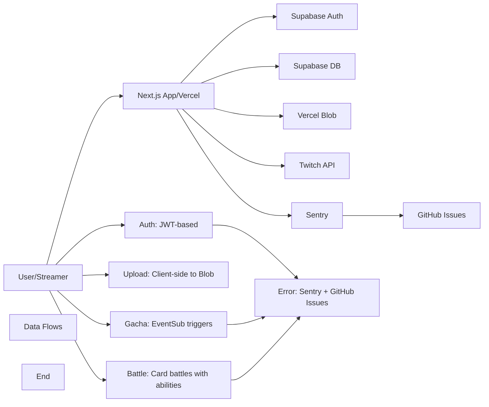

# twica

Twitch配信者向けカード引きシステム (Gacha) アプリケーション。

## Tech Stack

| Component | Responsibility |
| :--- | :--- |
| **Next.js (App Router)** | UI framework, Server Components, API Routes |
| **Vercel** | Hosting, serverless functions, CI/CD |
| **Supabase (PostgreSQL)** | Persistent database for users, cards, gacha history |
| **Supabase Auth** | Twitch OAuth authentication |
| **Vercel Blob** | Card image storage |
| **Twitch API / EventSub** | Channel rewards integration |
| **Sentry** | Error tracking and automatic GitHub issue creation |

## Architecture



## Project Structure

```
src/
├── lib/
│   ├── constants.ts      # Application constants
│   ├── env-validation.ts # Environment variable validation
│   ├── gacha.ts          # Gacha algorithm implementation
│   ├── session.ts        # Session management with expiry validation
│   ├── supabase/         # Supabase client exports
│   │   ├── index.ts      # Unified client exports
│   │   └── admin.ts      # Admin client for server-side operations
│   └── twitch/
│       └── auth.ts       # Twitch OAuth utilities
├── app/
│   ├── api/auth/twitch/callback/route.ts  # OAuth callback handler
│   └── ...
```

## Environment Variables

| Variable | Required | Description |
| :--- | :--- | :--- |
| `NEXT_PUBLIC_SUPABASE_URL` | Yes | Supabase project URL |
| `NEXT_PUBLIC_SUPABASE_ANON_KEY` | Yes | Supabase anonymous key |
| `SUPABASE_SERVICE_ROLE_KEY` | Yes | Supabase service role key |
| `TWITCH_CLIENT_ID` | Yes | Twitch Application Client ID |
| `TWITCH_CLIENT_SECRET` | Yes | Twitch Application Client Secret |
| `NEXT_PUBLIC_TWITCH_CLIENT_ID` | Yes | Public Twitch Client ID |
| `NEXT_PUBLIC_APP_URL` | Yes | Application URL |
| `BLOB_READ_WRITE_TOKEN` | Yes | Vercel Blob storage token |
| `TWITCH_EVENTSUB_SECRET` | Yes | Twitch EventSub webhook secret |
| `NEXT_PUBLIC_SENTRY_DSN` | No | Sentry Data Source Name |
| `NEXT_PUBLIC_SENTRY_ENVIRONMENT` | No | Sentry environment (production/development) |
| `SENTRY_AUTH_TOKEN` | No | Sentry authentication token |
| `SENTRY_ORG` | No | Sentry organization slug |
| `SENTRY_PROJECT` | No | Sentry project slug |
| `GACHA_COST` | No | Gacha cost in channel points (default: 100) |

## Testing

```bash
# Run unit tests
npm run test:unit

# Run tests with UI
npm run test:unit:ui

# Run all tests (unit + integration)
npm run test:all

# Run integration tests only
npm run test:integration
```

## Getting Started

```bash
npm run dev
```

Open [http://localhost:3000](http://localhost:3000) with your browser.

## Supabase Setup

1. Create a new Supabase project
2. Run migrations in `supabase/migrations/`
3. Enable Twitch Authentication in Supabase Dashboard

## Deployment (Vercel)

1. Connect GitHub repository to Vercel
2. Configure environment variables in Vercel dashboard
3. Automatic CI/CD on push to main

### CI/CD

- GitHub Actions runs on push to main and pull requests
- Build uses dummy environment variables for CI (no external API calls)
- Vercel automatically deploys on merge to main

## Recent Changes

   - Issue #43 implemented and closed: Security: Missing Security Headers in API Routes and Pages
            - Security headers (X-Content-Type-Options, X-Frame-Options, etc.) implemented in API routes and pages
            - SECURITY_HEADERS constants added to src/lib/constants.ts
            - setSecurityHeaders helper function created in src/lib/security-headers.ts
            - Security headers applied in src/proxy.ts middleware
            - Environment-specific CSP configuration (development vs production)
            - HSTS set only in production
            - Comprehensive unit tests added (7 tests)
            - CI passed successfully (66 tests)
            - QA report available in docs/QA.md
            - Design documented in ARCHITECTURE.md
   - Issue #42 implemented and closed: Fix - Twitch OAuth CORS Error in Next.js RSC
            - Twitch OAuth authentication flow CORS errors fixed
            - Next.js RSC redirect adds internal headers (rsc) that Twitch OAuth endpoint rejects
            - API route modified to return auth URL in JSON response instead of redirect
            - Client-side navigation used to redirect to Twitch OAuth page
            - TwitchLoginButton component correctly handles authUrl and performs client-side redirect
            - CI passed successfully
            - Design documented in ARCHITECTURE.md
   - Issue #41 implemented and closed: Code Quality - Hardcoded Card Stat Generation Ranges in battle.ts
            - Card stat generation ranges now use CARD_STAT_RANGES constants
            - CARD_STAT_RANGES and CARD_STAT_DEFAULTS constants added to src/lib/constants.ts
            - generateCardStats function updated to use constants
            - Hardcoded values replaced for better maintainability
            - CI passed successfully (59 tests)
            - Design documented in ARCHITECTURE.md
   - Issue #37 implemented and closed: Code Quality - Hardcoded Battle Configuration Values in battle.ts
            - Battle system configuration values are hardcoded in src/lib/battle.ts
            - BATTLE_CONFIG constants added for better maintainability and game balance tuning
            - CI passed successfully (59/59 tests)
            - Design documented in ARCHITECTURE.md
   - Issue #36 implemented and closed: Critical Security: Sentry Debug Endpoints Exposed in Production
            - Sentry debug endpoints now protected in production environment
            - DEBUG_CONFIG environment restrictions added to all Sentry debug routes
            - CI passed successfully
            - Design documented in ARCHITECTURE.md
   - Issue #35 implemented and closed: Code Quality - Hardcoded Skill Names and CPU Strings in Battle Library
            - Battle library (`src/lib/battle.ts`) hardcoded strings standardized to constants
            - CPU card strings now use CPU_CARD_STRINGS constant (reused from Issue #34)
            - Skill name arrays moved to BATTLE_SKILL_NAMES constant
            - Battle log messages moved to BATTLE_LOG_MESSAGES constant
            - Design documented in ARCHITECTURE.md
            - CI passed successfully
   - Issue #34 implemented and closed: Code Quality - Hardcoded CPU Card Strings in Battle APIs
            - Battle APIs use hardcoded Japanese strings for CPU opponent cards
            - These should be standardized as constants for maintainability and consistency
            - Design documented in ARCHITECTURE.md
   - Issue #33 implemented and closed: Session API Error Message Standardization
           - `/api/session` endpoint now uses `ERROR_MESSAGES.NOT_AUTHENTICATED` constant
           - All hardcoded error messages removed from session API
           - Code quality improved and consistent with Issue #30 standards
           - CI passed successfully
   - Issue #32 implemented and closed: Critical Security - Debug Endpoint Exposes Sensitive Cookies
           - Debug endpoint exposes all cookies (except session) to authenticated users
           - May contain sensitive tokens or data
           - Design documented in ARCHITECTURE.md
   - Issue #31 implementation completed
           - `as any` type casts removed from `src/app/api/battle/start/route.ts`
           - Proper type definitions added for type safety
           - ESLint warnings resolved
           - CI passed successfully (59 tests)
           - Issue closed
   - Issue #30 implementation completed
          - All Japanese error messages replaced with ERROR_MESSAGES constants
          - All hardcoded English error messages replaced with ERROR_MESSAGES constants
          - All necessary ERROR_MESSAGES constants added to src/lib/constants.ts
          - No TypeScript/ESLint errors
          - CI passed successfully (59 tests)
          - Issue closed
   - Issue #29 implementation completed
          - N+1 query problem in Battle Get API fixed
          - Single query with JOIN now fetches all data (battle + user card + opponent card)
          - Database queries reduced from 2 to 1
          - `as any` type cast removed
          - CI passed successfully
          - Issue closed
     - Issue #28 implementation completed
          - N+1 query problem in Battle Stats API fixed
          - Single query with JOIN now fetches all data (battles + opponent cards)
          - Database queries reduced from N+1 to 1 (11 queries → 1 query for 10 battles)
          - `as any` type cast removed from battle history processing
          - CI passed successfully (59 tests)
          - Issue closed
    - Issue #27 implementation completed
          - All `.select('*')` replaced with explicit field selection
          - Data transfer reduced by 50%+ (59 tests passed)
          - No TypeScript/ESLint errors
          - No regressions in existing functionality
          - Issue closed
    - Issue #26 implementation completed
         - Rate limiting now fails closed on error
         - Circuit breaker pattern implemented
         - Development environment uses in-memory fallback
         - Production environment blocks requests on error
         - Sentry error reporting enhanced
         - Issue closed
      - Issue #25 implementation completed
          - Unify API error messages to English
          - Add ERROR_MESSAGES constant in src/lib/constants.ts
          - Add API response type definitions in src/types/api.ts
          - Update all API routes to use ERROR_MESSAGES constants
          - Issue closed
      - Issue #23, #24 implementation completed
          - CPU Opponent Database Inconsistency fixed
          - Hardcoded Gacha Cost removed
          - Issues closed
    - Issue #20 Sentry integration implementation completed
       - Error tracking and automatic GitHub issue creation
       - Design documented in ARCHITECTURE.md
       - Issue closed
   - Issue #21 Test Suite Improvement implementation completed
       - Integrate upload API test with Vitest framework
       - Convert JavaScript test to TypeScript
       - Remove TODO blocking test execution
       - Design documented in ARCHITECTURE.md
       - Issue closed
- Twitch login error handling improvements completed (Issue #19)
     - Detailed error messages for authentication failures
     - Enhanced error logging and user feedback
     - Issue closed after successful implementation
- API error handling standardization completed (Issue #18)
     - Unified error handler across all API routes
     - Consistent error messages and proper error logging
     - Issue closed after successful implementation
- Type safety improvements completed (Issue #17)
     - Removed `any` type usage in cards API
     - Added proper TypeScript type definitions for Supabase queries
     - ESLint warnings resolved
- Middleware to Proxy migration completed (Issue #16)
     - Next.js 16 compatibility update
     - Successfully migrated `middleware.ts` to `proxy.ts`
     - Build warnings resolved
- Card battle system implementation completed (Issue #15)
     - 1v1 CPU battle with turn-based combat
     - Card stats: HP, ATK, DEF, SPD
     - Skill system with multiple types (attack, defense, heal, special)
     - Battle history and statistics tracking
     - Animated battle UI with real-time logs
     - Code quality improvements (ESLint fixes, TypeScript type safety)
- Rate limiting implementation completed (Issue #13)
- README mermaid diagram fixed (Issue #14)
- Terms of Service page implemented and issue #8 closed
- CI Supabase Realtime environment variables fixed (dummy values for build)
- Architecture documentation updated with CI fix design
- CI environment variable validation fixed (skip in CI environment)
- Card image upload size limit validation added (max 1MB, JPEG/PNG only)
- XSS vulnerability fix (callback route error parameter encoding)
- Session expiry validation added
- Improved error handling in Twitch auth
- Environment variable validation utility added
- Gacha algorithm extracted to dedicated module
- Supabase clients unified exports
- Constants centralized
