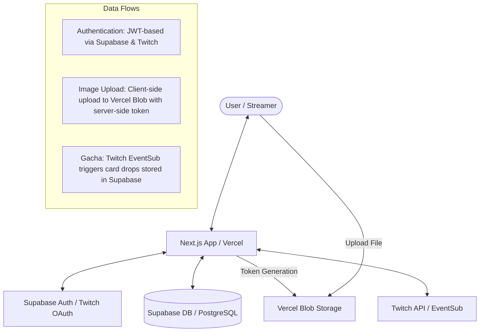

This is a [Next.js](https://nextjs.org) project bootstrapped with [`create-next-app`](https://nextjs.org/docs/app/api-reference/cli/create-next-app).

## Tech Stack Roles

| Component | Responsibility |
| :--- | :--- |
| **Next.js (App Router)** | UI framework, Server Components for data fetching, and API Routes for backend logic. |
| **Vercel** | Hosting platform, serverless function execution, and CI/CD integration. |
| **Supabase (PostgreSQL)** | Persistent database for users, cards, and gacha history. |
| **Supabase Auth** | Manages Twitch OAuth for streamer and viewer authentication. |
| **Vercel Blob** | Handles storage and delivery for card image files. |
| **Twitch API / EventSub** | Integrates with Twitch channel rewards and streamer profile data. |

## System Architecture & Integrations



### Integration Details

- **Next.js & Supabase Auth**: The application uses `@supabase/ssr` to manage session cookies. Users log in via Twitch OAuth managed by Supabase, and the resulting JWT is used to authorize Supabase DB queries via Row Level Security (RLS).
- **Next.js & Vercel Blob**: For card images, Next.js provides a secure API route to generate a temporary upload token. The browser then uploads the file directly to Vercel Blob, and the resulting URL is saved in the Supabase `cards` table.
- **Next.js & Twitch API**: The backend communicates with Twitch to:
    - Validate streamer status.
    - Create and monitor Channel Point Rewards.
    - Receive Webhooks (EventSub) when a reward is redeemed, which then triggers a card drop in Supabase.
- **Supabase & Vercel**: Vercel hosts the Next.js application, which connects to Supabase as its primary source of truth for all application data except for static image assets.

## Getting Started

First, run the development server:

```bash
npm run dev
# or
yarn dev
# or
pnpm dev
# or
bun dev
```

Open [http://localhost:3000](http://localhost:3000) with your browser to see the result.

You can start editing the page by modifying `app/page.tsx`. The page auto-updates as you edit the file.

This project uses [`next/font`](https://nextjs.org/docs/app/building-your-application/optimizing/fonts) to automatically optimize and load [Geist](https://vercel.com/font), a new font family for Vercel.

## Learn More

To learn more about Next.js, take a look at the following resources:

- [Next.js Documentation](https://nextjs.org/docs) - learn about Next.js features and API.
- [Learn Next.js](https://nextjs.org/learn) - an interactive Next.js tutorial.

You can check out [the Next.js GitHub repository](https://github.com/vercel/next.js) - your feedback and contributions are welcome!

## Deployment
 
 ### Vercel Deployment
 
 1.  Connect your GitHub repository to [Vercel](https://vercel.com).
 2.  Configure the following Environment Variables in Vercel:
 
-   `NEXT_PUBLIC_SUPABASE_URL`: Your Supabase project URL.
-   `NEXT_PUBLIC_SUPABASE_ANON_KEY`: Your Supabase anonymous key.
-   `SUPABASE_SERVICE_ROLE_KEY`: Your Supabase service role key (for server-side admin actions).
-   `TWITCH_CLIENT_ID`: Your Twitch Application Client ID.
-   `TWITCH_CLIENT_SECRET`: Your Twitch Application Client Secret.
-   `NEXT_PUBLIC_TWITCH_CLIENT_ID`: Same as `TWITCH_CLIENT_ID`.
-   `NEXT_PUBLIC_APP_URL`: Your application's URL (e.g., `https://your-app-name.vercel.app`).
-   `BLOB_READ_WRITE_TOKEN`: Required for card image uploads (Generate this from the "Storage" tab in Vercel Dashboard).
 
 ### Supabase Setup
 
 1. Create a new Supabase project.
 2. Run the migration found in `supabase/migrations/00001_initial_schema.sql` in the Supabase SQL Editor.
 3. Enable Twitch Authentication in Supabase (Authentication -> Providers -> Twitch).
 
 ### CI/CD
 
 This project uses GitHub Actions for CI. On every push to `main` and all pull requests, the code is automatically linted and built to ensure quality and stability.

## Deploy on Vercel

The easiest way to deploy your Next.js app is to use the [Vercel Platform](https://vercel.com/new?utm_medium=default-template&filter=next.js&utm_source=create-next-app&utm_campaign=create-next-app-readme) from the creators of Next.js.

Check out our [Next.js deployment documentation](https://nextjs.org/docs/app/building-your-application/deploying) for more details.
