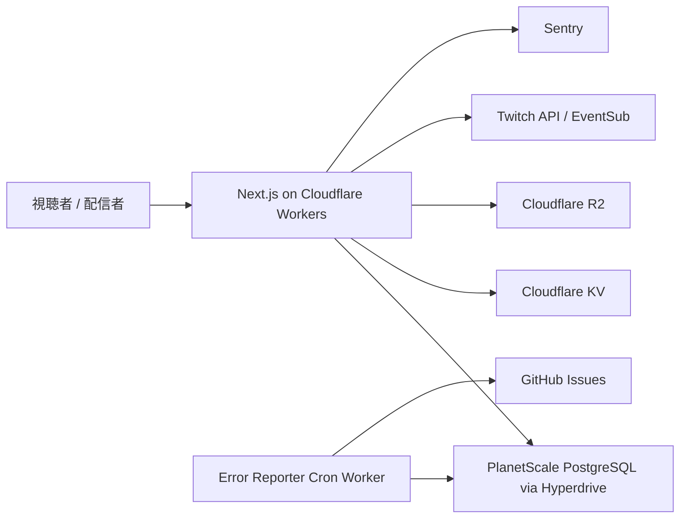

# twica

Twitch 配信者向けのチャネルポイント・カード引換システムです。Next.js を
Cloudflare Workers 上で動かし、カード・引換・配信設定の永続データは
PlanetScale PostgreSQL を正本として扱います。

## 現行アーキテクチャ


```mermaid
flowchart LR
  Viewer[視聴者 / 配信者] --> App[Next.js on Cloudflare Workers]
  App --> DB[PlanetScale PostgreSQL via Hyperdrive]
  App --> KV[Cloudflare KV]
  App --> R2[Cloudflare R2]
  App --> Twitch[Twitch API / EventSub]
  App --> Sentry[Sentry]
  Reporter[Error Reporter Cron Worker] --> DB
  Reporter --> GitHub[GitHub Issues]
```

| コンポーネント | 役割 |
| --- | --- |
| Next.js / OpenNext | UI と API Routes |
| Cloudflare Workers Builds | 本体 Worker の production / preview デプロイ |
| PlanetScale PostgreSQL | 永続データの唯一の正本 |
| Cloudflare Hyperdrive | Worker から PlanetScale への接続 |
| Cloudflare KV / R2 | レート制限・短期イベント / 画像・音声保存 |
| Twitch API / EventSub | ログイン、チャネルポイント、配信イベント |
| Sentry + Error Reporter | エラー記録と GitHub Issue 作成 |

Supabase SDK・CLI・実行時接続・環境変数・Secrets は廃止済みです。新しい実装、CI 設定、
運用手順に Supabase を再導入しないでください。

## ローカル開発

```bash
npm ci
npm run dev
```

`wrangler dev` を使うため、ローカルでは `wrangler.toml` の
`HYPERDRIVE_PLANETSCALE.localConnectionString`、またはプロジェクトのローカル設定で
PlanetScale 接続先を与えます。本番用の認証情報を `.env` やソースコードに保存しません。

主な設定値は以下です。Worker 実行時の機密値は Cloudflare の Secret として設定し、
ビルド時に必要な公開値だけを Workers Builds / CI に設定します。

| 変数 / binding | 用途 |
| --- | --- |
| `DATABASE_URL_PLANETSCALE` | CLI・ローカルの PlanetScale 直結接続文字列 |
| `HYPERDRIVE_PLANETSCALE` | production / preview Worker の DB binding |
| `TWITCH_CLIENT_ID`, `TWITCH_CLIENT_SECRET` | Twitch OAuth |
| `TWITCH_EVENTSUB_SECRET` | EventSub 署名検証 |
| `NEXT_PUBLIC_APP_URL`, `NEXT_PUBLIC_TWITCH_CLIENT_ID` | 公開ビルド設定 |
| `CSRF_TOKEN_SALT` | 状態変更 API の CSRF 保護 |
| `SENTRY_*` | 任意のエラー報告設定 |

## テストと品質確認

```bash
npm run test:unit
npm run typecheck
npm run lint
npm run check:supabase-shutdown
```

`check:supabase-shutdown` は名称互換のため残っていますが、確認対象は
「廃止済みの SDK・CLI・runtime 接続・設定が復活していないこと」です。DB を使うテストでは
postgres.js / Drizzle / Hyperdrive 境界をモックし、廃止済みクライアントのモックを追加しません。

## マイグレーション

新しい migration は PlanetScale 向けに作成し、必ず provider を明示して実行します。

```bash
npm run db:migrate:status
npm run db:migrate:plan
npm run db:migrate:apply
npm run db:migrate:verify
```

各コマンドは `scripts/db-migrate.js --provider=planetscale` を使用し、接続文字列は
`DATABASE_URL` からだけ読み取ります。`main` と `preview` への push では
`.github/workflows/planetscale-migrate.yml` が対応する GitHub Environment の
`PLANETSCALE_DATABASE_URL` で適用・検証します。加法的変更には expand/contract を用い、
破壊的 DDL はこの自動経路で実行せず、デプロイ順序を管理した上で個別に実施してください。

詳細と baseline の扱いは
[docs/planetscale-schema-baseline.md](docs/planetscale-schema-baseline.md) を参照してください。

## デプロイ

本体 Worker は Cloudflare Workers Builds が所有します。

- `main` → `twica`（production）
- `preview` → `twica-preview`（preview）
- GitHub Actions → PlanetScale migration と補助 Worker（overlay realtime / error reporter）

Workers Builds の設定、ロールバック前の確認、補助 Worker の責務は
[docs/cloudflare-workers-builds.md](docs/cloudflare-workers-builds.md) を参照してください。

## セキュリティ

- HTTP-only セッション Cookie と CSRF トークンを状態変更 API に適用する
- Twitch / Cloudflare / DB の機密値をログ・Issue・ソースコードへ出力しない
- DB 接続は Hyperdrive（runtime）または限定ロールの直結接続（migration / 管理）に限定する
- エラー通知は本体処理の commit を巻き戻さない best-effort 処理として扱い、失敗は監視する
