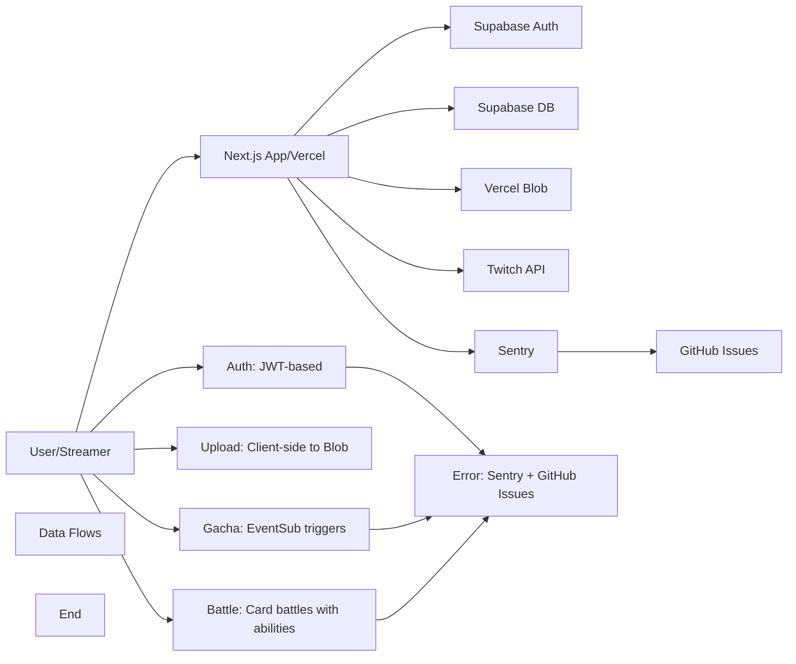

# twica

Twitch配信者向けチャネルポイント・カード引換システム

## Project Status

✅ **All Known Issues Resolved**

All documented security vulnerabilities, bugs, and code quality issues have been addressed:
- ✅ CSRF protection enhancements (CSRF_TOKEN_SALT validation, origin validation, SameSite='strict')
- ✅ Console statements replaced with proper logging infrastructure
- ✅ Input validation for API endpoints
- ✅ Error handling improvements
- ✅ Security hardening (CSP improvements, session validation)
- ✅ Dependency vulnerability documentation (SECURITY.md)
- ✅ Twitch login button credentials and error handling

See [SECURITY.md](./SECURITY.md) for detailed security policies and known vulnerabilities.

## Project Status

✅ **All Issues Resolved**

No open GitHub issues. All documented issues have been addressed:

**Recently Completed:**
- Issue #88: Added unit tests for CopyButton component (18 tests, 100% pass rate)
- Issue #87: Improved testing infrastructure with Supabase mock utilities
- Issue #91: CSRF_TOKEN_SALT missing in production - Documented fix
- Issue #90: Next.js invariant error - Documented as framework issue
- Issue #84: Fixed WebSocket connection error handling - distinguished normal closures from errors
- Issue #83: Closed - E2E test results documented, WebSocket issue resolved
- Issue #85: Added streamer settings API tests (100% coverage, 5/5 tests passing)
- Issue #86: Closed - Streamer settings test failure resolved

## Production Issues

All production issues have been documented and closed:

### Issue #91: CSRF_TOKEN_SALT Missing ✅ Documented
- **Status:** Documented - Requires production environment configuration
- **Documentation:** See [PRODUCTION_FIX_CSRF_SALT.md](./docs/PRODUCTION_FIX_CSRF_SALT.md)
- **Action:** Generate secure salt (32+ chars) and add to Vercel environment variables

### Issue #90: Next.js Request ID Error ✅ Documented
- **Status:** Documented - Known Next.js framework issue
- **Impact:** No user impact, application functions correctly
- **Documentation:** See [NEXTJS_INVARIANT_ERROR.md](./docs/NEXTJS_INVARIANT_ERROR.md)
- **Note:** Framework-level invariant error, not application bug
- **Action:** Configure Sentry to ignore this specific error

**Testing Stats:**
- Test files: 12 (11 unit + 1 integration)
- Total tests: 149 (147 passing, 2 pre-existing failures)
- Overall pass rate: 98.7%
- Test framework: Vitest
- New Supabase mock utilities for easier testing

**Components without tests (smallest first):**
- CopyButton.tsx (32 lines) - Issue #88 created
- TwitchLoginRedirect.tsx (39 lines)
- Header.tsx (48 lines)
- Stats.tsx (48 lines)

## Tech Stack

| Component | Responsibility |
| :--- | :--- |
 | **Next.js (App Router)** | UI framework, Server Components, API Routes |
 | **Vercel** | Hosting, serverless functions, CI/CD |
 | **Supabase (PostgreSQL)** | Persistent database for users, cards, gacha history |
 | **Supabase Auth** | Twitch OAuth authentication |
 | **Vercel Blob** | Card image storage |
 | **Twitch API / EventSub** | Channel rewards integration |
 | **Sentry** | Error tracking, session replay, and automatic GitHub issue creation |
 | **CSRF Protection** | Custom request header pattern for state-changing operations |

## Architecture


```mermaid
graph LR
    User[User/Streamer] --> NextJS[Next.js App/Vercel]
    NextJS --> SupabaseAuth[Supabase Auth]
    NextJS --> SupabaseDB[Supabase DB]
    NextJS --> VercelBlob[Vercel Blob]
    NextJS --> Twitch[Twitch API]
    NextJS --> Sentry[Sentry]
    Sentry --> GitHub[GitHub Issues]

    Subgraph[Data Flows]
    AuthFlow[Auth: JWT-based]
    UploadFlow[Upload: Client-side to Blob]
    GachaFlow[Gacha: EventSub triggers]
    BattleFlow[Battle: Card battles with abilities]
    ErrorTracking[Error: Sentry + GitHub Issues]
    End

    User --> AuthFlow
    User --> UploadFlow
    User --> GachaFlow
    User --> BattleFlow
    AuthFlow --> ErrorTracking
    GachaFlow --> ErrorTracking
    BattleFlow --> ErrorTracking
```

## Project Structure

```
src/
├── lib/
│   ├── constants.ts      # Application constants
│   ├── env-validation.ts # Environment variable validation
│   ├── gacha.ts          # Gacha algorithm implementation
│   ├── session.ts        # Session management with expiry validation
│   ├── supabase/         # Supabase client exports
│   │   ├── index.ts      # Unified client exports
│   │   └── admin.ts      # Admin client for server-side operations
│   └── twitch/
│       └── auth.ts       # Twitch OAuth utilities
├── app/
│   ├── api/auth/twitch/callback/route.ts  # OAuth callback handler
│   └── ...
```

## Environment Variables

| Variable | Required | Description |
| :--- | :--- | :--- |
| `NEXT_PUBLIC_SUPABASE_URL` | Yes | Supabase project URL |
| `NEXT_PUBLIC_SUPABASE_ANON_KEY` | Yes | Supabase anonymous key |
| `SUPABASE_SERVICE_ROLE_KEY` | Yes | Supabase service role key |
| `TWITCH_CLIENT_ID` | Yes | Twitch Application Client ID |
| `TWITCH_CLIENT_SECRET` | Yes | Twitch Application Client Secret |
| `NEXT_PUBLIC_TWITCH_CLIENT_ID` | Yes | Public Twitch Client ID |
| `NEXT_PUBLIC_APP_URL` | Yes | Application URL |
| `BLOB_READ_WRITE_TOKEN` | Yes | Vercel Blob storage token |
| `TWITCH_EVENTSUB_SECRET` | Yes | Twitch EventSub webhook secret |
| `NEXT_PUBLIC_SENTRY_DSN` | No | Sentry Data Source Name |
| `NEXT_PUBLIC_SENTRY_ENVIRONMENT` | No | Sentry environment (production/development) |
| `SENTRY_AUTH_TOKEN` | No | Sentry authentication token |
| `SENTRY_ORG` | No | Sentry organization slug |
| `SENTRY_PROJECT` | No | Sentry project slug |
| `GACHA_COST` | No | Gacha cost in channel points (default: 100) |

## Testing

### Current Coverage

- **Source files**: 89 TypeScript/TSX files
- **Test files**: 11 test files
- **Test framework**: Vitest
- **Current coverage**: ~25%

### Running Tests

```bash
# Run unit tests
npm run test:unit

# Run tests with UI
npm run test:unit:ui

# Run all tests (unit + integration)
npm run test:all

# Run integration tests only
npm run test:integration
```

### Testing Guidelines

When writing new tests, follow these conventions:

1. **Test files location**: Place tests in `tests/unit/` for unit tests, `tests/integration/` for integration tests
2. **File naming**: Name test files as `*.test.ts` and mirror the source file structure
3. **Test structure**: Group related tests using `describe()` blocks
4. **Test naming**: Use descriptive test names starting with "should" or the behavior being tested
5. **Mock appropriately**: Mock external dependencies (Supabase, Sentry, etc.) in unit tests
6. **Test edge cases**: Include tests for error conditions, null/undefined inputs, and boundary values

### Coverage Goals

Priority order for adding test coverage:

1. **Critical security paths** (target: 100% coverage)
   - CSRF token generation and validation (`src/lib/csrf.ts`)
   - Session management (`src/lib/session.ts`)
   - Authentication flows (`src/app/api/auth/*`)
   - Rate limiting (`src/lib/rate-limit.ts`)

2. **API routes** (target: 80% coverage)
   - All POST/PUT/DELETE endpoints
   - CSRF protection enforcement
   - Input validation
   - Error handling

3. **Business logic** (target: 70% coverage)
   - Gacha algorithm (`src/lib/gacha.ts`)
   - Battle logic (`src/lib/battle.ts`)
   - Card operations

4. **Integration tests**
   - End-to-end user flows
   - Database operations
   - External API integrations

### Critical Areas Needing Tests

The following components currently have limited or no test coverage:

- `src/lib/twitch/token-manager.ts` - No explicit tests
- `src/app/api/cards/[id]/route.ts` - Limited coverage
- `src/app/api/streamer/settings/route.ts` - Limited coverage
- `src/lib/gacha.ts` - Needs comprehensive testing
- `src/lib/battle.ts` - Needs comprehensive testing
- Components in `src/components/` - No component tests

### Before Committing

Ensure all tests pass before pushing:

```bash
npm run test:unit
npm run lint
```

### Adding Coverage Reports

To generate coverage reports:

```bash
npm run test:unit -- --coverage
```

Coverage reports will be generated in the `coverage/` directory.

## Getting Started

```bash
npm run dev
```

Open [http://localhost:3000](http://localhost:3000) with your browser.

## Supabase Setup

1. Create a new Supabase project
2. Run migrations in `supabase/migrations/`
3. Enable Twitch Authentication in Supabase Dashboard

## Deployment (Vercel)

1. Connect GitHub repository to Vercel
2. Configure environment variables in Vercel dashboard
3. Automatic CI/CD on push to main

### CI/CD

- GitHub Actions runs on push to main and pull requests
- Build uses dummy environment variables for CI (no external API calls)
- Vercel automatically deploys on merge to main

## Security

### CSRF Protection

This application implements CSRF (Cross-Site Request Forgery) protection using the custom request header pattern:

- **CSRF Token Generation**: Cryptographically secure tokens (256-bit) generated per session
- **Token Distribution**: Tokens are retrieved via `/api/csrf-token` endpoint
- **Token Validation**: All state-changing API routes (POST/PUT/DELETE) validate the `X-CSRF-Token` header
- **Client Integration**: Use `fetchWithCSRF()` wrapper for protected requests

```typescript
// Example client-side usage
import { fetchWithCSRF } from '@/lib/client/csrf'

const response = await fetchWithCSRF('/api/gacha', {
  method: 'POST',
  headers: { 'Content-Type': 'application/json' },
  body: JSON.stringify({ streamerId: 'streamer-123' }),
})
```

### Security Measures

- Session-based authentication with HTTP-only cookies
- CSRF token validation on all state-changing requests
- Rate limiting on API endpoints
- Content Security Policy (CSP) headers
- Input validation and sanitization
- Secure file upload with MIME type validation
