# twica

Twitch配信者向けカード引きシステム (Gacha) アプリケーション。

## Tech Stack

| Component | Responsibility |
| :--- | :--- |
| **Next.js (App Router)** | UI framework, Server Components, API Routes |
| **Vercel** | Hosting, serverless functions, CI/CD |
| **Supabase (PostgreSQL)** | Persistent database for users, cards, gacha history |
| **Supabase Auth** | Twitch OAuth authentication |
| **Vercel Blob** | Card image storage |
| **Twitch API / EventSub** | Channel rewards integration |

## Architecture

```mermaid
graph TD
    User([User / Streamer]) <--> NextJS[Next.js App / Vercel]
    NextJS <--> SupabaseAuth[Supabase Auth / Twitch OAuth]
    NextJS <--> SupabaseDB[(Supabase DB / PostgreSQL)]
    NextJS -- "Token Generation" --> VercelBlob[Vercel Blob Storage]
    User -- "Upload File" --> VercelBlob
    NextJS <--> TwitchAPI[Twitch API / EventSub]
    
    subgraph "Data Flows"
        AuthFlow[Authentication: JWT-based via Supabase & Twitch]
        UploadFlow[Image Upload: Client-side upload to Vercel Blob with server-side token]
        GachaFlow[Gacha: Twitch EventSub triggers card drops stored in Supabase]
    end
```



## Project Structure

```
src/
├── lib/
│   ├── constants.ts      # Application constants
│   ├── env-validation.ts # Environment variable validation
│   ├── gacha.ts          # Gacha algorithm implementation
│   ├── session.ts        # Session management with expiry validation
│   ├── supabase/         # Supabase client exports
│   │   ├── index.ts      # Unified client exports
│   │   └── admin.ts      # Admin client for server-side operations
│   └── twitch/
│       └── auth.ts       # Twitch OAuth utilities
├── app/
│   ├── api/auth/twitch/callback/route.ts  # OAuth callback handler
│   └── ...
```

## Environment Variables

| Variable | Required | Description |
| :--- | :--- | :--- |
| `NEXT_PUBLIC_SUPABASE_URL` | Yes | Supabase project URL |
| `NEXT_PUBLIC_SUPABASE_ANON_KEY` | Yes | Supabase anonymous key |
| `SUPABASE_SERVICE_ROLE_KEY` | Yes | Supabase service role key |
| `TWITCH_CLIENT_ID` | Yes | Twitch Application Client ID |
| `TWITCH_CLIENT_SECRET` | Yes | Twitch Application Client Secret |
| `NEXT_PUBLIC_TWITCH_CLIENT_ID` | Yes | Public Twitch Client ID |
| `NEXT_PUBLIC_APP_URL` | Yes | Application URL |
| `BLOB_READ_WRITE_TOKEN` | Yes | Vercel Blob storage token |
| `TWITCH_EVENTSUB_SECRET` | Yes | Twitch EventSub webhook secret |

## Getting Started

```bash
npm run dev
```

Open [http://localhost:3000](http://localhost:3000) with your browser.

## Supabase Setup

1. Create a new Supabase project
2. Run migrations in `supabase/migrations/`
3. Enable Twitch Authentication in Supabase Dashboard

## Deployment (Vercel)

1. Connect GitHub repository to Vercel
2. Configure environment variables in Vercel dashboard
3. Automatic CI/CD on push to main

### CI/CD

- GitHub Actions runs on push to main and pull requests
- Build uses dummy environment variables for CI (no external API calls)
- Vercel automatically deploys on merge to main

## Recent Changes

- Rate limiting implementation design added (Issue #13)
- Terms of Service page implemented and issue #8 closed
- CI Supabase Realtime environment variables fixed (dummy values for build)
- Architecture documentation updated with CI fix design
- CI environment variable validation fixed (skip in CI environment)
- Card image upload size limit validation added (max 1MB, JPEG/PNG only)
- XSS vulnerability fix (callback route error parameter encoding)
- Session expiry validation added
- Improved error handling in Twitch auth
- Environment variable validation utility added
- Gacha algorithm extracted to dedicated module
- Supabase clients unified exports
- Constants centralized
