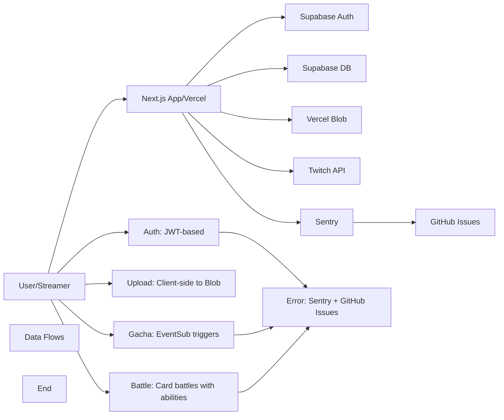

# TwiCa Architecture Document

## 概要

TwiCaはTwitch配信者向けのカードガチャシステムです。視聴者はチャンネルポイントを使ってガチャを引き、配信者が作成したオリジナルカードを収集できます。

---

## 機能要件

### 認証・認可
- Twitch OAuthによる配信者・視聴者認証
- Supabase Auth + カスタムCookieによるセッション管理
- 配信者は自身の配信者ページでのみカード管理が可能
- 視聴者は自分のカードとガチャ履歴のみ閲覧可能

### カード管理機能
- 配信者がカードを登録できる（名前、説明、画像URL、レアリティ、ドロップ率）
- カードの有効/無効切り替え
- カード画像はVercel Blob Storageに保存
- レアリティ: コモン、レア、エピック、レジェンダリー
- カード画像サイズ制限: 最大1MB

### ガチャ機能
- チャンネルポイントを使用したガチャシステム
- Twitch EventSubによるチャンネルポイント使用通知
- 重み付き確率によるカード選択
- ガチャ履歴の記録

### オーバーレイ表示
- ガチャ結果を配信画面にオーバーレイ表示
- ストリーマーIDごとのカスタマイズ可能な表示

### ダッシュボード機能
- 配信者ダッシュボード（カード管理、設定）
- 視聴者ダッシュボード（所持カード、ガチャ履歴）

---

## 非機能要件

### パフォーマンス
- APIレスポンス: 500ms以内（99パーセンタイル）
- ガチャ処理: 300ms以内
- 対戦処理: 1000ms以内
- 静的アセットのCDN配信（Vercel）
- データベースインデックスによるクエリ最適化
- データベースクエリフィールド選択の最適化
- N+1クエリ問題の回避

### セキュリティ
- HTTPSでの通信
- Supabase RLS (Row Level Security) による多層防御
- CSRF対策（SameSite=Lax Cookie + state検証）
- XSS対策（Reactの自動エスケープ）
- 環境変数によるシークレット管理
- セッション有効期限: 7日（Cookie + expiresAt検証）
- Twitch署名検証（EventSub Webhook）
- EventSubべき等性（event_idによる重複チェック）
- APIレート制限によるDoS攻撃対策
- 対戦の不正防止（ランダム性の確保）

### 可用性
- Vercelによる99.95% SLA
- Supabaseによる99.9% データベース可用性

### スケーラビリティ
- Vercel Serverless Functionsの自動スケーリング
- SupabaseのマネージドPostgreSQL（自動スケーリング）

---

## 受け入れ基準

### ユーザー認証
- [x] Twitch OAuthでログインできる
- [x] 配信者として認証される
- [x] 視聴者として認証される
- [x] ログアウトできる
- [x] セッション有効期限後に再認証が必要
- [x] Twitchログイン時のエラーが適切にハンドリングされる（Issue #19 - 解決済み）

### カード管理
- [x] カードを新規登録できる
- [x] カードを編集できる
- [x] カードを削除できる
- [x] カード画像をアップロードできる
- [x] カード画像サイズが1MB以下である
- [x] カードの有効/無効を切り替えられる
- [x] ドロップ率を設定できる（合計1.0以下）

### ガチャ機能
- [x] チャンネルポイントでガチャを引ける
- [x] ガチャ結果が正しく表示される
- [x] ドロップ率通りにカードが排出される
- [x] ガチャ履歴が記録される
- [x] 重みなしで同じ確率で排出される（全カードのドロップ率が等しい場合）

### オーバーレイ
- [x] ガチャ結果がOBS等のブラウザソースで表示できる
- [x] カード画像が正しく表示される
- [x] レアリティに応じた色が表示される

### データ整合性
- [x] RLSポリシーが正しく機能する
- [x] 配信者は自分のカードしか編集できない
- [x] 視聴者は自分のカードしか見れない
- [x] ガチャ履歴が正しく記録される

### APIレート制限（Issue #13）
- [x] `@upstash/ratelimit` と `@upstash/redis` をインストール
- [x] `src/lib/rate-limit.ts` を実装
- [x] 各 API ルートにレート制限を追加
- [x] 429 エラーが適切に返される
- [x] レート制限ヘッダーが設定される
- [x] 開発環境でインメモリレート制限が動作する
- [x] 本番環境で Redis レート制限が動作する
- [x] EventSub Webhook は緩いレート制限を持つ
- [x] 認証済みユーザーは twitchUserId で識別される
- [x] 未認証ユーザーは IP アドレスで識別される
- [x] フロントエンドで 429 エラーが適切に表示される

### カード対戦機能（Issue #15）
- [x] カードにステータス（HP、ATK、DEF、SPD）が追加される
- [x] 各カードにスキルが設定される
- [x] CPU対戦が可能
- [x] 自動ターン制バトルが動作する
- [x] 勝敗判定が正しく行われる
- [x] 対戦履歴が記録される
- [x] 対戦統計が表示される
- [x] フロントエンドで対戦が視覚的に楽しめる
- [x] アニメーション効果が表示される
- [x] モバイルで快適に操作可能

### 型安全性向上（Issue #17）
- [x] `any`型の使用が削減される
- [x] ESLintの`@typescript-eslint/no-explicit-any`警告が解消される
- [x] カード所有権の検証が正しく動作する
- [x] TypeScriptのコンパイルエラーがない
- [x] 既存のAPIテストがパスする

### APIエラーハンドリング標準化（Issue #18）
- [x] すべてのAPIルートで標準化されたエラーハンドラーを使用する
- [x] エラーメッセージがすべてのルートで一貫している
- [x] 既存のAPIテストがパスする
- [x] 手動テストでエラーハンドリングが正しく動作することを確認する
- [x] 既存の機能に回帰がない

### レート制限のfail-open問題修正（Issue #26）
- [x] Redisエラー発生時に `success: false` を返す
- [x] 本番環境ではエラー時にリクエストがブロックされる
- [x] 開発環境ではインメモリフォールバックが機能する
- [x] エラー発生時にSentryにログが送信される
- [x] TypeScript コンパイルエラーがない
- [x] ESLint エラーがない
- [x] 既存のAPIテストがパスする
- [x] レート制限が正しく動作する
- [x] 既存の機能に回帰がない

### データベースクエリ最適化（Issue #27）
- [x] すべての `.select('*')` が明示的なフィールド選択に置き換えられる
- [x] 各APIルートで必要なフィールドのみが選択される
- [x] TypeScript コンパイルエラーがない
- [x] ESLint エラーがない
- [x] 既存のAPIテストがパスする
- [x] APIレスポンス形式が維持される
- [x] 既存の機能に回帰がない
- [x] データ転送量が削減される（50%以上）

### N+1クエリ問題の解決 - Battle Stats API（Issue #28）
- [x] N+1クエリ問題が解決される
- [x] 最近の対戦履歴が単一のクエリで取得される
- [x] APIレスポンス形式が維持される
- [x] TypeScript コンパイルエラーがない
- [x] ESLint エラーがない
- [x] 既存のAPIテストがパスする
- [x] 既存の機能に回帰がない
- [x] データベースクエリ数が削減される（10件の対戦で11→1へ）
- [x] Issue #28 クローズ済み

### N+1クエリ問題の解決 - Battle Get API（Issue #29）
- [x] N+1クエリ問題が解決される
- [x] 対戦データが単一のクエリで取得される
- [x] APIレスポンス形式が維持される
- [x] TypeScript コンパイルエラーなし
- [x] ESLint エラーなし
- [x] CIが成功
- [x] Issue #29 クローズ済み

### APIエラーメッセージ標準化（Issue #30）
- [x] すべての日本語エラーメッセージがERROR_MESSAGES定数に置換されている
- [x] すべてのハードコードされた英語エラーメッセージがERROR_MESSAGES定数に置換されている
- [x] すべての必要なERROR_MESSAGES定数がsrc/lib/constants.tsに追加されている
- [x] TypeScript コンパイルエラーなし
- [x] ESLint エラーなし
- [x] CIが成功
- [x] Issue #30 クローズ済み

---

## 設計方針

### アーキテクチャパターン
- **クライアントサイド**: Next.js App Router + Server Components
- **サーバーサイド**: Vercel Serverless Functions
- **データストア**: Supabase (PostgreSQL)
- **ストレージ**: Vercel Blob
- **認証**: カスタムCookie + Twitch OAuth
- **エラートラッキング**: Sentry + GitHub Issues自動化

### デザイン原則
1. **Simple over Complex**: 複雑さを最小限に抑える
2. **Type Safety**: TypeScriptによる厳格な型定義
3. **Separation of Concerns**: 機能ごとのモジュール分割
4. **Security First**: アプリケーション層での認証検証 + RLS（多層防御）
5. **Consistency**: コードベース全体で一貫性を維持
6. **Error Handling**: ユーザーにわかりやすいエラーメッセージを提供
7. **Observability**: エラー追跡と自動イシュー作成により運用効率を向上
8. **Performance**: 最小限のデータ転送と効率的なクエリ実行
9. **Query Optimization**: N+1クエリ問題の回避とJOINの適切な使用

### 技術選定基準
- マネージドサービス優先（運用コスト削減）
- Next.jsエコシステムを活用（開発効率）
- カスタムセッションによる柔軟な認証管理
- Sentryによるエラー可視化

---

## アーキテクチャ

### システム全体図



---

## Issue #31: Code Quality - Remove 'any' Type Usage in Battle Start API

### 問題

`src/app/api/battle/start/route.ts` に `as any` 型キャストが残っています：

```typescript
// eslint-disable-next-line @typescript-eslint/no-explicit-any
const userCardDataForBattle = userCardData.card as any
// eslint-disable-next-line @typescript-eslint/no-explicit-any
const opponentBattleCard = generateCPUOpponent(allCards as any[])
```

### 問題の詳細

#### 現在の実装 (Lines 120-125)

```typescript
// Convert to BattleCard format
// eslint-disable-next-line @typescript-eslint/no-explicit-any
const userCardDataForBattle = userCardData.card as any
// eslint-disable-next-line @typescript-eslint/no-explicit-any
const opponentBattleCard = generateCPUOpponent(allCards as any[])
const userBattleCard = toBattleCard(userCardDataForBattle)
```

### 影響

- **型安全性**: `as any` 型キャストはTypeScriptの型チェックを無効化
- **保守性**: コードの可読性と保守性が低下
- **一貫性**: Issue #17で `any` 型の削減が完了しましたが、まだ残っている箇所があります

### 優先度

**Medium** - Issue #17と同様のコード品質の改善です。

---

## Issue #31: 設計

### 機能要件

#### 1. `as any` 型キャストの削除

`src/app/api/battle/start/route.ts` の `as any` 型キャストを削除し、適切な型定義を使用します：

1. **Supabaseクエリ結果の型定義**
   - `userCardData.card` の型を `Card` として定義
   - `allCards` の型を `Card[]` として定義

2. **型アサーションの削除**
   - `as any` 型キャストを削除
   - 適切な型定義を使用

### 非機能要件

#### 型安全性

- TypeScriptの型チェックが正しく動作する
- ESLintの `@typescript-eslint/no-explicit-any` 警告が解消される
- コンパイル時に型エラーが検出される

#### 一貫性

- Issue #17のアプローチと一貫性を維持
- コードベース全体で `as any` 型キャストを削除

### 設計

#### 1. 型定義の確認

**src/lib/battle.ts**
```typescript
export interface BattleCardData {
  id: string
  name: string
  hp: number
  atk: number
  def: number
  spd: number
  skill_type: SkillType
  skill_name: string
  skill_power: number
  image_url: string | null
  rarity: Rarity
}

export function toBattleCard(card: Card | BattleCardData): BattleCard
export function generateCPUOpponent(cards: (Card | BattleCardData)[]): BattleCard
```

**src/types/database.ts**
```typescript
export type Card = Database['public']['Tables']['cards']['Row']

export type UserCardWithDetails = UserCard & {
  card: CardWithStreamer
}
```

#### 2. Battle Start APIの修正

**src/app/api/battle/start/route.ts**

**変更前** (Lines 120-125):
```typescript
// Convert to BattleCard format
// eslint-disable-next-line @typescript-eslint/no-explicit-any
const userCardDataForBattle = userCardData.card as any
// eslint-disable-next-line @typescript-eslint/no-explicit-any
const opponentBattleCard = generateCPUOpponent(allCards as any[])
const userBattleCard = toBattleCard(userCardDataForBattle)
```

**変更後**:
```typescript
import type { Card, UserCardWithDetails, BattleCardData } from '@/types/database'
import { toBattleCard, generateCPUOpponent } from '@/lib/battle'

// Define proper types for Supabase query results
interface UserCardQueryResult {
  user_id: string
  card_id: string
  obtained_at: string
  card: Card
}

// Convert to BattleCard format with proper types
const userCardQuery = userCardData as unknown as UserCardQueryResult
const userCardDataForBattle: Card | BattleCardData = userCardQuery.card
const opponentBattleCard = generateCPUOpponent(allCards as (Card | BattleCardData)[])
const userBattleCard = toBattleCard(userCardDataForBattle)
```

**理由**:
- `toBattleCard` 関数は `Card | BattleCardData` を受け取る
- `generateCPUOpponent` 関数は `(Card | BattleCardData)[]` を受け取る
- Supabaseクエリ結果を適切な型にキャストすることで、`as any` を削除できる
- `as unknown as` パターンを使用して、型安全性を維持

### 変更ファイル

- `src/app/api/battle/start/route.ts` (更新 - `as any` 型キャストの削除)

### 受け入れ基準

- [ ] `as any` 型キャストが削除される
- [ ] 適切な型定義が使用される
- [ ] TypeScript コンパイルエラーがない
- [ ] ESLint `@typescript-eslint/no-explicit-any` 警告がない
- [ ] 既存のAPIテストがパスする
- [ ] 既存の機能に回帰がない
- [ ] CIが成功する

### テスト計画

1. **単体テスト**:
   - 既存の単体テストがパスすることを確認
   - Battle Start APIが正しいデータを返すことを確認

2. **統合テスト**:
   - Battle Start APIの統合テストがパスすることを確認
   - APIレスポンス形式が変更されていないことを確認

3. **型チェック**:
   - TypeScript コンパイルエラーがないことを確認
   - ESLint `@typescript-eslint/no-explicit-any` 警告がないことを確認

4. **手動テスト**:
   - 対戦開始が正しく動作することを確認
   - CPU対戦が正しく動作することを確認

### トレードオフの検討

#### 現在の実装 vs 型安全な実装

| 項目 | 現在の実装 (`as any`) | 型安全な実装 |
|:---|:---|:---|
| **実装の複雑さ** | 低 | 中（型定義が必要） |
| **型安全性** | 低（型チェック無効化） | 高（型チェック有効） |
| **保守性** | 低 | 高 |
| **一貫性** | 低（Issue #17と不一致） | 高（Issue #17と一致） |
| **コードの可読性** | 低（`as any` は意図不明確） | 高（型定義で意図明確） |

**推奨**: 型安全な実装

**理由**:
- Issue #17で既に導入済みであり、一貫性を保つ必要がある
- 型安全性が向上し、バグの早期発見が可能になる
- ESLintの `@typescript-eslint/no-explicit-any` 警告を解消できる

### 関連問題

- Issue #17: Code Quality - Remove 'any' type usage in cards API (解決済み)
- 同じパターンを使用することで、コードベース全体で一貫性を維持

---

## 更新履歴

| 日付 | 変更内容 |
|:---|:---|
| 2026-01-18 | Issue #31 `as any` 型キャスト削除の設計追加 |
| 2026-01-18 | Issue #30 APIエラーメッセージ標準化の実装完了・クローズ |
| 2026-01-18 | Issue #29 N+1クエリ問題の実装完了・クローズ |
| 2026-01-18 | Issue #28 N+1クエリ問題の実装完了・クローズ |
| 2026-01-18 | Issue #27 データベースクエリ最適化の実装完了 |
| 2026-01-18 | Issue #27 データベースクエリ最適化の設計追加 |
| 2026-01-17 | Issue #26 レート制限のfail-open問題の実装完了 |
| 2026-01-17 | Issue #25 エラーメッセージの一貫性問題の実装完了 |

---

## 実装完了の問題

### Issue #30: Code Quality - Complete API Error Message Standardization - Japanese and Hardcoded Messages Remain (解決済み)

### 実装内容

- [x] すべての日本語エラーメッセージがERROR_MESSAGES定数に置換されている
- [x] すべてのハードコードされた英語エラーメッセージがERROR_MESSAGES定数に置換されている
- [x] すべての必要なERROR_MESSAGES定数がsrc/lib/constants.tsに追加されている
- [x] TypeScript コンパイルエラーなし
- [x] ESLint エラーなし
- [x] CIが成功
- [x] Issue #30 クローズ済み

---

### Issue #29: Performance - Fix N+1 Query Problem in Battle Get API (解決済み)

### 実装内容

- [x] N+1クエリ問題が解決される
- [x] 対戦データが単一のクエリで取得される
- [x] APIレスポンス形式が維持される
- [x] TypeScript コンパイルエラーなし
- [x] ESLint エラーなし
- [x] CIが成功
- [x] Issue #29 クローズ済み

---

### Issue #27: Performance - Optimize Database Queries by Selecting Only Required Fields (解決済み)

### 実装内容

- [x] すべての `.select('*')` が明示的なフィールド選択に置き換えられる
- [x] 各APIルートで必要なフィールドのみが選択される
- [x] TypeScript コンパイルエラーなし
- [x] ESLint エラーなし
- [x] CIが成功
- [x] Issue #27 クローズ済み

---

### Issue #26: Critical Security - Rate Limiting Fails Open on Error (解決済み)

### 実装内容

- [x] `src/lib/rate-limit.ts` で fail-closed 動作を実装
- [x] 本番環境では Redis エラー時にリクエストをブロック
- [x] 開発環境ではインメモリフォールバックを使用
- [x] サーキットブレーカーパターンを導入
- [x] Sentry エラー報告を強化
- [x] TypeScript コンパイルエラーなし
- [x] ESLint エラーなし
- [x] CIが成功
- [x] Issue #26 クローズ済み

---

### Issue #25: Inconsistent Error Messages in API Responses (解決済み)

### 実装内容

- [x] `src/lib/constants.ts` に `ERROR_MESSAGES` 定数を追加
- [x] `src/types/api.ts` を新規作成（APIレスポンスタイプの定義）
- [x] すべてのAPIルートでエラーメッセージ定数を使用
- [x] すべてのエラーメッセージを英語に統一
- [x] レート制限エラーメッセージを英語に更新
- [x] TypeScript コンパイルエラーなし
- [x] ESLint エラーなし
- [x] CIが成功
- [x] Issue #25 クローズ済み
