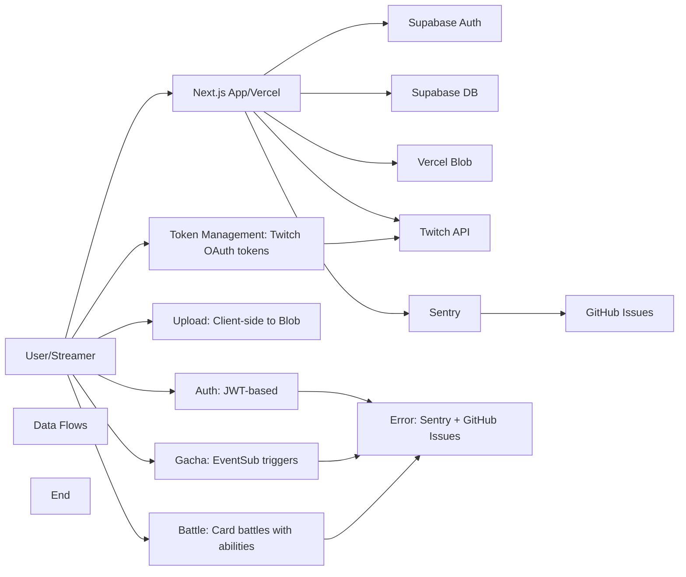

# TwiCa Architecture Document

## 概要

TwiCaはTwitch配信者向けのカードガチャシステムです。視聴者はチャンネルポイントを使ってガチャを引き、配信者が作成したオリジナルカードを収集できます。

---

## 機能要件

### 認証・認可
- Twitch OAuthによる配信者・視聴者認証
- Supabase Auth + カスタムCookieによるセッション管理
- 配信者は自身の配信者ページでのみカード管理が可能
- 視聴者は自分のカードとガチャ履歴のみ閲覧可能

### カード管理機能
- 配信者がカードを登録できる（名前、説明、画像URL、レアリティ、ドロップ率）
- カードの有効/無効切り替え
- カード画像はVercel Blob Storageに保存
- レアリティ: コモン、レア、エピック、レジェンダリー
- カード画像サイズ制限: 最大1MB

### ガチャ機能
- チャンネルポイントを使用したガチャシステム
- Twitch EventSubによるチャンネルポイント使用通知
- 重み付き確率によるカード選択
- ガチャ履歴の記録

### オーバーレイ表示
- ガチャ結果を配信画面にオーバーレイ表示
- ストリーマーIDごとのカスタマイズ可能な表示

### ダッシュボード機能
- 配信者ダッシュボード（カード管理、設定）
- 視聴者ダッシュボード（所持カード、ガチャ履歴）

### エラートラッキング
- Sentryによるエラー監視
- アプリケーションエラーの自動送信
- GitHub Issuesへの自動連携

---

## 非機能要件

### パフォーマンス
- APIレスポンス: 500ms以内（99パーセンタイル）
- ガチャ処理: 300ms以内
- 対戦処理: 1000ms以内
- 静的アセットのCDN配信（Vercel）
- データベースインデックスによるクエリ最適化
- データベースクエリフィールド選択の最適化
- N+1クエリ問題の回避

### セキュリティ
- HTTPSでの通信
- Supabase RLS (Row Level Security) による多層防御
- CSRF対策（SameSite=Lax Cookie + state検証）
- XSS対策（Reactの自動エスケープ）
- 環境変数によるシークレット管理
- セッション有効期限: 7日（Cookie + expiresAt検証）
- Twitch署名検証（EventSub Webhook）
- EventSubべき等性（event_idによる重複チェック）
- APIレート制限によるDoS攻撃対策
- 対戦の不正防止（ランダム性の確保）
- デバッグエンドポイントの保護（Issue #32）
- Sentryデバッグエンドポイントの保護（Issue #36）
- セキュリティヘッダーの設定（Issue #43）
- ファイルアップロードのサニタイズ（Issue #44）
- Twitch トークンの安全な管理（Issue #46）

### コード品質
- UI 文字列の標準化（Issue #35, Issue #47）
- 定数による設定値の管理
- TypeScript による型安全性
- ESLint によるコード品質チェック
- テストカバレッジの維持

### 可用性
- Vercelによる99.95% SLA
- Supabaseによる99.9% データベース可用性
- エラー検知と通知（Sentry）

### スケーラビリティ
- Vercel Serverless Functionsの自動スケーリング
- SupabaseのマネージドPostgreSQL（自動スケーリング）

### 可観測性
- Sentryによるエラー追跡と監視
- 構造化ロギング
- パフォーマンスモニタリング

---

## 受け入れ基準

### ユーザー認証
- [x] Twitch OAuthでログインできる
- [x] 配信者として認証される
- [x] 視聴者として認証される
- [x] ログアウトできる
- [x] セッション有効期限後に再認証が必要
- [x] Twitchログイン時のエラーが適切にハンドリングされる（Issue #19 - 解決済み）

### カード管理
- [x] カードを新規登録できる
- [x] カードを編集できる
- [x] カードを削除できる
- [x] カード画像をアップロードできる
- [x] カード画像サイズが1MB以下である
- [x] カードの有効/無効を切り替えられる
- [x] ドロップ率を設定できる（合計1.0以下）

### ガチャ機能
- [x] チャンネルポイントでガチャを引ける
- [x] ガチャ結果が正しく表示される
- [x] ドロップ率通りにカードが排出される
- [x] ガチャ履歴が記録される
- [x] 重みなしで同じ確率で排出される（全カードのドロップ率が等しい場合）

### オーバーレイ
- [x] ガチャ結果がOBS等のブラウザソースで表示できる
- [x] カード画像が正しく表示される
- [x] レアリティに応じた色が表示される

### データ整合性
- [x] RLSポリシーが正しく機能する
- [x] 配信者は自分のカードしか編集できない
- [x] 視聴者は自分のカードしか見れない
- [x] ガチャ履歴が正しく記録される

### APIレート制限（Issue #13）
- [x] `@upstash/ratelimit` と `@upstash/redis` をインストール
- [x] `src/lib/rate-limit.ts` を実装
- [x] 各 API ルートにレート制限を追加
- [x] 429 エラーが適切に返される
- [x] レート制限ヘッダーが設定される
- [x] 開発環境でインメモリレート制限が動作する
- [x] 本番環境で Redis レート制限が動作する
- [x] EventSub Webhook は緩いレート制限を持つ
- [x] 認証済みユーザーは twitchUserId で識別される
- [x] 未認証ユーザーは IP アドレスで識別される
- [x] フロントエンドで 429 エラーが適切に表示される

### カード対戦機能（Issue #15）
- [x] カードにステータス（HP、ATK、DEF、SPD）が追加される
- [x] 各カードにスキルが設定される
- [x] CPU対戦が可能
- [x] 自動ターン制バトルが動作する
- [x] 勝敗判定が正しく行われる
- [x] 対戦履歴が記録される
- [x] 対戦統計が表示される
- [x] フロントエンドで対戦が視覚的に楽しめる
- [x] アニメーション効果が表示される
- [x] モバイルで快適に操作可能

### コード品質（Issue #35）
- [x] Battle ライブラリの文字列が定数化されている
- [x] スキル名配列が定数として定義されている
- [x] バトルログメッセージが定数として定義されている
- [x] CPU カード文字列が定数を使用している
- [x] ハードコードされた日本語文字列が削除されている
- [x] Battle API と battle.ts の間で一貫性が保たれている

### Sentry エラー追跡
- [x] Sentry DSN が環境変数から正しく読み込まれる
- [x] クライアント側エラーがSentryに送信される
- [x] サーバー側APIエラーがSentryに送信される
- [x] コンソールエラーがSentryにキャプチャされる
- [x] 500エラーがSentryに報告される
- [x] Sentryイベントの環境が正しく設定される
- [x] エラーコンテキスト（ユーザー、リクエストなど）が正しく付与される

### セキュリティヘッダー（Issue #43）
- [x] `src/lib/constants.ts` に `SECURITY_HEADERS` 定数を追加
- [x] `src/lib/security-headers.ts` にヘルパー関数を作成
- [x] `src/proxy.ts` でセキュリティヘッダーを設定
- [x] 開発環境と本番環境で異なる CSP を設定
- [x] HSTS は本番環境のみで設定
- [ ] 本番環境で Tailwind CSS v4 が正常に動作することを確認
- [ ] 本番環境で Next.js App Router が正常に動作することを確認
- [ ] nonceを使用したCSPの実装（必要な場合）
- [x] lint と test がパスする
- [x] CI がパスする

### ファイルアップロードのセキュリティ（Issue #44）
- [x] ファイル名がハッシュ化される
- [x] マジックバイトによるファイルタイプ検証が実装される
- [x] 拡張子とファイル内容が一致しない場合、400エラーが返される
- [x] パストラバーサル攻撃が防止される
- [x] テストが追加される
- [x] lint と test がパスする
- [x] CI がパスする

### Twitch トークン管理（Issue #46）
- [x] データベースマイグレーションが作成される
- [x] `src/lib/twitch/token-manager.ts` が作成される
- [x] `/api/auth/twitch/callback` で Twitch トークンが保存される
- [x] `/api/twitch/rewards` で正しい Twitch アクセストークンが使用される
- [x] トークンの有効期限が切れた場合、自動的に更新される
- [x] ログアウト時、Twitch トークンが削除される
- [x] テストが追加される
- [x] lint と test がパスする
- [x] CI がパスする

### コード品質 - UI 文字列の定数化（Issue #47）
- [ ] `src/lib/constants.ts` に UI 文字列定数を追加する
- [ ] `TwitchLoginButton.tsx` の文字列を定数化する
- [ ] `Header.tsx` の文字列を定数化する
- [ ] `Collection.tsx` の文字列を定数化する
- [ ] `CardManager.tsx` の文字列を定数化する
- [ ] その他のコンポーネントの文字列を定数化する
- [ ] すべてのハードコードされた日本語文字列が定数に置き換えられる
- [ ] lint と test がパスする
- [ ] CI がパスする

---

## 設計方針

### アーキテクチャパターン
- **クライアントサイド**: Next.js App Router + Server Components
- **サーバーサイド**: Vercel Serverless Functions
- **データストア**: Supabase (PostgreSQL)
- **ストレージ**: Vercel Blob
- **認証**: カスタムCookie + Twitch OAuth
- **エラートラッキング**: Sentry + GitHub Issues自動化

### デザイン原則
1. **Simple over Complex**: 複雑さを最小限に抑える
2. **Type Safety**: TypeScriptによる厳格な型定義
3. **Separation of Concerns**: 機能ごとのモジュール分割
4. **Security First**: アプリケーション層での認証検証 + RLS（多層防御）
5. **Consistency**: コードベース全体で一貫性を維持
6. **Error Handling**: ユーザーにわかりやすいエラーメッセージを提供
7. **Observability**: エラー追跡と自動イシュー作成により運用効率を向上
8. **Performance**: 最小限のデータ転送と効率的なクエリ実行
9. **Query Optimization**: N+1クエリ問題の回避とJOINの適切な使用
10. **Development/Production Separation**: デバッグツールは開発環境でのみ使用
11. **String Standardization**: すべての表示文字列を定数として一元管理
12. **Constant Standardization**: すべての設定値・定数を一元管理
13. **Client-side OAuth**: OAuthリダイレクトはクライアント側で行い、CORS問題を回避
14. **Security Headers**: すべてのリクエストにセキュリティヘッダーを設定
15. **File Upload Security**: ファイルアップロード時に適切なサニタイズと検証を行う
16. **Token Management**: Twitch トークンは適切に保存・更新・削除する

### 技術選定基準
- マネージドサービス優先（運用コスト削減）
- Next.jsエコシステムを活用（開発効率）
- カスタムセッションによる柔軟な認証管理
- Sentryによるエラー可視化

---

## アーキテクチャ

### システム全体図



---

## Code Quality - Hardcoded Strings in React Components (Issue #47)

### 概要

React コンポーネント（`src/components/`）に多くのハードコードされた日本語文字列が含まれており、コードの保守性と一貫性が損なわれています。

Issue #35 で Battle ライブラリ（`src/lib/battle.ts`）の文字列は定数化されましたが、React コンポーネントにはまだ多くのハードコードされた文字列が残っています。

### 問題点

1. **ハードコードされた文字列が散在**: 複数のコンポーネントにハードコードされた日本語文字列が含まれている
2. **保守性の低下**: 文字列の変更時に複数のファイルを修正する必要がある
3. **翻訳の困難さ**: 将来的に多言語対応する場合の拡張性が低い
4. **一貫性の欠如**: 類似の文字列が異なる表現で使用されている可能性がある

### 影響範囲

以下のコンポーネントにハードコードされた日本語文字列が含まれています：
- `TwitchLoginButton.tsx`: '読み込み中...', 'Twitchでログイン', 'ログインに失敗しました', 'ネットワークエラーが発生しました'
- `Header.tsx`: 'ログアウト'
- `Collection.tsx`: 'マイコレクション', 'まだカードを持っていません。', '配信者のチャネルポイントを使ってカードをゲットしましょう！', '種類'
- `CardManager.tsx`: 多くのフォームラベル、ボタンテキスト、エラーメッセージ
- その他のコンポーネント

### 設計

#### 1. UI 文字列定数の作成

`src/lib/constants.ts` に以下の定数を追加：

```typescript
export const UI_STRINGS = {
  // Authentication
  AUTH: {
    TWITCH_LOGIN: 'Twitchでログイン',
    LOADING: '読み込み中...',
    LOGIN_FAILED: 'ログインに失敗しました',
    NETWORK_ERROR: 'ネットワークエラーが発生しました',
    LOGOUT: 'ログアウト',
  },

  // Card Manager
  CARD_MANAGER: {
    TITLE: 'カード管理',
    ADD_NEW_CARD: '新規カード追加',
    EDIT_CARD: 'カードを編集',
    NEW_CARD: '新規カード',
    FORM_LABELS: {
      NAME: 'カード名',
      NAME_PLACEHOLDER: 'カード名',
      IMAGE: '画像 (ファイルまたはURL)',
      IMAGE_URL_PLACEHOLDER: 'または画像URLを入力',
      RARITY: 'レアリティ',
      DROP_RATE: '出現確率',
      DESCRIPTION: '説明',
      DESCRIPTION_PLACEHOLDER: 'カードの説明を入力',
    },
    FILE_UPLOAD: {
      FORMATS: '対応形式: JPEG, PNG',
      MAX_SIZE: (mb: string) => `最大サイズ: ${mb}MB`,
      SUPPORTED_FORMATS: '対応形式: JPEG, PNG | ',
    },
    BUTTONS: {
      SAVE: '保存',
      CANCEL: 'キャンセル',
      DELETE: '削除',
      CLOSE: '閉じる',
      UPLOAD: 'アップロード',
      EDIT: '編集',
    },
    CONFIRMATIONS: {
      DELETE_CARD: 'このカードを削除しますか？',
    },
    MESSAGES: {
      RATE_LIMIT: 'リクエストが多すぎます。しばらく待ってから再試行してください。',
      SAVE_FAILED: 'カードの保存に失敗しました',
      DELETE_FAILED: 'カード削除に失敗しました',
      OPERATION_FAILED: (msg: string) => `操作失敗: ${msg}`,
      DELETE_FAILED_PREFIX: '削除失敗:',
      NETWORK_ERROR: 'ネットワークエラーが発生しました。削除をキャンセルしました。',
      UPLOAD_FAILED: '画像のアップロードに失敗しました',
      SUCCESS: 'カードを保存しました',
    },
  },

  // Collection
  COLLECTION: {
    TITLE: 'マイコレクション',
    EMPTY_MESSAGE: {
      LINE1: 'まだカードを持っていません。',
      LINE2: '配信者のチャネルポイントを使ってカードをゲットしましょう！',
    },
    CARD_TYPES: (count: number) => `(${count} 種類)`,
    CARD_COUNT: (count: number) => `x${count}`,
  },

  // Dashboard
  DASHBOARD: {
    TITLE: 'ダッシュボード',
    WELCOME: (name: string) => `ようこそ、${name}さん！`,
    RECENT_WINS: '最近の獲得',
    STATS: '統計',
  },

  // Battle
  BATTLE: {
    TITLE: 'カード対戦',
    VERSUS: 'VS',
    START_BATTLE: '対戦開始',
    YOUR_CARD: 'あなたのカード',
    OPPONENT_CARD: '相手のカード',
    RESULT_WIN: '勝利！',
    RESULT_LOSE: '敗北',
    RESULT_DRAW: '引き分け',
  },

  // General
  GENERAL: {
    LOADING: '読み込み中...',
    ERROR: 'エラーが発生しました',
    UNKNOWN_ERROR: '不明なエラーが発生しました',
    BACK: '戻る',
    NEXT: '次へ',
    PREV: '前へ',
    SAVE: '保存',
    CANCEL: 'キャンセル',
    DELETE: '削除',
    CONFIRM: '確認',
  },
} as const
```

#### 2. コンポーネントの更新例

`src/components/TwitchLoginButton.tsx`:

```typescript
import { UI_STRINGS } from '@/lib/constants'

// Before:
setError('ログインに失敗しました')

// After:
setError(UI_STRINGS.AUTH.LOGIN_FAILED)
```

`src/components/Header.tsx`:

```typescript
import { UI_STRINGS } from '@/lib/constants'

// Before:
<Link
  href="/api/auth/logout"
  className="..."
>
  ログアウト
</Link>

// After:
<Link
  href="/api/auth/logout"
  className="..."
>
  {UI_STRINGS.AUTH.LOGOUT}
</Link>
```

`src/components/Collection.tsx`:

```typescript
import { UI_STRINGS } from '@/lib/constants'

// Before:
<h2 className="...">マイコレクション</h2>

// After:
<h2 className="...">{UI_STRINGS.COLLECTION.TITLE}</h2>

// Before:
<p className="...">まだカードを持っていません。<br />配信者のチャネルポイントを使ってカードをゲットしましょう！</p>

// After:
<p className="...">
  {UI_STRINGS.COLLECTION.EMPTY_MESSAGE.LINE1}
  <br />
  {UI_STRINGS.COLLECTION.EMPTY_MESSAGE.LINE2}
</p>
```

`src/components/CardManager.tsx`:

```typescript
import { UI_STRINGS } from '@/lib/constants'

// Form labels
<label>{UI_STRINGS.CARD_MANAGER.FORM_LABELS.NAME}</label>
<input placeholder={UI_STRINGS.CARD_MANAGER.FORM_LABELS.NAME_PLACEHOLDER} />

// Buttons
<button onClick={() => setShowForm(true)}>
  {UI_STRINGS.CARD_MANAGER.ADD_NEW_CARD}
</button>

// Messages
<h3>
  {editingCard ? UI_STRINGS.CARD_MANAGER.EDIT_CARD : UI_STRINGS.CARD_MANAGER.NEW_CARD}
</h3>

// Error messages
setUploadError(errorData.error || UI_STRINGS.CARD_MANAGER.MESSAGES.RATE_LIMIT)

// Confirmations
if (!confirm(UI_STRINGS.CARD_MANAGER.CONFIRMATIONS.DELETE_CARD)) return

// File upload info
<p className="...">
  {UI_STRINGS.CARD_MANAGER.FILE_UPLOAD.SUPPORTED_FORMATS}
  {UI_STRINGS.CARD_MANAGER.FILE_UPLOAD.MAX_SIZE((UPLOAD_CONFIG.MAX_FILE_SIZE / (1024 * 1024)).toFixed(1) + 'MB')}
</p>

// Drop rate label
<label>
  {UI_STRINGS.CARD_MANAGER.FORM_LABELS.DROP_RATE} ({(formData.dropRate * 100).toFixed(1)}%)
</label>
```

#### 3. その他のコンポーネントの更新

以下のコンポーネントも同様に更新する必要があります：
- `src/components/AnimatedBattle.tsx`
- `src/components/BattleComponents.tsx` (存在する場合)
- `src/components/ChannelPointSettings.tsx`
- `src/components/CopyButton.tsx`
- `src/components/DashboardComponents.tsx`
- `src/components/GachaHistorySection.tsx`
- `src/components/RecentWins.tsx`
- `src/components/Stats.tsx`
- `src/components/StreamerSettings.tsx`
- `src/components/DevelopmentNotice.tsx`

#### 4. 型定義の更新

必要に応じて型定義を追加：

```typescript
export type UIStrings = typeof UI_STRINGS;
```

### メリット

1. **保守性の向上**: 文字列の変更時に 1 箇所（constants.ts）を修正するだけで済む
2. **一貫性の確保**: 同じ意味の文字列が一箇所で管理されるため、不整合がなくなる
3. **拡張性の確保**: 将来的に多言語対応（i18n）する場合の拡張性が高い
4. **コードの可読性向上**: 定数名から意味が明確になる
5. **Issue #35 との一貫性**: Battle ライブラリと同じパターンを適用

### トレードオフの検討

#### 選択肢1: 定数化（採用）
- **メリット**:
  - 保守性の向上
  - 一貫性の確保
  - 将来的な拡張性（i18n）
- **デメリット**:
  - 初期実装に時間がかかる
  - 定数ファイルが大きくなる
- **判断**: Issue #35 での実績と、長期的な保守性を考慮し採用

#### 選択肢2: 現状維持（採用しない）
- **メリット**:
  - 実装コストがかからない
- **デメリット**:
  - 保守性が低い
  - 一貫性が保てない
  - 将来的な拡張性がない
- **判断**: コード品質と保守性を優先し採用しない

#### 選択肢3: i18n ライブラリの導入（採用しない）
- **メリット**:
  - 多言語対応が容易
  - 機能が豊富
- **デメリット**:
  - 追加の依存関係
  - 実装コストが高い
  - 現時点では必要ない
- **判断**: 現状では日本語のみで十分であり、将来 i18n が必要になった際に導入可能

### 受け入れ基準

- [ ] `src/lib/constants.ts` に UI 文字列定数を追加する
- [ ] `TwitchLoginButton.tsx` の文字列を定数化する
- [ ] `Header.tsx` の文字列を定数化する
- [ ] `Collection.tsx` の文字列を定数化する
- [ ] `CardManager.tsx` の文字列を定数化する
- [ ] その他のコンポーネントの文字列を定数化する
- [ ] すべてのハードコードされた日本語文字列が定数に置き換えられる
- [ ] lint と test がパスする
- [ ] CI がパスする

---

## 更新履歴

| 日付 | 変更内容 |
|:---|:---|
| 2026-01-19 | UI 文字列の定数化設計を追加（Issue #47） |
| 2026-01-19 | アーキテクチャドキュメントの新規作成 |

---

## 実装完了の問題

なし

過去のアーキテクチャドキュメントの詳細を参照する場合は、docs/ARCHITECTURE_*.md ファイルを確認してください。
