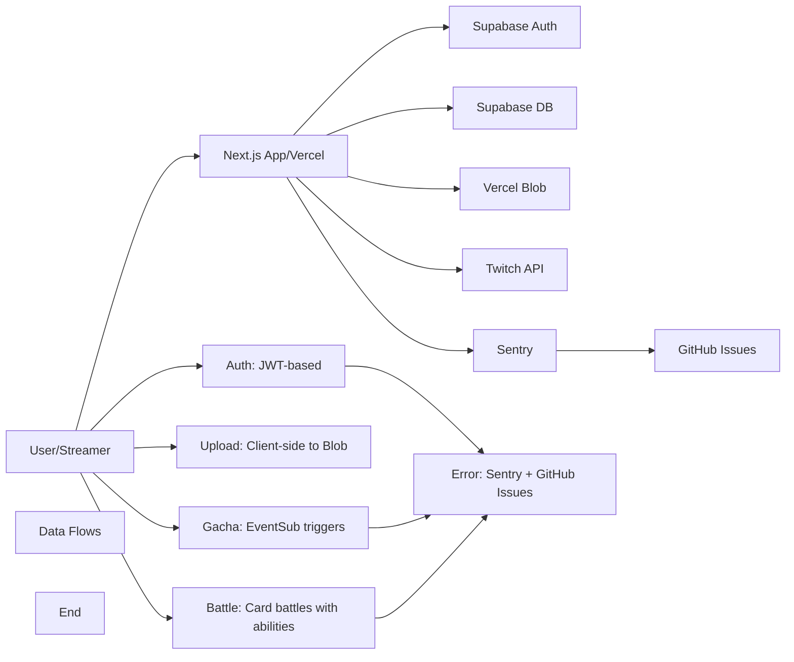

# TwiCa Architecture Document

## 概要

TwiCaはTwitch配信者向けのカードガチャシステムです。視聴者はチャンネルポイントを使ってガチャを引き、配信者が作成したオリジナルカードを収集できます。

---

## 機能要件

### 認証・認可
- Twitch OAuthによる配信者・視聴者認証
- Supabase Auth + カスタムCookieによるセッション管理
- 配信者は自身の配信者ページでのみカード管理が可能
- 視聴者は自分のカードとガチャ履歴のみ閲覧可能

### カード管理機能
- 配信者がカードを登録できる（名前、説明、画像URL、レアリティ、ドロップ率）
- カードの有効/無効切り替え
- カード画像はVercel Blob Storageに保存
- レアリティ: コモン、レア、エピック、レジェンダリー
- カード画像サイズ制限: 最大1MB

### ガチャ機能
- チャンネルポイントを使用したガチャシステム
- Twitch EventSubによるチャンネルポイント使用通知
- 重み付き確率によるカード選択
- ガチャ履歴の記録

### オーバーレイ表示
- ガチャ結果を配信画面にオーバーレイ表示
- ストリーマーIDごとのカスタマイズ可能な表示

### ダッシュボード機能
- 配信者ダッシュボード（カード管理、設定）
- 視聴者ダッシュボード（所持カード、ガチャ履歴）

---

## 非機能要件

### パフォーマンス
- APIレスポンス: 500ms以内（99パーセンタイル）
- ガチャ処理: 300ms以内
- 対戦処理: 1000ms以内
- 静的アセットのCDN配信（Vercel）
- データベースインデックスによるクエリ最適化

### セキュリティ
- HTTPSでの通信
- Supabase RLS (Row Level Security) による多層防御
- CSRF対策（SameSite=Lax Cookie + state検証）
- XSS対策（Reactの自動エスケープ）
- 環境変数によるシークレット管理
- セッション有効期限: 7日（Cookie + expiresAt検証）
- Twitch署名検証（EventSub Webhook）
- EventSubべき等性（event_idによる重複チェック）
- APIレート制限によるDoS攻撃対策
- 対戦の不正防止（ランダム性の確保）

### 可用性
- Vercelによる99.95% SLA
- Supabaseによる99.9% データベース可用性

### スケーラビリティ
- Vercel Serverless Functionsの自動スケーリング
- SupabaseのマネージドPostgreSQL（自動スケーリング）

---

## 受け入れ基準

### ユーザー認証
- [x] Twitch OAuthでログインできる
- [x] 配信者として認証される
- [x] 視聴者として認証される
- [x] ログアウトできる
- [x] セッション有効期限後に再認証が必要
- [x] Twitchログイン時のエラーが適切にハンドリングされる（Issue #19 - 解決済み）

### カード管理
- [x] カードを新規登録できる
- [x] カードを編集できる
- [x] カードを削除できる
- [x] カード画像をアップロードできる
- [x] カード画像サイズが1MB以下である
- [x] カードの有効/無効を切り替えられる
- [x] ドロップ率を設定できる（合計1.0以下）

### ガチャ機能
- [x] チャンネルポイントでガチャを引ける
- [x] ガチャ結果が正しく表示される
- [x] ドロップ率通りにカードが排出される
- [x] ガチャ履歴が記録される
- [x] 重みなしで同じ確率で排出される（全カードのドロップ率が等しい場合）

### オーバーレイ
- [x] ガチャ結果がOBS等のブラウザソースで表示できる
- [x] カード画像が正しく表示される
- [x] レアリティに応じた色が表示される

### データ整合性
- [x] RLSポリシーが正しく機能する
- [x] 配信者は自分のカードしか編集できない
- [x] 視聴者は自分のカードしか見れない
- [x] ガチャ履歴が正しく記録される

### APIレート制限（Issue #13）
- [x] `@upstash/ratelimit` と `@upstash/redis` をインストール
- [x] `src/lib/rate-limit.ts` を実装
- [x] 各 API ルートにレート制限を追加
- [x] 429 エラーが適切に返される
- [x] レート制限ヘッダーが設定される
- [x] 開発環境でインメモリレート制限が動作する
- [x] 本番環境で Redis レート制限が動作する
- [x] EventSub Webhook は緩いレート制限を持つ
- [x] 認証済みユーザーは twitchUserId で識別される
- [x] 未認証ユーザーは IP アドレスで識別される
- [x] フロントエンドで 429 エラーが適切に表示される

### カード対戦機能（Issue #15）
- [x] カードにステータス（HP、ATK、DEF、SPD）が追加される
- [x] 各カードにスキルが設定される
- [x] CPU対戦が可能
- [x] 自動ターン制バトルが動作する
- [x] 勝敗判定が正しく行われる
- [x] 対戦履歴が記録される
- [x] 対戦統計が表示される
- [x] フロントエンドで対戦が視覚的に楽しめる
- [x] アニメーション効果が表示される
- [x] モバイルで快適に操作可能

### 型安全性向上（Issue #17）
- [x] `any`型の使用が削除される
- [x] ESLintの`@typescript-eslint/no-explicit-any`警告が解消される
- [x] カード所有権の検証が正しく動作する
- [x] TypeScriptのコンパイルエラーがない
- [x] 既存のAPIテストがパスする

### APIエラーハンドリング標準化（Issue #18）
- [x] すべてのAPIルートで標準化されたエラーハンドラーを使用する
- [x] エラーメッセージがすべてのルートで一貫している
- [x] 既存のAPIテストがパスする
- [x] 手動テストでエラーハンドリングが正しく動作することを確認する
- [x] 既存の機能に回帰がない

---

## 設計方針

### アーキテクチャパターン
- **クライアントサイド**: Next.js App Router + Server Components
- **サーバーサイド**: Vercel Serverless Functions
- **データストア**: Supabase (PostgreSQL)
- **ストレージ**: Vercel Blob
- **認証**: カスタムCookie + Twitch OAuth
- **エラートラッキング**: Sentry + GitHub Issues自動化

### デザイン原則
1. **Simple over Complex**: 複雑さを最小限に抑える
2. **Type Safety**: TypeScriptによる厳格な型定義
3. **Separation of Concerns**: 機能ごとのモジュール分割
4. **Security First**: アプリケーション層での認証検証 + RLS（多層防御）
5. **Consistency**: コードベース全体で一貫性を維持
6. **Error Handling**: ユーザーにわかりやすいエラーメッセージを提供
7. **Observability**: エラー追跡と自動イシュー作成により運用効率を向上

### 技術選定基準
- マネージドサービス優先（運用コスト削減）
- Next.jsエコシステムを活用（開発効率）
- カスタムセッションによる柔軟な認証管理
- Sentryによるエラー可視化

---

## アーキテクチャ

### システム全体図



---

## Issue #23: Fix CPU Opponent Database Inconsistency in Battle System

### 問題

CPU対戦相手のデータベース参照に不整合があります。

### 問題の詳細

1. **battlesテーブルの外部キー制約の問題**
   - `battles.opponent_card_id` は `cards(id)` への外部キー参照を持っています
   - しかし、CPU対戦相手はランダムに生成される仮想的なカードで、実際にはデータベースに存在しません
   - 現在は `allCards[0]?.id` をプレースホルダーとして使用していますが、これはデータベースの整合性を破壊します

2. **実装の問題**
   - `src/app/api/battle/start/route.ts:121` で `opponent_card_id: allCards[0]?.id` を設定
   - これにより、実際の対戦相手とは異なるカードIDが記録されます

### 影響範囲

- 対戦履歴の正確性が損なわれる
- 統計データが不正確になる
- データの整合性が保たれない

### 優先度

高（データ整合性と正確性の問題）

---

## Issue #23: 設計

### 機能要件

#### 1. CPU対戦相手の正確な記録

1. **battlesテーブルの構造変更**
   - `opponent_card_id` を NULL許容に変更
   - `opponent_card_data` (JSONB) カラムを追加
   - CPU対戦の場合は `opponent_card_id` は NULL、CPU対戦相手の情報は `opponent_card_data` に格納
   - プレイヤー対プレイヤー（将来の実装）の場合は `opponent_card_id` を使用

2. **CPU対戦相手データの構造**
   - カードID（生成された一意なID、`cpu-xxx` 形式）
   - カード名
   - HP、ATK、DEF、SPD
   - スキルタイプ、スキル名
   - 画像URL
   - レアリティ

3. **APIの修正**
   - `src/app/api/battle/start/route.ts` での修正
   - CPU対戦相手のデータを `opponent_card_data` に格納
   - `opponent_card_id` には NULL を設定

#### 2. データベースマイグレーション

1. **マイグレーションファイルの作成**
   - `supabase/migrations/00003_fix_cpu_opponent_inconsistency.sql`
   - `opponent_card_id` を NULL許容に変更
   - `opponent_card_data` (JSONB) カラムを追加
   - 既存データのマイグレーション

2. **既存データのマイグレーション**
   - 既存の対戦履歴の `opponent_card_id` を保持
   - 必要に応じて `opponent_card_data` を補完

#### 3. 型定義の更新

1. **database.ts の更新**
   - `Battle` 型に `opponent_card_data` フィールドを追加

2. **battle.ts の更新**
   - `playBattle` 関数の戻り値にCPU対戦相手データを含める

### 非機能要件

#### データ整合性
- CPU対戦相手のデータを正確に記録する
- 既存の対戦履歴との互換性を維持する

#### 保守性
- 将来のプレイヤー対プレイヤー実装に対応できる柔軟性を確保
- マイグレーションが安全に実行できる

### 設計

#### 1. データベースマイグレーション

**supabase/migrations/00003_fix_cpu_opponent_inconsistency.sql**

```sql
-- Fix CPU opponent database inconsistency in battle system

-- Make opponent_card_id nullable
ALTER TABLE battles
ALTER COLUMN opponent_card_id DROP NOT NULL;

-- Add opponent_card_data column for storing CPU opponent data
ALTER TABLE battles
ADD COLUMN opponent_card_data JSONB;

-- Migrate existing data (if any)
-- Keep existing opponent_card_id values as they represent valid card references
-- For battles where opponent_card_id was incorrectly set, we'll need to fix them
-- This is a placeholder for any data migration logic if needed

-- Add comment for clarity
COMMENT ON COLUMN battles.opponent_card_id IS 'Card ID for player vs player battles. NULL for CPU battles. References cards(id).';
COMMENT ON COLUMN battles.opponent_card_data IS 'CPU opponent card data for CPU battles. Contains card details: id, name, hp, atk, def, spd, skill_type, skill_name, image_url, rarity.';
```

#### 2. 型定義の更新

**src/types/database.ts**

```typescript
export interface Battle {
  id: string
  user_id: string
  user_card_id: string
  opponent_card_id: string | null
  opponent_card_data: OpponentCardData | null
  result: 'win' | 'lose' | 'draw'
  turn_count: number
  battle_log: BattleLogEntry[]
  created_at: string
}

export interface OpponentCardData {
  id: string
  name: string
  hp: number
  atk: number
  def: number
  spd: number
  skill_type: 'attack' | 'defense' | 'heal' | 'special'
  skill_name: string
  image_url: string
  rarity: 'common' | 'rare' | 'epic' | 'legendary'
}

export interface BattleLogEntry {
  round: number
  attacker: 'user' | 'opponent'
  action: string
  damage?: number
  heal?: number
  effect?: string
}
```

#### 3. APIの修正

**src/app/api/battle/start/route.ts**

```typescript
// ... existing imports ...

export async function POST(request: NextRequest) {
  const requestId = crypto.randomUUID()
  setRequestContext(requestId, '/api/battle/start')
  
  let session: { twitchUserId: string; twitchUsername: string; broadcasterType?: string } | null = null
  
  try {
    session = await getSession()
    
    if (session) {
      setUserContext({
        twitchUserId: session.twitchUserId,
        twitchUsername: session.twitchUsername,
        broadcasterType: session.broadcasterType,
      })
    }
    
    const identifier = await getRateLimitIdentifier(request, session?.twitchUserId)
    const rateLimitResult = await checkRateLimit(rateLimits.battleStart, identifier)

    if (!rateLimitResult.success) {
      return NextResponse.json(
        { error: "リクエストが多すぎます。しばらく待ってから再試行してください。" },
        {
          status: 429,
          headers: {
            'X-RateLimit-Limit': String(rateLimitResult.limit),
            'X-RateLimit-Remaining': String(rateLimitResult.remaining),
            'X-RateLimit-Reset': String(rateLimitResult.reset),
          },
        }
      )
    }

    if (!session) {
      return NextResponse.json(
        { error: 'Unauthorized' },
        { status: 401 }
      )
    }

    const supabaseAdmin = getSupabaseAdmin()
    
    // Get user data
    const { data: userData, error: userError } = await supabaseAdmin
      .from('users')
      .select('*')
      .eq('twitch_user_id', session.twitchUserId)
      .single()

    if (userError || !userData) {
      return handleDatabaseError(userError ?? new Error('User not found'), "Battle Start API: Failed to fetch user data")
    }

    const body = await request.json()
    const { userCardId } = body
    
    if (userCardId) {
      setGameContext({ cardId: userCardId })
    }

    if (!userCardId) {
      return NextResponse.json(
        { error: 'userCardId is required' },
        { status: 400 }
      )
    }

    // Get user's card with details
    const { data: userCardData, error: userCardError } = await supabaseAdmin
      .from('user_cards')
      .select(`
        *,
        card:cards(
          *,
          streamer:streamers(*)
        )
      `)
      .eq('id', userCardId)
      .eq('user_id', userData.id)
      .single()

    if (userCardError || !userCardData) {
      return handleDatabaseError(userCardError ?? new Error('Card not found or not owned by user'), "Battle Start API: Failed to fetch user card")
    }

    // Get all active cards for CPU opponent
    const { data: allCards, error: allCardsError } = await supabaseAdmin
      .from('cards')
      .select('*')
      .eq('is_active', true)

    if (allCardsError) {
      return handleDatabaseError(allCardsError, "Battle Start API: Failed to fetch cards for CPU opponent")
    }

    // Convert to BattleCard format
    const userBattleCard = toBattleCard(userCardData.card)
    const opponentBattleCard = generateCPUOpponent(allCards as Card[])

    // Play the battle
    const battleResult = await playBattle(userBattleCard, opponentBattleCard)

    // Prepare opponent card data for storage
    const opponentCardData = {
      id: opponentBattleCard.id,
      name: opponentBattleCard.name,
      hp: opponentBattleCard.hp,
      atk: opponentBattleCard.atk,
      def: opponentBattleCard.def,
      spd: opponentBattleCard.spd,
      skill_type: opponentBattleCard.skill_type,
      skill_name: opponentBattleCard.skill_name,
      image_url: opponentBattleCard.image_url,
      rarity: opponentBattleCard.rarity
    }

    // Store battle in database
    const { data: battleData, error: battleError } = await supabaseAdmin
      .from('battles')
      .insert({
        user_id: userData.id,
        user_card_id: userCardId,
        opponent_card_id: null, // CPU battle, set to NULL
        opponent_card_data: opponentCardData, // Store CPU opponent data
        result: battleResult.result,
        turn_count: battleResult.turnCount,
        battle_log: battleResult.logs
      })
      .select()
      .single()
      
    if (battleData) {
      setGameContext({ 
        battleId: battleData.id,
        outcome: battleResult.result 
      })
    }

    if (battleError) {
      return handleDatabaseError(battleError, "Battle Start API: Failed to save battle")
    }

    // Return battle result with card details
    return NextResponse.json({
      battleId: battleData.id,
      result: battleResult.result,
      turnCount: battleResult.turnCount,
      userCard: {
        id: userBattleCard.id,
        name: userBattleCard.name,
        hp: userBattleCard.hp,
        currentHp: battleResult.userHp,
        atk: userBattleCard.atk,
        def: userBattleCard.def,
        spd: userBattleCard.spd,
        skill_type: userBattleCard.skill_type,
        skill_name: userBattleCard.skill_name,
        image_url: userBattleCard.image_url,
        rarity: userBattleCard.rarity
      },
      opponentCard: {
        id: opponentBattleCard.id,
        name: opponentBattleCard.name,
        hp: opponentBattleCard.hp,
        currentHp: battleResult.opponentHp,
        atk: opponentBattleCard.atk,
        def: opponentBattleCard.def,
        spd: opponentBattleCard.spd,
        skill_type: opponentBattleCard.skill_type,
        skill_name: opponentBattleCard.skill_name,
        image_url: opponentBattleCard.image_url,
        rarity: opponentBattleCard.rarity
      },
      logs: battleResult.logs
    })

  } catch (error) {
    if (session) {
      reportBattleError(error, {
        battleId: undefined, // Not created yet due to error
        userId: session.twitchUserId,
        round: undefined, // Battle hasn't started
      })
    } else {
      reportBattleError(error, {})
    }
    
    return handleApiError(error, "Battle Start API: General")
  }
}
```

### 変更ファイル

- `supabase/migrations/00003_fix_cpu_opponent_inconsistency.sql` (新規作成)
- `src/types/database.ts` (更新 - `Battle` 型と `OpponentCardData` 型の追加)
- `src/app/api/battle/start/route.ts` (更新 - CPU対戦相手データの格納)
- `src/lib/battle.ts` (確認 - 必要に応じて更新)

### 受け入れ基準

- [x] `opponent_card_id` が NULL許容になる
- [x] `opponent_card_data` カラムが追加される
- [x] CPU対戦の場合、`opponent_card_id` に NULL が設定される
- [x] CPU対戦相手のデータが `opponent_card_data` に格納される
- [x] マイグレーションが成功する
- [x] 既存の対戦履歴と互換性がある
- [x] TypeScript コンパイルエラーがない
- [x] ESLint エラーがない
- [x] 対戦機能が正しく動作する
- [x] 既存の機能に回帰がない

### テスト計画

1. **単体テスト**:
   - マイグレーションが成功することを確認
   - データ型が正しいことを確認

2. **統合テスト**:
   - CPU対戦が正しく動作することを確認
   - 対戦履歴が正しく保存されることを確認

3. **手動テスト**:
   - 実際にCPU対戦を行い、履歴を確認
   - 既存の対戦履歴を確認し、互換性を確認

### トレードオフの検討

#### 解決策の選択

| 項目 | 新しいテーブルの作成 | 既存テーブルのカラム追加 | 外部キー制約の削除 |
|:---|:---|:---|:---|
| **データ整合性** | 高 | 中 | 低 |
| **実装複雑度** | 中 | 低 | 低 |
| **パフォーマンス** | 中（JOINが必要） | 高（単一テーブル） | 高 |
| **将来の拡張性** | 高 | 高 | 低 |
| **マイグレーションのリスク** | 中 | 低 | 低 |

**推奨**: 既存テーブルのカラム追加（実装がシンプルで、パフォーマンスと整合性のバランスが良いため）

#### NULL許容とJSONBの使用

| 項目 | NULL許容 + JSONB | 別々のテーブル |
|:---|:---|:---|
| **クエリのシンプルさ** | 高 | 中 |
| **データの整合性** | 中 | 高 |
| **パフォーマンス** | 高（JOIN不要） | 中（JOINが必要） |
| **将来の拡張性** | 高 | 高 |

**推奨**: NULL許容 + JSONB（クエリがシンプルで、将来のプレイヤー対プレイヤー実装に対応できるため）

---

## Issue #24: Remove Hardcoded Gacha Cost Value

### 問題

ガチャコストがハードコードされています。

### 問題の詳細

1. **ハードコードされた値**
   - `src/app/api/gacha/route.ts:74` で、ガチャコストが `cost: 100` とハードコードされています

2. **柔軟性の欠如**
   - コストを変更する場合、コードの変更が必要
   - 環境ごとに異なるコストを設定できない
   - エラーレポートでコストが常に100として記録される

### 影響範囲

- コストの変更にはコード修正が必要
- テスト環境と本番環境で異なるコストを設定できない
- エラーレポートの正確性が損なわれる

### 優先度

中（保守性の向上）

---

## Issue #24: 設計

### 機能要件

#### 1. ガチャコストの設定ファイルへの移動

1. **constants.ts に定数を追加**
   - `GACHA_COST` 定数を追加
   - 環境変数からコストを取得（デフォルト値: 100）
   - 環境変数がない場合はデフォルト値を使用

2. **env-validation.ts の更新**
   - `GACHA_COST` 環境変数の検証を追加
   - 数値チェック、範囲チェック

3. **APIの修正**
   - `src/app/api/gacha/route.ts` でハードコードされた `cost: 100` を削除
   - `GACHA_COST` 定数を使用

#### 2. ドキュメントの更新

1. **README.md の更新**
   - 環境変数テーブルに `GACHA_COST` を追加
   - デフォルト値と説明を追加

2. **.env.local.example の更新**
   - `GACHA_COST` の例を追加

### 非機能要件

#### 保守性
- コストを変更する場合、環境変数の変更のみで済む
- コードの変更が不要になる

#### 柔軟性
- 環境ごとに異なるコストを設定可能
- デフォルト値が設定されているため、環境変数がなくても動作する

### 設計

#### 1. constants.ts の更新

```typescript
// ... existing exports ...

export const GACHA_COST = parseInt(process.env.GACHA_COST || '100', 10)
```

#### 2. env-validation.ts の更新

```typescript
// ... existing validation ...

// Gacha cost validation
const gachaCost = parseInt(env.GACHA_COST || '100', 10)
if (isNaN(gachaCost) || gachaCost < 1 || gachaCost > 10000) {
  throw new Error('GACHA_COST must be a number between 1 and 10000')
}
```

#### 3. APIの修正

**src/app/api/gacha/route.ts**

```typescript
// ... existing imports ...
import { GACHA_COST } from '@/lib/constants'

// ... existing code ...

export async function POST(request: NextRequest) {
  const requestId = crypto.randomUUID()
  setRequestContext(requestId, '/api/gacha')
  
  let session: { twitchUserId: string; twitchUsername: string; broadcasterType?: string } | null = null
  let body: Record<string, unknown> | null = null
  
  try {
    // ... existing code ...

    if (session) {
      reportGachaError(error, {
        streamerId: body && typeof body === 'object' && 'streamerId' in body ? String(body.streamerId) : undefined,
        userId: session?.twitchUserId,
        cost: GACHA_COST, // Use constant instead of hardcoded value
      })
    } else {
      reportGachaError(error, {})
    }
    
    // ... existing code ...
  } catch (error) {
    // ... existing code ...
  }
}
```

### 変更ファイル

- `src/lib/constants.ts` (更新 - `GACHA_COST` 定数の追加)
- `src/lib/env-validation.ts` (更新 - `GACHA_COST` 環境変数の検証)
- `src/app/api/gacha/route.ts` (更新 - `GACHA_COST` 定数の使用)
- `README.md` (更新 - 環境変数テーブルに `GACHA_COST` を追加)
- `.env.local.example` (更新 - `GACHA_COST` の例を追加)

### 受け入れ基準

- [x] `GACHA_COST` 定数が `src/lib/constants.ts` に追加される
- [x] `GACHA_COST` 環境変数の検証が `src/lib/env-validation.ts` に追加される
- [x] `src/app/api/gacha/route.ts` で `GACHA_COST` 定数を使用する
- [x] ハードコードされた `cost: 100` が削除される
- [x] 環境変数がない場合、デフォルト値（100）が使用される
- [x] README.md に `GACHA_COST` 環境変数が記載される
- [x] `.env.local.example` に `GACHA_COST` の例が追加される
- [x] TypeScript コンパイルエラーがない
- [x] ESLint エラーがない
- [x] ガチャ機能が正しく動作する
- [x] 既存の機能に回帰がない

### テスト計画

1. **単体テスト**:
   - `GACHA_COST` 定数が正しく設定されることを確認
   - 環境変数がない場合、デフォルト値が使用されることを確認

2. **統合テスト**:
   - ガチャAPIが正しく動作することを確認
   - Sentryのエラーレポートで正しいコストが記録されることを確認

3. **手動テスト**:
   - 異なるコスト値を設定してガチャを試す
   - エラーレポートを確認

### トレードオフの検討

なし（単純な改善であり、トレードオフの検討は不要）

---

## 更新履歴

| 日付 | 変更内容 |
|:---|:---|
| 2026-01-17 | Issue #24 ガチャコストのハードコード問題の設計追加 |
| 2026-01-17 | Issue #23 CPU対戦相手のデータベース不整合問題の設計追加 |
