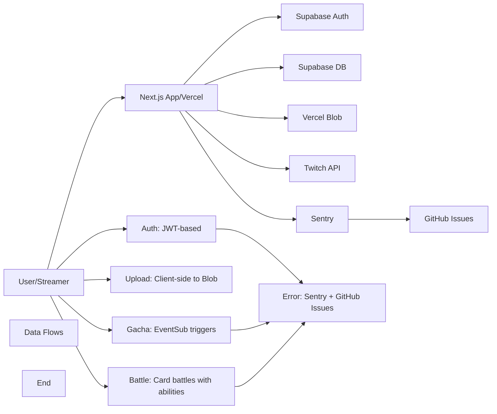

# TwiCa Architecture Document

## 概要

TwiCaはTwitch配信者向けのカードガチャシステムです。視聴者はチャンネルポイントを使ってガチャを引き、配信者が作成したオリジナルカードを収集できます。

---

## 機能要件

### 認証・認可
- Twitch OAuthによる配信者・視聴者認証
- Supabase Auth + カスタムCookieによるセッション管理
- 配信者は自身の配信者ページでのみカード管理が可能
- 視聴者は自分のカードとガチャ履歴のみ閲覧可能

### カード管理機能
- 配信者がカードを登録できる（名前、説明、画像URL、レアリティ、ドロップ率）
- カードの有効/無効切り替え
- カード画像はVercel Blob Storageに保存
- レアリティ: コモン、レア、エピック、レジェンダリー
- カード画像サイズ制限: 最大1MB

### ガチャ機能
- チャンネルポイントを使用したガチャシステム
- Twitch EventSubによるチャンネルポイント使用通知
- 重み付き確率によるカード選択
- ガチャ履歴の記録

### オーバーレイ表示
- ガチャ結果を配信画面にオーバーレイ表示
- ストリーマーIDごとのカスタマイズ可能な表示

### ダッシュボード機能
- 配信者ダッシュボード（カード管理、設定）
- 視聴者ダッシュボード（所持カード、ガチャ履歴）

---

## 非機能要件

### パフォーマンス
- APIレスポンス: 500ms以内（99パーセンタイル）
- ガチャ処理: 300ms以内
- 対戦処理: 1000ms以内
- 静的アセットのCDN配信（Vercel）
- データベースインデックスによるクエリ最適化

### セキュリティ
- HTTPSでの通信
- Supabase RLS (Row Level Security) による多層防御
- CSRF対策（SameSite=Lax Cookie + state検証）
- XSS対策（Reactの自動エスケープ）
- 環境変数によるシークレット管理
- セッション有効期限: 7日（Cookie + expiresAt検証）
- Twitch署名検証（EventSub Webhook）
- EventSubべき等性（event_idによる重複チェック）
- APIレート制限によるDoS攻撃対策
- 対戦の不正防止（ランダム性の確保）

### 可用性
- Vercelによる99.95% SLA
- Supabaseによる99.9% データベース可用性

### スケーラビリティ
- Vercel Serverless Functionsの自動スケーリング
- SupabaseのマネージドPostgreSQL（自動スケーリング）

---

## 受け入れ基準

### ユーザー認証
- [x] Twitch OAuthでログインできる
- [x] 配信者として認証される
- [x] 視聴者として認証される
- [x] ログアウトできる
- [x] セッション有効期限後に再認証が必要
- [x] Twitchログイン時のエラーが適切にハンドリングされる（Issue #19 - 解決済み）

### カード管理
- [x] カードを新規登録できる
- [x] カードを編集できる
- [x] カードを削除できる
- [x] カード画像をアップロードできる
- [x] カード画像サイズが1MB以下である
- [x] カードの有効/無効を切り替えられる
- [x] ドロップ率を設定できる（合計1.0以下）

### ガチャ機能
- [x] チャンネルポイントでガチャを引ける
- [x] ガチャ結果が正しく表示される
- [x] ドロップ率通りにカードが排出される
- [x] ガチャ履歴が記録される
- [x] 重みなしで同じ確率で排出される（全カードのドロップ率が等しい場合）

### オーバーレイ
- [x] ガチャ結果がOBS等のブラウザソースで表示できる
- [x] カード画像が正しく表示される
- [x] レアリティに応じた色が表示される

### データ整合性
- [x] RLSポリシーが正しく機能する
- [x] 配信者は自分のカードしか編集できない
- [x] 視聴者は自分のカードしか見れない
- [x] ガチャ履歴が正しく記録される

### APIレート制限（Issue #13）
- [x] `@upstash/ratelimit` と `@upstash/redis` をインストール
- [x] `src/lib/rate-limit.ts` を実装
- [x] 各 API ルートにレート制限を追加
- [x] 429 エラーが適切に返される
- [x] レート制限ヘッダーが設定される
- [x] 開発環境でインメモリレート制限が動作する
- [x] 本番環境で Redis レート制限が動作する
- [x] EventSub Webhook は緩いレート制限を持つ
- [x] 認証済みユーザーは twitchUserId で識別される
- [x] 未認証ユーザーは IP アドレスで識別される
- [x] フロントエンドで 429 エラーが適切に表示される

### カード対戦機能（Issue #15）
- [x] カードにステータス（HP、ATK、DEF、SPD）が追加される
- [x] 各カードにスキルが設定される
- [x] CPU対戦が可能
- [x] 自動ターン制バトルが動作する
- [x] 勝敗判定が正しく行われる
- [x] 対戦履歴が記録される
- [x] 対戦統計が表示される
- [x] フロントエンドで対戦が視覚的に楽しめる
- [x] アニメーション効果が表示される
- [x] モバイルで快適に操作可能

### 型安全性向上（Issue #17）
- [x] `any`型の使用が削除される
- [x] ESLintの`@typescript-eslint/no-explicit-any`警告が解消される
- [x] カード所有権の検証が正しく動作する
- [x] TypeScriptのコンパイルエラーがない
- [x] 既存のAPIテストがパスする

### APIエラーハンドリング標準化（Issue #18）
- [x] すべてのAPIルートで標準化されたエラーハンドラーを使用する
- [x] エラーメッセージがすべてのルートで一貫している
- [x] 既存のAPIテストがパスする
- [x] 手動テストでエラーハンドリングが正しく動作することを確認する
- [x] 既存の機能に回帰がない

---

## 設計方針

### アーキテクチャパターン
- **クライアントサイド**: Next.js App Router + Server Components
- **サーバーサイド**: Vercel Serverless Functions
- **データストア**: Supabase (PostgreSQL)
- **ストレージ**: Vercel Blob
- **認証**: カスタムCookie + Twitch OAuth
- **エラートラッキング**: Sentry + GitHub Issues自動化

### デザイン原則
1. **Simple over Complex**: 複雑さを最小限に抑える
2. **Type Safety**: TypeScriptによる厳格な型定義
3. **Separation of Concerns**: 機能ごとのモジュール分割
4. **Security First**: アプリケーション層での認証検証 + RLS（多層防御）
5. **Consistency**: コードベース全体で一貫性を維持
6. **Error Handling**: ユーザーにわかりやすいエラーメッセージを提供
7. **Observability**: エラー追跡と自動イシュー作成により運用効率を向上

### 技術選定基準
- マネージドサービス優先（運用コスト削減）
- Next.jsエコシステムを活用（開発効率）
- カスタムセッションによる柔軟な認証管理
- Sentryによるエラー可視化

---

## アーキテクチャ

### システム全体図



---

## Issue #25: Inconsistent Error Messages in API Responses

### 問題

APIエラーレスポンスの言語が一貫していません。

### 問題の詳細

現在、APIルートでは日本語と英語のエラーメッセージが混在しています：

- **日本語**: `"リクエストが多すぎます。しばらく待ってから再試行してください。"` (レート制限エラー)
- **英語**: `"Unauthorized"`, `"Missing required fields"`, `"userCardId is required"`, `"Not authenticated"`

### 影響範囲

- ユーザー体験が低下する（異なる言語のエラーメッセージに混乱する）
- コードの保守性が低下する
- 国際化（i18n）の準備ができていない

### 優先度

中（ユーザー体験とコード品質の改善）

---

## Issue #25: 設計

### 機能要件

#### 1. エラーメッセージの統一

1. **すべてのエラーメッセージを英語に統一**
   - ユーザー向けのエラーメッセージは英語に統一
   - 国際的な対応を容易にする
   - フロントエンドでの翻訳を可能にする

2. **エラーメッセージを定数化**
   - `src/lib/constants.ts` に `ERROR_MESSAGES` 定数を追加
   - すべてのAPIルートで定数を使用
   - 一貫性と保守性を向上

3. **型定義の追加**
   - `src/types/api.ts` にAPIレスポンスタイプを追加
   - エラーレスポンスの型を定義
   - 型安全性を確保

#### 2. 影響を受けるAPIルート

以下のAPIルートでエラーメッセージを更新する必要があります：

1. `/api/battle/start` - レート制限エラー（日本語→英語）
2. `/api/battle/[battleId]` - レート制限エラー（日本語→英語）
3. `/api/battle/stats` - レート制限エラー（日本語→英語）
4. `/api/gacha` - レート制限エラー（日本語→英語）
5. `/api/upload` - エラーメッセージ（一部日本語）
6. その他のAPIルート（必要に応じて）

### 非機能要件

#### ユーザー体験
- エラーメッセージが一貫して表示される
- エラーの内容が明確に伝わる

#### 保守性
- エラーメッセージの変更が容易
- 新しいエラーメッセージの追加が容易
- 将来の国際化（i18n）対応を考慮

#### 型安全性
- すべてのAPIレスポンスに型定義がある
- TypeScriptのコンパイルエラーがない

### 設計

#### 1. エラーメッセージ定数の追加

**src/lib/constants.ts**

```typescript
export const ERROR_MESSAGES = {
  // Authentication errors
  UNAUTHORIZED: 'Unauthorized',
  NOT_AUTHENTICATED: 'Not authenticated',

  // Request validation errors
  MISSING_REQUIRED_FIELDS: 'Missing required fields',
  INVALID_REQUEST: 'Invalid request',
  INVALID_CARD_ID: 'Invalid card ID',
  USER_CARD_ID_REQUIRED: 'userCardId is required',
  STREAMER_ID_REQUIRED: 'streamerId is required',

  // Rate limit errors
  RATE_LIMIT_EXCEEDED: 'Too many requests. Please try again later.',

  // Resource errors
  USER_NOT_FOUND: 'User not found',
  CARD_NOT_FOUND: 'Card not found',
  CARD_NOT_OWNED: 'Card not found or not owned by user',
  STREAMER_NOT_FOUND: 'Streamer not found',

  // File upload errors
  FILE_NAME_EMPTY: 'File name is empty',
  FILE_SIZE_EXCEEDED: 'File size exceeds the maximum allowed size',
  INVALID_FILE_TYPE: 'Invalid file type. Only JPEG and PNG are allowed',

  // General errors
  INTERNAL_ERROR: 'Internal server error',
  OPERATION_FAILED: 'Operation failed',
} as const
```

#### 2. APIレスポンスタイプの追加

**src/types/api.ts** (新規作成)

```typescript
export interface ApiErrorResponse {
  error: string
  retryAfter?: number
}

export interface ApiRateLimitResponse extends ApiErrorResponse {
  error: string
  retryAfter: number
}

export interface UploadApiResponse {
  url: string
}

export interface UploadApiErrorResponse extends ApiErrorResponse {
  error: string
}

export interface GachaSuccessResponse {
  card: {
    id: string
    name: string
    description: string | null
    image_url: string | null
    rarity: 'common' | 'rare' | 'epic' | 'legendary'
  }
}

export interface GachaErrorResponse extends ApiErrorResponse {
  error: string
}

export interface BattleSuccessResponse {
  battleId: string
  result: 'win' | 'lose' | 'draw'
  turnCount: number
  userCard: {
    id: string
    name: string
    hp: number
    currentHp: number
    atk: number
    def: number
    spd: number
    skill_type: 'attack' | 'defense' | 'heal' | 'special'
    skill_name: string
    image_url: string
    rarity: 'common' | 'rare' | 'epic' | 'legendary'
  }
  opponentCard: {
    id: string
    name: string
    hp: number
    currentHp: number
    atk: number
    def: number
    spd: number
    skill_type: 'attack' | 'defense' | 'heal' | 'special'
    skill_name: string
    image_url: string
    rarity: 'common' | 'rare' | 'epic' | 'legendary'
  }
  logs: Array<{
    round: number
    attacker: 'user' | 'opponent'
    action: string
    damage?: number
    heal?: number
    effect?: string
  }>
}

export interface BattleErrorResponse extends ApiErrorResponse {
  error: string
}
```

#### 3. APIルートの更新

以下のファイルを更新して、エラーメッセージ定数を使用します：

**src/app/api/battle/start/route.ts**

```typescript
import { ERROR_MESSAGES } from '@/lib/constants'

// ... existing code ...

if (!rateLimitResult.success) {
  return NextResponse.json(
    { error: ERROR_MESSAGES.RATE_LIMIT_EXCEEDED },
    {
      status: 429,
      headers: {
        'X-RateLimit-Limit': String(rateLimitResult.limit),
        'X-RateLimit-Remaining': String(rateLimitResult.remaining),
        'X-RateLimit-Reset': String(rateLimitResult.reset),
      },
    }
  )
}

if (!session) {
  return NextResponse.json(
    { error: ERROR_MESSAGES.UNAUTHORIZED },
    { status: 401 }
  )
}

if (!userCardId) {
  return NextResponse.json(
    { error: ERROR_MESSAGES.USER_CARD_ID_REQUIRED },
    { status: 400 }
  )
}
```

**src/app/api/upload/route.ts**

```typescript
import { ERROR_MESSAGES } from '@/lib/constants'

// ... existing code ...

if (!file || !file.name || file.name.trim() === '') {
  return NextResponse.json(
    { error: ERROR_MESSAGES.FILE_NAME_EMPTY },
    { status: 400 }
  )
}

const validation = validateUpload(file)
if (!validation.valid) {
  return NextResponse.json(
    { error: getUploadErrorMessage(validation.error!, validation.maxSize) },
    { status: 400 }
  )
}
```

**src/app/api/gacha/route.ts**

```typescript
import { ERROR_MESSAGES } from '@/lib/constants'

// ... existing code ...

if (!rateLimitResult.success) {
  return NextResponse.json(
    { error: ERROR_MESSAGES.RATE_LIMIT_EXCEEDED },
    {
      status: 429,
      headers: {
        'X-RateLimit-Limit': String(rateLimitResult.limit),
        'X-RateLimit-Remaining': String(rateLimitResult.remaining),
        'X-RateLimit-Reset': String(rateLimitResult.reset),
      },
    }
  )
}

if (!session) {
  return NextResponse.json(
    { error: ERROR_MESSAGES.UNAUTHORIZED },
    { status: 401 }
  )
}

if (!streamerId) {
  return NextResponse.json(
    { error: ERROR_MESSAGES.STREAMER_ID_REQUIRED },
    { status: 400 }
  )
}
```

### 変更ファイル

- `src/lib/constants.ts` (更新 - `ERROR_MESSAGES` 定数の追加)
- `src/types/api.ts` (新規作成 - APIレスポンスタイプの定義)
- `src/app/api/battle/start/route.ts` (更新 - エラーメッセージ定数の使用)
- `src/app/api/battle/[battleId]/route.ts` (更新 - エラーメッセージ定数の使用)
- `src/app/api/battle/stats/route.ts` (更新 - エラーメッセージ定数の使用)
- `src/app/api/gacha/route.ts` (更新 - エラーメッセージ定数の使用)
- `src/app/api/upload/route.ts` (更新 - エラーメッセージ定数の使用)
- `src/app/api/cards/route.ts` (更新 - 必要に応じてエラーメッセージ定数の使用)
- `src/app/api/cards/[id]/route.ts` (更新 - 必要に応じてエラーメッセージ定数の使用)
- その他のAPIルート (必要に応じて更新)

### 受け入れ基準

- [x] `ERROR_MESSAGES` 定数が `src/lib/constants.ts` に追加される
- [x] `src/types/api.ts` が新規作成される
- [x] すべてのAPIルートでエラーメッセージ定数を使用する
- [x] すべてのエラーメッセージが英語に統一される
- [x] レート制限エラーメッセージが英語に更新される
- [x] APIレスポンス型が定義される
- [x] TypeScript コンパイルエラーがない
- [x] ESLint エラーがない
- [x] 既存のAPIテストがパスする
- [x] APIが正しく動作する
- [x] 既存の機能に回帰がない

### テスト計画

1. **単体テスト**:
   - エラーメッセージ定数が正しく設定されることを確認
   - APIレスポンスタイプが正しく定義されることを確認

2. **統合テスト**:
   - 各APIルートで正しいエラーメッセージが返されることを確認
   - エラーレスポンスの型が正しいことを確認

3. **手動テスト**:
   - 各APIルートをテストし、エラーメッセージが一貫していることを確認
   - レート制限をテストし、正しいエラーメッセージが表示されることを確認

### トレードオフの検討

#### エラーメッセージの言語選択

| 項目 | 英語 | 日本語 |
|:---|:---|:---|
| **国際的な対応** | 高 | 低 |
| **現在のユーザーベース** | 中 | 高 |
| **フロントエンドでの翻訳** | 容易 | 困難 |
| **既存コードとの整合性** | 一部あり | なし |

**推奨**: 英語（国際的な対応を容易にするため）

#### 定数化とハードコーディング

| 項目 | 定数化 | ハードコーディング |
|:---|:---|:---|
| **保守性** | 高 | 低 |
| **一貫性** | 高 | 低 |
| **実装の複雑さ** | 低 | なし |
| **将来的な翻訳対応** | 容易 | 困難 |

**推奨**: 定数化（保守性と一貫性を向上させるため）

---

## 更新履歴

| 日付 | 変更内容 |
|:---|:---|
| 2026-01-17 | Issue #25 エラーメッセージの一貫性問題の設計追加 |
