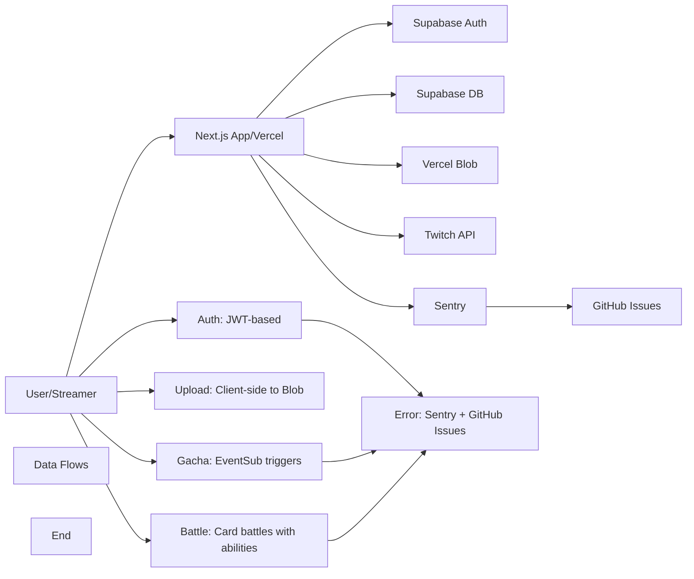

# TwiCa Architecture Document

## 概要

TwiCaはTwitch配信者向けのカードガチャシステムです。視聴者はチャンネルポイントを使ってガチャを引き、配信者が作成したオリジナルカードを収集できます。

---

## 機能要件

### 認証・認可
- Twitch OAuthによる配信者・視聴者認証
- Supabase Auth + カスタムCookieによるセッション管理
- 配信者は自身の配信者ページでのみカード管理が可能
- 視聴者は自分のカードとガチャ履歴のみ閲覧可能

### カード管理機能
- 配信者がカードを登録できる（名前、説明、画像URL、レアリティ、ドロップ率）
- カードの有効/無効切り替え
- カード画像はVercel Blob Storageに保存
- レアリティ: コモン、レア、エピック、レジェンダリー
- カード画像サイズ制限: 最大1MB

### ガチャ機能
- チャンネルポイントを使用したガチャシステム
- Twitch EventSubによるチャンネルポイント使用通知
- 重み付き確率によるカード選択
- ガチャ履歴の記録

### オーバーレイ表示
- ガチャ結果を配信画面にオーバーレイ表示
- ストリーマーIDごとのカスタマイズ可能な表示

### ダッシュボード機能
- 配信者ダッシュボード（カード管理、設定）
- 視聴者ダッシュボード（所持カード、ガチャ履歴）

### エラートラッキング
- Sentryによるエラー監視
- アプリケーションエラーの自動送信
- GitHub Issuesへの自動連携

---

## 非機能要件

### パフォーマンス
- APIレスポンス: 500ms以内（99パーセンタイル）
- ガチャ処理: 300ms以内
- 対戦処理: 1000ms以内
- 静的アセットのCDN配信（Vercel）
- データベースインデックスによるクエリ最適化
- データベースクエリフィールド選択の最適化
- N+1クエリ問題の回避

### セキュリティ
- HTTPSでの通信
- Supabase RLS (Row Level Security) による多層防御
- CSRF対策（SameSite=Lax Cookie + state検証）
- XSS対策（Reactの自動エスケープ）
- 環境変数によるシークレット管理
- セッション有効期限: 7日（Cookie + expiresAt検証）
- Twitch署名検証（EventSub Webhook）
- EventSubべき等性（event_idによる重複チェック）
- APIレート制限によるDoS攻撃対策
- 対戦の不正防止（ランダム性の確保）
- デバッグエンドポイントの保護（Issue #32）
- Sentryデバッグエンドポイントの保護（Issue #36）
- セキュリティヘッダーの設定（Issue #43）
- ファイルアップロードのサニタイズ（Issue #44）

### 可用性
- Vercelによる99.95% SLA
- Supabaseによる99.9% データベース可用性
- エラー検知と通知（Sentry）

### スケーラビリティ
- Vercel Serverless Functionsの自動スケーリング
- SupabaseのマネージドPostgreSQL（自動スケーリング）

### 可観測性
- Sentryによるエラー追跡と監視
- 構造化ロギング
- パフォーマンスモニタリング

---

## 受け入れ基準

### ユーザー認証
- [x] Twitch OAuthでログインできる
- [x] 配信者として認証される
- [x] 視聴者として認証される
- [x] ログアウトできる
- [x] セッション有効期限後に再認証が必要
- [x] Twitchログイン時のエラーが適切にハンドリングされる（Issue #19 - 解決済み）

### カード管理
- [x] カードを新規登録できる
- [x] カードを編集できる
- [x] カードを削除できる
- [x] カード画像をアップロードできる
- [x] カード画像サイズが1MB以下である
- [x] カードの有効/無効を切り替えられる
- [x] ドロップ率を設定できる（合計1.0以下）

### ガチャ機能
- [x] チャンネルポイントでガチャを引ける
- [x] ガチャ結果が正しく表示される
- [x] ドロップ率通りにカードが排出される
- [x] ガチャ履歴が記録される
- [x] 重みなしで同じ確率で排出される（全カードのドロップ率が等しい場合）

### オーバーレイ
- [x] ガチャ結果がOBS等のブラウザソースで表示できる
- [x] カード画像が正しく表示される
- [x] レアリティに応じた色が表示される

### データ整合性
- [x] RLSポリシーが正しく機能する
- [x] 配信者は自分のカードしか編集できない
- [x] 視聴者は自分のカードしか見れない
- [x] ガチャ履歴が正しく記録される

### APIレート制限（Issue #13）
- [x] `@upstash/ratelimit` と `@upstash/redis` をインストール
- [x] `src/lib/rate-limit.ts` を実装
- [x] 各 API ルートにレート制限を追加
- [x] 429 エラーが適切に返される
- [x] レート制限ヘッダーが設定される
- [x] 開発環境でインメモリレート制限が動作する
- [x] 本番環境で Redis レート制限が動作する
- [x] EventSub Webhook は緩いレート制限を持つ
- [x] 認証済みユーザーは twitchUserId で識別される
- [x] 未認証ユーザーは IP アドレスで識別される
- [x] フロントエンドで 429 エラーが適切に表示される

### カード対戦機能（Issue #15）
- [x] カードにステータス（HP、ATK、DEF、SPD）が追加される
- [x] 各カードにスキルが設定される
- [x] CPU対戦が可能
- [x] 自動ターン制バトルが動作する
- [x] 勝敗判定が正しく行われる
- [x] 対戦履歴が記録される
- [x] 対戦統計が表示される
- [x] フロントエンドで対戦が視覚的に楽しめる
- [x] アニメーション効果が表示される
- [x] モバイルで快適に操作可能

### コード品質（Issue #35）
- [x] Battle ライブラリの文字列が定数化されている
- [x] スキル名配列が定数として定義されている
- [x] バトルログメッセージが定数として定義されている
- [x] CPU カード文字列が定数を使用している
- [x] ハードコードされた日本語文字列が削除されている
- [x] Battle API と battle.ts の間で一貫性が保たれている

### Sentry エラー追跡
- [x] Sentry DSN が環境変数から正しく読み込まれる
- [x] クライアント側エラーがSentryに送信される
- [x] サーバー側APIエラーがSentryに送信される
- [x] コンソールエラーがSentryにキャプチャされる
- [x] 500エラーがSentryに報告される
- [x] Sentryイベントの環境が正しく設定される
- [x] エラーコンテキスト（ユーザー、リクエストなど）が正しく付与される

### セキュリティヘッダー（Issue #43）
- [x] `src/lib/constants.ts` に `SECURITY_HEADERS` 定数を追加
- [x] `src/lib/security-headers.ts` にヘルパー関数を作成
- [x] `src/proxy.ts` でセキュリティヘッダーを設定
- [x] 開発環境と本番環境で異なる CSP を設定
- [x] HSTS は本番環境のみで設定
- [ ] 本番環境で Tailwind CSS v4 が正常に動作することを確認
- [ ] 本番環境で Next.js App Router が正常に動作することを確認
- [ ] nonceを使用したCSPの実装（必要な場合）
- [x] lint と test がパスする
- [x] CI がパスする

### ファイルアップロードのセキュリティ（Issue #44）
- [ ] ファイル名がハッシュ化される
- [ ] マジックバイトによるファイルタイプ検証が実装される
- [ ] 拡張子とファイル内容が一致しない場合、400エラーが返される
- [ ] パストラバーサル攻撃が防止される
- [ ] テストが追加される
- [ ] lint と test がパスする
- [ ] CI がパスする

---

## 設計方針

### アーキテクチャパターン
- **クライアントサイド**: Next.js App Router + Server Components
- **サーバーサイド**: Vercel Serverless Functions
- **データストア**: Supabase (PostgreSQL)
- **ストレージ**: Vercel Blob
- **認証**: カスタムCookie + Twitch OAuth
- **エラートラッキング**: Sentry + GitHub Issues自動化

### デザイン原則
1. **Simple over Complex**: 複雑さを最小限に抑える
2. **Type Safety**: TypeScriptによる厳格な型定義
3. **Separation of Concerns**: 機能ごとのモジュール分割
4. **Security First**: アプリケーション層での認証検証 + RLS（多層防御）
5. **Consistency**: コードベース全体で一貫性を維持
6. **Error Handling**: ユーザーにわかりやすいエラーメッセージを提供
7. **Observability**: エラー追跡と自動イシュー作成により運用効率を向上
8. **Performance**: 最小限のデータ転送と効率的なクエリ実行
9. **Query Optimization**: N+1クエリ問題の回避とJOINの適切な使用
10. **Development/Production Separation**: デバッグツールは開発環境でのみ使用
11. **String Standardization**: すべての表示文字列を定数として一元管理
12. **Constant Standardization**: すべての設定値・定数を一元管理
13. **Client-side OAuth**: OAuthリダイレクトはクライアント側で行い、CORS問題を回避
14. **Security Headers**: すべてのリクエストにセキュリティヘッダーを設定
15. **File Upload Security**: ファイルアップロード時に適切なサニタイズと検証を行う

### 技術選定基準
- マネージドサービス優先（運用コスト削減）
- Next.jsエコシステムを活用（開発効率）
- カスタムセッションによる柔軟な認証管理
- Sentryによるエラー可視化

---

## アーキテクチャ

### システム全体図



---

## ファイルアップロードのセキュリティ強化（Issue #44）

### 概要

ファイルアップロードAPI (`src/app/api/upload/route.ts`) で適切なサニタイズが行われていません。ファイル名が直接連結され、拡張子の検証が不十分です。

### 問題点

1. **パストラバーサル攻撃の脆弱性**: ファイル名が直接連結され、`../` などのパストラバーサル攻撃が可能
2. **不十分なファイルタイプ検証**: 現在の検証は拡張子のみをチェックしており、実際のファイル内容を検証していない
3. **悪意のあるファイルのアップロード**: 拡張子を偽装したファイルがアップロードされる可能性がある

### 影響範囲

- `/Users/azumag/work/twica/src/app/api/upload/route.ts` (lines 49-58)
- カード画像アップロード機能

### 設計

#### 1. ファイル名のサニタイズ

現在の実装:
```typescript
const fileName = `${session.twitchUserId}/${file.name}`
```

問題点:
- `file.name` がユーザー入力であり、パストラバーサル攻撃が可能
- ファイル名に特殊文字が含まれる可能性がある

修正後の実装:
```typescript
import { createHash } from 'crypto'

// 拡張子を取得
const ext = file.name.slice(file.name.lastIndexOf('.') + 1).toLowerCase();

// 安全なベース名を生成（SHA-256 ハッシュの一部を使用）
const safeBasename = createHash('sha256')
  .update(`${session.twitchUserId}-${Date.now()}`)
  .digest('hex')
  .substring(0, 16);

// 安全なファイル名を構築
const fileName = `${safeBasename}.${ext}`;
```

メリット:
- パストラバーサル攻撃を防止
- ファイル名が推測不可能
- 一意性が保証される

#### 2. マジックバイトによるファイルタイプ検証

マジックバイト（ファイルシグネチャ）を使用して、実際のファイル内容を検証します。

```typescript
function getFileTypeFromBuffer(buffer: Buffer): string {
  // JPEG
  if (buffer.length >= 2 && buffer[0] === 0xFF && buffer[1] === 0xD8) {
    return 'image/jpeg';
  }
  
  // PNG
  if (buffer.length >= 8 && 
      buffer[0] === 0x89 && buffer[1] === 0x50 && buffer[2] === 0x4E && buffer[3] === 0x47 &&
      buffer[4] === 0x0D && buffer[5] === 0x0A && buffer[6] === 0x1A && buffer[7] === 0x0A) {
    return 'image/png';
  }
  
  // GIF
  if (buffer.length >= 6 &&
      buffer[0] === 0x47 && buffer[1] === 0x49 && buffer[2] === 0x46 &&
      buffer[3] === 0x38 && buffer[4] === 0x37 && buffer[5] === 0x61) {
    return 'image/gif';
  }
  
  // WebP
  if (buffer.length >= 12 &&
      buffer[8] === 0x57 && buffer[9] === 0x45 && buffer[10] === 0x42 && buffer[11] === 0x50) {
    return 'image/webp';
  }
  
  return 'application/octet-stream';
}
```

#### 3. 拡張子の検証強化

```typescript
// 許可される拡張子
const ALLOWED_EXTENSIONS = ['jpg', 'jpeg', 'png', 'gif', 'webp'] as const;

function isValidExtension(ext: string): ext is typeof ALLOWED_EXTENSIONS[number] {
  return ALLOWED_EXTENSIONS.includes(ext as any);
}
```

#### 4. アップロードAPIの修正

`src/app/api/upload/route.ts` の修正:

```typescript
import { NextRequest, NextResponse } from 'next/server'
import { put } from '@vercel/blob'
import { getSession } from '@/lib/session'
import { logger } from '@/lib/logger'
import { createHash } from 'crypto'

// 許可される拡張子
const ALLOWED_EXTENSIONS = ['jpg', 'jpeg', 'png', 'gif', 'webp'] as const;

function isValidExtension(ext: string): ext is typeof ALLOWED_EXTENSIONS[number] {
  return ALLOWED_EXTENSIONS.includes(ext as any);
}

function getFileTypeFromBuffer(buffer: Buffer): string {
  // JPEG
  if (buffer.length >= 2 && buffer[0] === 0xFF && buffer[1] === 0xD8) {
    return 'image/jpeg';
  }
  
  // PNG
  if (buffer.length >= 8 && 
      buffer[0] === 0x89 && buffer[1] === 0x50 && buffer[2] === 0x4E && buffer[3] === 0x47 &&
      buffer[4] === 0x0D && buffer[5] === 0x0A && buffer[6] === 0x1A && buffer[7] === 0x0A) {
    return 'image/png';
  }
  
  // GIF
  if (buffer.length >= 6 &&
      buffer[0] === 0x47 && buffer[1] === 0x49 && buffer[2] === 0x46 &&
      buffer[3] === 0x38 && buffer[4] === 0x37 && buffer[5] === 0x61) {
    return 'image/gif';
  }
  
  // WebP
  if (buffer.length >= 12 &&
      buffer[8] === 0x57 && buffer[9] === 0x45 && buffer[10] === 0x42 && buffer[11] === 0x50) {
    return 'image/webp';
  }
  
  return 'application/octet-stream';
}

export async function POST(request: NextRequest) {
  try {
    const session = await getSession(request)
    if (!session) {
      return NextResponse.json({ error: 'Unauthorized' }, { status: 401 })
    }

    const formData = await request.formData()
    const file = formData.get('file') as File

    if (!file) {
      return NextResponse.json({ error: 'No file provided' }, { status: 400 })
    }

    // ファイルサイズの検証（1MB）
    if (file.size > 1024 * 1024) {
      return NextResponse.json({ error: 'File size exceeds 1MB limit' }, { status: 400 })
    }

    // 拡張子の検証
    const ext = file.name.slice(file.name.lastIndexOf('.') + 1).toLowerCase()
    if (!isValidExtension(ext)) {
      return NextResponse.json({ error: 'Invalid file extension' }, { status: 400 })
    }

    // マジックバイトによるファイルタイプ検証
    const buffer = Buffer.from(await file.arrayBuffer())
    const actualType = getFileTypeFromBuffer(buffer)
    
    // 拡張子とファイルタイプのマッピング
    const extToMimeType: Record<string, string> = {
      jpg: 'image/jpeg',
      jpeg: 'image/jpeg',
      png: 'image/png',
      gif: 'image/gif',
      webp: 'image/webp',
    }
    
    const expectedType = extToMimeType[ext]
    
    if (actualType !== expectedType) {
      logger.warn(`File content does not match extension. Expected: ${expectedType}, Actual: ${actualType}`)
      return NextResponse.json({ error: 'File content does not match extension' }, { status: 400 })
    }

    // ファイル名のサニタイズ
    const safeBasename = createHash('sha256')
      .update(`${session.twitchUserId}-${Date.now()}`)
      .digest('hex')
      .substring(0, 16)
    
    const fileName = `${safeBasename}.${ext}`

    // Blob Storage にアップロード
    const blob = await put(fileName, buffer, {
      access: 'public',
    })

    return NextResponse.json({ url: blob.url })
  } catch (error) {
    logger.error('Upload error:', error)
    return NextResponse.json({ error: 'Upload failed' }, { status: 500 })
  }
}
```

#### 5. テストの追加

`tests/unit/upload.test.ts` の追加:

```typescript
import { describe, it, expect } from 'vitest'
import { getFileTypeFromBuffer, isValidExtension } from '@/lib/file-utils'

describe('File Utils', () => {
  describe('getFileTypeFromBuffer', () => {
    it('JPEGファイルを正しく識別する', () => {
      const jpegBuffer = Buffer.from([0xFF, 0xD8, 0xFF, 0xE0, 0x00, 0x10, 0x4A, 0x46, 0x49, 0x46])
      expect(getFileTypeFromBuffer(jpegBuffer)).toBe('image/jpeg')
    })

    it('PNGファイルを正しく識別する', () => {
      const pngBuffer = Buffer.from([0x89, 0x50, 0x4E, 0x47, 0x0D, 0x0A, 0x1A, 0x0A])
      expect(getFileTypeFromBuffer(pngBuffer)).toBe('image/png')
    })

    it('GIFファイルを正しく識別する', () => {
      const gifBuffer = Buffer.from([0x47, 0x49, 0x46, 0x38, 0x37, 0x61])
      expect(getFileTypeFromBuffer(gifBuffer)).toBe('image/gif')
    })

    it('WebPファイルを正しく識別する', () => {
      const webpBuffer = Buffer.from([0x52, 0x49, 0x46, 0x46, 0x00, 0x00, 0x00, 0x00, 0x57, 0x45, 0x42, 0x50])
      expect(getFileTypeFromBuffer(webpBuffer)).toBe('image/webp')
    })

    it('不明なファイルタイプを返す', () => {
      const unknownBuffer = Buffer.from([0x00, 0x00, 0x00, 0x00])
      expect(getFileTypeFromBuffer(unknownBuffer)).toBe('application/octet-stream')
    })

    it('短いバッファを処理する', () => {
      const shortBuffer = Buffer.from([0xFF])
      expect(getFileTypeFromBuffer(shortBuffer)).toBe('application/octet-stream')
    })
  })

  describe('isValidExtension', () => {
    it('有効な拡張子を許可する', () => {
      expect(isValidExtension('jpg')).toBe(true)
      expect(isValidExtension('jpeg')).toBe(true)
      expect(isValidExtension('png')).toBe(true)
      expect(isValidExtension('gif')).toBe(true)
      expect(isValidExtension('webp')).toBe(true)
    })

    it('無効な拡張子を拒否する', () => {
      expect(isValidExtension('txt')).toBe(false)
      expect(isValidExtension('exe')).toBe(false)
      expect(isValidExtension('php')).toBe(false)
      expect(isValidExtension('')).toBe(false)
    })

    it('大文字の拡張子を拒否する', () => {
      expect(isValidExtension('JPG')).toBe(false)
      expect(isValidExtension('PNG')).toBe(false)
    })
  })
})
```

### メリット

1. **セキュリティ強化**: パストラバーサル攻撃を防止
2. **ファイルタイプ検証**: マジックバイトによる厳格なファイルタイプ検証
3. **ユーザー保護**: 悪意のあるファイルのアップロードを防止
4. **ファイル名の予測不可能性**: ハッシュ化されたファイル名によりファイルの予測を困難にする

### トレードオフの検討

#### 選択肢1: マジックバイトによる検証（採用）
- **メリット**:
  - 実際のファイル内容を検証できる
  - 拡張子偽装攻撃を防止できる
  - OWASP のベストプラクティスに準拠
- **デメリット**:
  - 実装の複雑度が増す
  - パフォーマンスへの影響（バッファの読み込み）
- **判断**: セキュリティ上の重要性が高いため採用

#### 選択肢2: 拡張子のみの検証（採用しない）
- **メリット**:
  - 実装がシンプル
  - パフォーマンスへの影響が少ない
- **デメリット**:
  - 拡張子偽装攻撃が可能
  - セキュリティ上のリスクが高い
- **判断**: セキュリティ上のリスクが高いため採用しない

#### 選択肢3: 外部ライブラリの使用（採用しない）
- **メリット**:
  - 多くのファイルタイプをサポート
  - メンテナンスが容易
- **デメリット**:
  - 依存関係が増える
  - バンドルサイズが増加
- **判断**: 必要なファイルタイプが限られているため、自前実装を採用

### 受け入れ基準

- [ ] ファイル名がハッシュ化される
- [ ] マジックバイトによるファイルタイプ検証が実装される
- [ ] 拡張子とファイル内容が一致しない場合、400エラーが返される
- [ ] パストラバーサル攻撃が防止される
- [ ] テストが追加される（JPEG, PNG, GIF, WebP, 不明なファイルタイプ）
- [ ] lint と test がパスする
- [ ] CI がパスする

---

## 更新履歴

| 日付 | 変更内容 |
|:---|:---|
| 2026-01-19 | ファイルアップロードのセキュリティ強化設計を追加（Issue #44） |
| 2026-01-19 | CSP実装方法を更新（Tailwind CSS v4とNext.js App Routerの対応状況を追加） |
| 2026-01-19 | セキュリティヘッダー設定の設計を追加（Issue #43 - 解決済み） |

---

## 実装完了の問題

- **Issue #44**: Critical Security: File Upload Lacks Proper Sanitization (未実装)
- **Issue #43**: Security: Missing Security Headers in API Routes and Pages (解決済み - 本番環境での動作確認が必要)
- **Issue #42**: Fix: Twitch OAuth CORS Error in Next.js RSC (解決済み)

過去のアーキテクチャドキュメントの詳細を参照する場合は、docs/ARCHITECTURE_*.md ファイルを確認してください。
