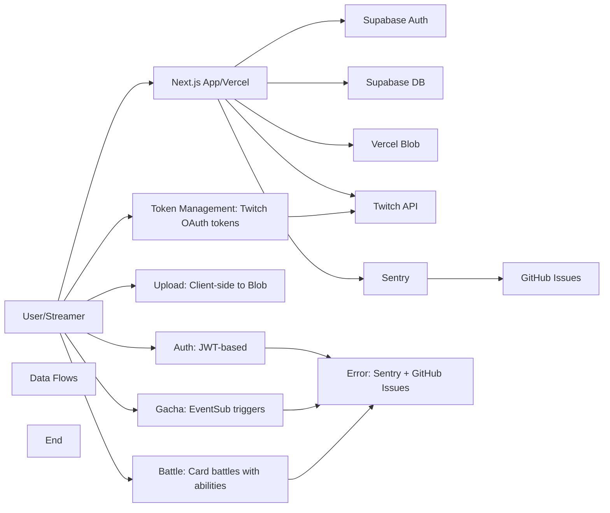

# TwiCa Architecture Document

## 概要

TwiCaはTwitch配信者向けのカードガチャシステムです。視聴者はチャンネルポイントを使ってガチャを引き、配信者が作成したオリジナルカードを収集できます。

---

## 機能要件

### 認証・認可
- Twitch OAuthによる配信者・視聴者認証
- Supabase Auth + カスタムCookieによるセッション管理
- 配信者は自身の配信者ページでのみカード管理が可能
- 視聴者は自分のカードとガチャ履歴のみ閲覧可能

### カード管理機能
- 配信者がカードを登録できる（名前、説明、画像URL、レアリティ、ドロップ率）
- カードの有効/無効切り替え
- カード画像はVercel Blob Storageに保存
- レアリティ: コモン、レア、エピック、レジェンダリー
- カード画像サイズ制限: 最大1MB

### ガチャ機能
- チャンネルポイントを使用したガチャシステム
- Twitch EventSubによるチャンネルポイント使用通知
- 重み付き確率によるカード選択
- ガチャ履歴の記録

### オーバーレイ表示
- ガチャ結果を配信画面にオーバーレイ表示
- ストリーマーIDごとのカスタマイズ可能な表示

### ダッシュボード機能
- 配信者ダッシュボード（カード管理、設定）
- 視聴者ダッシュボード（所持カード、ガチャ履歴）

### エラートラッキング
- Sentryによるエラー監視
- アプリケーションエラーの自動送信
- GitHub Issuesへの自動連携

---

## 非機能要件

### パフォーマンス
- APIレスポンス: 500ms以内（99パーセンタイル）
- ガチャ処理: 300ms以内
- 対戦処理: 1000ms以内
- 静的アセットのCDN配信（Vercel）
- データベースインデックスによるクエリ最適化
- データベースクエリフィールド選択の最適化
- N+1クエリ問題の回避

### セキュリティ
- HTTPSでの通信
- Supabase RLS (Row Level Security) による多層防御
- CSRF対策（SameSite=Lax Cookie + state検証）
- XSS対策（Reactの自動エスケープ）
- 環境変数によるシークレット管理
- セッション有効期限: 7日（Cookie + expiresAt検証）
- Twitch署名検証（EventSub Webhook）
- EventSubべき等性（event_idによる重複チェック）
- APIレート制限によるDoS攻撃対策
- 対戦の不正防止（ランダム性の確保）
- デバッグエンドポイントの保護（Issue #32）
- Sentryデバッグエンドポイントの保護（Issue #36）
- セキュリティヘッダーの設定（Issue #43）
- ファイルアップロードのサニタイズ（Issue #44）

### 可用性
- Vercelによる99.95% SLA
- Supabaseによる99.9% データベース可用性
- エラー検知と通知（Sentry）

### スケーラビリティ
- Vercel Serverless Functionsの自動スケーリング
- SupabaseのマネージドPostgreSQL（自動スケーリング）

### 可観測性
- Sentryによるエラー追跡と監視
- 構造化ロギング
- パフォーマンスモニタリング

---

## 受け入れ基準

### ユーザー認証
- [x] Twitch OAuthでログインできる
- [x] 配信者として認証される
- [x] 視聴者として認証される
- [x] ログアウトできる
- [x] セッション有効期限後に再認証が必要
- [x] Twitchログイン時のエラーが適切にハンドリングされる（Issue #19 - 解決済み）

### カード管理
- [x] カードを新規登録できる
- [x] カードを編集できる
- [x] カードを削除できる
- [x] カード画像をアップロードできる
- [x] カード画像サイズが1MB以下である
- [x] カードの有効/無効を切り替えられる
- [x] ドロップ率を設定できる（合計1.0以下）

### ガチャ機能
- [x] チャンネルポイントでガチャを引ける
- [x] ガチャ結果が正しく表示される
- [x] ドロップ率通りにカードが排出される
- [x] ガチャ履歴が記録される
- [x] 重みなしで同じ確率で排出される（全カードのドロップ率が等しい場合）

### オーバーレイ
- [x] ガチャ結果がOBS等のブラウザソースで表示できる
- [x] カード画像が正しく表示される
- [x] レアリティに応じた色が表示される

### データ整合性
- [x] RLSポリシーが正しく機能する
- [x] 配信者は自分のカードしか編集できない
- [x] 視聴者は自分のカードしか見れない
- [x] ガチャ履歴が正しく記録される

### APIレート制限（Issue #13）
- [x] `@upstash/ratelimit` と `@upstash/redis` をインストール
- [x] `src/lib/rate-limit.ts` を実装
- [x] 各 API ルートにレート制限を追加
- [x] 429 エラーが適切に返される
- [x] レート制限ヘッダーが設定される
- [x] 開発環境でインメモリレート制限が動作する
- [x] 本番環境で Redis レート制限が動作する
- [x] EventSub Webhook は緩いレート制限を持つ
- [x] 認証済みユーザーは twitchUserId で識別される
- [x] 未認証ユーザーは IP アドレスで識別される
- [x] フロントエンドで 429 エラーが適切に表示される

### カード対戦機能（Issue #15）
- [x] カードにステータス（HP、ATK、DEF、SPD）が追加される
- [x] 各カードにスキルが設定される
- [x] CPU対戦が可能
- [x] 自動ターン制バトルが動作する
- [x] 勝敗判定が正しく行われる
- [x] 対戦履歴が記録される
- [x] 対戦統計が表示される
- [x] フロントエンドで対戦が視覚的に楽しめる
- [x] アニメーション効果が表示される
- [x] モバイルで快適に操作可能

### コード品質（Issue #35）
- [x] Battle ライブラリの文字列が定数化されている
- [x] スキル名配列が定数として定義されている
- [x] バトルログメッセージが定数として定義されている
- [x] CPU カード文字列が定数を使用している
- [x] ハードコードされた日本語文字列が削除されている
- [x] Battle API と battle.ts の間で一貫性が保たれている

### Sentry エラー追跡
- [x] Sentry DSN が環境変数から正しく読み込まれる
- [x] クライアント側エラーがSentryに送信される
- [x] サーバー側APIエラーがSentryに送信される
- [x] コンソールエラーがSentryにキャプチャされる
- [x] 500エラーがSentryに報告される
- [x] Sentryイベントの環境が正しく設定される
- [x] エラーコンテキスト（ユーザー、リクエストなど）が正しく付与される

### セキュリティヘッダー（Issue #43）
- [x] `src/lib/constants.ts` に `SECURITY_HEADERS` 定数を追加
- [x] `src/lib/security-headers.ts` にヘルパー関数を作成
- [x] `src/proxy.ts` でセキュリティヘッダーを設定
- [x] 開発環境と本番環境で異なる CSP を設定
- [x] HSTS は本番環境のみで設定
- [ ] 本番環境で Tailwind CSS v4 が正常に動作することを確認
- [ ] 本番環境で Next.js App Router が正常に動作することを確認
- [ ] nonceを使用したCSPの実装（必要な場合）
- [x] lint と test がパスする
- [x] CI がパスする

### ファイルアップロードのセキュリティ（Issue #44）
- [x] ファイル名がハッシュ化される
- [x] マジックバイトによるファイルタイプ検証が実装される
- [x] 拡張子とファイル内容が一致しない場合、400エラーが返される
- [x] パストラバーサル攻撃が防止される
- [x] テストが追加される
- [x] lint と test がパスする
- [x] CI がパスする

---

## 設計方針

### アーキテクチャパターン
- **クライアントサイド**: Next.js App Router + Server Components
- **サーバーサイド**: Vercel Serverless Functions
- **データストア**: Supabase (PostgreSQL)
- **ストレージ**: Vercel Blob
- **認証**: カスタムCookie + Twitch OAuth
- **エラートラッキング**: Sentry + GitHub Issues自動化

### デザイン原則
1. **Simple over Complex**: 複雑さを最小限に抑える
2. **Type Safety**: TypeScriptによる厳格な型定義
3. **Separation of Concerns**: 機能ごとのモジュール分割
4. **Security First**: アプリケーション層での認証検証 + RLS（多層防御）
5. **Consistency**: コードベース全体で一貫性を維持
6. **Error Handling**: ユーザーにわかりやすいエラーメッセージを提供
7. **Observability**: エラー追跡と自動イシュー作成により運用効率を向上
8. **Performance**: 最小限のデータ転送と効率的なクエリ実行
9. **Query Optimization**: N+1クエリ問題の回避とJOINの適切な使用
10. **Development/Production Separation**: デバッグツールは開発環境でのみ使用
11. **String Standardization**: すべての表示文字列を定数として一元管理
12. **Constant Standardization**: すべての設定値・定数を一元管理
13. **Client-side OAuth**: OAuthリダイレクトはクライアント側で行い、CORS問題を回避
14. **Security Headers**: すべてのリクエストにセキュリティヘッダーを設定
15. **File Upload Security**: ファイルアップロード時に適切なサニタイズと検証を行う
16. **Token Management**: Twitch トークンは適切に保存・更新・削除する

### 技術選定基準
- マネージドサービス優先（運用コスト削減）
- Next.jsエコシステムを活用（開発効率）
- カスタムセッションによる柔軟な認証管理
- Sentryによるエラー可視化

---

## アーキテクチャ

### システム全体図



---

## Critical Bug: Twitch API Calls Fail Due to Missing Twitch Access Token Storage (Issue #46)

### 概要

`/api/twitch/rewards` エンドポイントが Twitch API を呼び出す際、Supabase のセッションアクセストークンを使用しており、これにより Twitch API 呼び出しが失敗します。

### 問題点

1. **Twitch トークンが保存されていない**: Twitch OAuth コールバック (`/api/auth/twitch/callback`) で Twitch の `access_token` と `refresh_token` を取得していますが、これらはどこにも保存されていません
2. **誤ったトークンが使用されている**: `/api/twitch/rewards` の `getAccessToken()` 関数は Supabase Auth のセッションアクセストークンを取得しており、これは Twitch API とは無関係です
3. **Twitch API 呼び出しが失敗する**: Supabase トークンを使用して Twitch API を呼び出そうとすると、401 Unauthorized エラーが発生します

### 影響範囲

- `/Users/azumag/work/twica/src/app/api/auth/twitch/callback/route.ts` (lines 52-74)
  - Twitch トークンが取得され、使用されずに破棄される
- `/Users/azumag/work/twica/src/app/api/twitch/rewards/route.ts` (lines 10-14, 40-43, 93-96)
  - Supabase トークンが誤って Twitch API 呼び出しに使用される
- ストリーマー機能（チャンネルポイント報酬の管理）が完全に使用できない

### 設計

#### 1. データベーススキーマの変更

`users` テーブルに Twitch トークンを保存するカラムを追加します：

```sql
-- マイグレーション: supabase/migrations/20260119020000_add_twitch_tokens_to_users.sql
ALTER TABLE users ADD COLUMN IF NOT EXISTS twitch_access_token TEXT;
ALTER TABLE users ADD COLUMN IF NOT EXISTS twitch_refresh_token TEXT;
ALTER TABLE users ADD COLUMN IF NOT EXISTS twitch_token_expires_at TIMESTAMP WITH TIME ZONE;

-- RLS ポリシーを更新
ALTER TABLE users ENABLE ROW LEVEL SECURITY;

-- トークンカラムはシステム（サーバーサイド）のみ更新可能
CREATE POLICY "Users can update own twitch tokens"
ON users FOR UPDATE
USING (auth.uid()::text = twitch_user_id)
WITH CHECK (auth.uid()::text = twitch_user_id);

-- トークンカラムはシステム（サーバーサイド）のみ読み取り可能
CREATE POLICY "Users can read own twitch tokens"
ON users FOR SELECT
USING (auth.uid()::text = twitch_user_id);
```

#### 2. Twitch トークン管理ユーティリティの作成

`src/lib/twitch/token-manager.ts` を作成：

```typescript
import { getSupabaseAdmin } from '@/lib/supabase/admin';
import { refreshTwitchToken, type TwitchTokens } from './auth';

export interface TwitchTokenData {
  accessToken: string;
  refreshToken: string;
  expiresAt: Date;
}

export async function getTwitchAccessToken(twitchUserId: string): Promise<string | null> {
  const supabaseAdmin = getSupabaseAdmin();

  const { data: user } = await supabaseAdmin
    .from('users')
    .select('twitch_access_token, twitch_refresh_token, twitch_token_expires_at')
    .eq('twitch_user_id', twitchUserId)
    .single();

  if (!user || !user.twitch_access_token || !user.twitch_refresh_token) {
    return null;
  }

  const now = new Date();
  const expiresAt = new Date(user.twitch_token_expires_at);

  if (expiresAt > now) {
    return user.twitch_access_token;
  }

  return await refreshTwitchAccessToken(twitchUserId, user.twitch_refresh_token);
}

async function refreshTwitchAccessToken(twitchUserId: string, refreshToken: string): Promise<string | null> {
  try {
    const tokens = await refreshTwitchToken(refreshToken);
    const expiresAt = new Date(Date.now() + tokens.expires_in * 1000);

    const supabaseAdmin = getSupabaseAdmin();
    const { error } = await supabaseAdmin
      .from('users')
      .update({
        twitch_access_token: tokens.access_token,
        twitch_refresh_token: tokens.refresh_token,
        twitch_token_expires_at: expiresAt.toISOString(),
      })
      .eq('twitch_user_id', twitchUserId);

    if (error) {
      throw error;
    }

    return tokens.access_token;
  } catch (error) {
    return null;
  }
}

export async function saveTwitchTokens(twitchUserId: string, tokens: TwitchTokens): Promise<void> {
  const supabaseAdmin = getSupabaseAdmin();
  const expiresAt = new Date(Date.now() + tokens.expires_in * 1000);

  const { error } = await supabaseAdmin
    .from('users')
    .update({
      twitch_access_token: tokens.access_token,
      twitch_refresh_token: tokens.refresh_token,
      twitch_token_expires_at: expiresAt.toISOString(),
    })
    .eq('twitch_user_id', twitchUserId);

  if (error) {
    throw error;
  }
}

export async function deleteTwitchTokens(twitchUserId: string): Promise<void> {
  const supabaseAdmin = getSupabaseAdmin();

  const { error } = await supabaseAdmin
    .from('users')
    .update({
      twitch_access_token: null,
      twitch_refresh_token: null,
      twitch_token_expires_at: null,
    })
    .eq('twitch_user_id', twitchUserId);

  if (error) {
    throw error;
  }
}
```

#### 3. Twitch OAuth コールバックの修正

`src/app/api/auth/twitch/callback/route.ts` を修正：

```typescript
import { saveTwitchTokens } from '@/lib/twitch/token-manager';

// ... 既存のコード ...

export async function GET(request: NextRequest) {
  // ... 既存のバリデーションコード ...

  try {
    const supabaseAdmin = getSupabaseAdmin();
    const redirectUri = `${process.env.NEXT_PUBLIC_APP_URL}/api/auth/twitch/callback`;

    let tokens;
    try {
      tokens = await exchangeCodeForTokens(code, redirectUri);
    } catch (error) {
      return handleAuthError(
        error,
        'twitch_auth_failed',
        { code: code.substring(0, 10) + '...' }
      );
    }

    let twitchUser;
    try {
      twitchUser = await getTwitchUser(tokens.access_token);
    } catch (error) {
      return handleAuthError(
        error,
        'twitch_user_fetch_failed',
        { twitchUserId: tokens.access_token.substring(0, 10) + '...' }
      );
    }

    // Check if user can be a streamer (affiliate or partner)
    const canBeStreamer = twitchUser.broadcaster_type === 'affiliate' || twitchUser.broadcaster_type === 'partner';

    try {
      await supabaseAdmin
        .from('users')
        .upsert({
          twitch_user_id: twitchUser.id,
          twitch_username: twitchUser.login,
          twitch_display_name: twitchUser.display_name,
          twitch_profile_image_url: twitchUser.profile_image_url,
          twitch_access_token: tokens.access_token,
          twitch_refresh_token: tokens.refresh_token,
          twitch_token_expires_at: new Date(Date.now() + tokens.expires_in * 1000).toISOString(),
        }, {
          onConflict: 'twitch_user_id',
        });
    } catch (error) {
      return handleAuthError(
        error,
        'database_error',
        { operation: 'upsert_user', twitchUserId: twitchUser.id }
      );
    }

    if (canBeStreamer) {
      try {
        await supabaseAdmin
          .from('streamers')
          .upsert({
            twitch_user_id: twitchUser.id,
            twitch_username: twitchUser.login,
            twitch_display_name: twitchUser.display_name,
            twitch_profile_image_url: twitchUser.profile_image_url,
          }, {
            onConflict: 'twitch_user_id',
          });
      } catch (error) {
        return handleAuthError(
          error,
          'database_error',
          { operation: 'upsert_streamer', twitchUserId: twitchUser.id }
        );
      }
    }

    // ... 既存のセッション設定コード ...
  } catch (error) {
    return handleAuthError(error, 'unknown_error');
  }
}
```

#### 4. Twitch Rewards API の修正

`src/app/api/twitch/rewards/route.ts` を修正：

```typescript
import { getTwitchAccessToken } from '@/lib/twitch/token-manager';
import { ERROR_MESSAGES } from '@/lib/constants';

// ... 既存の getAccessToken 関数を削除 ...

async function getTwitchAccessTokenOrError(twitchUserId: string): Promise<string> {
  const accessToken = await getTwitchAccessToken(twitchUserId);

  if (!accessToken) {
    throw new Error(ERROR_MESSAGES.NO_ACCESS_TOKEN_AVAILABLE);
  }

  return accessToken;
}

export async function GET(request: Request) {
  const session = await getSession();

  const identifier = await getRateLimitIdentifier(request, session?.twitchUserId);
  const rateLimitResult = await checkRateLimit(rateLimits.twitchRewardsGet, identifier);

  if (!rateLimitResult.success) {
    return NextResponse.json(
      { error: ERROR_MESSAGES.RATE_LIMIT_EXCEEDED },
      {
        status: 429,
        headers: {
          "X-RateLimit-Limit": String(rateLimitResult.limit),
          "X-RateLimit-Remaining": String(rateLimitResult.remaining),
          "X-RateLimit-Reset": String(rateLimitResult.reset),
        },
      }
    );
  }

  if (!session || !canUseStreamerFeatures(session)) {
    return NextResponse.json({ error: ERROR_MESSAGES.UNAUTHORIZED }, { status: 401 });
  }

  const accessToken = await getTwitchAccessTokenOrError(session.twitchUserId);

  try {
    const response = await fetch(
      `${TWITCH_API_URL}/channel_points/custom_rewards?broadcaster_id=${session.twitchUserId}`,
      {
        headers: {
          "Authorization": `Bearer ${accessToken}`,
          "Client-Id": process.env.TWITCH_CLIENT_ID!,
        },
      }
    );

    if (!response.ok) {
      const error = await response.json();
      return handleApiError(error, "Twitch API rewards fetch");
    }

    const data = await response.json();
    return NextResponse.json(data.data || []);
  } catch (error) {
    return handleApiError(error, "Twitch rewards fetch");
  }
}

export async function POST(request: Request) {
  const session = await getSession();

  const identifier = await getRateLimitIdentifier(request, session?.twitchUserId);
  const rateLimitResult = await checkRateLimit(rateLimits.twitchRewardsPost, identifier);

  if (!rateLimitResult.success) {
    return NextResponse.json(
      { error: ERROR_MESSAGES.RATE_LIMIT_EXCEEDED },
      {
        status: 429,
        headers: {
          "X-RateLimit-Limit": String(rateLimitResult.limit),
          "X-RateLimit-Remaining": String(rateLimitResult.remaining),
          "X-RateLimit-Reset": String(rateLimitResult.reset),
        },
      }
    );
  }

  if (!session || !canUseStreamerFeatures(session)) {
    return NextResponse.json({ error: ERROR_MESSAGES.UNAUTHORIZED }, { status: 401 });
  }

  const accessToken = await getTwitchAccessTokenOrError(session.twitchUserId);

  try {
    const response = await fetch(
      `${TWITCH_API_URL}/channel_points/custom_rewards?broadcaster_id=${session.twitchUserId}`,
      {
        method: "POST",
        headers: {
          "Authorization": `Bearer ${accessToken}`,
          "Client-Id": process.env.TWITCH_CLIENT_ID!,
          "Content-Type": "application/json",
        },
        body: JSON.stringify({
          title: "TwiCa カードガチャ",
          cost: 100,
          prompt: "カードガチャを1回引きます",
          is_enabled: true,
          background_color: "#9147FF",
        }),
      }
    );

    if (!response.ok) {
      const error = await response.json();
      return handleApiError(error, "Twitch API reward creation");
    }

    const data = await response.json();
    return NextResponse.json(data.data[0]);
  } catch (error) {
    return handleApiError(error, "Twitch reward creation");
  }
}
```

#### 5. ログアウト時のトークン削除

`src/app/api/auth/logout/route.ts` で Twitch トークンも削除：

```typescript
import { deleteTwitchTokens } from '@/lib/twitch/token-manager';

export async function POST(request: NextRequest) {
  try {
    const session = await getSession();

    if (session) {
      await deleteTwitchTokens(session.twitchUserId);
    }

    await clearSession();

    return NextResponse.json({ success: true });
  } catch (error) {
    return handleApiError(error, "Logout API");
  }
}
```

#### 6. テストの追加

`tests/unit/twitch-token-manager.test.ts` の追加：

```typescript
import { describe, it, expect, vi, beforeEach, afterEach } from 'vitest';
import { getTwitchAccessToken, saveTwitchTokens, deleteTwitchTokens } from '@/lib/twitch/token-manager';
import { getSupabaseAdmin } from '@/lib/supabase/admin';
import { refreshTwitchToken } from '@/lib/twitch/auth';

vi.mock('@/lib/supabase/admin');
vi.mock('@/lib/twitch/auth');

describe('Twitch Token Manager', () => {
  beforeEach(() => {
    vi.clearAllMocks();
  });

  describe('getTwitchAccessToken', () => {
    it('有効なトークンを返す', async () => {
      const mockSupabaseAdmin = {
        from: vi.fn().mockReturnThis(),
        select: vi.fn().mockReturnThis(),
        eq: vi.fn().mockReturnThis(),
        single: vi.fn().mockResolvedValue({
          data: {
            twitch_access_token: 'valid-token',
            twitch_refresh_token: 'refresh-token',
            twitch_token_expires_at: new Date(Date.now() + 3600000).toISOString(),
          },
          error: null,
        }),
      };

      vi.mocked(getSupabaseAdmin).mockReturnValue(mockSupabaseAdmin as any);

      const token = await getTwitchAccessToken('123456789');
      expect(token).toBe('valid-token');
    });

    it('トークンが存在しない場合は null を返す', async () => {
      const mockSupabaseAdmin = {
        from: vi.fn().mockReturnThis(),
        select: vi.fn().mockReturnThis(),
        eq: vi.fn().mockReturnThis(),
        single: vi.fn().mockResolvedValue({
          data: null,
          error: null,
        }),
      };

      vi.mocked(getSupabaseAdmin).mockReturnValue(mockSupabaseAdmin as any);

      const token = await getTwitchAccessToken('123456789');
      expect(token).toBeNull();
    });

    it('期限切れのトークンを更新する', async () => {
      const mockSupabaseAdmin = {
        from: vi.fn().mockReturnThis(),
        select: vi.fn().mockReturnThis(),
        eq: vi.fn().mockReturnThis(),
        single: vi.fn().mockResolvedValueOnce({
          data: {
            twitch_access_token: 'expired-token',
            twitch_refresh_token: 'refresh-token',
            twitch_token_expires_at: new Date(Date.now() - 3600000).toISOString(),
          },
          error: null,
        }),
      };

      vi.mocked(getSupabaseAdmin).mockReturnValue(mockSupabaseAdmin as any);
      vi.mocked(refreshTwitchToken).mockResolvedValue({
        access_token: 'new-token',
        refresh_token: 'new-refresh-token',
        expires_in: 3600,
        token_type: 'bearer',
        scope: ['user:read:email'],
      });

      const token = await getTwitchAccessToken('123456789');
      expect(token).toBe('new-token');
      expect(refreshTwitchToken).toHaveBeenCalledWith('refresh-token');
    });
  });

  describe('saveTwitchTokens', () => {
    it('トークンを保存する', async () => {
      const mockSupabaseAdmin = {
        from: vi.fn().mockReturnThis(),
        update: vi.fn().mockReturnThis(),
        eq: vi.fn().mockResolvedValue({
          error: null,
        }),
      };

      vi.mocked(getSupabaseAdmin).mockReturnValue(mockSupabaseAdmin as any);

      await saveTwitchTokens('123456789', {
        access_token: 'access-token',
        refresh_token: 'refresh-token',
        expires_in: 3600,
        token_type: 'bearer',
        scope: ['user:read:email'],
      });

      expect(mockSupabaseAdmin.from).toHaveBeenCalledWith('users');
      expect(mockSupabaseAdmin.update).toHaveBeenCalledWith(
        expect.objectContaining({
          twitch_access_token: 'access-token',
          twitch_refresh_token: 'refresh-token',
        })
      );
    });
  });

  describe('deleteTwitchTokens', () => {
    it('トークンを削除する', async () => {
      const mockSupabaseAdmin = {
        from: vi.fn().mockReturnThis(),
        update: vi.fn().mockReturnThis(),
        eq: vi.fn().mockResolvedValue({
          error: null,
        }),
      };

      vi.mocked(getSupabaseAdmin).mockReturnValue(mockSupabaseAdmin as any);

      await deleteTwitchTokens('123456789');

      expect(mockSupabaseAdmin.from).toHaveBeenCalledWith('users');
      expect(mockSupabaseAdmin.update).toHaveBeenCalledWith(
        expect.objectContaining({
          twitch_access_token: null,
          twitch_refresh_token: null,
          twitch_token_expires_at: null,
        })
      );
    });
  });
});
```

### メリット

1. **機能修復**: ストリーマー機能（チャンネルポイント報酬の管理）が正常に動作する
2. **トークン管理の改善**: Twitch トークンの保存、更新、削除が適切に行われる
3. **自動リフレッシュ**: トークンの有効期限が切れた場合、自動的に更新される
4. **セキュリティの維持**: トークンはデータベースに安全に保存され、RLS ポリシーで保護される

### トレードオフの検討

#### 選択肢1: データベースに保存（採用）
- **メリット**:
  - 永続的な保存
  - サーバーサイドでトークン更新が可能
  - 複数のセッション間でトークンを共有可能
- **デメリット**:
  - データベースへの追加クエリが必要
  - RLS ポリシーの適切な設定が必要
- **判断**: ストリーマー機能の必要性とトークン管理の柔軟性を考慮し採用

#### 選択肢2: Cookie に保存（採用しない）
- **メリット**:
  - 実装がシンプル
  - データベースの追加クエリ不要
- **デメリット**:
  - Cookie のサイズ制限（4KB）
  - セキュリティリスク（XSS によるトークン盗難の可能性）
  - トークンの自動リフレッシュが困難
- **判断**: セキュリティと機能性を考慮し採用しない

#### 選択肢3: Redis に保存（採用しない）
- **メリット**:
  - 高速なアクセス
  - 自動期限切れ（TTL）
- **デメリット**:
  - 追加のインフラコスト
  - 既存のアーキテクチャ（Supabase ベース）からの乖離
  - データの永続性が低い
- **判断**: 運用コストとアーキテクチャの一貫性を考慮し採用しない

### 受け入れ基準

- [x] データベースマイグレーションが作成される
- [x] `src/lib/twitch/token-manager.ts` が作成される
- [x] `/api/auth/twitch/callback` で Twitch トークンが保存される
- [x] `/api/twitch/rewards` で正しい Twitch アクセストークンが使用される
- [x] トークンの有効期限が切れた場合、自動的に更新される
- [x] ログアウト時、Twitch トークンが削除される
- [x] テストが追加される
- [x] lint と test がパスする
- [x] CI がパスする

---

## 更新履歴

| 日付 | 変更内容 |
|:---|:---|
| 2026-01-19 | Twitch トークン管理機能の設計を追加（Issue #46） |

---

## 実装完了の問題

なし

過去のアーキテクチャドキュメントの詳細を参照する場合は、docs/ARCHITECTURE_*.md ファイルを確認してください。
