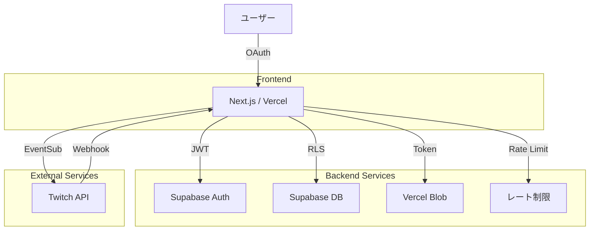

# TwiCa Architecture Document

## 概要

TwiCaはTwitch配信者向けのカードガチャシステムです。視聴者はチャンネルポイントを使ってガチャを引き、配信者が作成したオリジナルカードを収集できます。

---

## 機能要件

### 認証・認可
- Twitch OAuthによる配信者・視聴者認証
- Supabase Auth + カスタムCookieによるセッション管理
- 配信者は自身の配信者ページでのみカード管理が可能
- 視聴者は自分のカードとガチャ履歴のみ閲覧可能

### カード管理機能
- 配信者がカードを登録できる（名前、説明、画像URL、レアリティ、ドロップ率）
- カードの有効/無効切り替え
- カード画像はVercel Blob Storageに保存
- レアリティ: コモン、レア、エピック、レジェンダリー
- カード画像サイズ制限: 最大1MB

### ガチャ機能
- チャンネルポイントを使用したガチャシステム
- Twitch EventSubによるチャンネルポイント使用通知
- 重み付き確率によるカード選択
- ガチャ履歴の記録

### オーバーレイ表示
- ガチャ結果を配信画面にオーバーレイ表示
- ストリーマーIDごとのカスタマイズ可能な表示

### ダッシュボード機能
- 配信者ダッシュボード（カード管理、設定）
- 視聴者ダッシュボード（所持カード、ガチャ履歴）

---

## 非機能要件

### パフォーマンス
- APIレスポンス: 500ms以内（99パーセンタイル）
- ガチャ処理: 300ms以内
- 静的アセットのCDN配信（Vercel）
- データベースインデックスによるクエリ最適化

### セキュリティ
- HTTPSでの通信
- Supabase RLS (Row Level Security) による多層防御
- CSRF対策（SameSite=Lax Cookie + state検証）
- XSS対策（Reactの自動エスケープ）
- 環境変数によるシークレット管理
- セッション有効期限: 7日（Cookie + expiresAt検証）
- Twitch署名検証（EventSub Webhook）
- EventSubべき等性（event_idによる重複チェック）
- **APIレート制限によるDoS攻撃対策**

### 可用性
- Vercelによる99.95% SLA
- Supabaseによる99.9% データベース可用性

### スケーラビリティ
- Vercel Serverless Functionsの自動スケーリング
- SupabaseのマネージドPostgreSQL（自動スケーリング）

---

## 受け入れ基準

### ユーザー認証
- [ ] Twitch OAuthでログインできる
- [ ] 配信者として認証される
- [ ] 視聴者として認証される
- [ ] ログアウトできる
- [ ] セッション有効期限後に再認証が必要

### カード管理
- [ ] カードを新規登録できる
- [ ] カードを編集できる
- [ ] カードを削除できる
- [ ] カード画像をアップロードできる
- [ ] カード画像サイズが1MB以下である
- [ ] カードの有効/無効を切り替えられる
- [ ] ドロップ率を設定できる（合計1.0以下）

### ガチャ機能
- [ ] チャンネルポイントでガチャを引ける
- [ ] ガチャ結果が正しく表示される
- [ ] ドロップ率通りにカードが排出される
- [ ] ガチャ履歴が記録される
- [ ] 重みなしで同じ確率で排出される（全カードのドロップ率が等しい場合）

### オーバーレイ
- [ ] ガチャ結果がOBS等のブラウザソースで表示できる
- [ ] カード画像が正しく表示される
- [ ] レアリティに応じた色が表示される

### データ整合性
- [ ] RLSポリシーが正しく機能する
- [ ] 配信者は自分のカードしか編集できない
- [ ] 視聴者は自分のカードしか見れない
- [ ] ガチャ履歴が正しく記録される

---

## 設計方針

### アーキテクチャパターン
- **クライアントサイド**: Next.js App Router + Server Components
- **サーバーサイド**: Vercel Serverless Functions
- **データストア**: Supabase (PostgreSQL)
- **ストレージ**: Vercel Blob
- **認証**: カスタムCookie + Twitch OAuth

### デザイン原則
1. **Simple over Complex**: 複雑さを最小限に抑える
2. **Type Safety**: TypeScriptによる厳格な型定義
3. **Separation of Concerns**: 機能ごとのモジュール分割
4. **Security First**: アプリケーション層での認証検証 + RLS（多層防御）

### 技術選定基準
- マネージドサービス優先（運用コスト削減）
- Next.jsエコシステムを活用（開発効率）
- カスタムセッションによる柔軟な認証管理

---

## アーキテクチャ

### システム全体図



### データフロー

#### 認証フロー
1. ユーザーがTwitchログインボタンをクリック
2. `/api/auth/twitch/login`でTwitch OAuth URLを生成
3. ユーザーがTwitchで認証
4. `/api/auth/twitch/callback`でコードを処理
5. Supabase AuthでJWTトークンを発行
6. Cookieにセッションを保存

#### ガチャフロー
1. 視聴者がチャンネルポイントで報酬を交換
2. Twitch EventSubが通知を送信
3. `/api/twitch/eventsub`で通知を受信
4. レート制限チェックをスキップ（EventSub WebhookはTwitchからの信頼できる通知）
5. 有効なカードを取得（RLS）
6. 重み付き選択アルゴリズムでカードを選択
7. `user_cards`と`gacha_history`に記録
8. オーバーレイが結果を表示

#### 画像アップロードフロー
1. 配信者が画像を選択
2. フロントエンドで画像サイズと形式を検証（最大1MB）
3. `/api/upload`でレート制限チェック
4. レート制限を超過している場合、429エラーを返す
5. クライアントからVercel Blobに直接アップロード
6. 画像URLを返却
7. カード登録時にURLを使用

---

## Issue #13: APIルートのレート制限実装

### 問題

APIルートにレート制限が実装されておらず、悪意あるユーザーによるAPI乱用のリスクがあります。

### 現象

- `/api/upload` - アップロード API にレート制限がない
- `/api/cards` - カード作成 API にレート制限がない
- `/api/gacha` - ガチャ API にレート制限がない
- その他すべての API ルートにレート制限がない

これにより以下のリスクがあります：
- 大量の画像アップロードによるストレージ容量の消費
- 大量のカード作成によるデータベース負荷の増加
- ガチャ API の乱用によるサーバー負荷の増加
- DoS 攻撃の可能性

### 解決策

インメモリのレート制限ライブラリを使用して、各 API ルートに適切なレート制限を実装する。

### 設計内容

#### 1. レート制限ライブラリの選定

**選択**: `@upstash/ratelimit`

**理由**:
- Vercel Edge Runtime との互換性が高い
- Redis またはインメモリストレージの両方に対応
- TypeScript サポート
- 軽量でシンプルな API
- Vercel KV (Redis) との統合が容易

**トレードオフ**:
- Redis を使用する場合、コストが発生する
- インメモリの場合、複数のサーバーレス関数間で共有できない
- ただし、Vercel のデプロイメント間ではインメモリでも十分機能する

#### 2. レート制限の設定

各 API ルートに対して、以下のレート制限を設定:

| API ルート | リクエスト制限 | 期間 | 認証が必要 |
|:---|:---:|:---:|:---:|
| `/api/upload` | 10 リクエスト | 1 分 | ✓ |
| `/api/cards` (POST) | 20 リクエスト | 1 分 | ✓ |
| `/api/cards` (GET) | 100 リクエスト | 1 分 | ✓ |
| `/api/cards/[id]` | 100 リクエスト | 1 分 | ✓ |
| `/api/streamer/settings` | 10 リクエスト | 1 分 | ✓ |
| `/api/gacha` | 30 リクエスト | 1 分 | ✓ |
| `/api/auth/twitch/login` | 5 リクエスト | 1 分 | ✗ |
| `/api/auth/twitch/callback` | 10 リクエスト | 1 分 | ✗ |
| `/api/auth/logout` | 10 リクエスト | 1 分 | ✓ |
| `/api/twitch/eventsub` | 1000 リクエスト | 1 分 | ✗ |

**補足**:
- EventSub Webhook は Twitch からの信頼できる通知であるため、制限を緩く設定
- ログイン関連は認証前なので、厳しく設定
- アップロード API は最も厳しく設定（ストレージコスト削減）

#### 3. 実装設計

##### 3.1. `src/lib/rate-limit.ts` を新規作成

```typescript
import { Ratelimit } from "@upstash/ratelimit";
import { Redis } from "@upstash/redis";
import { logger } from "./logger";

// Redis クライアントの初期化（環境変数がある場合のみ）
const redis = process.env.UPSTASH_REDIS_REST_URL
  ? new Redis({
      url: process.env.UPSTASH_REDIS_REST_URL,
      token: process.env.UPSTASH_REDIS_REST_TOKEN!,
    })
  : null;

// レート制限の作成
function createRatelimit(limit: number, window: string) {
  if (redis) {
    // Redis を使用する場合
    return new Ratelimit({
      redis,
      limiter: Ratelimit.slidingWindow(limit, window),
      analytics: true,
    });
  } else {
    // インメモリを使用する場合（開発環境）
    return new Ratelimit({
      redis: Ratelimit.memory(),
      limiter: Ratelimit.slidingWindow(limit, window),
    });
  }
}

// 各 API ルート用のレート制限
export const rateLimits = {
  upload: createRatelimit(10, "1 m"),
  cardsPost: createRatelimit(20, "1 m"),
  cardsGet: createRatelimit(100, "1 m"),
  streamerSettings: createRatelimit(10, "1 m"),
  gacha: createRatelimit(30, "1 m"),
  authLogin: createRatelimit(5, "1 m"),
  authCallback: createRatelimit(10, "1 m"),
  authLogout: createRatelimit(10, "1 m"),
  eventsub: createRatelimit(1000, "1 m"),
} as const;

// レート制限チェック関数
export async function checkRateLimit(
  ratelimit: Ratelimit,
  identifier: string
): Promise<{ success: boolean; limit?: number; remaining?: number; reset?: number }> {
  try {
    const result = await ratelimit.limit(identifier);
    return {
      success: result.success,
      limit: result.limit,
      remaining: result.remaining,
      reset: result.reset,
    };
  } catch (error) {
    logger.error("Rate limit check failed:", error);
    // エラー時は許可（フェイルセーフ）
    return { success: true };
  }
}

// IP アドレスの取得
export function getClientIp(request: Request): string {
  // Vercel のヘッダーをチェック
  const forwarded = request.headers.get("x-forwarded-for");
  if (forwarded) {
    return forwarded.split(",")[0].trim();
  }
  
  // その他のヘッダーをチェック
  const realIp = request.headers.get("x-real-ip");
  if (realIp) {
    return realIp;
  }
  
  // フォールバック
  return "unknown";
}
```

##### 3.2. ユーザー識別子の取得

認証済みユーザーの場合は `twitchUserId` を使用し、未認証の場合は IP アドレスを使用:

```typescript
export async function getRateLimitIdentifier(
  request: Request,
  twitchUserId?: string
): Promise<string> {
  if (twitchUserId) {
    return `user:${twitchUserId}`;
  }
  
  const ip = getClientIp(request);
  return `ip:${ip}`;
}
```

##### 3.3. API ルートへの統合

各 API ルートにレート制限チェックを追加:

**例: `/api/upload/route.ts`**

```typescript
import { NextRequest, NextResponse } from 'next/server';
import { randomUUID } from 'crypto';
import { put } from '@vercel/blob';
import { getSession } from '@/lib/session';
import { logger } from '@/lib/logger';
import { validateUpload, getUploadErrorMessage } from '@/lib/upload-validation';
import { checkRateLimit, rateLimits, getRateLimitIdentifier } from '@/lib/rate-limit';

export async function POST(request: NextRequest): Promise<NextResponse> {
  const session = await getSession();
  
  // レート制限チェック
  const identifier = await getRateLimitIdentifier(request, session?.twitchUserId);
  const rateLimitResult = await checkRateLimit(rateLimits.upload, identifier);
  
  if (!rateLimitResult.success) {
    return NextResponse.json(
      { 
        error: 'リクエストが多すぎます。しばらく待ってから再試行してください。',
        retryAfter: rateLimitResult.reset,
      },
      { 
        status: 429,
        headers: {
          'X-RateLimit-Limit': String(rateLimitResult.limit),
          'X-RateLimit-Remaining': String(rateLimitResult.remaining),
          'X-RateLimit-Reset': String(rateLimitResult.reset),
        },
      }
    );
  }

  try {
    if (!session) {
      return NextResponse.json({ error: 'Not authenticated' }, { status: 401 });
    }

    const formData = await request.formData();
    const file = formData.get('file') as File | null;

    const validation = validateUpload(file);
    if (!validation.valid) {
      return NextResponse.json(
        { error: getUploadErrorMessage(validation.error!, validation.maxSize) },
        { status: 400 }
      );
    }

    if (!file || !file.name || file.name.trim() === '') {
      return NextResponse.json({ error: 'ファイル名が空です' }, { status: 400 });
    }

    const ext = file.name.slice(file.name.lastIndexOf('.') + 1).toLowerCase();
    const fileName = `${session.twitchUserId}-${randomUUID()}.${ext}`;

    const blob = await put(fileName, file, {
      access: 'public',
    });

    return NextResponse.json({ url: blob.url });
  } catch (error) {
    logger.error('[Upload API] Error:', error);
    return NextResponse.json({ error: (error as Error).message }, { status: 500 });
  }
}
```

##### 3.4. ミドルウェアによるグローバルレート制限

すべての API ルートに適用する基本的なレート制限:

```typescript
// src/middleware.ts
import { NextResponse } from 'next/server';
import type { NextRequest } from 'next/server';
import { checkRateLimit, rateLimits, getClientIp } from '@/lib/rate-limit';

export async function middleware(request: NextRequest) {
  // API ルートのみ対象
  if (request.nextUrl.pathname.startsWith('/api')) {
    const ip = getClientIp(request);
    
    // グローバルレート制限（IP ベース）
    const identifier = `global:${ip}`;
    const rateLimitResult = await checkRateLimit(
      rateLimits.eventsub, // 最も緩い制限を使用
      identifier
    );
    
    if (!rateLimitResult.success) {
      return NextResponse.json(
        { error: 'Too many requests' },
        { 
          status: 429,
          headers: {
            'X-RateLimit-Limit': String(rateLimitResult.limit),
            'X-RateLimit-Remaining': String(rateLimitResult.remaining),
            'X-RateLimit-Reset': String(rateLimitResult.reset),
          },
        }
      );
    }
  }
  
  return NextResponse.next();
}

export const config = {
  matcher: '/api/:path*',
};
```

#### 4. 依存関係の追加

```bash
npm install @upstash/ratelimit @upstash/redis
```

#### 5. 環境変数

**開発環境（.env.local）**:
```bash
# Upstash Redis（オプション - 使用する場合のみ）
# UPSTASH_REDIS_REST_URL=
# UPSTASH_REDIS_REST_TOKEN=
```

**本番環境（Vercel）**:
- Upstash Redis をセットアップすることを推奨
- 本番環境ではスケーラビリティのために Redis を使用

#### 6. フロントエンドでの対応

429 エラーが返された場合、ユーザーに適切なメッセージを表示:

```typescript
// 例: アップロードコンポーネント
const handleUpload = async (file: File) => {
  try {
    const response = await fetch('/api/upload', {
      method: 'POST',
      body: formData,
    });
    
    if (response.status === 429) {
      const data = await response.json();
      setError(data.error || 'リクエストが多すぎます');
      return;
    }
    
    // ... 通常の処理
  } catch (error) {
    // ... エラーハンドリング
  }
};
```

### 受け入れ基準

- [ ] `@upstash/ratelimit` と `@upstash/redis` をインストール
- [ ] `src/lib/rate-limit.ts` を実装
- [ ] 各 API ルートにレート制限を追加
- [ ] 429 エラーが適切に返される
- [ ] レート制限ヘッダーが設定される
- [ ] 開発環境でインメモリレート制限が動作する
- [ ] 本番環境で Redis レート制限が動作する
- [ ] EventSub Webhook は緩いレート制限を持つ
- [ ] 認証済みユーザーは twitchUserId で識別される
- [ ] 未認証ユーザーは IP アドレスで識別される
- [ ] フロントエンドで 429 エラーが適切に表示される

### テスト計画

1. **ユニットテスト**:
   - `checkRateLimit` 関数のテスト
   - `getClientIp` 関数のテスト
   - `getRateLimitIdentifier` 関数のテスト

2. **統合テスト**:
   - 各 API ルートでレート制限が正しく動作することを確認
   - 429 エラーが正しく返されることを確認
   - レート制限ヘッダーが正しく設定されることを確認

3. **負荷テスト**:
   - 複数のリクエストを同時に送信し、レート制限が正しく動作することを確認

### トレードオフの検討

#### Redis vs インメモリ

**選択**: 両方をサポート（Redis があれば使用、なければインメモリ）

**理由**:
- 開発環境では設定の簡易さを優先（インメモリ）
- 本番環境ではスケーラビリティを優先（Redis）
- コストと運用のバランスを考慮

**トレードオフ**:
- Redis はコストが発生するが、複数のインスタンス間で共有可能
- インメモリは無料だが、単一のインスタンスに制限される
- Vercel Serverless Functions では、同じデプロイメント内ではインメモリでも機能する

---

## 更新履歴

| 日付 | 変更内容 |
|:---|:---|
| 2026-01-17 | APIルートのレート制限設計追加（Issue #13対応） |
