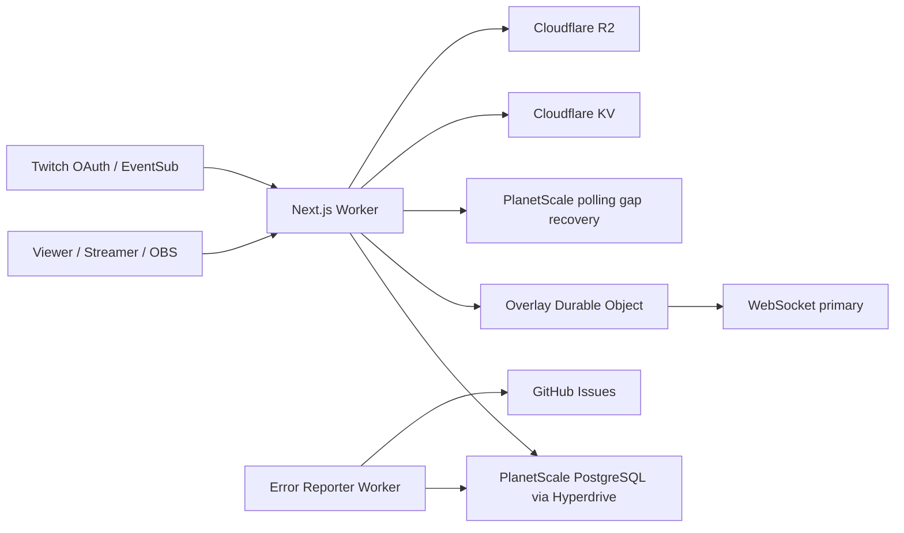

# 現行アーキテクチャ

twica の永続データは PlanetScale PostgreSQL を唯一の正本とし、Cloudflare Workers
から Hyperdrive 経由で接続します。段階移行で使用した Supabase／PostgREST 経路と
runtime driver flag はコードから撤去済みです。

```mermaid
flowchart LR
  Client[Viewer / Streamer / OBS] --> App[Next.js Worker]
  Twitch[Twitch OAuth / EventSub] --> App
  App --> DB[PlanetScale PostgreSQL via Hyperdrive]
  App --> Realtime[Overlay Durable Object]
  Realtime --> OBS[WebSocket primary]
  App --> Polling[PlanetScale polling gap recovery]
  App --> KV[Cloudflare KV]
  App --> R2[Cloudflare R2]
  Reporter[Error Reporter Worker] --> DB
  Reporter --> GitHub[GitHub Issues]
```

## 境界

- DB access は `src/lib/db/client.ts` から PlanetScale／Drizzle を使用する。
- overlay は Durable Objects WebSocket を primary、PlanetScale polling を
  reconnect 時の gap recovery とする。
- Twitch credential refresh は外部 API を DB transaction に含めず、旧 refresh
  token 条件の CAS update で競合時の上書きを防ぐ。
- 本体 Worker、overlay Worker、error reporter Worker の生成 bundle は
  `npm run check:supabase-shutdown` で廃止済み provider の再混入を拒否する。
- 旧切替手順は `docs/history/` の記録であり、現在の運用へ適用しない。

## 設定

- local Next.js: `DATABASE_URL_PLANETSCALE`
- production / preview Worker: `HYPERDRIVE_PLANETSCALE`
- migration workflow: GitHub Environment の `PLANETSCALE_DATABASE_URL`

接続文字列をソース、`.env`、公開 build variable へ保存しません。Cloudflare に残る
旧 Secret は PG/DO-only release の観測期間を完了して利用ゼロを確認した後、preview、
production の順で削除します。コード撤去と Secret revoke を同時に行わないことで、
障害時の原因を切り分けます。
