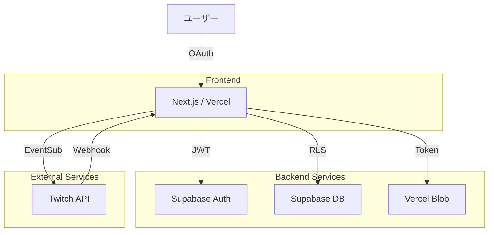

# TwiCa Architecture Document

## 概要

TwiCaはTwitch配信者向けのカードガチャシステムです。視聴者はチャンネルポイントを使ってガチャを引き、配信者が作成したオリジナルカードを収集できます。

---

## 機能要件

### 認証・認可
- Twitch OAuthによる配信者・視聴者認証
- Supabase Auth + カスタムCookieによるセッション管理
- 配信者は自身の配信者ページでのみカード管理が可能
- 視聴者は自分のカードとガチャ履歴のみ閲覧可能

### カード管理機能
- 配信者がカードを登録できる（名前、説明、画像URL、レアリティ、ドロップ率）
- カードの有効/無効切り替え
- カード画像はVercel Blob Storageに保存
- レアリティ: コモン、レア、エピック、レジェンダリー
- カード画像サイズ制限: 最大1MB

### ガチャ機能
- チャンネルポイントを使用したガチャシステム
- Twitch EventSubによるチャンネルポイント使用通知
- 重み付き確率によるカード選択
- ガチャ履歴の記録

### オーバーレイ表示
- ガチャ結果を配信画面にオーバーレイ表示
- ストリーマーIDごとのカスタマイズ可能な表示

### ダッシュボード機能
- 配信者ダッシュボード（カード管理、設定）
- 視聴者ダッシュボード（所持カード、ガチャ履歴）

---

## 非機能要件

### パフォーマンス
- APIレスポンス: 500ms以内（99パーセンタイル）
- ガチャ処理: 300ms以内
- 静的アセットのCDN配信（Vercel）
- データベースインデックスによるクエリ最適化

### セキュリティ
- HTTPSでの通信
- Supabase RLS (Row Level Security) による多層防御
- CSRF対策（SameSite=Lax Cookie + state検証）
- XSS対策（Reactの自動エスケープ）
- 環境変数によるシークレット管理
- セッション有効期限: 7日（Cookie + expiresAt検証）
- Twitch署名検証（EventSub Webhook）
- EventSubべき等性（event_idによる重複チェック）

### 可用性
- Vercelによる99.95% SLA
- Supabaseによる99.9% データベース可用性

### スケーラビリティ
- Vercel Serverless Functionsの自動スケーリング
- SupabaseのマネージドPostgreSQL（自動スケーリング）

---

## 受け入れ基準

### ユーザー認証
- [ ] Twitch OAuthでログインできる
- [ ] 配信者として認証される
- [ ] 視聴者として認証される
- [ ] ログアウトできる
- [ ] セッション有効期限後に再認証が必要

### カード管理
- [ ] カードを新規登録できる
- [ ] カードを編集できる
- [ ] カードを削除できる
- [ ] カード画像をアップロードできる
- [ ] カード画像サイズが1MB以下である
- [ ] カードの有効/無効を切り替えられる
- [ ] ドロップ率を設定できる（合計1.0以下）

### ガチャ機能
- [ ] チャンネルポイントでガチャを引ける
- [ ] ガチャ結果が正しく表示される
- [ ] ドロップ率通りにカードが排出される
- [ ] ガチャ履歴が記録される
- [ ] 重みなしで同じ確率で排出される（全カードのドロップ率が等しい場合）

### オーバーレイ
- [ ] ガチャ結果がOBS等のブラウザソースで表示できる
- [ ] カード画像が正しく表示される
- [ ] レアリティに応じた色が表示される

### データ整合性
- [ ] RLSポリシーが正しく機能する
- [ ] 配信者は自分のカードしか編集できない
- [ ] 視聴者は自分のカードしか見れない
- [ ] ガチャ履歴が正しく記録される

---

## 設計方針

### アーキテクチャパターン
- **クライアントサイド**: Next.js App Router + Server Components
- **サーバーサイド**: Vercel Serverless Functions
- **データストア**: Supabase (PostgreSQL)
- **ストレージ**: Vercel Blob
- **認証**: カスタムCookie + Twitch OAuth

### デザイン原則
1. **Simple over Complex**: 複雑さを最小限に抑える
2. **Type Safety**: TypeScriptによる厳格な型定義
3. **Separation of Concerns**: 機能ごとのモジュール分割
4. **Security First**: アプリケーション層での認証検証 + RLS（多層防御）

### 技術選定基準
- マネージドサービス優先（運用コスト削減）
- Next.jsエコシステムを活用（開発効率）
- カスタムセッションによる柔軟な認証管理

---

## アーキテクチャ

### システム全体図



### データフロー

#### 認証フロー
1. ユーザーがTwitchログインボタンをクリック
2. `/api/auth/twitch/login`でTwitch OAuth URLを生成
3. ユーザーがTwitchで認証
4. `/api/auth/twitch/callback`でコードを処理
5. Supabase AuthでJWTトークンを発行
6. Cookieにセッションを保存

#### ガチャフロー
1. 視聴者がチャンネルポイントで報酬を交換
2. Twitch EventSubが通知を送信
3. `/api/twitch/eventsub`で通知を受信
4. 有効なカードを取得（RLS）
5. 重み付き選択アルゴリズムでカードを選択
6. `user_cards`と`gacha_history`に記録
7. オーバーレイが結果を表示

#### 画像アップロードフロー
1. 配信者が画像を選択
2. フロントエンドで画像サイズと形式を検証（最大1MB）
3. `/api/upload`でアップロードトークンをリクエスト
4. クライアントからVercel Blobに直接アップロード
5. 画像URLを返却
6. カード登録時にURLを使用

### データベース設計

```mermaid
erDiagram
    STREAMERS ||--o{ CARDS : manages
    STREAMERS ||--o{ GACHA_HISTORY : records
    USERS ||--o{ USER_CARDS : owns
    CARDS ||--o{ USER_CARDS : collected
    CARDS ||--o{ GACHA_HISTORY : dropped
    
    STREAMERS {
        UUID id PK
        TEXT twitch_user_id UK
        TEXT twitch_username
        TEXT twitch_display_name
        TEXT twitch_profile_image_url
        TEXT channel_point_reward_id
        TEXT channel_point_reward_name
        BOOLEAN is_active
        TIMESTAMPTZ created_at
        TIMESTAMPTZ updated_at
    }
    
    CARDS {
        UUID id PK
        UUID streamer_id FK
        TEXT name
        TEXT description
        TEXT image_url
        TEXT rarity
        DECIMAL(5, 4) drop_rate
        BOOLEAN is_active
        TIMESTAMPTZ created_at
        TIMESTAMPTZ updated_at
    }
    
    USERS {
        UUID id PK
        TEXT twitch_user_id UK
        TEXT twitch_username
        TEXT twitch_display_name
        TEXT twitch_profile_image_url
        TIMESTAMPTZ created_at
        TIMESTAMPTZ updated_at
    }
    
    USER_CARDS {
        UUID id PK
        UUID user_id FK
        UUID card_id FK
        TIMESTAMPTZ obtained_at
    }
    
    GACHA_HISTORY {
        UUID id PK
        TEXT event_id UK           -- EventSubべき等性のためのID
        TEXT user_twitch_id
        TEXT user_twitch_username
        UUID card_id FK
        UUID streamer_id FK
        TIMESTAMPTZ redeemed_at
    }
```

### ディレクトリ構造

```
src/
├── app/
│   ├── api/
│   │   ├── auth/
│   │   │   ├── twitch/
│   │   │   │   ├── login/route.ts
│   │   │   │   └── callback/route.ts
│   │   │   └── logout/route.ts
│   │   ├── upload/route.ts
│   │   └── twitch/
│   │       └── eventsub/route.ts
│   ├── dashboard/
│   │   └── page.tsx
│   ├── overlay/
│   │   └── [streamerId]/
│   │       └── page.tsx
│   ├── layout.tsx
│   └── page.tsx
├── lib/
│   ├── constants.ts
│   ├── env-validation.ts
│   ├── error-handler.ts
│   ├── gacha.ts
│   ├── logger.ts
│   ├── session.ts
│   ├── dashboard-data.ts
│   ├── upload-validation.ts
│   ├── supabase/
│   │   ├── index.ts
│   │   └── admin.ts
│   └── twitch/
│       └── auth.ts
└── components/
```

---

## トレードオフの検討

### 1. 画像ストレージ: Vercel Blob vs Supabase Storage

**選択**: Vercel Blob

**理由**:
- Vercelとの統合が容易
- パフォーマンスが良い（CDN配信）
- 実装がシンプル

**トレードオフ**:
- Supabase Storageに比べて機能が限定
- 移行コストが高い
- 容量制限: 1GB（約200ユーザー相当）

### 2. ガチャ確率: 重み付き vs 固定確率

**選択**: 重み付き確率

**理由**:
- 配信者がドロップ率を制御できる
- レアリティ別の出現調整が容易

**トレードオフ**:
- ドロップ率の合計が1.0を超えるとバグになる
- 確率計算の複雑さ

### 3. データアクセス制御: RLS vs アプリケーション層

**選択**: RLS (Row Level Security)

**理由**:
- データベースレベルでのセキュリティ保証
- アプリケーションコードの簡素化
- バグによるデータ漏洩リスクの低減

**トレードオフ**:
- 複雑なポリシーの場合RLSが制約になる
- デバッグが難しい場合がある

### 4. ガチャ履歴: リアルタイム更新 vs 通知ベース

**選択**: EventSub通知ベース

**理由**:
- Twitch API公式の仕組みを使用
- ポーリングに比べて効率的
- リアルタイム性が十分

**トレードオフ**:
- Webhookの設定が必要
- 一時的な通知ロストの可能性

### 5. 認証: Supabase Auth vs NextAuth.js

**選択**: Supabase Auth

**理由**:
- RLSとの統合が容易
- Twitchプロバイダーの標準サポート
- セッション管理がシンプル

**トレードオフ**:
- カスタマイズ性はNextAuthの方が高い
- Supabaseへの依存が増える

---

## 依存関係

### 外部API

| サービス | 用途 | 依存度 |
|:---|:---|:---|
| Twitch API | OAuth、EventSub | 高 |
| Supabase | 認証、データベース | 高 |
| Vercel | ホスティング、Blob | 高 |

### キー外部サービス

- Twitch Client ID / Secret
- Supabase URL / Keys
- Vercel Blob Token

---

## 監視・ログ

### ログ戦略
- アプリケーションログ: Vercel Logs
- エラートラッキング: 予定
- アナリティクス: 予定

### 監視項目
- APIレスポンス時間
- エラー率
- EventSub Webhook成功率
- データベースクエリパフォーマンス

---

## セキュリティ考慮事項

### 認証・認可
- カスタムCookieによるセッション管理（7日有効期限）
- CSRF対策 (SameSite=Lax + state検証)
- アプリケーション層でのセッション検証（APIルート）
- Twitch署名検証（EventSub Webhook）
- RLSは多層防御として有効（service role 操作のみ許可）
- EventSubべき等性（event_idによる重複チェック）

### データ保護
- 機密情報の環境変数管理
- HTTPS enforced
- 画像URLの署名（必要に応じて）

### 入力検証
- ユーザー入力のバリデーション
- ファイルアップロードの制限（サイズ1MB以下、形式JPEG/PNG）

---

## 今後の拡張性

### 機能拡張
- カードトレード機能
- コレクション達成報酬
- マルチ配信者対応
- カードのアップグレード/合成

### 技術的改善
- Real-time更新 (Supabase Realtime)
- 画像の最適化 (Next.js Image Optimization)
- キャッシュ戦略の強化

---

## CI/CD

### GitHub Actions
```yaml
- テスト実行 (Unit)
- Lint実行
- TypeCheck実行
- ビルド
- デプロイ (Vercelに自動デプロイ)
```

---

## 開発環境

### 必要なツール
- Node.js 20+
- pnpm / npm
- Git

### ローカルセットアップ
```bash
npm install
cp .env.local.example .env.local
# 環境変数を設定
npm run dev
```

---

## 付録

### 環境変数一覧

| 変数名 | 必須 | 説明 |
|:---|:---:|:---|
| `NEXT_PUBLIC_SUPABASE_URL` | ✓ | SupabaseプロジェクトURL |
| `NEXT_PUBLIC_SUPABASE_ANON_KEY` | ✓ | Supabase匿名キー |
| `SUPABASE_SERVICE_ROLE_KEY` | ✓ | Supabaseサービスロールキー |
| `TWITCH_CLIENT_ID` | ✓ | TwitchアプリケーションClient ID |
| `TWITCH_CLIENT_SECRET` | ✓ | TwitchアプリケーションClient Secret |
| `NEXT_PUBLIC_TWITCH_CLIENT_ID` | ✓ | 公開Twitch Client ID |
| `NEXT_PUBLIC_APP_URL` | ✓ | アプリケーションURL |
| `BLOB_READ_WRITE_TOKEN` | ✓ | Vercel Blobストレージトークン |

### APIルート一覧

| ルート | メソッド | 説明 |
|:---|:---:|:---|
| `/api/auth/twitch/login` | GET | Twitch OAuthログイン開始 |
| `/api/auth/twitch/callback` | GET | Twitch OAuthコールバック |
| `/api/auth/logout` | POST | ログアウト |
| `/api/upload` | POST | 画像アップロードトークン取得 |
| `/api/twitch/eventsub` | POST | Twitch EventSub Webhook |

---

## CI環境変数検証の修正

### 問題
CIビルド時に環境変数の検証が失敗し、ビルドが成功しない

### 現象
- `src/lib/env-validation.ts` で環境変数のバリデーションが実行される
- CI環境（`process.env.CI`）では検証をスキップするはずだが、動作していない
- 現在の実装は `process.env.NODE_ENV !== 'test'` のみチェックしている
- GitHub Actions CIでは `NODE_ENV` が設定されていないため、検証が実行されてしまう

### 解決策
`src/lib/env-validation.ts` を更新して、CI環境でのバリデーションを適切にスキップする

### 設計内容

1. **`src/lib/env-validation.ts` の検証ロジックを更新**
   - 現在: `if (!valid && process.env.NODE_ENV !== 'test')`
   - 修正: `if (!valid && process.env.NODE_ENV !== 'test' && !process.env.CI)`
   - CI環境変数 `process.env.CI` が設定されている場合も検証をスキップ

2. **理由**
   - GitHub Actionsでは `CI` 環境変数が自動的に `true` に設定される
   - CIビルドでは実際のAPI接続が不要（静的解析、型チェックのみ）
   - CI workflowですべての必要な環境変数にダミー値を設定済み
   - 本番環境ではVercelの環境変数設定が使用される

### 受け入れ基準
- [ ] CIが成功する
- [ ] ビルドが正常に完了する
- [ ] すべてのテストとLintがパスする
- [ ] 環境変数の検証がCI環境で正しくスキップされる

---

## Issue #8: 利用規約 (Terms of Service)

### 問題
利用規約ページが存在しない

### 現象
- `/tos` ページが存在しない
- ユーザーが利用規約を閲覧できない
- 法的コンプライアンスの観点から利用規約の提示が必要

### 解決策
利用規約ページを実装する

### 設計内容

1. **`src/app/tos/page.tsx` を新規作成**
   - 利用規約を表示する静的ページ
   - マークダウンまたはHTML形式で規約内容を表示
   - レスポンシブデザイン対応
   - ナビゲーションからのリンクを追加

2. **利用規約の内容**
   - サービスの概要
   - ユーザーの責任と義務
   - 利用制限
   - 知的財産権
   - 免責事項
   - 変更と終了
   - お問い合わせ先

3. **ナビゲーション更新**
   - `src/app/layout.tsx` またはナビゲーションコンポーネントに「利用規約」リンクを追加
   - フッターに「利用規約」リンクを追加

4. **今後の拡張性**
   - 将来的にはデータベースに規約内容を保存し、管理画面から更新可能にする
   - ユーザーによる同意確認機能の追加

### 受け入れ基準
- [ ] `/tos` ページにアクセスできる
- [ ] 利用規約の内容が正しく表示される
- [ ] ナビゲーションまたはフッターから利用規約にリンクされている
- [ ] レスポンシブデザインで正しく表示される
- [ ] ページがSEOに適した構造になっている

---

## CIビルド失敗の修正: Supabase Realtime環境変数の不備

### 問題

CIビルド時にSupabase Realtimeモジュールの初期化で環境変数の不足によりビルドが失敗している。

**エラー内容**:
```
Error: Missing Supabase environment variables for realtime
    at module evaluation (.next/server/chunks/[root-of-the-server]__e6ba679a._.js:1:4396)
    at instantiateModule (.next/server/chunks/[turbopack]_runtime.js:740:9)
```

**発生箇所**: `/api/twitch/eventsub/route.ts` -> `src/lib/realtime.ts`

### 現象

1. `.github/workflows/ci.yml` では以下の環境変数が空文字で設定されている:
   ```yaml
   env:
     NEXT_PUBLIC_SUPABASE_URL: ''
     NEXT_PUBLIC_SUPABASE_ANON_KEY: ''
     NEXT_PUBLIC_TWITCH_CLIENT_ID: ''
   ```

2. `src/lib/realtime.ts` は以下の問題がある:
   - `broadcastGachaResult` 関数（line 44-55）で `supabaseRealtime.channel()` を直接使用
   - `subscribeToGachaResults` 関数（line 57-72）でも `supabaseRealtime.channel()` を直接使用
   - これらの関数は `getSupabaseRealtimeClient()` を呼ばずに `supabaseRealtime` を使用している
   - ビルド時にSupabaseモジュールのモジュール評価が行われ、環境変数チェックが実行される

3. CIビルド時の環境変数が空文字の場合:
   - `process.env.NEXT_PUBLIC_SUPABASE_URL` は `''`
   - `process.env.NEXT_PUBLIC_SUPABASE_ANON_KEY` は `''`
   - これらはfalsy値なのでチェックに失敗する
   - CI環境であっても、空文字のチェックでは `process.env.CI` のチェック前にエラーになる

### 解決策

**方針**:
CI環境でもビルドが成功するように、以下の2点を修正する

1. **`.github/workflows/ci.yml` の環境変数を修正**
   - 空文字ではなくダミー値を設定する
   - 他の環境変数と同様に適切なダミー値を提供する

2. **`src/lib/realtime.ts` の関数を修正**
   - 各関数内で `getSupabaseRealtimeClient()` を呼ぶように修正
   - 初期化されていない場合に適切に処理する

### 設計内容

#### 1. `.github/workflows/ci.yml` の修正

```yaml
- name: Build
  run: npm run build
  env:
    NEXT_PUBLIC_SUPABASE_URL: https://dummy.supabase.co
    NEXT_PUBLIC_SUPABASE_ANON_KEY: dummy_anon_key
    NEXT_PUBLIC_TWITCH_CLIENT_ID: dummy_client_id
    NEXT_PUBLIC_APP_URL: http://localhost:3000
    TWITCH_CLIENT_ID: dummy_client_id
    TWITCH_CLIENT_SECRET: dummy_client_secret
    TWITCH_EVENTSUB_SECRET: dummy_eventsub_secret
    SUPABASE_SERVICE_ROLE_KEY: dummy_service_role_key
    BLOB_READ_WRITE_TOKEN: dummy_blob_token
```

**変更点**:
- `NEXT_PUBLIC_SUPABASE_URL`: `''` → `https://dummy.supabase.co`
- `NEXT_PUBLIC_SUPABASE_ANON_KEY`: `''` → `dummy_anon_key`
- `NEXT_PUBLIC_TWITCH_CLIENT_ID`: `''` → `dummy_client_id`

**理由**:
- Next.jsのビルドプロセスでは、`NEXT_PUBLIC_*` プレフィックスの環境変数がクライアントサイドコードに埋め込まれる
- 空文字ではSupabaseクライアントの初期化に失敗する
- ダミー値であっても、有効なフォーマットである必要がある
- CI環境では実際のSupabase接続は不要（ビルドのみ実行）

#### 2. `src/lib/realtime.ts` の修正

**現在の問題**:
```typescript
export async function broadcastGachaResult(
  streamerId: string,
  payload: GachaBroadcastPayload
): Promise<void> {
  const channel = supabaseRealtime.channel(`gacha:${streamerId}`)  // supabaseRealtimeはnullの可能性
  await channel.send({
    type: 'broadcast',
    event: 'gacha_result',
    payload,
  })
}
```

**修正後**:
```typescript
export async function broadcastGachaResult(
  streamerId: string,
  payload: GachaBroadcastPayload
): Promise<void> {
  const client = getSupabaseRealtimeClient()
  const channel = client.channel(`gacha:${streamerId}`)
  
  await channel.send({
    type: 'broadcast',
    event: 'gacha_result',
    payload,
  })
}

export function subscribeToGachaResults(
  streamerId: string,
  callback: (payload: GachaBroadcastPayload) => void
): () => void {
  const client = getSupabaseRealtimeClient()
  const channel = client.channel(`gacha:${streamerId}`)
  
  channel
    .on('broadcast', { event: 'gacha_result' }, (payload) => {
      callback(payload.payload as GachaBroadcastPayload)
    })
    .subscribe()

  return () => {
    client.removeChannel(channel)
  }
}
```

**変更点**:
- 各関数の先頭で `getSupabaseRealtimeClient()` を呼び出す
- 直接 `supabaseRealtime` グローバル変数を使用しない
- 返されたクライアントインスタンスを使用する

**理由**:
- `getSupabaseRealtimeClient()` 内で環境変数チェックと初期化を行う
- CI環境（`process.env.CI`）またはテスト環境（`process.env.NODE_ENV === 'test'`）であれば適切なエラーハンドリングが可能
- クライアントが初期化されるまで遅延初期化する
- 実行時にのみSupabase接続が必要（ビルド時には不要）

#### 3. `src/lib/realtime.ts` の CI環境対応の追加

`getSupabaseRealtimeClient()` 関数にCI環境特有の処理を追加:

```typescript
function getSupabaseRealtimeClient(): SupabaseClient {
  if (supabaseRealtime) {
    return supabaseRealtime
  }

  const supabaseUrl = process.env.NEXT_PUBLIC_SUPABASE_URL
  const supabaseKey = process.env.NEXT_PUBLIC_SUPABASE_ANON_KEY

  if (!supabaseUrl || !supabaseKey) {
    if (process.env.CI || process.env.NODE_ENV === 'test') {
      throw new Error('Realtime not available in CI/test environment')
    } else {
      throw new Error('Missing Supabase environment variables for realtime')
    }
  }

  supabaseRealtime = createClient(supabaseUrl, supabaseKey, {
    realtime: {
      params: {
        eventsPerSecond: 10,
      },
    },
  })

  return supabaseRealtime
}
```

### 受け入れ基準

- [ ] CIビルドが成功する
- [ ] ビルドが正常に完了する
- [ ] すべてのテストとLintがパスする
- [ ] CI環境でSupabase Realtimeモジュールの初期化エラーが発生しない
- [ ] `broadcastGachaResult` 関数が正しく動作する
- [ ] `subscribeToGachaResults` 関数が正しく動作する
- [ ] 本番環境でRealtime通信が正常に動作する

### テスト計画

1. **CIビルドテスト**:
   - GitHub ActionsでCIビルドを実行
   - ビルドが成功することを確認

2. **ユニットテスト**:
   - `broadcastGachaResult` 関数のテスト
   - `subscribeToGachaResults` 関数のテスト
   - CI環境でのエラーハンドリングのテスト

3. **統合テスト**:
   - 本番環境でガチャ結果のブロードキャストが動作することを確認
   - オーバーレイがガチャ結果を受信して表示することを確認

---

## 更新履歴

| 日付 | 変更内容 |
|:---|:---|
| 2026-01-17 | CIビルド失敗の修正設計追加（Supabase Realtime環境変数の不備） |
| 2026-01-17 | 利用規約の設計追加（Issue #8対応） |
| 2026-01-17 | CI環境変数検証の修正設計追加 |
