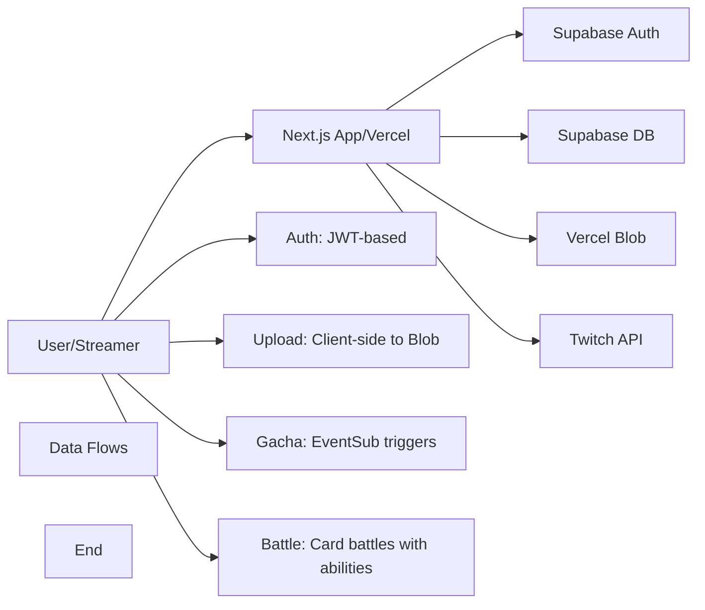

# TwiCa Architecture Document

## 概要

TwiCaはTwitch配信者向けのカードガチャシステムです。視聴者はチャンネルポイントを使ってガチャを引き、配信者が作成したオリジナルカードを収集できます。

---

## 機能要件

### 認証・認可
- Twitch OAuthによる配信者・視聴者認証
- Supabase Auth + カスタムCookieによるセッション管理
- 配信者は自身の配信者ページでのみカード管理が可能
- 視聴者は自分のカードとガチャ履歴のみ閲覧可能

### カード管理機能
- 配信者がカードを登録できる（名前、説明、画像URL、レアリティ、ドロップ率）
- カードの有効/無効切り替え
- カード画像はVercel Blob Storageに保存
- レアリティ: コモン、レア、エピック、レジェンダリー
- カード画像サイズ制限: 最大1MB

### ガチャ機能
- チャンネルポイントを使用したガチャシステム
- Twitch EventSubによるチャンネルポイント使用通知
- 重み付き確率によるカード選択
- ガチャ履歴の記録

### オーバーレイ表示
- ガチャ結果を配信画面にオーバーレイ表示
- ストリーマーIDごとのカスタマイズ可能な表示

### ダッシュボード機能
- 配信者ダッシュボード（カード管理、設定）
- 視聴者ダッシュボード（所持カード、ガチャ履歴）

---

## 非機能要件

### パフォーマンス
- APIレスポンス: 500ms以内（99パーセンタイル）
- ガチャ処理: 300ms以内
- 対戦処理: 1000ms以内
- 静的アセットのCDN配信（Vercel）
- データベースインデックスによるクエリ最適化

### セキュリティ
- HTTPSでの通信
- Supabase RLS (Row Level Security) による多層防御
- CSRF対策（SameSite=Lax Cookie + state検証）
- XSS対策（Reactの自動エスケープ）
- 環境変数によるシークレット管理
- セッション有効期限: 7日（Cookie + expiresAt検証）
- Twitch署名検証（EventSub Webhook）
- EventSubべき等性（event_idによる重複チェック）
- APIレート制限によるDoS攻撃対策
- 対戦の不正防止（ランダム性の確保）

### 可用性
- Vercelによる99.95% SLA
- Supabaseによる99.9% データベース可用性

### スケーラビリティ
- Vercel Serverless Functionsの自動スケーリング
- SupabaseのマネージドPostgreSQL（自動スケーリング）

---

## 受け入れ基準

### ユーザー認証
- [x] Twitch OAuthでログインできる
- [x] 配信者として認証される
- [x] 視聴者として認証される
- [x] ログアウトできる
- [x] セッション有効期限後に再認証が必要

### カード管理
- [x] カードを新規登録できる
- [x] カードを編集できる
- [x] カードを削除できる
- [x] カード画像をアップロードできる
- [x] カード画像サイズが1MB以下である
- [x] カードの有効/無効を切り替えられる
- [x] ドロップ率を設定できる（合計1.0以下）

### ガチャ機能
- [x] チャンネルポイントでガチャを引ける
- [x] ガチャ結果が正しく表示される
- [x] ドロップ率通りにカードが排出される
- [x] ガチャ履歴が記録される
- [x] 重みなしで同じ確率で排出される（全カードのドロップ率が等しい場合）

### オーバーレイ
- [x] ガチャ結果がOBS等のブラウザソースで表示できる
- [x] カード画像が正しく表示される
- [x] レアリティに応じた色が表示される

### データ整合性
- [x] RLSポリシーが正しく機能する
- [x] 配信者は自分のカードしか編集できない
- [x] 視聴者は自分のカードしか見れない
- [x] ガチャ履歴が正しく記録される

### APIレート制限（Issue #13）
- [x] `@upstash/ratelimit` と `@upstash/redis` をインストール
- [x] `src/lib/rate-limit.ts` を実装
- [x] 各 API ルートにレート制限を追加
- [x] 429 エラーが適切に返される
- [x] レート制限ヘッダーが設定される
- [x] 開発環境でインメモリレート制限が動作する
- [x] 本番環境で Redis レート制限が動作する
- [x] EventSub Webhook は緩いレート制限を持つ
- [x] 認証済みユーザーは twitchUserId で識別される
- [x] 未認証ユーザーは IP アドレスで識別される
- [x] フロントエンドで 429 エラーが適切に表示される

---

## 設計方針

### アーキテクチャパターン
- **クライアントサイド**: Next.js App Router + Server Components
- **サーバーサイド**: Vercel Serverless Functions
- **データストア**: Supabase (PostgreSQL)
- **ストレージ**: Vercel Blob
- **認証**: カスタムCookie + Twitch OAuth

### デザイン原則
1. **Simple over Complex**: 複雑さを最小限に抑える
2. **Type Safety**: TypeScriptによる厳格な型定義
3. **Separation of Concerns**: 機能ごとのモジュール分割
4. **Security First**: アプリケーション層での認証検証 + RLS（多層防御）

### 技術選定基準
- マネージドサービス優先（運用コスト削減）
- Next.jsエコシステムを活用（開発効率）
- カスタムセッションによる柔軟な認証管理

---

## アーキテクチャ

### システム全体図



### データフロー

#### 認証フロー
1. ユーザーがTwitchログインボタンをクリック
2. `/api/auth/twitch/login`でTwitch OAuth URLを生成
3. ユーザーがTwitchで認証
4. `/api/auth/twitch/callback`でコードを処理
5. Supabase AuthでJWTトークンを発行
6. Cookieにセッションを保存

#### ガチャフロー
1. 視聴者がチャンネルポイントで報酬を交換
2. Twitch EventSubが通知を送信
3. `/api/twitch/eventsub`で通知を受信
4. レート制限チェックをスキップ（EventSub WebhookはTwitchからの信頼できる通知）
5. 有効なカードを取得（RLS）
6. 重み付き選択アルゴリズムでカードを選択
7. `user_cards`と`gacha_history`に記録
8. オーバーレイが結果を表示

#### 画像アップロードフロー
1. 配信者が画像を選択
2. フロントエンドで画像サイズと形式を検証（最大1MB）
3. `/api/upload`でレート制限チェック
4. レート制限を超過している場合、429エラーを返す
5. クライアントからVercel Blobに直接アップロード
6. 画像URLを返却
7. カード登録時にURLを使用

---

## Issue #15: 集めたカードで対戦できる機能

### 問題

視聴者が集めたカードを使って対戦する機能が存在しません。配信者と視聴者のエンゲージメントを高めるために、カード対戦機能を実装する必要があります。

### 現象

- 視聴者が集めたカードを活用する方法がガチャのみ
- カードのステータスや能力が定義されていない
- 対戦ロジックが存在しない

これにより以下の課題があります：
- 視聴者のエンゲージメントが低下
- カードのコレクション価値が低い
- 配信者のコンテンツの多様性が不足

### 期待される動作

視聴者が集めたカードを使って、自動対戦機能で遊べるようにする。

### 優先度

中（エンゲージメント向上機能）

---

## Issue #15: カード対戦機能の設計

### 機能要件

#### カードステータス
- 各カードにステータスを追加
- **HP (Hit Points)**: 体力（100-200の範囲）
- **ATK (Attack)**: 攻撃力（20-50の範囲）
- **DEF (Defense)**: 防御力（10-30の範囲）
- **SPD (Speed)**: 速度（1-10の範囲、行動順決定）

#### カード能力（スキル）
- 各カードに1つのアクティブスキルを持つ
- スキル発動確率（SPDに基づく）
- スキルタイプ:
  - **攻撃型**: 相手にダメージを与える
  - **防御型**: 自身の防御力を上げる
  - **回復型**: 自身のHPを回復する
  - **特殊型**: 特殊効果（状態異常など）

#### 対戦ルール（シンプル版）
- 1対1の自動対戦
- ターン制バトル
- ターンごとに攻撃またはスキル発動
- HPが0になった方が敗北
- 最大ターン数: 20ターン（制限超過時はHPが多い方の勝利）

#### 対戦フロー
1. 視聴者が自分のカードを選択
2. CPUまたは他の視聴者のカードを選択（今回はCPUのみ）
3. 対戦開始
4. 自動でターン制バトルが進行
5. 勝敗判定
6. 対戦結果の表示

#### 対戦履歴
- 対戦結果をデータベースに記録
- 勝利数、敗北数、勝率の統計
- 使用したカードの履歴

### データベース設計

#### 既存テーブルへの変更

**`cards`テーブルにステータス列を追加**:
```sql
ALTER TABLE cards
ADD COLUMN hp INTEGER DEFAULT 100,
ADD COLUMN atk INTEGER DEFAULT 30,
ADD COLUMN def INTEGER DEFAULT 15,
ADD COLUMN spd INTEGER DEFAULT 5,
ADD COLUMN skill_type TEXT DEFAULT 'attack',
ADD COLUMN skill_name TEXT DEFAULT '通常攻撃',
ADD COLUMN skill_power INTEGER DEFAULT 10;
```

**スキルタイプの定義**:
- `attack`: 攻撃型（相手にダメージ）
- `defense`: 防御型（防御力アップ）
- `heal`: 回復型（HP回復）
- `special`: 特殊型（状態異常など）

#### 新規テーブル

**`battles`テーブル**:
```sql
CREATE TABLE battles (
    id UUID PRIMARY KEY DEFAULT gen_random_uuid(),
    user_id UUID REFERENCES auth.users(id) NOT NULL,
    user_card_id UUID REFERENCES user_cards(id) NOT NULL,
    opponent_card_id UUID REFERENCES cards(id) NOT NULL,
    result TEXT NOT NULL, -- 'win', 'lose', 'draw'
    turn_count INTEGER DEFAULT 0,
    battle_log JSONB, -- 対戦の詳細なログ
    created_at TIMESTAMP WITH TIME ZONE DEFAULT NOW()
);

CREATE INDEX idx_battles_user_id ON battles(user_id);
CREATE INDEX idx_battles_created_at ON battles(created_at DESC);
```

**`battle_stats`テーブル**:
```sql
CREATE TABLE battle_stats (
    id UUID PRIMARY KEY DEFAULT gen_random_uuid(),
    user_id UUID REFERENCES auth.users(id) NOT NULL UNIQUE,
    total_battles INTEGER DEFAULT 0,
    wins INTEGER DEFAULT 0,
    losses INTEGER DEFAULT 0,
    draws INTEGER DEFAULT 0,
    win_rate DECIMAL(5, 2) DEFAULT 0,
    updated_at TIMESTAMP WITH TIME ZONE DEFAULT NOW()
);
```

### API設計

#### `POST /api/battle/start`

対戦を開始する。

**リクエスト**:
```json
{
  "userCardId": "uuid",
  "opponentType": "cpu"
}
```

**レスポンス**:
```json
{
  "battleId": "uuid",
  "userCard": {
    "id": "uuid",
    "name": "カード名",
    "hp": 150,
    "currentHp": 150,
    "atk": 35,
    "def": 20,
    "spd": 6
  },
  "opponentCard": {
    "id": "uuid",
    "name": "CPUカード",
    "hp": 140,
    "currentHp": 140,
    "atk": 40,
    "def": 15,
    "spd": 5
  }
}
```

#### `GET /api/battle/[battleId]`

対戦状況を取得する。

**レスポンス**:
```json
{
  "battleId": "uuid",
  "status": "in_progress", -- "in_progress", "completed"
  "turn": 1,
  "maxTurns": 20,
  "userCard": {
    "id": "uuid",
    "name": "カード名",
    "hp": 150,
    "currentHp": 145,
    "atk": 35,
    "def": 20,
    "spd": 6
  },
  "opponentCard": {
    "id": "uuid",
    "name": "CPUカード",
    "hp": 140,
    "currentHp": 135,
    "atk": 40,
    "def": 15,
    "spd": 5
  },
  "logs": [
    {
      "turn": 1,
      "actor": "user", -- "user", "opponent"
      "action": "attack",
      "damage": 5,
      "message": "あなたのカードが攻撃！5ダメージを与えた！"
    }
  ]
}
```

#### `GET /api/battle/stats`

ユーザーの対戦統計を取得する。

**レスポンス**:
```json
{
  "totalBattles": 100,
  "wins": 60,
  "losses": 35,
  "draws": 5,
  "winRate": 60.0,
  "recentBattles": [
    {
      "battleId": "uuid",
      "result": "win",
      "opponentCardName": "CPUカード",
      "turnCount": 8,
      "createdAt": "2026-01-17T10:00:00Z"
    }
  ]
}
```

### 対戦ロジック

#### ステータス計算

カードのステータスは、レアリティに応じて変動：
- **コモン**: HP 100-120, ATK 20-30, DEF 10-15, SPD 1-3
- **レア**: HP 120-140, ATK 30-40, DEF 15-20, SPD 3-5
- **エピック**: HP 140-160, ATK 40-45, DEF 20-25, SPD 5-7
- **レジェンダリー**: HP 160-200, ATK 45-50, DEF 25-30, SPD 7-10

#### スキル発動確率

SPDに基づいてスキル発動確率を決定：
- 発動確率 = SPD × 10%（最大70%）
- 例: SPD 5の場合、50%の確率でスキル発動

#### ダメージ計算

通常攻撃ダメージ:
```
damage = max(1, attacker.atk - defender.def)
```

スキルダメージ:
```
skillDamage = max(1, attacker.atk + attacker.skill_power - defender.def)
```

防御力アップ:
```
newDef = defender.def + defender.skill_power
```

回復量:
```
healAmount = defender.skill_power
```

#### ターン制バトルフロー

```typescript
async function playBattle(userCard: Card, opponentCard: Card): Promise<BattleResult> {
  const maxTurns = 20;
  const logs: BattleLog[] = [];
  let turn = 1;
  
  // 行動順決定（SPDが高い方が先手）
  let firstActor = userCard.spd >= opponentCard.spd ? 'user' : 'opponent';
  let currentActor = firstActor;
  
  // カードのステータスをコピー
  let userStats = { ...userCard };
  let opponentStats = { ...opponentCard };
  
  while (turn <= maxTurns && userStats.currentHp > 0 && opponentStats.currentHp > 0) {
    const attacker = currentActor === 'user' ? userStats : opponentStats;
    const defender = currentActor === 'user' ? opponentStats : userStats;
    
    // スキル発動判定
    const skillTrigger = Math.random() * 100 < (attacker.spd * 10);
    
    if (skillTrigger) {
      // スキル発動
      const result = executeSkill(attacker, defender);
      logs.push({
        turn,
        actor: currentActor,
        action: 'skill',
        damage: result.damage || 0,
        heal: result.heal || 0,
        message: `${attacker.name}がスキル発動！${result.message}`
      });
      
      // ステータス更新
      if (result.damage) {
        defender.currentHp = Math.max(0, defender.currentHp - result.damage);
      }
      if (result.heal) {
        attacker.currentHp = Math.min(attacker.hp, attacker.currentHp + result.heal);
      }
      if (result.defenseUp) {
        defender.def += result.defenseUp;
      }
    } else {
      // 通常攻撃
      const damage = Math.max(1, attacker.atk - defender.def);
      defender.currentHp = Math.max(0, defender.currentHp - damage);
      
      logs.push({
        turn,
        actor: currentActor,
        action: 'attack',
        damage,
        message: `${attacker.name}が攻撃！${damage}ダメージを与えた！`
      });
    }
    
    // ターン交代
    currentActor = currentActor === 'user' ? 'opponent' : 'user';
    
    // 両方が行動したらターン終了
    if (currentActor === firstActor) {
      turn++;
    }
  }
  
  // 勝敗判定
  let result: 'win' | 'lose' | 'draw';
  if (userStats.currentHp <= 0) {
    result = 'lose';
  } else if (opponentStats.currentHp <= 0) {
    result = 'win';
  } else {
    // 20ターン経過時はHPが多い方の勝利
    result = userStats.currentHp >= opponentStats.currentHp ? 'win' : 'lose';
  }
  
  return {
    result,
    turnCount: turn,
    userHp: userStats.currentHp,
    opponentHp: opponentStats.currentHp,
    logs
  };
}
```

### スキル実装

```typescript
interface SkillResult {
  damage?: number;
  heal?: number;
  defenseUp?: number;
  message: string;
}

function executeSkill(attacker: Card, defender: Card): SkillResult {
  switch (attacker.skillType) {
    case 'attack':
      const skillDamage = Math.max(1, attacker.atk + attacker.skill_power - defender.def);
      return {
        damage: skillDamage,
        message: `${attacker.skill_name}！${skillDamage}ダメージを与えた！`
      };
    
    case 'defense':
      return {
        defenseUp: attacker.skill_power,
        message: `${attacker.skill_name}！防御力が上がった！`
      };
    
    case 'heal':
      const healAmount = Math.min(attacker.hp - attacker.currentHp, attacker.skill_power);
      return {
        heal: healAmount,
        message: `${attacker.skill_name}！${healAmount}回復した！`
      };
    
    case 'special':
      // 特殊効果（今回は実装せず、次回の機能拡張で追加）
      return {
        message: `${attacker.skill_name}！特殊効果発動！`
      };
    
    default:
      return { message: 'スキル発動失敗' };
  }
}
```

### フロントエンド設計

#### 対戦画面 (`/battle`)

1. **カード選択画面**
   - ユーザーのカードリストを表示
   - CPU対戦ボタン
   - 最近使用したカードの履歴

2. **対戦進行画面**
   - ユーザーカードとCPUカードの表示
   - 現在のHP、ターン数の表示
   - 対戦ログのリアルタイム表示
   - アニメーション効果（攻撃、ダメージ、回復）

3. **結果画面**
   - 勝敗の表示
   - 統計情報（対戦数、勝率）
   - 再戦ボタン
   - 他のカードで対戦ボタン

#### 統計画面 (`/battle/stats`)

- 総対戦数、勝利数、敗北数、引き分け数
- 勝率のグラフ表示
- 最近の対戦履歴
- 使用カードごとの勝率

### UI/UX

1. **カード選択**
   - グリッド表示でカードを選択
   - ステータス情報を表示（HP、ATK、DEF、SPD）
   - レアリティごとに色分け

2. **対戦進行**
   - カードのイラストを中央に配置
   - HPバーを表示
   - 対戦ログをスクロール表示
   - アニメーションをスムーズに実行

3. **レスポンシブ対応**
   - モバイルでも快適に操作可能
   - 縦横両方のレイアウト対応

### 受け入れ基準

- [ ] カードにステータス（HP、ATK、DEF、SPD）が追加される
- [ ] 各カードにスキルが設定される
- [ ] CPU対戦が可能
- [ ] 自動ターン制バトルが動作する
- [ ] 勝敗判定が正しく行われる
- [ ] 対戦履歴が記録される
- [ ] 対戦統計が表示される
- [ ] フロントエンドで対戦が視覚的に楽しめる
- [ ] アニメーション効果が表示される
- [ ] モバイルで快適に操作可能

### テスト計画

1. **ユニットテスト**:
   - 対戦ロジックのテスト（ダメージ計算、スキル発動）
   - ステータス計算のテスト
   - 勝敗判定のテスト

2. **統合テスト**:
   - APIエンドポイントのテスト
   - データベース操作のテスト
   - 対戦フローのテスト

3. **E2Eテスト**:
   - カード選択から対戦完了までのフロー
   - 対戦履歴の確認
   - 統計情報の表示

4. **パフォーマンステスト**:
   - 対戦処理が1000ms以内に完了すること
   - 複数の対戦が同時に行われた場合の動作

### トレードオフの検討

#### スキルの複雑さ vs シンプルさ

**選択**: 最初はシンプルなスキルのみ実装

**理由**:
- 開発期間を短縮
- ユーザーがルールを理解しやすく
- 将来的な機能拡張の余地を残す

**トレードオフ**:
- シンプルなスキルのみでは深みが不足
- 複雑なスキルはバランス調整が困難

#### CPUのAI

**選択**: ランダム行動（シンプル版）

**理由**:
- 開発コストを削減
- ランダムでも十分楽しめる
- 将来的な機能拡張の余地を残す

**トレードオフ**:
- AIが予測可能で退屈
- 複雑なAIは計算コストが高い

#### 対戦モード

**選択**: 1対1のCPU対戦のみ

**理由**:
- ユーザー同時接続の必要がない
- リアルタイム通信の複雑さを回避
- データベース設計がシンプル

**トレードオフ**:
- ユーザー同士の対戦ができない
- エンゲージメントが制限される

---

## 更新履歴

| 日付 | 変更内容 |
|:---|:---|
| 2026-01-17 | Issue #15 カード対戦機能の設計追加 |
| 2026-01-17 | APIルートのレート制限実装完了（Issue #13） |
