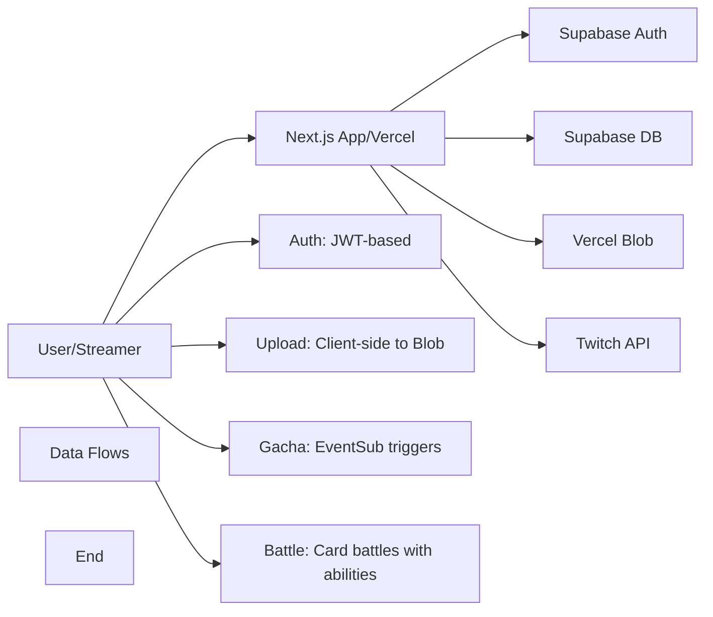

# TwiCa Architecture Document

## 概要

TwiCaはTwitch配信者向けのカードガチャシステムです。視聴者はチャンネルポイントを使ってガチャを引き、配信者が作成したオリジナルカードを収集できます。

---

## 機能要件

### 認証・認可
- Twitch OAuthによる配信者・視聴者認証
- Supabase Auth + カスタムCookieによるセッション管理
- 配信者は自身の配信者ページでのみカード管理が可能
- 視聴者は自分のカードとガチャ履歴のみ閲覧可能

### カード管理機能
- 配信者がカードを登録できる（名前、説明、画像URL、レアリティ、ドロップ率）
- カードの有効/無効切り替え
- カード画像はVercel Blob Storageに保存
- レアリティ: コモン、レア、エピック、レジェンダリー
- カード画像サイズ制限: 最大1MB

### ガチャ機能
- チャンネルポイントを使用したガチャシステム
- Twitch EventSubによるチャンネルポイント使用通知
- 重み付き確率によるカード選択
- ガチャ履歴の記録

### オーバーレイ表示
- ガチャ結果を配信画面にオーバーレイ表示
- ストリーマーIDごとのカスタマイズ可能な表示

### ダッシュボード機能
- 配信者ダッシュボード（カード管理、設定）
- 視聴者ダッシュボード（所持カード、ガチャ履歴）

---

## 非機能要件

### パフォーマンス
- APIレスポンス: 500ms以内（99パーセンタイル）
- ガチャ処理: 300ms以内
- 対戦処理: 1000ms以内
- 静的アセットのCDN配信（Vercel）
- データベースインデックスによるクエリ最適化

### セキュリティ
- HTTPSでの通信
- Supabase RLS (Row Level Security) による多層防御
- CSRF対策（SameSite=Lax Cookie + state検証）
- XSS対策（Reactの自動エスケープ）
- 環境変数によるシークレット管理
- セッション有効期限: 7日（Cookie + expiresAt検証）
- Twitch署名検証（EventSub Webhook）
- EventSubべき等性（event_idによる重複チェック）
- APIレート制限によるDoS攻撃対策
- 対戦の不正防止（ランダム性の確保）

### 可用性
- Vercelによる99.95% SLA
- Supabaseによる99.9% データベース可用性

### スケーラビリティ
- Vercel Serverless Functionsの自動スケーリング
- SupabaseのマネージドPostgreSQL（自動スケーリング）

---

## 受け入れ基準

### ユーザー認証
- [x] Twitch OAuthでログインできる
- [x] 配信者として認証される
- [x] 視聴者として認証される
- [x] ログアウトできる
- [x] セッション有効期限後に再認証が必要

### カード管理
- [x] カードを新規登録できる
- [x] カードを編集できる
- [x] カードを削除できる
- [x] カード画像をアップロードできる
- [x] カード画像サイズが1MB以下である
- [x] カードの有効/無効を切り替えられる
- [x] ドロップ率を設定できる（合計1.0以下）

### ガチャ機能
- [x] チャンネルポイントでガチャを引ける
- [x] ガチャ結果が正しく表示される
- [x] ドロップ率通りにカードが排出される
- [x] ガチャ履歴が記録される
- [x] 重みなしで同じ確率で排出される（全カードのドロップ率が等しい場合）

### オーバーレイ
- [x] ガチャ結果がOBS等のブラウザソースで表示できる
- [x] カード画像が正しく表示される
- [x] レアリティに応じた色が表示される

### データ整合性
- [x] RLSポリシーが正しく機能する
- [x] 配信者は自分のカードしか編集できない
- [x] 視聴者は自分のカードしか見れない
- [x] ガチャ履歴が正しく記録される

### APIレート制限（Issue #13）
- [x] `@upstash/ratelimit` と `@upstash/redis` をインストール
- [x] `src/lib/rate-limit.ts` を実装
- [x] 各 API ルートにレート制限を追加
- [x] 429 エラーが適切に返される
- [x] レート制限ヘッダーが設定される
- [x] 開発環境でインメモリレート制限が動作する
- [x] 本番環境で Redis レート制限が動作する
- [x] EventSub Webhook は緩いレート制限を持つ
- [x] 認証済みユーザーは twitchUserId で識別される
- [x] 未認証ユーザーは IP アドレスで識別される
- [x] フロントエンドで 429 エラーが適切に表示される

### カード対戦機能（Issue #15）
- [x] カードにステータス（HP、ATK、DEF、SPD）が追加される
- [x] 各カードにスキルが設定される
- [x] CPU対戦が可能
- [x] 自動ターン制バトルが動作する
- [x] 勝敗判定が正しく行われる
- [x] 対戦履歴が記録される
- [x] 対戦統計が表示される
- [x] フロントエンドで対戦が視覚的に楽しめる
- [x] アニメーション効果が表示される
- [x] モバイルで快適に操作可能

---

## 設計方針

### アーキテクチャパターン
- **クライアントサイド**: Next.js App Router + Server Components
- **サーバーサイド**: Vercel Serverless Functions
- **データストア**: Supabase (PostgreSQL)
- **ストレージ**: Vercel Blob
- **認証**: カスタムCookie + Twitch OAuth

### デザイン原則
1. **Simple over Complex**: 複雑さを最小限に抑える
2. **Type Safety**: TypeScriptによる厳格な型定義
3. **Separation of Concerns**: 機能ごとのモジュール分割
4. **Security First**: アプリケーション層での認証検証 + RLS（多層防御）

### 技術選定基準
- マネージドサービス優先（運用コスト削減）
- Next.jsエコシステムを活用（開発効率）
- カスタムセッションによる柔軟な認証管理

---

## アーキテクチャ

### システム全体図



---

## Issue #17: Code Quality - Remove 'any' type usage in cards API

### 問題

`src/app/api/cards/[id]/route.ts` で型安全を確保するために、`any`型の使用を削除する必要があります。

### 現象

2箇所で`any`型が使用されています：
- Line 57: `const streamers = card?.streamers as any;`
- Line 143: `const streamers = card?.streamers as any;`

### 影響

- 型安全性が低下
- ランタイムエラーのリスクが増加
- コードの保守性が低下

### 優先度

中（コード品質改善）

---

## Issue #17: 型安全性向上の設計

### 機能要件

#### 型定義の追加
- Supabaseクエリ結果の適切な型定義を作成
- `streamers`フィールドの型を定義
- ESLintの`@typescript-eslint/no-explicit-any`警告を解消

#### 既存の動作維持
- カード所有権の検証ロジックを変更しない
- APIの挙動を維持する

### 設計

#### 型定義の作成

新しい型定義を `src/types/database.ts` または `src/types/supabase.ts` に追加：

```typescript
export interface CardWithStreamer {
  id: string;
  streamer_id: string;
  streamers: {
    twitch_user_id: string;
  } | {
    twitch_user_id: string;
  }[];
}

export type StreamerRelation = {
  twitch_user_id: string;
};
```

#### 実装方法

**オプション1: 明示的な型定義を使用**

```typescript
import type { CardWithStreamer } from '@/types/database';

const { data: card } = await supabaseAdmin
  .from("cards")
  .select("streamer_id, streamers!inner(twitch_user_id)")
  .eq("id", id)
  .single();

const streamers = card?.streamers as { twitch_user_id: string } | { twitch_user_id: string }[];
const twitchUserId = Array.isArray(streamers) ? streamers[0]?.twitch_user_id : streamers?.twitch_user_id;
```

**オプション2: 型ガード関数を使用**

```typescript
function extractTwitchUserId(streamers: unknown): string | null {
  if (!streamers) return null;

  if (Array.isArray(streamers)) {
    return streamers[0]?.twitch_user_id ?? null;
  }

  if (typeof streamers === 'object' && 'twitch_user_id' in streamers) {
    return streamers.twitch_user_id as string;
  }

  return null;
}

const twitchUserId = extractTwitchUserId(card?.streamers);
```

**推奨実装: オプション1（明示的な型定義）**

オプション1が最もシンプルで、Supabaseのクエリ結果の型を明確にします。

### 変更ファイル

- `src/app/api/cards/[id]/route.ts` - `any`型の削除
- `src/types/database.ts` - 型定義の追加（新規または更新）

### 受け入れ基準

- [ ] `any`型の使用が削除される
- [ ] ESLintの`@typescript-eslint/no-explicit-any`警告が解消される
- [ ] カード所有権の検証が正しく動作する
- [ ] TypeScriptのコンパイルエラーがない
- [ ] 既存のAPIテストがパスする

### テスト計画

1. **静的解析**:
   - TypeScript コンパイル
   - ESLint チェック

2. **統合テスト**:
   - PUT /api/cards/[id] が正しく動作する
   - DELETE /api/cards/[id] が正しく動作する
   - カード所有権の検証が正しく行われる

3. **手動テスト**:
   - 配信者が自分のカードを更新できる
   - 配信者が自分のカードを削除できる
   - 他の配信者のカードを操作できない

---

## 更新履歴

| 日付 | 変更内容 |
|:---|:---|
| 2026-01-17 | Issue #17 型安全性向上の設計追加 |
| 2026-01-17 | Issue #16 Middleware proxy update 設計追加 |
| 2026-01-17 | Issue #15 カード対戦機能の設計追加（実装完了） |
| 2026-01-17 | APIルートのレート制限実装完了（Issue #13） |
