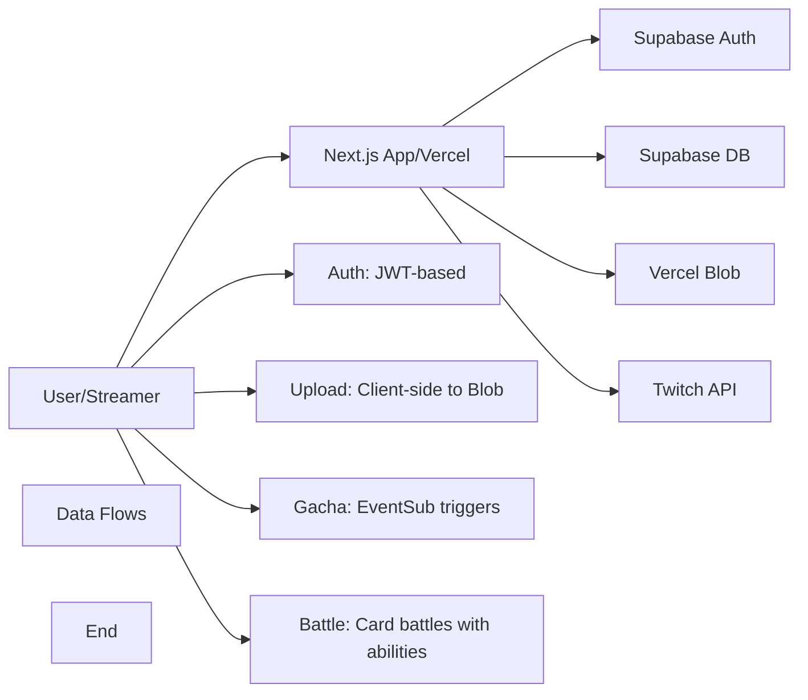

# TwiCa Architecture Document

## 概要

TwiCaはTwitch配信者向けのカードガチャシステムです。視聴者はチャンネルポイントを使ってガチャを引き、配信者が作成したオリジナルカードを収集できます。

---

## 機能要件

### 認証・認可
- Twitch OAuthによる配信者・視聴者認証
- Supabase Auth + カスタムCookieによるセッション管理
- 配信者は自身の配信者ページでのみカード管理が可能
- 視聴者は自分のカードとガチャ履歴のみ閲覧可能

### カード管理機能
- 配信者がカードを登録できる（名前、説明、画像URL、レアリティ、ドロップ率）
- カードの有効/無効切り替え
- カード画像はVercel Blob Storageに保存
- レアリティ: コモン、レア、エピック、レジェンダリー
- カード画像サイズ制限: 最大1MB

### ガチャ機能
- チャンネルポイントを使用したガチャシステム
- Twitch EventSubによるチャンネルポイント使用通知
- 重み付き確率によるカード選択
- ガチャ履歴の記録

### オーバーレイ表示
- ガチャ結果を配信画面にオーバーレイ表示
- ストリーマーIDごとのカスタマイズ可能な表示

### ダッシュボード機能
- 配信者ダッシュボード（カード管理、設定）
- 視聴者ダッシュボード（所持カード、ガチャ履歴）

---

## 非機能要件

### パフォーマンス
- APIレスポンス: 500ms以内（99パーセンタイル）
- ガチャ処理: 300ms以内
- 対戦処理: 1000ms以内
- 静的アセットのCDN配信（Vercel）
- データベースインデックスによるクエリ最適化

### セキュリティ
- HTTPSでの通信
- Supabase RLS (Row Level Security) による多層防御
- CSRF対策（SameSite=Lax Cookie + state検証）
- XSS対策（Reactの自動エスケープ）
- 環境変数によるシークレット管理
- セッション有効期限: 7日（Cookie + expiresAt検証）
- Twitch署名検証（EventSub Webhook）
- EventSubべき等性（event_idによる重複チェック）
- APIレート制限によるDoS攻撃対策
- 対戦の不正防止（ランダム性の確保）

### 可用性
- Vercelによる99.95% SLA
- Supabaseによる99.9% データベース可用性

### スケーラビリティ
- Vercel Serverless Functionsの自動スケーリング
- SupabaseのマネージドPostgreSQL（自動スケーリング）

---

## 受け入れ基準

### ユーザー認証
- [x] Twitch OAuthでログインできる
- [x] 配信者として認証される
- [x] 視聴者として認証される
- [x] ログアウトできる
- [x] セッション有効期限後に再認証が必要

### カード管理
- [x] カードを新規登録できる
- [x] カードを編集できる
- [x] カードを削除できる
- [x] カード画像をアップロードできる
- [x] カード画像サイズが1MB以下である
- [x] カードの有効/無効を切り替えられる
- [x] ドロップ率を設定できる（合計1.0以下）

### ガチャ機能
- [x] チャンネルポイントでガチャを引ける
- [x] ガチャ結果が正しく表示される
- [x] ドロップ率通りにカードが排出される
- [x] ガチャ履歴が記録される
- [x] 重みなしで同じ確率で排出される（全カードのドロップ率が等しい場合）

### オーバーレイ
- [x] ガチャ結果がOBS等のブラウザソースで表示できる
- [x] カード画像が正しく表示される
- [x] レアリティに応じた色が表示される

### データ整合性
- [x] RLSポリシーが正しく機能する
- [x] 配信者は自分のカードしか編集できない
- [x] 視聴者は自分のカードしか見れない
- [x] ガチャ履歴が正しく記録される

### APIレート制限（Issue #13）
- [x] `@upstash/ratelimit` と `@upstash/redis` をインストール
- [x] `src/lib/rate-limit.ts` を実装
- [x] 各 API ルートにレート制限を追加
- [x] 429 エラーが適切に返される
- [x] レート制限ヘッダーが設定される
- [x] 開発環境でインメモリレート制限が動作する
- [x] 本番環境で Redis レート制限が動作する
- [x] EventSub Webhook は緩いレート制限を持つ
- [x] 認証済みユーザーは twitchUserId で識別される
- [x] 未認証ユーザーは IP アドレスで識別される
- [x] フロントエンドで 429 エラーが適切に表示される

### カード対戦機能（Issue #15）
- [x] カードにステータス（HP、ATK、DEF、SPD）が追加される
- [x] 各カードにスキルが設定される
- [x] CPU対戦が可能
- [x] 自動ターン制バトルが動作する
- [x] 勝敗判定が正しく行われる
- [x] 対戦履歴が記録される
- [x] 対戦統計が表示される
- [x] フロントエンドで対戦が視覚的に楽しめる
- [x] アニメーション効果が表示される
- [x] モバイルで快適に操作可能

### 型安全性向上（Issue #17）
- [x] `any`型の使用が削除される
- [x] ESLintの`@typescript-eslint/no-explicit-any`警告が解消される
- [x] カード所有権の検証が正しく動作する
- [x] TypeScriptのコンパイルエラーがない
- [x] 既存のAPIテストがパスする

---

## 設計方針

### アーキテクチャパターン
- **クライアントサイド**: Next.js App Router + Server Components
- **サーバーサイド**: Vercel Serverless Functions
- **データストア**: Supabase (PostgreSQL)
- **ストレージ**: Vercel Blob
- **認証**: カスタムCookie + Twitch OAuth

### デザイン原則
1. **Simple over Complex**: 複雑さを最小限に抑える
2. **Type Safety**: TypeScriptによる厳格な型定義
3. **Separation of Concerns**: 機能ごとのモジュール分割
4. **Security First**: アプリケーション層での認証検証 + RLS（多層防御）

### 技術選定基準
- マネージドサービス優先（運用コスト削減）
- Next.jsエコシステムを活用（開発効率）
- カスタムセッションによる柔軟な認証管理

---

## アーキテクチャ

### システム全体図



---

## Issue #16: Middleware proxy update for Next.js 16

### 問題

Next.js 16で`middleware.ts`から`proxy.ts`への移行が推奨されています。

### 現象

Next.js 16のビルド時に以下の警告が出ています：
```
The "middleware" file convention is deprecated. Please use "proxy" instead.
```

### 影響

- ビルド時の警告により今後のバージョンで動作しなくなる可能性
- Next.js 16の新しいAPIへの移行が必要

### 優先度

低（機能への影響なし、次期対応）

---

## Issue #16: MiddlewareからProxyへの移行設計

### 機能要件

#### ファイル名の変更
- `src/middleware.ts` を `src/proxy.ts` にリネーム
- `export function middleware()` を `export function proxy()` に変更

#### 既存の動作維持
- APIルートに対するグローバルレート制限を維持
- セッション管理（Supabase middleware）を維持
- matcher設定を維持

### 設計

#### Next.js 16 Proxy APIの概要

Next.js 16では、`middleware.ts`というファイル名が非推奨となり、`proxy.ts`に変更されました。主な変更点は以下の通りです：

1. **ファイル名**: `middleware.ts` → `proxy.ts`
2. **エクスポート関数名**: `middleware` → `proxy`
3. **引数の型**: `NextRequest`のまま（変更なし）
4. **返り値の型**: `NextResponse`のまま（変更なし）

#### 実装方法

**オプション1: 手動移行**

```typescript
// src/proxy.ts
import { type NextRequest, NextResponse } from 'next/server'
import { updateSession } from '@/lib/supabase/middleware'
import { checkRateLimit, rateLimits, getClientIp } from '@/lib/rate-limit'

export function proxy(request: NextRequest) {
  // Apply global rate limiting to API routes
  if (request.nextUrl.pathname.startsWith('/api')) {
    const ip = getClientIp(request);
    
    // Global rate limit (IP-based)
    const identifier = `global:${ip}`;
    const rateLimitResult = await checkRateLimit(
      rateLimits.eventsub, // Use the most lenient limit for global
      identifier
    );
    
    if (!rateLimitResult.success) {
      return NextResponse.json(
        { error: 'Too many requests' },
        { 
          status: 429,
          headers: {
            'X-RateLimit-Limit': String(rateLimitResult.limit),
            'X-RateLimit-Remaining': String(rateLimitResult.remaining),
            'X-RateLimit-Reset': String(rateLimitResult.reset),
          },
        }
      );
    }
  }
  
  return await updateSession(request)
}

export const config = {
  matcher: [
    '/((?!_next/static|_next/image|favicon.ico|.*\\.(?:svg|png|jpg|jpeg|gif|webp)$).*)',
  ],
}
```

**オプション2: Codemodを使用（推奨）**

Next.jsが提供するcodemodを使用して自動的に移行できます：

```bash
npx @next/codemod@canary middleware-to-proxy .
```

codemodは以下の変更を自動的に行います：
1. ファイル名を `middleware.ts` → `proxy.ts` に変更
2. `export function middleware()` → `export function proxy()` に変更

#### Supabase Middlewareとの互換性

`@/lib/supabase/middleware.ts` 内の `updateSession` 関数は、`NextRequest` を引数として受け取るため、そのまま使用できます。変更は不要です。

### 変更ファイル

- `src/middleware.ts` → `src/proxy.ts` - ファイル名と関数名の変更

### 受け入れ基準

- [ ] `src/proxy.ts` が作成される
- [ ] `src/middleware.ts` が削除される
- [ ] `export function proxy()` が定義されている
- [ ] ビルド時の警告が解消される
- [ ] APIルートへのグローバルレート制限が正しく動作する
- [ ] セッション管理が正しく動作する
- [ ] 既存の統合テストがパスする

### テスト計画

1. **静的解析**:
   - TypeScript コンパイル
   - Next.js ビルド（警告の確認）

2. **統合テスト**:
   - APIルートへのアクセスでレート制限が動作する
   - セッション管理が正しく機能する
   - 認証が必要なページへのアクセスが制御される

3. **手動テスト**:
   - ログイン/ログアウトが正常に動作する
   - APIへの過剰なリクエストで429が返される
   - 配信者ダッシュボードにアクセスできる
   - 視聴者ダッシュボードにアクセスできる

### トレードオフの検討

#### 手動移行 vs Codemod

| 項目 | 手動移行 | Codemod |
|:---|:---|:---|
| **時間** | わずかに長い | 短い |
| **エラー** | 人為的なミスのリスク | 自動化により安全 |
| **可読性** | わかりやすい | ブラックボックス |
| **学習効果** | APIの理解が深まる | 自動化のみ |

**推奨**: Codemodを使用（時間効率と安全性の観点から）

#### 移行のタイミング

| 項目 | 今すぐ移行 | 後で移行 |
|:---|:---|:---|
| **リスク** | 低（機能への影響なし） | 将来のバージョンで動作しなくなる可能性 |
| **優先度** | 低（機能追加には影響なし） | テクニカルデットとして残る |
| **コスト** | 低（簡単な移行） | 高（後で大きな変更が必要になる可能性）|

**推奨**: 今すぐ移行（リスクとコストが低いため）

---

## 更新履歴

| 日付 | 変更内容 |
|:---|:---|
| 2026-01-17 | Issue #16 Middleware proxy update 設計追加 |
| 2026-01-17 | Issue #17 型安全性向上の設計追加（実装完了） |
| 2026-01-17 | Issue #15 カード対戦機能の設計追加（実装完了） |
| 2026-01-17 | APIルートのレート制限実装完了（Issue #13） |
