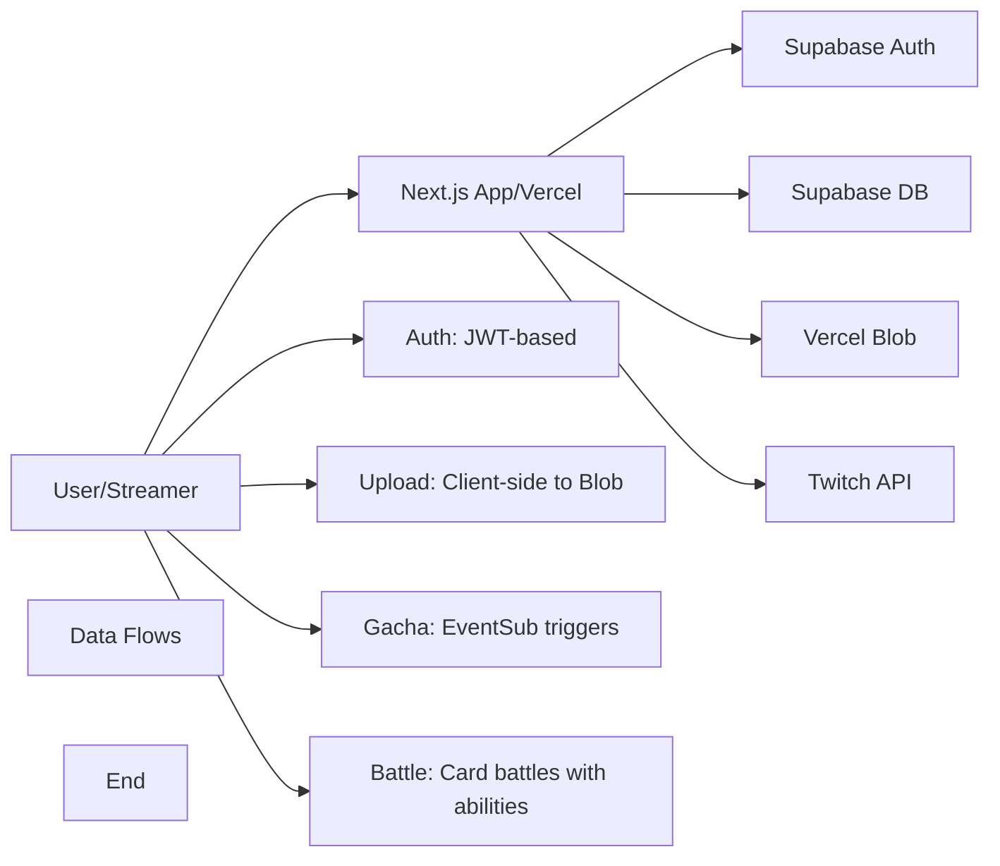

# TwiCa Architecture Document

## 概要

TwiCaはTwitch配信者向けのカードガチャシステムです。視聴者はチャンネルポイントを使ってガチャを引き、配信者が作成したオリジナルカードを収集できます。

---

## 機能要件

### 認証・認可
- Twitch OAuthによる配信者・視聴者認証
- Supabase Auth + カスタムCookieによるセッション管理
- 配信者は自身の配信者ページでのみカード管理が可能
- 視聴者は自分のカードとガチャ履歴のみ閲覧可能

### カード管理機能
- 配信者がカードを登録できる（名前、説明、画像URL、レアリティ、ドロップ率）
- カードの有効/無効切り替え
- カード画像はVercel Blob Storageに保存
- レアリティ: コモン、レア、エピック、レジェンダリー
- カード画像サイズ制限: 最大1MB

### ガチャ機能
- チャンネルポイントを使用したガチャシステム
- Twitch EventSubによるチャンネルポイント使用通知
- 重み付き確率によるカード選択
- ガチャ履歴の記録

### オーバーレイ表示
- ガチャ結果を配信画面にオーバーレイ表示
- ストリーマーIDごとのカスタマイズ可能な表示

### ダッシュボード機能
- 配信者ダッシュボード（カード管理、設定）
- 視聴者ダッシュボード（所持カード、ガチャ履歴）

---

## 非機能要件

### パフォーマンス
- APIレスポンス: 500ms以内（99パーセンタイル）
- ガチャ処理: 300ms以内
- 対戦処理: 1000ms以内
- 静的アセットのCDN配信（Vercel）
- データベースインデックスによるクエリ最適化

### セキュリティ
- HTTPSでの通信
- Supabase RLS (Row Level Security) による多層防御
- CSRF対策（SameSite=Lax Cookie + state検証）
- XSS対策（Reactの自動エスケープ）
- 環境変数によるシークレット管理
- セッション有効期限: 7日（Cookie + expiresAt検証）
- Twitch署名検証（EventSub Webhook）
- EventSubべき等性（event_idによる重複チェック）
- APIレート制限によるDoS攻撃対策
- 対戦の不正防止（ランダム性の確保）

### 可用性
- Vercelによる99.95% SLA
- Supabaseによる99.9% データベース可用性

### スケーラビリティ
- Vercel Serverless Functionsの自動スケーリング
- SupabaseのマネージドPostgreSQL（自動スケーリング）

---

## 受け入れ基準

### ユーザー認証
- [x] Twitch OAuthでログインできる
- [x] 配信者として認証される
- [x] 視聴者として認証される
- [x] ログアウトできる
- [x] セッション有効期限後に再認証が必要

### カード管理
- [x] カードを新規登録できる
- [x] カードを編集できる
- [x] カードを削除できる
- [x] カード画像をアップロードできる
- [x] カード画像サイズが1MB以下である
- [x] カードの有効/無効を切り替えられる
- [x] ドロップ率を設定できる（合計1.0以下）

### ガチャ機能
- [x] チャンネルポイントでガチャを引ける
- [x] ガチャ結果が正しく表示される
- [x] ドロップ率通りにカードが排出される
- [x] ガチャ履歴が記録される
- [x] 重みなしで同じ確率で排出される（全カードのドロップ率が等しい場合）

### オーバーレイ
- [x] ガチャ結果がOBS等のブラウザソースで表示できる
- [x] カード画像が正しく表示される
- [x] レアリティに応じた色が表示される

### データ整合性
- [x] RLSポリシーが正しく機能する
- [x] 配信者は自分のカードしか編集できない
- [x] 視聴者は自分のカードしか見れない
- [x] ガチャ履歴が正しく記録される

### APIレート制限（Issue #13）
- [x] `@upstash/ratelimit` と `@upstash/redis` をインストール
- [x] `src/lib/rate-limit.ts` を実装
- [x] 各 API ルートにレート制限を追加
- [x] 429 エラーが適切に返される
- [x] レート制限ヘッダーが設定される
- [x] 開発環境でインメモリレート制限が動作する
- [x] 本番環境で Redis レート制限が動作する
- [x] EventSub Webhook は緩いレート制限を持つ
- [x] 認証済みユーザーは twitchUserId で識別される
- [x] 未認証ユーザーは IP アドレスで識別される
- [x] フロントエンドで 429 エラーが適切に表示される

### カード対戦機能（Issue #15）
- [x] カードにステータス（HP、ATK、DEF、SPD）が追加される
- [x] 各カードにスキルが設定される
- [x] CPU対戦が可能
- [x] 自動ターン制バトルが動作する
- [x] 勝敗判定が正しく行われる
- [x] 対戦履歴が記録される
- [x] 対戦統計が表示される
- [x] フロントエンドで対戦が視覚的に楽しめる
- [x] アニメーション効果が表示される
- [x] モバイルで快適に操作可能

### 型安全性向上（Issue #17）
- [x] `any`型の使用が削除される
- [x] ESLintの`@typescript-eslint/no-explicit-any`警告が解消される
- [x] カード所有権の検証が正しく動作する
- [x] TypeScriptのコンパイルエラーがない
- [x] 既存のAPIテストがパスする

### APIエラーハンドリング標準化（Issue #18）
- [ ] すべてのAPIルートで標準化されたエラーハンドラーを使用する
- [ ] エラーメッセージがすべてのルートで一貫している
- [ ] 既存のAPIテストがパスする
- [ ] 手動テストでエラーハンドリングが正しく動作することを確認する
- [ ] 既存の機能に回帰がない

---

## 設計方針

### アーキテクチャパターン
- **クライアントサイド**: Next.js App Router + Server Components
- **サーバーサイド**: Vercel Serverless Functions
- **データストア**: Supabase (PostgreSQL)
- **ストレージ**: Vercel Blob
- **認証**: カスタムCookie + Twitch OAuth

### デザイン原則
1. **Simple over Complex**: 複雑さを最小限に抑える
2. **Type Safety**: TypeScriptによる厳格な型定義
3. **Separation of Concerns**: 機能ごとのモジュール分割
4. **Security First**: アプリケーション層での認証検証 + RLS（多層防御）
5. **Consistency**: コードベース全体で一貫性を維持

### 技術選定基準
- マネージドサービス優先（運用コスト削減）
- Next.jsエコシステムを活用（開発効率）
- カスタムセッションによる柔軟な認証管理

---

## アーキテクチャ

### システム全体図



---

## Issue #18: API Error Handling Standardization

### 問題

現在、APIルートでエラーハンドリングが一貫していません：

- 一部のルートでは `@/lib/error-handler` の `handleApiError` を使用（例: `src/app/api/gacha/route.ts`）
- ほとんどのルートでは `logger.error` を使用した手動エラーハンドリング（例: `src/app/api/cards/route.ts`, `src/app/api/upload/route.ts`, `src/app/api/battle/start/route.ts`）

この一貫性の欠如は、コードベースの保守を困難にし、バグのリスクを増加させます。

### 影響

- **保守性の低下**: エラーハンドリングの実装が分散しているため、変更や改善が困難
- **バグのリスク増加**: 一部のルートでエラーハンドリングが不十分な可能性
- **コードの一貫性欠如**: チームメンバーがどのエラーハンドリングパターンを使用すべきか判断するのが困難

### 優先度

中（コード品質と保守性の改善）

---

## Issue #18: API Error Handling Standardization Design

### 機能要件

#### 標準化されたエラーハンドリング
- すべてのAPIルートで `handleApiError` を使用
- データベースエラーには `handleDatabaseError` を使用
- エラーメッセージの一貫性を確保
- 既存の機能とエラーレスポンスを維持

### 設計

#### 現在のエラーハンドリング実装

**`src/lib/error-handler.ts`**:

```typescript
import { NextResponse } from 'next/server'
import { logger } from './logger'

export function handleApiError(error: unknown, context: string): Response {
  logger.error(`${context}:`, error)
  return NextResponse.json({ error: 'Internal server error' }, { status: 500 })
}

export function handleDatabaseError(error: unknown, context: string): Response {
  logger.error(`${context}:`, error)
  return NextResponse.json({ error: 'Database error' }, { status: 500 })
}
```

#### 現在の問題のある実装

**`src/app/api/cards/route.ts`**（手動エラーハンドリング）:

```typescript
try {
  // ... code ...
  if (error) {
    logger.error("Database error:", error);
    return NextResponse.json({ error: "Failed to create card" }, { status: 500 });
  }
  // ... code ...
} catch (error) {
  logger.error("Error creating card:", error);
  return NextResponse.json({ error: "Internal server error" }, { status: 500 });
}
```

**`src/app/api/gacha/route.ts`**（正しい標準化された実装）:

```typescript
try {
  // ... code ...
  return NextResponse.json(result.data);
} catch (error) {
  return handleApiError(error, "Gacha API");
}
```

#### 改善されたエラーハンドリング設計

**オプション1: 既存のエラーハンドラーを強化**

既存の `handleApiError` および `handleDatabaseError` をそのまま使用し、すべてのAPIルートで統一します。

利点:
- 既存の実装を再利用
- 変更が最小限
- シンプルでわかりやすい

**オプション2: エラーハンドラーの拡張**

エラーハンドラーを拡張して、より詳細なエラーコンテキストをサポートします。

```typescript
export function handleApiError(
  error: unknown,
  context: string,
  options?: {
    statusCode?: number
    message?: string
    includeDetails?: boolean
  }
): Response {
  logger.error(`${context}:`, error)
  
  const statusCode = options?.statusCode ?? 500
  const message = options?.message ?? 'Internal server error'
  
  return NextResponse.json(
    { 
      error: message,
      ...(options?.includeDetails && { details: error instanceof Error ? error.message : String(error) })
    }, 
    { status: statusCode }
  )
}
```

利点:
- より柔軟なエラーハンドリング
- 開発環境での詳細なエラー情報の表示
- 本番環境での簡略化されたエラーメッセージ

**推奨**: オプション1（シンプルさと既存コードの再利用）

#### 実装方法

1. **`src/app/api/cards/route.ts`の更新**:

```typescript
import { handleApiError, handleDatabaseError } from '@/lib/error-handler'

export async function POST(request: NextRequest) {
  // ... code ...
  
  try {
    const { data: card, error } = await supabaseAdmin
      .from("cards")
      .insert({ /* ... */ })
      .select()
      .single()

    if (error) {
      return handleDatabaseError(error, "Failed to create card")
    }

    return NextResponse.json(card);
  } catch (error) {
    return handleApiError(error, "Cards API: POST")
  }
}

export async function GET(request: NextRequest) {
  // ... code ...
  
  try {
    const { data: cards, error } = await supabaseAdmin
      .from("cards")
      .select("*")
      .eq("streamer_id", streamerId)
      .eq("is_active", true)
      .order("created_at", { ascending: false })

    if (error) {
      return handleDatabaseError(error, "Failed to fetch cards")
    }

    return NextResponse.json(cards);
  } catch (error) {
    return handleApiError(error, "Cards API: GET")
  }
}
```

2. **`src/app/api/upload/route.ts`の更新**:

```typescript
import { handleApiError } from '@/lib/error-handler'

export async function POST(request: NextRequest): Promise<NextResponse> {
  // ... code ...
  
  try {
    // ... validation ...
    
    const blob = await put(fileName, file, {
      access: 'public',
    });

    return NextResponse.json({ url: blob.url });
  } catch (error) {
    return handleApiError(error, "Upload API");
  }
}
```

3. **`src/app/api/battle/start/route.ts`の更新**:

```typescript
import { handleApiError, handleDatabaseError } from '@/lib/error-handler'

export async function POST(request: NextRequest) {
  try {
    // ... code ...
    
    const { data: userData, error: userError } = await supabaseAdmin
      .from('users')
      .select('*')
      .eq('twitch_user_id', session.twitchUserId)
      .single()

    if (userError || !userData) {
      return handleDatabaseError(userError ?? new Error('User not found'), "Failed to fetch user data")
    }

    // ... more code ...
    
    const { data: battleData, error: battleError } = await supabaseAdmin
      .from('battles')
      .insert({ /* ... */ })
      .select()
      .single()

    if (battleError) {
      return handleDatabaseError(battleError, "Failed to save battle")
    }

    return NextResponse.json({ /* ... */ })
  } catch (error) {
    return handleApiError(error, "Battle Start API")
  }
}
```

### 変更ファイル

- `src/app/api/cards/route.ts` - エラーハンドリングの標準化
- `src/app/api/upload/route.ts` - エラーハンドリングの標準化
- `src/app/api/battle/start/route.ts` - エラーハンドリングの標準化
- `src/app/api/battle/stats/route.ts` - エラーハンドリングの標準化
- `src/app/api/battle/[battleId]/route.ts` - エラーハンドリングの標準化
- `src/app/api/cards/[id]/route.ts` - エラーハンドリングの標準化
- `src/app/api/user-cards/route.ts` - エラーハンドリングの標準化
- `src/app/api/gacha-history/[id]/route.ts` - エラーハンドリングの標準化
- `src/app/api/twitch/eventsub/subscribe/route.ts` - エラーハンドリングの標準化
- `src/app/api/twitch/rewards/route.ts` - エラーハンドリングの標準化
- `src/app/api/twitch/eventsub/route.ts` - エラーハンドリングの標準化
- `src/app/api/auth/logout/route.ts` - エラーハンドリングの標準化
- `src/app/api/auth/twitch/callback/route.ts` - エラーハンドリングの標準化
- `src/app/api/auth/twitch/login/route.ts` - エラーハンドリングの標準化
- `src/app/api/streamer/settings/route.ts` - エラーハンドリングの標準化
- `src/app/api/session/route.ts` - エラーハンドリングの標準化

### 受け入れ基準

- [ ] すべてのAPIルートで標準化されたエラーハンドラーを使用している
- [ ] エラーメッセージがすべてのルートで一貫している
- [ ] 既存のAPIテストがパスする
- [ ] 手動テストでエラーハンドリングが正しく動作することを確認する
- [ ] 既存の機能に回帰がない
- [ ] TypeScriptコンパイルエラーがない
- [ ] ESLintエラーがない

### テスト計画

1. **静的解析**:
   - TypeScript コンパイル
   - ESLintチェック

2. **ユニットテスト**:
   - 既存のユニットテストがパスする

3. **統合テスト**:
   - APIルートへのアクセスでエラーが正しく処理される
   - データベースエラーが正しく処理される
   - エラーレスポンスが一貫している

4. **手動テスト**:
   - 各APIルートでエラーが発生した場合、正しいエラーレスポンスが返される
   - ログに適切なエラー情報が記録される
   - ユーザーに適切なエラーメッセージが表示される

### トレードオフの検討

#### 手動エラーハンドリング vs 標準化されたエラーハンドラー

| 項目 | 手動エラーハンドリング | 標準化されたエラーハンドラー |
|:---|:---|:---|
| **一貫性** | 低（ルートごとに異なる） | 高（統一された実装） |
| **保守性** | 低（変更が分散） | 高（一箇所で変更） |
| **バグのリスク** | 高（実装の不備） | 低（テスト済みの実装） |
| **柔軟性** | 高（ルートごとにカスタマイズ可） | 中（オプションで対応可能） |
| **学習曲線** | 低（シンプルな実装） | 中（新しいパターンの学習） |

**推奨**: 標準化されたエラーハンドラー（一貫性と保守性の観点から）

#### オプション1 vs オプション2

| 項目 | オプション1（既存） | オプション2（拡張） |
|:---|:---|:---|
| **複雑性** | 低（シンプル） | 中（柔軟性追加） |
| **変更量** | 最小限 | 中 |
| **保守性** | 高（シンプル） | 中（複雑性追加） |
| **柔軟性** | 低 | 高 |
| **学習曲線** | 低 | 中 |

**推奨**: オプション1（シンプルさと既存コードの再用の観点から）

---

## 更新履歴

| 日付 | 変更内容 |
|:---|:---|
| 2026-01-17 | Issue #18 API Error Handling Standardization 設計追加 |
| 2026-01-17 | Issue #16 Middleware proxy update 実装完了 |
| 2026-01-17 | Issue #17 型安全性向上の設計追加（実装完了） |
| 2026-01-17 | Issue #15 カード対戦機能の設計追加（実装完了） |
| 2026-01-17 | APIルートのレート制限実装完了（Issue #13） |
