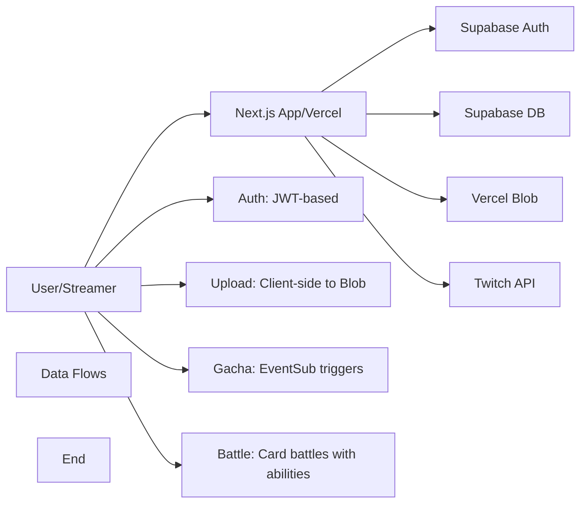

# TwiCa Architecture Document

## 概要

TwiCaはTwitch配信者向けのカードガチャシステムです。視聴者はチャンネルポイントを使ってガチャを引き、配信者が作成したオリジナルカードを収集できます。

---

## 機能要件

### 認証・認可
- Twitch OAuthによる配信者・視聴者認証
- Supabase Auth + カスタムCookieによるセッション管理
- 配信者は自身の配信者ページでのみカード管理が可能
- 視聴者は自分のカードとガチャ履歴のみ閲覧可能

### カード管理機能
- 配信者がカードを登録できる（名前、説明、画像URL、レアリティ、ドロップ率）
- カードの有効/無効切り替え
- カード画像はVercel Blob Storageに保存
- レアリティ: コモン、レア、エピック、レジェンダリー
- カード画像サイズ制限: 最大1MB

### ガチャ機能
- チャンネルポイントを使用したガチャシステム
- Twitch EventSubによるチャンネルポイント使用通知
- 重み付き確率によるカード選択
- ガチャ履歴の記録

### オーバーレイ表示
- ガチャ結果を配信画面にオーバーレイ表示
- ストリーマーIDごとのカスタマイズ可能な表示

### ダッシュボード機能
- 配信者ダッシュボード（カード管理、設定）
- 視聴者ダッシュボード（所持カード、ガチャ履歴）

---

## 非機能要件

### パフォーマンス
- APIレスポンス: 500ms以内（99パーセンタイル）
- ガチャ処理: 300ms以内
- 対戦処理: 1000ms以内
- 静的アセットのCDN配信（Vercel）
- データベースインデックスによるクエリ最適化

### セキュリティ
- HTTPSでの通信
- Supabase RLS (Row Level Security) による多層防御
- CSRF対策（SameSite=Lax Cookie + state検証）
- XSS対策（Reactの自動エスケープ）
- 環境変数によるシークレット管理
- セッション有効期限: 7日（Cookie + expiresAt検証）
- Twitch署名検証（EventSub Webhook）
- EventSubべき等性（event_idによる重複チェック）
- APIレート制限によるDoS攻撃対策
- 対戦の不正防止（ランダム性の確保）

### 可用性
- Vercelによる99.95% SLA
- Supabaseによる99.9% データベース可用性

### スケーラビリティ
- Vercel Serverless Functionsの自動スケーリング
- SupabaseのマネージドPostgreSQL（自動スケーリング）

---

## 受け入れ基準

### ユーザー認証
- [x] Twitch OAuthでログインできる
- [x] 配信者として認証される
- [x] 視聴者として認証される
- [x] ログアウトできる
- [x] セッション有効期限後に再認証が必要
- [ ] Twitchログイン時のエラーが適切にハンドリングされる（Issue #19）

### カード管理
- [x] カードを新規登録できる
- [x] カードを編集できる
- [x] カードを削除できる
- [x] カード画像をアップロードできる
- [x] カード画像サイズが1MB以下である
- [x] カードの有効/無効を切り替えられる
- [x] ドロップ率を設定できる（合計1.0以下）

### ガチャ機能
- [x] チャンネルポイントでガチャを引ける
- [x] ガチャ結果が正しく表示される
- [x] ドロップ率通りにカードが排出される
- [x] ガチャ履歴が記録される
- [x] 重みなしで同じ確率で排出される（全カードのドロップ率が等しい場合）

### オーバーレイ
- [x] ガチャ結果がOBS等のブラウザソースで表示できる
- [x] カード画像が正しく表示される
- [x] レアリティに応じた色が表示される

### データ整合性
- [x] RLSポリシーが正しく機能する
- [x] 配信者は自分のカードしか編集できない
- [x] 視聴者は自分のカードしか見れない
- [x] ガチャ履歴が正しく記録される

### APIレート制限（Issue #13）
- [x] `@upstash/ratelimit` と `@upstash/redis` をインストール
- [x] `src/lib/rate-limit.ts` を実装
- [x] 各 API ルートにレート制限を追加
- [x] 429 エラーが適切に返される
- [x] レート制限ヘッダーが設定される
- [x] 開発環境でインメモリレート制限が動作する
- [x] 本番環境で Redis レート制限が動作する
- [x] EventSub Webhook は緩いレート制限を持つ
- [x] 認証済みユーザーは twitchUserId で識別される
- [x] 未認証ユーザーは IP アドレスで識別される
- [x] フロントエンドで 429 エラーが適切に表示される

### カード対戦機能（Issue #15）
- [x] カードにステータス（HP、ATK、DEF、SPD）が追加される
- [x] 各カードにスキルが設定される
- [x] CPU対戦が可能
- [x] 自動ターン制バトルが動作する
- [x] 勝敗判定が正しく行われる
- [x] 対戦履歴が記録される
- [x] 対戦統計が表示される
- [x] フロントエンドで対戦が視覚的に楽しめる
- [x] アニメーション効果が表示される
- [x] モバイルで快適に操作可能

### 型安全性向上（Issue #17）
- [x] `any`型の使用が削除される
- [x] ESLintの`@typescript-eslint/no-explicit-any`警告が解消される
- [x] カード所有権の検証が正しく動作する
- [x] TypeScriptのコンパイルエラーがない
- [x] 既存のAPIテストがパスする

### APIエラーハンドリング標準化（Issue #18）
- [x] すべてのAPIルートで標準化されたエラーハンドラーを使用する
- [x] エラーメッセージがすべてのルートで一貫している
- [x] 既存のAPIテストがパスする
- [x] 手動テストでエラーハンドリングが正しく動作することを確認する
- [x] 既存の機能に回帰がない

---

## 設計方針

### アーキテクチャパターン
- **クライアントサイド**: Next.js App Router + Server Components
- **サーバーサイド**: Vercel Serverless Functions
- **データストア**: Supabase (PostgreSQL)
- **ストレージ**: Vercel Blob
- **認証**: カスタムCookie + Twitch OAuth

### デザイン原則
1. **Simple over Complex**: 複雑さを最小限に抑える
2. **Type Safety**: TypeScriptによる厳格な型定義
3. **Separation of Concerns**: 機能ごとのモジュール分割
4. **Security First**: アプリケーション層での認証検証 + RLS（多層防御）
5. **Consistency**: コードベース全体で一貫性を維持
6. **Error Handling**: ユーザーにわかりやすいエラーメッセージを提供

### 技術選定基準
- マネージドサービス優先（運用コスト削減）
- Next.jsエコシステムを活用（開発効率）
- カスタムセッションによる柔軟な認証管理

---

## アーキテクチャ

### システム全体図



---

## Issue #19: Twitchログイン時のエラー改善

### 問題

Twitchログイン時にInternal Server Error（500）が発生していますが、ユーザーには詳細なエラー情報が提供されていません。現在のエラーハンドラーはすべてのエラーに対して"Internal server error"という汎用的なメッセージのみを返します。

**現在の問題点**:

1. エラーの原因が特定できない
   - Twitch APIの失敗か、データベースエラーか、環境変数の欠落か不明
   - デバッグが困難

2. ユーザーエクスペリエンスの低下
   - ユーザーは何が問題なのか理解できない
   - 再試行すべきか、連絡すべきかわからない

3. 運用上の問題
   - エラーログは記録されるが、ユーザーにはフィードバックがない
   - 開発者はエラーの詳細を把握するためにログを確認する必要がある

### 優先度

高（ユーザーエクスペリエンスとデバッグ効率の改善）

---

## Issue #19: 設計

### 機能要件

#### 改善されたエラーハンドリング

1. **Twitch Auth Callback API**での詳細なエラーハンドリング
   - Twitch APIエラーを区別して処理
   - データベースエラーを区別して処理
   - 環境変数の欠落を検出
   - バリデーションエラーを適切に処理

2. **ユーザーへのわかりやすいエラーメッセージ**
   - エラーの種類に応じて適切なメッセージを表示
   - 必要に応じて再試行を促す
   - 重要なエラーではサポート連絡を推奨

3. **エラーログの強化**
   - エラーの詳細情報をログに記録
   - ユーザーID、リクエストIDなどのコンテキスト情報を含む
   - スタックトレースを記録（開発環境）

### 設計

#### エラータイプの分類

```typescript
enum AuthErrorType {
  // Twitch APIエラー
  TWITCH_AUTH_FAILED = 'twitch_auth_failed',
  TWITCH_USER_FETCH_FAILED = 'twitch_user_fetch_failed',
  
  // データベースエラー
  DATABASE_ERROR = 'database_error',
  DATABASE_CONNECTION_FAILED = 'database_connection_failed',
  
  // 環境変数エラー
  MISSING_ENV_VAR = 'missing_env_var',
  
  // バリデーションエラー
  INVALID_STATE = 'invalid_state',
  MISSING_PARAMS = 'missing_params',
  
  // その他のエラー
  UNKNOWN_ERROR = 'unknown_error',
}
```

#### 改善されたエラーハンドラー

**新しいファイル: `src/lib/auth-error-handler.ts`**

```typescript
import { NextResponse } from 'next/server'
import { logger } from './logger'

interface AuthErrorDetails {
  type: string
  message: string
  statusCode: number
  userMessage: string
  shouldLog: boolean
}

const AUTH_ERROR_MAP: Record<string, AuthErrorDetails> = {
  twitch_auth_failed: {
    type: 'twitch_auth_failed',
    message: 'Twitch authentication failed',
    statusCode: 500,
    userMessage: 'Twitchとの認証に失敗しました。しばらく待ってから再度お試しください。',
    shouldLog: true,
  },
  twitch_user_fetch_failed: {
    type: 'twitch_user_fetch_failed',
    message: 'Failed to fetch Twitch user data',
    statusCode: 500,
    userMessage: 'ユーザー情報の取得に失敗しました。しばらく待ってから再度お試しください。',
    shouldLog: true,
  },
  database_error: {
    type: 'database_error',
    message: 'Database operation failed',
    statusCode: 500,
    userMessage: 'データベースエラーが発生しました。しばらく待ってから再度お試しください。',
    shouldLog: true,
  },
  database_connection_failed: {
    type: 'database_connection_failed',
    message: 'Failed to connect to database',
    statusCode: 500,
    userMessage: 'サーバーでエラーが発生しました。管理者にお問い合わせください。',
    shouldLog: true,
  },
  missing_env_var: {
    type: 'missing_env_var',
    message: 'Missing required environment variables',
    statusCode: 500,
    userMessage: 'サーバー設定エラーが発生しました。管理者にお問い合わせください。',
    shouldLog: true,
  },
  invalid_state: {
    type: 'invalid_state',
    message: 'Invalid OAuth state parameter',
    statusCode: 400,
    userMessage: '認証セッションが無効です。再度ログインしてください。',
    shouldLog: false,
  },
  missing_params: {
    type: 'missing_params',
    message: 'Missing required OAuth parameters',
    statusCode: 400,
    userMessage: '必要なパラメータが不足しています。再度ログインしてください。',
    shouldLog: false,
  },
  unknown_error: {
    type: 'unknown_error',
    message: 'Unknown error occurred',
    statusCode: 500,
    userMessage: '予期しないエラーが発生しました。しばらく待ってから再度お試しください。',
    shouldLog: true,
  },
}

export function handleAuthError(
  error: unknown,
  errorType: string,
  context?: Record<string, unknown>
): NextResponse {
  const errorDetails = AUTH_ERROR_MAP[errorType] || AUTH_ERROR_MAP.unknown_error
  
  if (errorDetails.shouldLog) {
    logger.error(`${errorDetails.message}:`, {
      error,
      errorType,
      context,
      stack: error instanceof Error ? error.stack : undefined,
    })
  }

  return NextResponse.redirect(
    `${process.env.NEXT_PUBLIC_APP_URL}/?error=${encodeURIComponent(errorDetails.userMessage)}`
  )
}
```

#### 更新された Twitch Auth Callback

**ファイル: `src/app/api/auth/twitch/callback/route.ts`**

```typescript
import { NextRequest, NextResponse } from 'next/server'
import { cookies } from 'next/headers'
import { exchangeCodeForTokens, getTwitchUser } from '@/lib/twitch/auth'
import { getSupabaseAdmin } from '@/lib/supabase/admin'
import { COOKIE_NAMES } from '@/lib/constants'
import { checkRateLimit, rateLimits, getClientIp } from '@/lib/rate-limit'
import { handleAuthError } from '@/lib/auth-error-handler'

export async function GET(request: NextRequest) {
  const ip = getClientIp(request)
  const identifier = `ip:${ip}`
  const rateLimitResult = await checkRateLimit(rateLimits.authCallback, identifier)

  if (!rateLimitResult.success) {
    return NextResponse.redirect(
      `${process.env.NEXT_PUBLIC_APP_URL}/?error=${encodeURIComponent('リクエストが多すぎます。しばらく待ってから再試行してください。')}`
    )
  }

  const searchParams = request.nextUrl.searchParams
  const code = searchParams.get('code')
  const state = searchParams.get('state')
  const error = searchParams.get('error')

  if (error) {
    return NextResponse.redirect(
      `${process.env.NEXT_PUBLIC_APP_URL}/?error=${encodeURIComponent(error)}`
    )
  }

  if (!code || !state) {
    return handleAuthError(
      new Error('Missing OAuth parameters'),
      'missing_params',
      { code: !!code, state: !!state }
    )
  }

  const cookieStore = await cookies()
  const storedState = cookieStore.get('twitch_auth_state')?.value

  if (!storedState || state !== storedState) {
    return handleAuthError(
      new Error('Invalid state parameter'),
      'invalid_state',
      { storedState: !!storedState, stateMatch: storedState === state }
    )
  }

  try {
    const supabaseAdmin = getSupabaseAdmin()
    const redirectUri = `${process.env.NEXT_PUBLIC_APP_URL}/api/auth/twitch/callback`
    
    let tokens
    try {
      tokens = await exchangeCodeForTokens(code, redirectUri)
    } catch (error) {
      return handleAuthError(
        error,
        'twitch_auth_failed',
        { code: code.substring(0, 10) + '...' }
      )
    }

    let twitchUser
    try {
      twitchUser = await getTwitchUser(tokens.access_token)
    } catch (error) {
      return handleAuthError(
        error,
        'twitch_user_fetch_failed',
        { twitchUserId: tokens.access_token.substring(0, 10) + '...' }
      )
    }

    const canBeStreamer = twitchUser.broadcaster_type === 'affiliate' || twitchUser.broadcaster_type === 'partner'

    try {
      await supabaseAdmin
        .from('users')
        .upsert({
          twitch_user_id: twitchUser.id,
          twitch_username: twitchUser.login,
          twitch_display_name: twitchUser.display_name,
          twitch_profile_image_url: twitchUser.profile_image_url,
        }, {
          onConflict: 'twitch_user_id',
        })
    } catch (error) {
      return handleAuthError(
        error,
        'database_error',
        { operation: 'upsert_user', twitchUserId: twitchUser.id }
      )
    }

    if (canBeStreamer) {
      try {
        await supabaseAdmin
          .from('streamers')
          .upsert({
            twitch_user_id: twitchUser.id,
            twitch_username: twitchUser.login,
            twitch_display_name: twitchUser.display_name,
            twitch_profile_image_url: twitchUser.profile_image_url,
          }, {
            onConflict: 'twitch_user_id',
          })
      } catch (error) {
        return handleAuthError(
          error,
          'database_error',
          { operation: 'upsert_streamer', twitchUserId: twitchUser.id }
        )
      }
    }

    const SESSION_DURATION = 7 * 24 * 60 * 60 * 1000
    const sessionData = JSON.stringify({
      twitchUserId: twitchUser.id,
      twitchUsername: twitchUser.login,
      twitchDisplayName: twitchUser.display_name,
      twitchProfileImageUrl: twitchUser.profile_image_url,
      broadcasterType: twitchUser.broadcaster_type,
      expiresAt: Date.now() + SESSION_DURATION,
    })

    cookieStore.set(COOKIE_NAMES.SESSION, sessionData, {
      httpOnly: true,
      secure: process.env.NODE_ENV === 'production',
      sameSite: 'lax',
      path: '/',
      maxAge: 60 * 60 * 24 * 7,
    })

    cookieStore.delete('twitch_auth_state')

    return NextResponse.redirect(`${process.env.NEXT_PUBLIC_APP_URL}/dashboard`)
  } catch (error) {
    return handleAuthError(error, 'unknown_error')
  }
}
```

#### フロントエンドでのエラー表示の改善

**ファイル: `src/app/page.tsx` (またはエラー表示コンポーネント)**

既存のエラー表示ロジックを維持しつつ、よりユーザーフレンドリーなメッセージを表示する。

### 変更ファイル

- `src/lib/auth-error-handler.ts` (新規作成)
- `src/app/api/auth/twitch/callback/route.ts` (更新)
- `src/app/api/auth/twitch/login/route.ts` (更新 - 必要に応じて)

### 受け入れ基準

- [ ] Twitchログイン時にエラーが発生した場合、ユーザーにわかりやすいエラーメッセージが表示される
- [ ] エラーの種類に応じて適切なメッセージが表示される
- [ ] エラーの詳細情報がログに記録される
- [ ] 正常なログインフローが引き続き動作する
- [ ] テストで各エラーケースがカバーされる
- [ ] TypeScriptコンパイルエラーがない
- [ ] ESLintエラーがない

### テスト計画

1. **単体テスト**:
   - `handleAuthError`関数の各エラータイプをテスト
   - エラーメッセージが正しく生成されることを確認

2. **統合テスト**:
   - Twitch APIエラー時の挙動を確認
   - データベースエラー時の挙動を確認
   - 環境変数欠落時の挙動を確認

3. **手動テスト**:
   - 正常なログインフローが動作する
   - エラー時に適切なメッセージが表示される
   - ログにエラー情報が記録される

### トレードオフの検討

#### エラーメッセージの詳細度

| 項目 | 詳細なエラーメッセージ | 簡略化されたエラーメッセージ |
|:---|:---|:---|
| **ユーザー理解度** | 高（何が問題かわかる） | 低（不明瞭） |
| **セキュリティ** | 低（内部情報漏洩のリスク） | 高（情報を隠蔽） |
| **デバッグ効率** | 高（原因が特定しやすい） | 低（ログ確認が必要） |
| **ユーザーエクスペリエンス** | 高（適切なアクションが可能） | 低（フラストレーション） |

**推奨**: 詳細なエラーメッセージ（ただしセキュリティ上の考慮が必要）

#### セキュリティ上の考慮

- 詳細なエラーメッセージには以下を含めない:
  - パスワード、トークンなどの機密情報
  - データベーススキーマ情報
  - サーバー内部構造情報
- ログには詳細情報を記録するが、ユーザーにはサニタイズされたメッセージを表示する

#### 保守性

| 項目 | 集中的なエラーハンドラー | 分散的なエラーハンドリング |
|:---|:---|:---|
| **一貫性** | 高 | 低 |
| **保守性** | 高（一箇所で変更） | 低（複数箇所で変更） |
| **柔軟性** | 中 | 高 |
| **学習曲線** | 中 | 低 |

**推奨**: 集中的なエラーハンドラー（一貫性と保守性の観点から）

---

## 更新履歴

| 日付 | 変更内容 |
|:---|:---|
| 2026-01-17 | Issue #19 Twitchログイン時のエラー改善の設計追加 |
| 2026-01-17 | Issue #18 API Error Handling Standardization 実装完了・Issue閉鎖 |
| 2026-01-17 | Issue #16 Middleware proxy update 実装完了 |
| 2026-01-17 | Issue #17 型安全性向上の設計追加（実装完了） |
| 2026-01-17 | Issue #15 カード対戦機能の設計追加（実装完了） |
| 2026-01-17 | APIルートのレート制限実装完了（Issue #13） |
