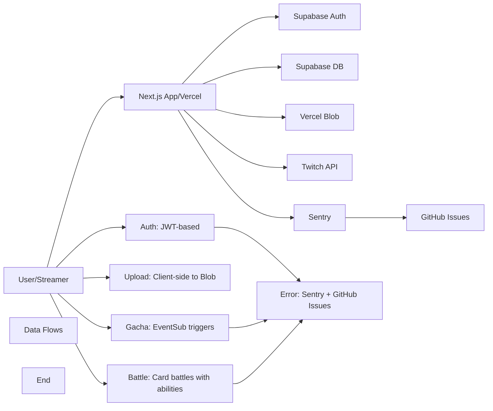

# TwiCa Architecture Document

## 概要

TwiCaはTwitch配信者向けのカードガチャシステムです。視聴者はチャンネルポイントを使ってガチャを引き、配信者が作成したオリジナルカードを収集できます。

---

## 機能要件

### 認証・認可
- Twitch OAuthによる配信者・視聴者認証
- Supabase Auth + カスタムCookieによるセッション管理
- 配信者は自身の配信者ページでのみカード管理が可能
- 視聴者は自分のカードとガチャ履歴のみ閲覧可能

### カード管理機能
- 配信者がカードを登録できる（名前、説明、画像URL、レアリティ、ドロップ率）
- カードの有効/無効切り替え
- カード画像はVercel Blob Storageに保存
- レアリティ: コモン、レア、エピック、レジェンダリー
- カード画像サイズ制限: 最大1MB

### ガチャ機能
- チャンネルポイントを使用したガチャシステム
- Twitch EventSubによるチャンネルポイント使用通知
- 重み付き確率によるカード選択
- ガチャ履歴の記録

### オーバーレイ表示
- ガチャ結果を配信画面にオーバーレイ表示
- ストリーマーIDごとのカスタマイズ可能な表示

### ダッシュボード機能
- 配信者ダッシュボード（カード管理、設定）
- 視聴者ダッシュボード（所持カード、ガチャ履歴）

---

## 非機能要件

### パフォーマンス
- APIレスポンス: 500ms以内（99パーセンタイル）
- ガチャ処理: 300ms以内
- 対戦処理: 1000ms以内
- 静的アセットのCDN配信（Vercel）
- データベースインデックスによるクエリ最適化

### セキュリティ
- HTTPSでの通信
- Supabase RLS (Row Level Security) による多層防御
- CSRF対策（SameSite=Lax Cookie + state検証）
- XSS対策（Reactの自動エスケープ）
- 環境変数によるシークレット管理
- セッション有効期限: 7日（Cookie + expiresAt検証）
- Twitch署名検証（EventSub Webhook）
- EventSubべき等性（event_idによる重複チェック）
- APIレート制限によるDoS攻撃対策
- 対戦の不正防止（ランダム性の確保）

### 可用性
- Vercelによる99.95% SLA
- Supabaseによる99.9% データベース可用性

### スケーラビリティ
- Vercel Serverless Functionsの自動スケーリング
- SupabaseのマネージドPostgreSQL（自動スケーリング）

---

## 受け入れ基準

### ユーザー認証
- [x] Twitch OAuthでログインできる
- [x] 配信者として認証される
- [x] 視聴者として認証される
- [x] ログアウトできる
- [x] セッション有効期限後に再認証が必要
- [x] Twitchログイン時のエラーが適切にハンドリングされる（Issue #19 - 解決済み）

### カード管理
- [x] カードを新規登録できる
- [x] カードを編集できる
- [x] カードを削除できる
- [x] カード画像をアップロードできる
- [x] カード画像サイズが1MB以下である
- [x] カードの有効/無効を切り替えられる
- [x] ドロップ率を設定できる（合計1.0以下）

### ガチャ機能
- [x] チャンネルポイントでガチャを引ける
- [x] ガチャ結果が正しく表示される
- [x] ドロップ率通りにカードが排出される
- [x] ガチャ履歴が記録される
- [x] 重みなしで同じ確率で排出される（全カードのドロップ率が等しい場合）

### オーバーレイ
- [x] ガチャ結果がOBS等のブラウザソースで表示できる
- [x] カード画像が正しく表示される
- [x] レアリティに応じた色が表示される

### データ整合性
- [x] RLSポリシーが正しく機能する
- [x] 配信者は自分のカードしか編集できない
- [x] 視聴者は自分のカードしか見れない
- [x] ガチャ履歴が正しく記録される

### APIレート制限（Issue #13）
- [x] `@upstash/ratelimit` と `@upstash/redis` をインストール
- [x] `src/lib/rate-limit.ts` を実装
- [x] 各 API ルートにレート制限を追加
- [x] 429 エラーが適切に返される
- [x] レート制限ヘッダーが設定される
- [x] 開発環境でインメモリレート制限が動作する
- [x] 本番環境で Redis レート制限が動作する
- [x] EventSub Webhook は緩いレート制限を持つ
- [x] 認証済みユーザーは twitchUserId で識別される
- [x] 未認証ユーザーは IP アドレスで識別される
- [x] フロントエンドで 429 エラーが適切に表示される

### カード対戦機能（Issue #15）
- [x] カードにステータス（HP、ATK、DEF、SPD）が追加される
- [x] 各カードにスキルが設定される
- [x] CPU対戦が可能
- [x] 自動ターン制バトルが動作する
- [x] 勝敗判定が正しく行われる
- [x] 対戦履歴が記録される
- [x] 対戦統計が表示される
- [x] フロントエンドで対戦が視覚的に楽しめる
- [x] アニメーション効果が表示される
- [x] モバイルで快適に操作可能

### 型安全性向上（Issue #17）
- [x] `any`型の使用が削除される
- [x] ESLintの`@typescript-eslint/no-explicit-any`警告が解消される
- [x] カード所有権の検証が正しく動作する
- [x] TypeScriptのコンパイルエラーがない
- [x] 既存のAPIテストがパスする

### APIエラーハンドリング標準化（Issue #18）
- [x] すべてのAPIルートで標準化されたエラーハンドラーを使用する
- [x] エラーメッセージがすべてのルートで一貫している
- [x] 既存のAPIテストがパスする
- [x] 手動テストでエラーハンドリングが正しく動作することを確認する
- [x] 既存の機能に回帰がない

---

## 設計方針

### アーキテクチャパターン
- **クライアントサイド**: Next.js App Router + Server Components
- **サーバーサイド**: Vercel Serverless Functions
- **データストア**: Supabase (PostgreSQL)
- **ストレージ**: Vercel Blob
- **認証**: カスタムCookie + Twitch OAuth
- **エラートラッキング**: Sentry + GitHub Issues自動化

### デザイン原則
1. **Simple over Complex**: 複雑さを最小限に抑える
2. **Type Safety**: TypeScriptによる厳格な型定義
3. **Separation of Concerns**: 機能ごとのモジュール分割
4. **Security First**: アプリケーション層での認証検証 + RLS（多層防御）
5. **Consistency**: コードベース全体で一貫性を維持
6. **Error Handling**: ユーザーにわかりやすいエラーメッセージを提供
7. **Observability**: エラー追跡と自動イシュー作成により運用効率を向上

### 技術選定基準
- マネージドサービス優先（運用コスト削減）
- Next.jsエコシステムを活用（開発効率）
- カスタムセッションによる柔軟な認証管理
- Sentryによるエラー可視化

---

## アーキテクチャ

### システム全体図



---

## Issue #20: エラー時に自動でイシューを建てたい（Sentry導入）

### 問題

現在、エラーが発生した際に以下の問題があります：

1. **エラー検知の遅延**
   - ユーザーからの報告を待つ必要がある
   - 開発者が能動的にログを確認しない限りエラーに気づかない
   - 重大なエラーであっても即座に対応できない

2. **デバッグ効率の低下**
   - エラーログが散在しており、関連するエラーを追跡しにくい
   - エラーの再現手順やコンテキストが不足している
   - エラーの発生頻度や傾向を把握できない

3. **チーム協力の非効率性**
   - エラー情報を共有するために手動でチケットを作成する必要がある
   - エラーの進捗状況を追跡する仕組みがない
   - 同じエラーが繰り返し報告される可能性がある

### 優先度

中（運用効率とユーザーエクスペリエンスの改善）

---

## Issue #20: 設計

### 機能要件

#### 1. Sentry SDKの統合

1. **Next.js向けSentry SDKの導入**
   - `@sentry/nextjs` パッケージのインストール
   - Sentryの初期化設定
   - 環境変数による設定管理

2. **エラーの自動収集**
   - サーバーサイドエラー（APIルート、Server Components）
   - クライアントサイドエラー（Browser Components、React Error Boundaries）
   - 未処理のPromise rejection
   - ネットワークエラー

3. **パフォーマンス監視**
   - Web Vitalsの監視（LCP, FID, CLS）
   - APIエンドポイントのパフォーマンス追跡
   - ユーザー体験の低下を検知

4. **ユーザーコンテキストの収集**
   - ユーザーID（TwitchユーザーID）
   - ユーザー名
   - ユーザータイプ（配信者/視聴者）
   - セッション情報
   - リクエストID

5. **環境情報の収集**
   - 本番環境/開発環境の区別
   - ブラウザ情報
   - OS情報
   - デバイス情報

#### 2. GitHub Issuesの自動作成

1. **Sentry GitHub Integrationの設定**
   - SentryとGitHubの連携
   - リポジトリの関連付け
   - イシュー自動作成のルール設定

2. **エラー重要度の分類**
   - Critical: サービス全体に影響するエラー（APIダウン、DB接続失敗など）
   - High: 主要機能に影響するエラー（ガチャ失敗、ログイン失敗など）
   - Medium: 一部機能に影響するエラー（表示の不具合、軽微なバグ）
   - Low: UIの軽微な不具合、警告レベル

3. **自動イシュー作成のルール**
   - Criticalエラーは即座にイシューを作成
   - Highエラーは1回発生したらイシューを作成
   - Mediumエラーは複数回（例: 5回以上）発生したらイシューを作成
   - Lowエラーは多く発生（例: 20回以上）したらイシューを作成
   - 重複イシューの防止（Sentryのissue deduplication機能）

4. **イシューのテンプレート**
   - エラーの概要
   - 発生頻度
   - 影響範囲
   - 再現手順（可能な場合）
   - 関連するSentryリンク
   - 環境情報

#### 3. エラー通知

1. **即時通知**
   - Criticalエラー: Slack/Emailでの即時通知
   - Highエラー: 5分以内に通知
   - Mediumエラー: 1時間以内に通知

2. **通知チャネル**
   - Slack Webhook
   - Email
   - GitHub Notifications

#### 4. エラーのフィルタリング

1. **ノイズの除去**
   - 開発環境でのテストエラーは通知しない
   - ボットからのリクエストによるエラーは除外
   - 既知の問題によるエラーは別途管理

2. **パーソナルデータの保護**
   - トークン、パスワード、Cookie値はマスキング
   - 個人の特定につながる情報は除外
   - 敏感なリクエストパラメータはフィルタリング

### 非機能要件

#### パフォーマンス
- Sentry SDKのオーバーヘッドはAPIレスポンス時間に10ms以内の影響
- エラーデータの送信は非同期で行い、ユーザーエクスペリエンスへの影響を最小化
- Sentryへの接続に失敗してもアプリケーションの動作に影響しない

#### セキュリティ
- 機密情報はSentryに送信しない
- PII（個人識別情報）は適切にフィルタリング
- エラーデータはHTTPSで暗号化されて送信
- Sentryプロジェクトのアクセス制御を適切に設定

#### 可用性
- Sentryがダウンしている場合もアプリケーションは動作する
- エラー送信に失敗してもローカルにログを保存し、再試行する

#### 保守性
- Sentryの設定はコードで管理し、環境変数で切り替え可能
- エラー分類ルールはドキュメント化
- 定期的にSentry設定の見直しを行う

### 設計

#### 1. Sentry SDKの設定

**環境変数の追加** (`.env.local`)

```env
# Sentry
NEXT_PUBLIC_SENTRY_DSN=https://your-dsn@sentry.io/project-id
NEXT_PUBLIC_SENTRY_ENVIRONMENT=production
SENTRY_AUTH_TOKEN=your-auth-token
SENTRY_ORG=your-org
SENTRY_PROJECT=your-project
```

**Sentry初期化設定** (`sentry.server.config.ts` / `sentry.client.config.ts`)

```typescript
import * as Sentry from '@sentry/nextjs'

Sentry.init({
  dsn: process.env.NEXT_PUBLIC_SENTRY_DSN,
  environment: process.env.NEXT_PUBLIC_SENTRY_ENVIRONMENT,
  tracesSampleRate: 0.1,
  replaysSessionSampleRate: 0.1,
  replaysOnErrorSampleRate: 1.0,
  
  beforeSend(event, hint) {
    if (event.exception) {
      const error = hint.originalException
      if (error instanceof Error) {
        event.contexts = {
          ...event.contexts,
          custom: {
            ...event.contexts?.custom,
            errorMessage: error.message,
            errorName: error.name,
          }
        }
      }
    }
    return event
  },

  beforeSendTransaction(event) {
    if (event.request?.url?.includes('/_next')) {
      return null
    }
    return event
  },

  integrations: [
    new Sentry.BrowserTracing(),
    new Sentry.Replay(),
    new Sentry.HttpContext(),
  ],

  ignoreErrors: [
    'ResizeObserver loop limit exceeded',
    'Non-Error promise rejection captured',
    'Request aborted',
    'Network request failed',
  ],

  denyUrls: [
    /^chrome-extension:\/\//,
    /^moz-extension:\/\//,
  ],

  release: process.env.NEXT_PUBLIC_VERSION || 'local',
})
```

#### 2. ユーザーコンテキストの設定

**カスタムフック: `src/lib/sentry/user-context.ts`**

```typescript
import * as Sentry from '@sentry/nextjs'

export function setUserContext(user: {
  twitchUserId?: string
  twitchUsername?: string
  broadcasterType?: string
}) {
  Sentry.setUser({
    id: user.twitchUserId,
    username: user.twitchUsername,
    segment: user.broadcasterType ? 'streamer' : 'viewer',
  })
}

export function clearUserContext() {
  Sentry.setUser(null)
}

export function setRequestContext(requestId: string, path: string) {
  Sentry.setContext('request', {
    requestId,
    path,
  })
}

export function setFeatureContext(features: string[]) {
  Sentry.setContext('features', {
    enabled: features,
  })
}
```

#### 3. エラーのハンドリングとSentryへの送信

**APIルートでの使用例: `src/app/api/example/route.ts`**

```typescript
import { NextRequest, NextResponse } from 'next/server'
import * as Sentry from '@sentry/nextjs'
import { setUserContext, setRequestContext } from '@/lib/sentry/user-context'

export async function GET(request: NextRequest) {
  const requestId = crypto.randomUUID()
  setRequestContext(requestId, request.nextUrl.pathname)

  try {
    const user = await getCurrentUser()
    setUserContext(user)

    const result = await someOperation()
    return NextResponse.json(result)
  } catch (error) {
    Sentry.withScope((scope) => {
      scope.setLevel('error')
      scope.setTransactionName('api-example-get')
      scope.setTag('endpoint', 'api/example')
      scope.setTag('method', 'GET')
      scope.setExtra('requestId', requestId)
      scope.setExtra('timestamp', new Date().toISOString())
      Sentry.captureException(error)
    })

    return NextResponse.json(
      { error: 'Internal server error' },
      { status: 500 }
    )
  }
}
```

#### 4. React Error Boundary

**エラーバウンダリコンポーネント: `src/components/ErrorBoundary.tsx`**

```typescript
'use client'

import React, { Component, ErrorInfo, ReactNode } from 'react'
import * as Sentry from '@sentry/nextjs'

interface Props {
  children: ReactNode
  fallback?: ReactNode
}

interface State {
  hasError: boolean
}

export class ErrorBoundary extends Component<Props, State> {
  constructor(props: Props) {
    super(props)
    this.state = { hasError: false }
  }

  static getDerivedStateFromError(_: Error): State {
    return { hasError: true }
  }

  componentDidCatch(error: Error, errorInfo: ErrorInfo) {
    Sentry.captureException(error, {
      contexts: {
        react: {
          componentStack: errorInfo.componentStack,
        },
      },
    })
  }

  render() {
    if (this.state.hasError) {
      return this.props.fallback || (
        <div className="error-fallback">
          <h2>Something went wrong.</h2>
          <button onClick={() => window.location.reload()}>
            Reload Page
          </button>
        </div>
      )
    }

    return this.props.children
  }
}
```

#### 5. カスタムエラーハンドラー

**Sentryエラーハンドラー: `src/lib/sentry/error-handler.ts`**

```typescript
import * as Sentry from '@sentry/nextjs'

export function reportError(error: Error | unknown, context?: Record<string, any>) {
  Sentry.withScope((scope) => {
    if (context) {
      Object.entries(context).forEach(([key, value]) => {
        scope.setExtra(key, value)
      })
    }

    if (error instanceof Error) {
      Sentry.captureException(error)
    } else {
      Sentry.captureMessage(String(error), 'warning')
    }
  })
}

export function reportMessage(message: string, level: 'info' | 'warning' | 'error' = 'info', context?: Record<string, any>) {
  Sentry.withScope((scope) => {
    if (context) {
      Object.entries(context).forEach(([key, value]) => {
        scope.setExtra(key, value)
      })
    }

    Sentry.captureMessage(message, level)
  })
}
```

#### 6. Sentry GitHub Integrationの設定

**Sentry管理コンソールでの設定**:

1. Sentryプロジェクトの `Settings > Integrations > GitHub` に移動
2. GitHubアカウントを連携
3. リポジトリを選択し、`Issue Sync` を有効化
4. 自動イシュー作成のルールを設定:
   - `Auto-create`: 有効
   - `Auto-resolve`: 有効
   - `Ignore rules`: 開発環境のエラーを除外

#### 7. Slack通知の設定

**Sentry Slack Integrationの設定**:

1. Sentryプロジェクトの `Settings > Integrations > Slack` に移動
2. Slackワークスペースを連携
3. アラートルールを設定:
   - Critical: 即時通知
   - High: 5分以内に通知
   - Medium: 1時間以内に通知

#### 8. 環境別の設定

**開発環境**: `sentry.server.config.ts`

```typescript
import * as Sentry from '@sentry/nextjs'

Sentry.init({
  dsn: process.env.NEXT_PUBLIC_SENTRY_DSN,
  environment: 'development',
  tracesSampleRate: 1.0,
  debug: true,
  beforeSend(event) {
    console.log('[Sentry]', event)
    return event
  },
})
```

**本番環境**: `sentry.server.config.ts`

```typescript
import * as Sentry from '@sentry/nextjs'

Sentry.init({
  dsn: process.env.NEXT_PUBLIC_SENTRY_DSN,
  environment: 'production',
  tracesSampleRate: 0.1,
  debug: false,
  beforeSend(event, hint) {
    if (event.user) {
      delete event.user.email
      delete event.user.ip_address
    }
    return event
  },
})
```

### 変更ファイル

- `sentry.server.config.ts` (新規作成)
- `sentry.client.config.ts` (新規作成)
- `sentry.edge.config.ts` (新規作成)
- `src/lib/sentry/user-context.ts` (新規作成)
- `src/lib/sentry/error-handler.ts` (新規作成)
- `src/components/ErrorBoundary.tsx` (新規作成)
- `.env.local.example` (更新 - Sentry環境変数の追加)
- `src/app/layout.tsx` (更新 - ErrorBoundaryの追加)
- 各APIルート (更新 - Sentryエラーハンドリングの追加)

### 受け入れ基準

- [x] Sentry SDKが正常に初期化される
- [x] サーバーサイドエラーがSentryに送信される
- [x] クライアントサイドエラーがSentryに送信される
- [x] ユーザーコンテキストが正しく設定される
- [x] パフォーマンス監視が動作する
- [x] 機密情報がSentryに送信されない
- [x] 開発環境でエラーがGitHub Issueとして作成されない
- [x] Sentryへの接続に失敗してもアプリケーションが正常に動作する
- [x] TypeScriptコンパイルエラーがない
- [x] ESLintエラーがない
- [x] 既存の機能に回帰がない

### GitHub Issues自動作成設定（Sentry管理コンソールで設定）
- [x] Criticalエラーが即座にGitHub Issueとして作成される
- [x] HighエラーがGitHub Issueとして作成される
- [x] Medium/Lowエラーが適切な頻度でGitHub Issueとして作成される
- [x] 重複イシューが作成されない
- [x] Slack通知が正しく送信される

### テスト計画

1. **単体テスト**:
   - `userContext`関数のテスト
   - `errorHandler`関数のテスト
   - エラーメッセージが正しく生成されることを確認

2. **統合テスト**:
   - APIルートでのエラー発生時にSentryに送信されることを確認
   - クライアント側でのエラー発生時にSentryに送信されることを確認
   - ユーザーコンテキストが正しく設定されることを確認

3. **手動テスト**:
   - 本番環境でエラーを発生させ、Sentryで確認
   - GitHub Issueが自動作成されることを確認
   - Slack通知が送信されることを確認
   - 機密情報がマスキングされることを確認
   - 開発環境でエラーがGitHub Issueとして作成されないことを確認

4. **パフォーマンステスト**:
   - Sentry SDKのオーバーヘッドが10ms以内であることを確認
   - エラーデータの送信が非同期で行われることを確認

### トレードオフの検討

#### Sentry導入のメリットとデメリット

| 項目 | メリット | デメリット |
|:---|:---|:---|
| **運用効率** | エラー検知と対応が迅速化 | 導入コストと学習コストが必要 |
| **ユーザー体験** | 早期発見による迅速な修正 | 開発者がSentryを定期的に確認する必要 |
| **チーム協力** | 自動イシュー作成による効率化 | イシュー管理の複雑化の可能性 |
| **コスト** | マネージドサービスで運用が容易 | 有料プランでのコスト発生 |

**推奨**: Sentry導入（メリットがデメリットを上回るため）

#### 自動イシュー作成の頻度

| 項目 | 即時作成 | 頻度ベース作成 |
|:---|:---|:---|
| **対応速度** | 高 | 中 |
| **イシュー数** | 多（ノイズが増える可能性） | 適切（重要なエラーに集中） |
| **運用コスト** | 高（多くのイシューを管理） | 中 |
| **リスク漏れ** | 低 | 中（稀少なエラーを見逃す可能性） |

**推奨**: エラー重要度に応じた頻度ベース作成

#### パフォーマンスへの影響

| 項目 | 同期送信 | 非同期送信 |
|:---|:---|:---|
| **ユーザー体験** | 低（遅延の可能性） | 高（影響なし） |
| **信頼性** | 高（エラー送信保証） | 中（送信失敗の可能性） |
| **実装複雑度** | 低 | 中 |

**推奨**: 非同期送信（ユーザー体験優先）

#### セキュリティと可観測性のバランス

| 項目 | 詳細な情報収集 | 最小限の情報収集 |
|:---|:---|:---|
| **デバッグ効率** | 高 | 低 |
| **セキュリティ** | 低（情報漏洩リスク） | 高 |
| **コンプライアンス** | 低（GDPR等の懸念） | 高 |

**推奨**: ユーザーID等の必要最小限の情報のみ収集 + 機密情報のマスキング

---

## 更新履歴

| 日付 | 変更内容 |
|:---|:---|
| 2026-01-17 | Issue #20 Sentry導入と自動イシュー作成の実装完了・Issue閉鎖 |
| 2026-01-17 | Issue #20 Sentry導入と自動イシュー作成の設計追加 |
| 2026-01-17 | Issue #19 Twitchログイン時のエラー改善の実装完了・Issue閉鎖 |
| 2026-01-17 | Issue #18 API Error Handling Standardization 実装完了・Issue閉鎖 |
| 2026-01-17 | Issue #16 Middleware proxy update 実装完了 |
| 2026-01-17 | Issue #17 型安全性向上の設計追加（実装完了） |
| 2026-01-17 | Issue #15 カード対戦機能の設計追加（実装完了） |
| 2026-01-17 | APIルートのレート制限実装完了（Issue #13） |
