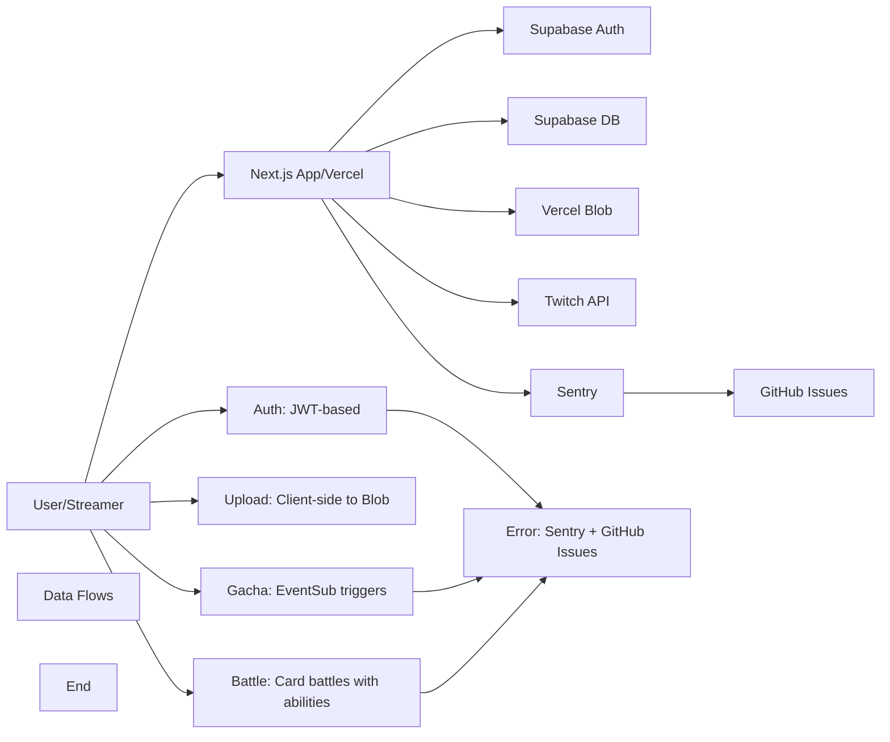

# TwiCa Architecture Document

## 概要

TwiCaはTwitch配信者向けのカードガチャシステムです。視聴者はチャンネルポイントを使ってガチャを引き、配信者が作成したオリジナルカードを収集できます。

---

## 機能要件

### 認証・認可
- Twitch OAuthによる配信者・視聴者認証
- Supabase Auth + カスタムCookieによるセッション管理
- 配信者は自身の配信者ページでのみカード管理が可能
- 視聴者は自分のカードとガチャ履歴のみ閲覧可能

### カード管理機能
- 配信者がカードを登録できる（名前、説明、画像URL、レアリティ、ドロップ率）
- カードの有効/無効切り替え
- カード画像はVercel Blob Storageに保存
- レアリティ: コモン、レア、エピック、レジェンダリー
- カード画像サイズ制限: 最大1MB

### ガチャ機能
- チャンネルポイントを使用したガチャシステム
- Twitch EventSubによるチャンネルポイント使用通知
- 重み付き確率によるカード選択
- ガチャ履歴の記録

### オーバーレイ表示
- ガチャ結果を配信画面にオーバーレイ表示
- ストリーマーIDごとのカスタマイズ可能な表示

### ダッシュボード機能
- 配信者ダッシュボード（カード管理、設定）
- 視聴者ダッシュボード（所持カード、ガチャ履歴）

---

## 非機能要件

### パフォーマンス
- APIレスポンス: 500ms以内（99パーセンタイル）
- ガチャ処理: 300ms以内
- 対戦処理: 1000ms以内
- 静的アセットのCDN配信（Vercel）
- データベースインデックスによるクエリ最適化
- データベースクエリフィールド選択の最適化
- N+1クエリ問題の回避

### セキュリティ
- HTTPSでの通信
- Supabase RLS (Row Level Security) による多層防御
- CSRF対策（SameSite=Lax Cookie + state検証）
- XSS対策（Reactの自動エスケープ）
- 環境変数によるシークレット管理
- セッション有効期限: 7日（Cookie + expiresAt検証）
- Twitch署名検証（EventSub Webhook）
- EventSubべき等性（event_idによる重複チェック）
- APIレート制限によるDoS攻撃対策
- 対戦の不正防止（ランダム性の確保）
- デバッグエンドポイントの保護（Issue #32）

### 可用性
- Vercelによる99.95% SLA
- Supabaseによる99.9% データベース可用性

### スケーラビリティ
- Vercel Serverless Functionsの自動スケーリング
- SupabaseのマネージドPostgreSQL（自動スケーリング）

---

## 受け入れ基準

### ユーザー認証
- [x] Twitch OAuthでログインできる
- [x] 配信者として認証される
- [x] 視聴者として認証される
- [x] ログアウトできる
- [x] セッション有効期限後に再認証が必要
- [x] Twitchログイン時のエラーが適切にハンドリングされる（Issue #19 - 解決済み）

### カード管理
- [x] カードを新規登録できる
- [x] カードを編集できる
- [x] カードを削除できる
- [x] カード画像をアップロードできる
- [x] カード画像サイズが1MB以下である
- [x] カードの有効/無効を切り替えられる
- [x] ドロップ率を設定できる（合計1.0以下）

### ガチャ機能
- [x] チャンネルポイントでガチャを引ける
- [x] ガチャ結果が正しく表示される
- [x] ドロップ率通りにカードが排出される
- [x] ガチャ履歴が記録される
- [x] 重みなしで同じ確率で排出される（全カードのドロップ率が等しい場合）

### オーバーレイ
- [x] ガチャ結果がOBS等のブラウザソースで表示できる
- [x] カード画像が正しく表示される
- [x] レアリティに応じた色が表示される

### データ整合性
- [x] RLSポリシーが正しく機能する
- [x] 配信者は自分のカードしか編集できない
- [x] 視聴者は自分のカードしか見れない
- [x] ガチャ履歴が正しく記録される

### APIレート制限（Issue #13）
- [x] `@upstash/ratelimit` と `@upstash/redis` をインストール
- [x] `src/lib/rate-limit.ts` を実装
- [x] 各 API ルートにレート制限を追加
- [x] 429 エラーが適切に返される
- [x] レート制限ヘッダーが設定される
- [x] 開発環境でインメモリレート制限が動作する
- [x] 本番環境で Redis レート制限が動作する
- [x] EventSub Webhook は緩いレート制限を持つ
- [x] 認証済みユーザーは twitchUserId で識別される
- [x] 未認証ユーザーは IP アドレスで識別される
- [x] フロントエンドで 429 エラーが適切に表示される

### カード対戦機能（Issue #15）
- [x] カードにステータス（HP、ATK、DEF、SPD）が追加される
- [x] 各カードにスキルが設定される
- [x] CPU対戦が可能
- [x] 自動ターン制バトルが動作する
- [x] 勝敗判定が正しく行われる
- [x] 対戦履歴が記録される
- [x] 対戦統計が表示される
- [x] フロントエンドで対戦が視覚的に楽しめる
- [x] アニメーション効果が表示される
- [x] モバイルで快適に操作可能

---

## 設計方針

### アーキテクチャパターン
- **クライアントサイド**: Next.js App Router + Server Components
- **サーバーサイド**: Vercel Serverless Functions
- **データストア**: Supabase (PostgreSQL)
- **ストレージ**: Vercel Blob
- **認証**: カスタムCookie + Twitch OAuth
- **エラートラッキング**: Sentry + GitHub Issues自動化

### デザイン原則
1. **Simple over Complex**: 複雑さを最小限に抑える
2. **Type Safety**: TypeScriptによる厳格な型定義
3. **Separation of Concerns**: 機能ごとのモジュール分割
4. **Security First**: アプリケーション層での認証検証 + RLS（多層防御）
5. **Consistency**: コードベース全体で一貫性を維持
6. **Error Handling**: ユーザーにわかりやすいエラーメッセージを提供
7. **Observability**: エラー追跡と自動イシュー作成により運用効率を向上
8. **Performance**: 最小限のデータ転送と効率的なクエリ実行
9. **Query Optimization**: N+1クエリ問題の回避とJOINの適切な使用
10. **Development/Production Separation**: デバッグツールは開発環境でのみ使用

### 技術選定基準
- マネージドサービス優先（運用コスト削減）
- Next.jsエコシステムを活用（開発効率）
- カスタムセッションによる柔軟な認証管理
- Sentryによるエラー可視化

---

## アーキテクチャ

### システム全体図



---

## Issue #33: Code Quality - Inconsistent Error Message in Session API

### 問題

`/api/session` エンドポイントにハードコードされたエラーメッセージ `'Not authenticated'` があり、標準化された `ERROR_MESSAGES.NOT_AUTHENTICATED` 定数を使用していません。

### 問題の詳細

#### 現在の実装

**src/app/api/session/route.ts**

```typescript
export async function GET() {
  try {
    const session = await getSession()
    
    if (!session) {
      return NextResponse.json({ error: 'Not authenticated' }, { status: 401 })  // Hardcoded string
    }
    
    return NextResponse.json(session)
  } catch (error) {
    return handleApiError(error, "Session API: GET")
  }
}
```

#### 影響

- **コード品質**: Issue #30で実装されたAPIエラーメッセージ標準化に違反
- **保守性**: ハードコードされた文字列はメンテナンスが困難で一貫性のないエラーメッセージにつながる可能性がある
- **一貫性**: 他のAPIルートは適切に `ERROR_MESSAGES` 定数を使用している

### 優先度

**Low** - コード品質の問題、セキュリティまたは機能的なバグではない

---

## Issue #33: 設計

### 機能要件

#### 1. Session API エラーメッセージの標準化

Session APIのエラーメッセージを標準化し、`ERROR_MESSAGES` 定数を使用します。

### 非機能要件

#### コード品質

- すべてのエラーメッセージが `ERROR_MESSAGES` 定数を使用する
- ハードコードされた文字列が削除される
- 一貫性のあるエラーハンドリングが維持される

### 設計

#### 1. Session API の修正

**src/app/api/session/route.ts**

**変更前**:
```typescript
export async function GET() {
  try {
    const session = await getSession()
    
    if (!session) {
      return NextResponse.json({ error: 'Not authenticated' }, { status: 401 })
    }
    
    return NextResponse.json(session)
  } catch (error) {
    return handleApiError(error, "Session API: GET")
  }
}
```

**変更後**:
```typescript
import { ERROR_MESSAGES } from '@/lib/constants'

export async function GET() {
  try {
    const session = await getSession()
    
    if (!session) {
      return NextResponse.json({ error: ERROR_MESSAGES.NOT_AUTHENTICATED }, { status: 401 })
    }
    
    return NextResponse.json(session)
  } catch (error) {
    return handleApiError(error, "Session API: GET")
  }
}
```

**理由**:
- 他のAPIルートと一貫性を保つ
- エラーメッセージの一元管理により、将来の変更が容易
- Issue #30の標準化完了状態を維持

### 変更ファイル

- `src/app/api/session/route.ts` (更新 - エラーメッセージ標準化)

### 受け入れ基準

- [ ] `/api/session` エンドポイントが `ERROR_MESSAGES.NOT_AUTHENTICATED` 定数を使用する
- [ ] TypeScript コンパイルエラーがない
- [ ] ESLint エラーがない
- [ ] 既存のAPIテストがパスする
- [ ] CIが成功
- [ ] Issue #33 クローズ済み

### テスト計画

1. **統合テスト**:
   - セッションがない場合に `ERROR_MESSAGES.NOT_AUTHENTICATED` が返されることを確認
   - セッションがある場合に正しいセッションデータが返されることを確認

2. **回帰テスト**:
   - 既存の認証フローが正しく動作することを確認
   - 以前の動作と変わらないことを確認

### トレードオフの検討

#### ハードコードされた文字列 vs ERROR_MESSAGES定数

| 項目 | ハードコードされた文字列 | ERROR_MESSAGES定数 |
|:---|:---|:---|
| **コード品質** | 低（標準化違反） | 高（一貫性あり） |
| **保守性** | 低（変更時に複数箇所を修正） | 高（一箇所の修正で全体に反映） |
| **一貫性** | 低（ルートごとに異なる可能性） | 高（全ルートで統一） |
| **実装コスト** | 低（変更なし） | 低（簡単な置換） |

**推奨**: ERROR_MESSAGES定数を使用

**理由**:
- Issue #30で実装された標準化完了状態を維持できる
- 将来のエラーメッセージの変更や追加言語対応が容易
- コードベース全体で一貫性が保たれる

### 関連問題

- Issue #30 - API Error Message Standardization (解決済み)
- Issue #25 - Inconsistent Error Messages in API Responses (解決済み)

---

## 更新履歴

| 日付 | 変更内容 |
|:---|:---|
| 2026-01-18 | Issue #33 Session APIエラーメッセージ標準化の設計追加 |
| 2026-01-18 | Issue #32 デバッグエンドポイントセキュリティ強化の実装完了・クローズ |
| 2026-01-18 | Issue #31 `as any` 型キャスト削除の実装完了・クローズ |
| 2026-01-18 | Issue #30 APIエラーメッセージ標準化の実装完了・クローズ |
| 2026-01-18 | Issue #29 N+1クエリ問題の実装完了・クローズ |
| 2026-01-18 | Issue #28 N+1クエリ問題の実装完了・クローズ |
| 2026-01-18 | Issue #27 データベースクエリ最適化の実装完了・クローズ |
| 2026-01-17 | Issue #26 レート制限のfail-open問題の実装完了 |
| 2026-01-17 | Issue #25 エラーメッセージの一貫性問題の実装完了 |

---

## 実装完了の問題

詳細は `docs/ARCHITECTURE_2026-01-18.md` を参照してください。
