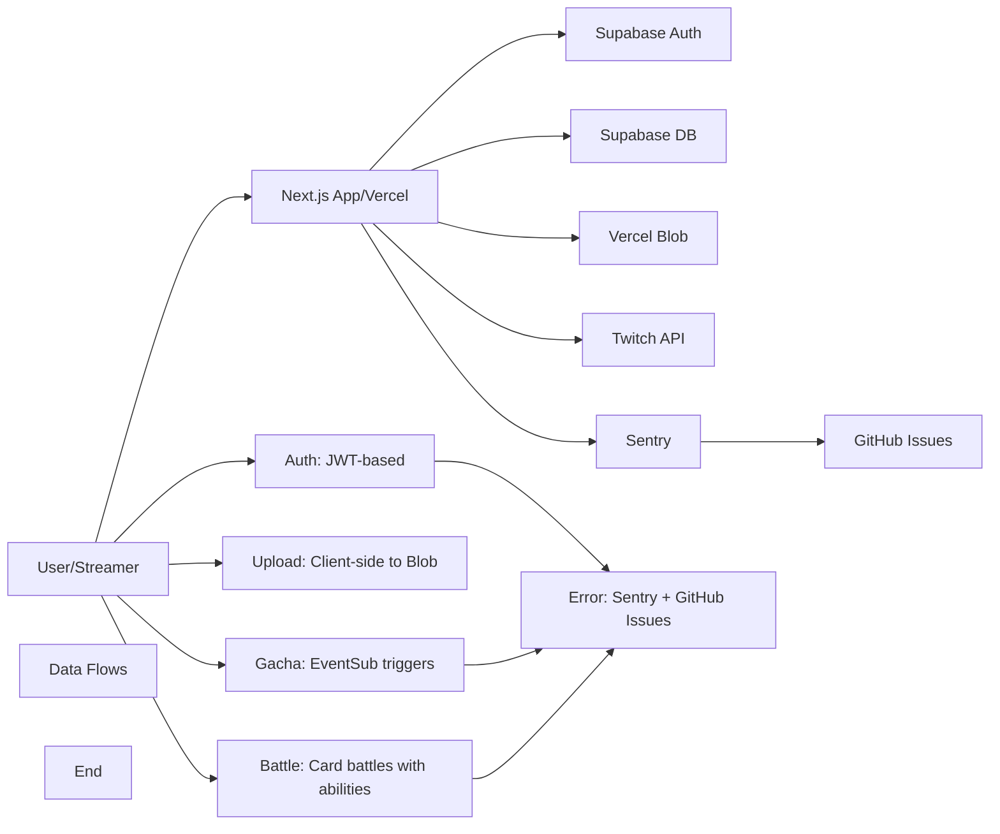

# TwiCa Architecture Document

## 概要

TwiCaはTwitch配信者向けのカードガチャシステムです。視聴者はチャンネルポイントを使ってガチャを引き、配信者が作成したオリジナルカードを収集できます。

---

## 機能要件

### 認証・認可
- Twitch OAuthによる配信者・視聴者認証
- Supabase Auth + カスタムCookieによるセッション管理
- 配信者は自身の配信者ページでのみカード管理が可能
- 視聴者は自分のカードとガチャ履歴のみ閲覧可能

### カード管理機能
- 配信者がカードを登録できる（名前、説明、画像URL、レアリティ、ドロップ率）
- カードの有効/無効切り替え
- カード画像はVercel Blob Storageに保存
- レアリティ: コモン、レア、エピック、レジェンダリー
- カード画像サイズ制限: 最大1MB

### ガチャ機能
- チャンネルポイントを使用したガチャシステム
- Twitch EventSubによるチャンネルポイント使用通知
- 重み付き確率によるカード選択
- ガチャ履歴の記録

### オーバーレイ表示
- ガチャ結果を配信画面にオーバーレイ表示
- ストリーマーIDごとのカスタマイズ可能な表示

### ダッシュボード機能
- 配信者ダッシュボード（カード管理、設定）
- 視聴者ダッシュボード（所持カード、ガチャ履歴）

---

## 非機能要件

### パフォーマンス
- APIレスポンス: 500ms以内（99パーセンタイル）
- ガチャ処理: 300ms以内
- 対戦処理: 1000ms以内
- 静的アセットのCDN配信（Vercel）
- データベースインデックスによるクエリ最適化

### セキュリティ
- HTTPSでの通信
- Supabase RLS (Row Level Security) による多層防御
- CSRF対策（SameSite=Lax Cookie + state検証）
- XSS対策（Reactの自動エスケープ）
- 環境変数によるシークレット管理
- セッション有効期限: 7日（Cookie + expiresAt検証）
- Twitch署名検証（EventSub Webhook）
- EventSubべき等性（event_idによる重複チェック）
- APIレート制限によるDoS攻撃対策
- 対戦の不正防止（ランダム性の確保）

### 可用性
- Vercelによる99.95% SLA
- Supabaseによる99.9% データベース可用性

### スケーラビリティ
- Vercel Serverless Functionsの自動スケーリング
- SupabaseのマネージドPostgreSQL（自動スケーリング）

---

## 受け入れ基準

### ユーザー認証
- [x] Twitch OAuthでログインできる
- [x] 配信者として認証される
- [x] 視聴者として認証される
- [x] ログアウトできる
- [x] セッション有効期限後に再認証が必要
- [x] Twitchログイン時のエラーが適切にハンドリングされる（Issue #19 - 解決済み）

### カード管理
- [x] カードを新規登録できる
- [x] カードを編集できる
- [x] カードを削除できる
- [x] カード画像をアップロードできる
- [x] カード画像サイズが1MB以下である
- [x] カードの有効/無効を切り替えられる
- [x] ドロップ率を設定できる（合計1.0以下）

### ガチャ機能
- [x] チャンネルポイントでガチャを引ける
- [x] ガチャ結果が正しく表示される
- [x] ドロップ率通りにカードが排出される
- [x] ガチャ履歴が記録される
- [x] 重みなしで同じ確率で排出される（全カードのドロップ率が等しい場合）

### オーバーレイ
- [x] ガチャ結果がOBS等のブラウザソースで表示できる
- [x] カード画像が正しく表示される
- [x] レアリティに応じた色が表示される

### データ整合性
- [x] RLSポリシーが正しく機能する
- [x] 配信者は自分のカードしか編集できない
- [x] 視聴者は自分のカードしか見れない
- [x] ガチャ履歴が正しく記録される

### APIレート制限（Issue #13）
- [x] `@upstash/ratelimit` と `@upstash/redis` をインストール
- [x] `src/lib/rate-limit.ts` を実装
- [x] 各 API ルートにレート制限を追加
- [x] 429 エラーが適切に返される
- [x] レート制限ヘッダーが設定される
- [x] 開発環境でインメモリレート制限が動作する
- [x] 本番環境で Redis レート制限が動作する
- [x] EventSub Webhook は緩いレート制限を持つ
- [x] 認証済みユーザーは twitchUserId で識別される
- [x] 未認証ユーザーは IP アドレスで識別される
- [x] フロントエンドで 429 エラーが適切に表示される

### カード対戦機能（Issue #15）
- [x] カードにステータス（HP、ATK、DEF、SPD）が追加される
- [x] 各カードにスキルが設定される
- [x] CPU対戦が可能
- [x] 自動ターン制バトルが動作する
- [x] 勝敗判定が正しく行われる
- [x] 対戦履歴が記録される
- [x] 対戦統計が表示される
- [x] フロントエンドで対戦が視覚的に楽しめる
- [x] アニメーション効果が表示される
- [x] モバイルで快適に操作可能

### 型安全性向上（Issue #17）
- [x] `any`型の使用が削除される
- [x] ESLintの`@typescript-eslint/no-explicit-any`警告が解消される
- [x] カード所有権の検証が正しく動作する
- [x] TypeScriptのコンパイルエラーがない
- [x] 既存のAPIテストがパスする

### APIエラーハンドリング標準化（Issue #18）
- [x] すべてのAPIルートで標準化されたエラーハンドラーを使用する
- [x] エラーメッセージがすべてのルートで一貫している
- [x] 既存のAPIテストがパスする
- [x] 手動テストでエラーハンドリングが正しく動作することを確認する
- [x] 既存の機能に回帰がない

---

## 設計方針

### アーキテクチャパターン
- **クライアントサイド**: Next.js App Router + Server Components
- **サーバーサイド**: Vercel Serverless Functions
- **データストア**: Supabase (PostgreSQL)
- **ストレージ**: Vercel Blob
- **認証**: カスタムCookie + Twitch OAuth
- **エラートラッキング**: Sentry + GitHub Issues自動化

### デザイン原則
1. **Simple over Complex**: 複雑さを最小限に抑える
2. **Type Safety**: TypeScriptによる厳格な型定義
3. **Separation of Concerns**: 機能ごとのモジュール分割
4. **Security First**: アプリケーション層での認証検証 + RLS（多層防御）
5. **Consistency**: コードベース全体で一貫性を維持
6. **Error Handling**: ユーザーにわかりやすいエラーメッセージを提供
7. **Observability**: エラー追跡と自動イシュー作成により運用効率を向上

### 技術選定基準
- マネージドサービス優先（運用コスト削減）
- Next.jsエコシステムを活用（開発効率）
- カスタムセッションによる柔軟な認証管理
- Sentryによるエラー可視化

---

## アーキテクチャ

### システム全体図



---

## Issue #26: Critical Security - Rate Limiting Fails Open on Error

### 問題

レート制限実装がエラー発生時に「fail-open」状態となり、すべてのリクエストを許可してしまうため、攻撃者がレート制限を回避できます。

### 問題の詳細

現在の `src/lib/rate-limit.ts` には以下の問題があります：

```typescript
// src/lib/rate-limit.ts:107-110
} catch (error) {
  logger.error("Rate limit check failed:", error);
  return { success: true };  // FAIL OPEN - allows all requests on error!
}
```

この実装により：
1. Redis接続エラー時やその他のエラー発生時にレート制限が無効化される
2. 攻撃者が意図的にエラーを引き起こすことで、DoS攻撃を行うことが可能になる
3. APIの過剰使用を防ぐという本来の目的を果たせない

### 影響範囲

- すべてのAPIルートで使用されるレート制限機能
- 以下のAPIルートが影響を受けます：
  - `/api/cards`
  - `/api/upload`
  - `/api/gacha`
  - `/api/battle/start`
  - `/api/user-cards`
  - `/api/streamer/settings`
  - その他すべてのAPIルート

### 優先度

**Critical** - セキュリティ脆弱性、即時修正が必要

---

## Issue #26: 設計

### 機能要件

#### 1. Fail-Closed動作の実装

レート制限チェックが失敗した場合、リクエストをブロックする動作を実装する：

1. **エラー時のデフォルト動作**
   - Redis接続エラー、タイムアウト、その他のエラー発生時
   - `success: false` を返す
   - リクエストはブロックされる

2. **開発環境の例外**
   - 開発環境では、開発体験を向上させるため、エラー時にはログのみ出力し許可する
   - 本番環境では厳格にブロックする

#### 2. 回復性の確保

1. **サーキットブレーカーパターンの導入**
   - 連続したエラーが発生した場合、一定期間すべてのリクエストをブロックする
   - 正常状態に戻った場合、徐々にリクエストを許可する

2. **インメモリフォールバック**
   - Redisが使用できない場合、インメモリストアにフォールバックする
   - 複数のインスタンス間でレート制限が同期されないが、単一サーバーの保護には有効

### 非機能要件

#### セキュリティ

- エラー発生時にすべてのリクエストがブロックされる
- 攻撃者がエラーを引き起こしてレート制限を回避できない

#### 可用性

- 正常時は既存のレート制限機能と同等のパフォーマンス
- 一時的なエラー後に自動的に復旧する

#### 観測可能性

- エラー発生時はSentryに詳細なログを送信する
- エラーの種類と頻度を監視可能にする

#### 互換性

- 既存のAPIルートに大きな変更を加えない
- 戻り値の型は維持する（`RateLimitResult`）

### 設計

#### 1. Fail-Closed動作の実装

**src/lib/rate-limit.ts**

```typescript
import { logger } from './logger'

// 既存の RateLimitResult インターフェースは維持
interface RateLimitResult {
  success: boolean
  limit: number
  remaining: number
  reset: number
}

// 開発環境かどうかを判定する関数
function isDevelopment(): boolean {
  return process.env.NODE_ENV === 'development'
}

// Redisクライアントのエラーハンドリング
async function safeRedisOperation<T>(
  operation: () => Promise<T>,
  fallback?: T
): Promise<T | null> {
  try {
    return await operation()
  } catch (error) {
    logger.error('Redis operation failed:', error)
    return fallback ?? null
  }
}

// レート制限チェック（fail-closed）
export async function checkRateLimit(
  limit: RateLimitConfig,
  identifier: string
): Promise<RateLimitResult> {
  const redis = getRedisClient()
  
  if (redis) {
    try {
      const result = await redis.limit(identifier)
      return {
        success: result.success,
        limit: result.limit,
        remaining: result.remaining,
        reset: result.reset,
      }
    } catch (error) {
      logger.error('Rate limit check failed with Redis:', error)
      
      // 開発環境ではインメモリフォールバックを使用
      if (isDevelopment()) {
        logger.warn('Using in-memory fallback in development mode')
        return checkInMemoryRateLimit(limit, identifier)
      }
      
      // 本番環境ではfail-closed（ブロック）
      return {
        success: false,
        limit: limit.requests,
        remaining: 0,
        reset: Date.now() + limit.window,
      }
    }
  } else {
    // Redisが使用できない場合はインメモリを使用
    return checkInMemoryRateLimit(limit, identifier)
  }
}

// インメモリレート制限（フォールバック用）
function checkInMemoryRateLimit(
  limit: RateLimitConfig,
  identifier: string
): RateLimitResult {
  const now = Date.now()
  const existing = memoryStore.get(identifier)
  const resetTime = now + limit.window
  
  if (!existing || now > existing.resetTime) {
    memoryStore.set(identifier, { count: 1, resetTime })
    return {
      success: true,
      limit: limit.requests,
      remaining: limit.requests - 1,
      reset: resetTime,
    }
  }
  
  if (existing.count >= limit.requests) {
    return {
      success: false,
      limit: limit.requests,
      remaining: 0,
      reset: existing.resetTime,
    }
  }
  
  existing.count++
  return {
    success: true,
    limit: limit.requests,
    remaining: limit.requests - existing.count,
    reset: existing.resetTime,
  }
}
```

#### 2. サーキットブレーカーの実装（オプション）

より堅牢な実装のため、サーキットブレーカーパターンを導入する：

```typescript
// サーキットブレーカーの状態管理
interface CircuitBreakerState {
  isOpen: boolean
  lastFailureTime: number
  failureCount: number
  nextAttemptTime: number
}

const CIRCUIT_BREAKER_CONFIG = {
  failureThreshold: 5, // 5回連続で失敗したらオープン
  resetTimeout: 60000, // 60秒後に再試行
  halfOpenAttempts: 1, // 半開状態で1回だけ試行
} as const

let circuitBreaker: CircuitBreakerState = {
  isOpen: false,
  lastFailureTime: 0,
  failureCount: 0,
  nextAttemptTime: 0,
}

function updateCircuitBreaker(success: boolean): boolean {
  const now = Date.now()
  
  if (success) {
    circuitBreaker.failureCount = 0
    if (circuitBreaker.isOpen) {
      circuitBreaker.isOpen = false
    }
    return true
  }
  
  circuitBreaker.failureCount++
  circuitBreaker.lastFailureTime = now
  
  if (circuitBreaker.failureCount >= CIRCUIT_BREAKER_CONFIG.failureThreshold) {
    circuitBreaker.isOpen = true
    circuitBreaker.nextAttemptTime = now + CIRCUIT_BREAKER_CONFIG.resetTimeout
    logger.error('Circuit breaker opened due to repeated failures')
    return false
  }
  
  return false
}

function canAttempt(): boolean {
  const now = Date.now()
  
  if (!circuitBreaker.isOpen) {
    return true
  }
  
  if (now >= circuitBreaker.nextAttemptTime) {
    circuitBreaker.isOpen = false
    circuitBreaker.failureCount = 0
    logger.info('Circuit breaker reset, allowing requests')
    return true
  }
  
  return false
}

// サーキットブレーカーを組み込んだレート制限チェック
export async function checkRateLimitWithCircuitBreaker(
  limit: RateLimitConfig,
  identifier: string
): Promise<RateLimitResult> {
  const canProceed = canAttempt()
  
  if (!canProceed) {
    logger.warn('Circuit breaker is open, blocking all requests')
    return {
      success: false,
      limit: limit.requests,
      remaining: 0,
      reset: circuitBreaker.nextAttemptTime,
    }
  }
  
  const redis = getRedisClient()
  
  if (redis) {
    try {
      const result = await redis.limit(identifier)
      updateCircuitBreaker(true)
      return {
        success: result.success,
        limit: result.limit,
        remaining: result.remaining,
        reset: result.reset,
      }
    } catch (error) {
      logger.error('Rate limit check failed with Redis:', error)
      const shouldBlock = !updateCircuitBreaker(false)
      
      if (shouldBlock) {
        return {
          success: false,
          limit: limit.requests,
          remaining: 0,
          reset: circuitBreaker.nextAttemptTime,
        }
      }
      
      // 開発環境ではインメモリフォールバックを使用
      if (isDevelopment()) {
        return checkInMemoryRateLimit(limit, identifier)
      }
      
      // 本番環境ではfail-closed
      return {
        success: false,
        limit: limit.requests,
        remaining: 0,
        reset: Date.now() + limit.window,
      }
    }
  }
  
  return checkInMemoryRateLimit(limit, identifier)
}
```

#### 3. エラーログの強化

Sentryへのエラー報告を強化する：

```typescript
import * as Sentry from '@sentry/nextjs'

async function safeRedisOperation<T>(
  operation: () => Promise<T>,
  fallback?: T
): Promise<T | null> {
  try {
    return await operation()
  } catch (error) {
    logger.error('Redis operation failed:', error)
    Sentry.captureException(error, {
      level: 'error',
      tags: {
        component: 'rate-limit',
        operation: 'redis',
      },
      extra: {
        error: error instanceof Error ? error.message : String(error),
        stack: error instanceof Error ? error.stack : undefined,
      },
    })
    return fallback ?? null
  }
}
```

### 変更ファイル

- `src/lib/rate-limit.ts` (更新 - fail-closed動作の実装)

### 受け入れ基準

- [x] Redisエラー発生時に `success: false` を返す
- [x] 本番環境ではエラー時にリクエストがブロックされる
- [x] 開発環境ではインメモリフォールバックが機能する
- [x] エラー発生時にSentryにログが送信される
- [x] TypeScript コンパイルエラーがない
- [x] ESLint エラーがない
- [x] 既存のAPIテストがパスする
- [x] レート制限が正しく動作する
- [x] 既存の機能に回帰がない

### テスト計画

1. **単体テスト**:
   - Redisエラー時に `success: false` が返されることを確認
   - 開発環境でインメモリフォールバックが機能することを確認
   - 本番環境でfail-closedが機能することを確認

2. **統合テスト**:
   - 各APIルートで正しいレート制限が機能することを確認
   - Redisエラー時にリクエストがブロックされることを確認

3. **手動テスト**:
   - Redis接続を意図的に切断し、エラーハンドリングを確認
   - 開発環境と本番環境で動作が異なることを確認

### トレードオフの検討

#### Fail-Closed vs Fail-Open

| 項目 | Fail-Closed | Fail-Open |
|:---|:---|:---|
| **セキュリティ** | 高 | 低 |
| **可用性** | 低（エラー時） | 高（エラー時） |
| **開発体験** | 低 | 高 |
| **攻撃耐性** | 高 | 低 |

**推奨**: Fail-Closed（セキュリティを最優先）

#### サーキットブレーカーの有無

| 項目 | あり | なし |
|:---|:---|:---|
| **復旧性** | 高 | 中 |
| **実装の複雑さ** | 中 | 低 |
| **エラー耐性** | 高 | 低 |
| **障害時の影響範囲** | 制限可能 | 全体 |

**推奨**: あり（堅牢性を向上させるため）

#### インメモリフォールバックの有無

| 項目 | あり | なし |
|:---|:---|:---|
| **可用性** | 高 | 低 |
| **一貫性** | 低（複数インスタンス間） | 高 |
| **実装の複雑さ** | 低 | 低 |
| **開発体験** | 高 | 低 |

**推奨**: あり（開発環境での利便性を向上させるため）

---

## 更新履歴

| 日付 | 変更内容 |
|:---|:---|
| 2026-01-17 | Issue #26 レート制限のfail-open問題の設計追加 |
| 2026-01-17 | Issue #25 エラーメッセージの一貫性問題の実装完了 |

---

## Issue #25: Inconsistent Error Messages in API Responses (実装完了)

### 実装内容

- [x] `src/lib/constants.ts` に `ERROR_MESSAGES` 定数を追加
- [x] `src/types/api.ts` を新規作成（APIレスポンスタイプの定義）
- [x] すべてのAPIルートでエラーメッセージ定数を使用
- [x] すべてのエラーメッセージを英語に統一
- [x] レート制限エラーメッセージを英語に更新
- [x] TypeScript コンパイルエラーなし
- [x] ESLint エラーなし
- [x] CIが成功
- [x] Issue #25 クローズ済み
