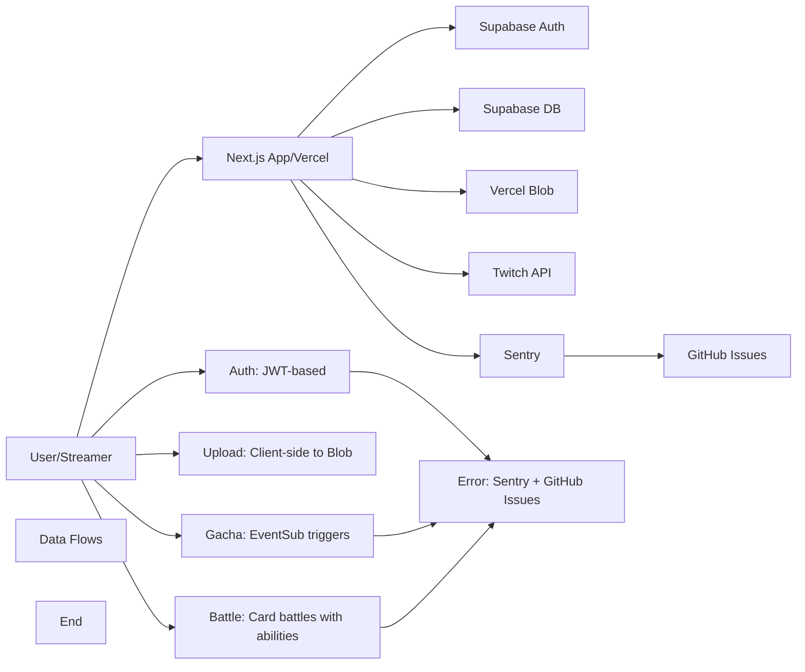

# TwiCa Architecture Document

## 概要

TwiCaはTwitch配信者向けのカードガチャシステムです。視聴者はチャンネルポイントを使ってガチャを引き、配信者が作成したオリジナルカードを収集できます。

---

## 機能要件

### 認証・認可
- Twitch OAuthによる配信者・視聴者認証
- Supabase Auth + カスタムCookieによるセッション管理
- 配信者は自身の配信者ページでのみカード管理が可能
- 視聴者は自分のカードとガチャ履歴のみ閲覧可能

### カード管理機能
- 配信者がカードを登録できる（名前、説明、画像URL、レアリティ、ドロップ率）
- カードの有効/無効切り替え
- カード画像はVercel Blob Storageに保存
- レアリティ: コモン、レア、エピック、レジェンダリー
- カード画像サイズ制限: 最大1MB

### ガチャ機能
- チャンネルポイントを使用したガチャシステム
- Twitch EventSubによるチャンネルポイント使用通知
- 重み付き確率によるカード選択
- ガチャ履歴の記録

### オーバーレイ表示
- ガチャ結果を配信画面にオーバーレイ表示
- ストリーマーIDごとのカスタマイズ可能な表示

### ダッシュボード機能
- 配信者ダッシュボード（カード管理、設定）
- 視聴者ダッシュボード（所持カード、ガチャ履歴）

---

## 非機能要件

### パフォーマンス
- APIレスポンス: 500ms以内（99パーセンタイル）
- ガチャ処理: 300ms以内
- 対戦処理: 1000ms以内
- 静的アセットのCDN配信（Vercel）
- データベースインデックスによるクエリ最適化
- データベースクエリフィールド選択の最適化

### セキュリティ
- HTTPSでの通信
- Supabase RLS (Row Level Security) による多層防御
- CSRF対策（SameSite=Lax Cookie + state検証）
- XSS対策（Reactの自動エスケープ）
- 環境変数によるシークレット管理
- セッション有効期限: 7日（Cookie + expiresAt検証）
- Twitch署名検証（EventSub Webhook）
- EventSubべき等性（event_idによる重複チェック）
- APIレート制限によるDoS攻撃対策
- 対戦の不正防止（ランダム性の確保）

### 可用性
- Vercelによる99.95% SLA
- Supabaseによる99.9% データベース可用性

### スケーラビリティ
- Vercel Serverless Functionsの自動スケーリング
- SupabaseのマネージドPostgreSQL（自動スケーリング）

---

## 受け入れ基準

### ユーザー認証
- [x] Twitch OAuthでログインできる
- [x] 配信者として認証される
- [x] 視聴者として認証される
- [x] ログアウトできる
- [x] セッション有効期限後に再認証が必要
- [x] Twitchログイン時のエラーが適切にハンドリングされる（Issue #19 - 解決済み）

### カード管理
- [x] カードを新規登録できる
- [x] カードを編集できる
- [x] カードを削除できる
- [x] カード画像をアップロードできる
- [x] カード画像サイズが1MB以下である
- [x] カードの有効/無効を切り替えられる
- [x] ドロップ率を設定できる（合計1.0以下）

### ガチャ機能
- [x] チャンネルポイントでガチャを引ける
- [x] ガチャ結果が正しく表示される
- [x] ドロップ率通りにカードが排出される
- [x] ガチャ履歴が記録される
- [x] 重みなしで同じ確率で排出される（全カードのドロップ率が等しい場合）

### オーバーレイ
- [x] ガチャ結果がOBS等のブラウザソースで表示できる
- [x] カード画像が正しく表示される
- [x] レアリティに応じた色が表示される

### データ整合性
- [x] RLSポリシーが正しく機能する
- [x] 配信者は自分のカードしか編集できない
- [x] 視聴者は自分のカードしか見れない
- [x] ガチャ履歴が正しく記録される

### APIレート制限（Issue #13）
- [x] `@upstash/ratelimit` と `@upstash/redis` をインストール
- [x] `src/lib/rate-limit.ts` を実装
- [x] 各 API ルートにレート制限を追加
- [x] 429 エラーが適切に返される
- [x] レート制限ヘッダーが設定される
- [x] 開発環境でインメモリレート制限が動作する
- [x] 本番環境で Redis レート制限が動作する
- [x] EventSub Webhook は緩いレート制限を持つ
- [x] 認証済みユーザーは twitchUserId で識別される
- [x] 未認証ユーザーは IP アドレスで識別される
- [x] フロントエンドで 429 エラーが適切に表示される

### カード対戦機能（Issue #15）
- [x] カードにステータス（HP、ATK、DEF、SPD）が追加される
- [x] 各カードにスキルが設定される
- [x] CPU対戦が可能
- [x] 自動ターン制バトルが動作する
- [x] 勝敗判定が正しく行われる
- [x] 対戦履歴が記録される
- [x] 対戦統計が表示される
- [x] フロントエンドで対戦が視覚的に楽しめる
- [x] アニメーション効果が表示される
- [x] モバイルで快適に操作可能

### 型安全性向上（Issue #17）
- [x] `any`型の使用が削減される
- [x] ESLintの`@typescript-eslint/no-explicit-any`警告が解消される
- [x] カード所有権の検証が正しく動作する
- [x] TypeScriptのコンパイルエラーがない
- [x] 既存のAPIテストがパスする

### APIエラーハンドリング標準化（Issue #18）
- [x] すべてのAPIルートで標準化されたエラーハンドラーを使用する
- [x] エラーメッセージがすべてのルートで一貫している
- [x] 既存のAPIテストがパスする
- [x] 手動テストでエラーハンドリングが正しく動作することを確認する
- [x] 既存の機能に回帰がない

### レート制限のfail-open問題修正（Issue #26）
- [x] Redisエラー発生時に `success: false` を返す
- [x] 本番環境ではエラー時にリクエストがブロックされる
- [x] 開発環境ではインメモリフォールバックが機能する
- [x] エラー発生時にSentryにログが送信される
- [x] TypeScript コンパイルエラーがない
- [x] ESLint エラーがない
- [x] 既存のAPIテストがパスする
- [x] レート制限が正しく動作する
- [x] 既存の機能に回帰がない

---

## 設計方針

### アーキテクチャパターン
- **クライアントサイド**: Next.js App Router + Server Components
- **サーバーサイド**: Vercel Serverless Functions
- **データストア**: Supabase (PostgreSQL)
- **ストレージ**: Vercel Blob
- **認証**: カスタムCookie + Twitch OAuth
- **エラートラッキング**: Sentry + GitHub Issues自動化

### デザイン原則
1. **Simple over Complex**: 複雑さを最小限に抑える
2. **Type Safety**: TypeScriptによる厳格な型定義
3. **Separation of Concerns**: 機能ごとのモジュール分割
4. **Security First**: アプリケーション層での認証検証 + RLS（多層防御）
5. **Consistency**: コードベース全体で一貫性を維持
6. **Error Handling**: ユーザーにわかりやすいエラーメッセージを提供
7. **Observability**: エラー追跡と自動イシュー作成により運用効率を向上
8. **Performance**: 最小限のデータ転送と効率的なクエリ実行

### 技術選定基準
- マネージドサービス優先（運用コスト削減）
- Next.jsエコシステムを活用（開発効率）
- カスタムセッションによる柔軟な認証管理
- Sentryによるエラー可視化

---

## アーキテクチャ

### システム全体図



---

## Issue #27: Performance - Optimize Database Queries by Selecting Only Required Fields

### 問題

複数のAPIルートで `.select('*')` を使用してデータベーステーブルからすべてのカラムを取得しており、これにより以下の問題が発生している：

1. **パフォーマンス問題**: 不必要なカラムの取得によりデータ転送時間とメモリ使用量が増加する
2. **データ露出**: アプリケーションロジックで必要ない内部フィールドが露出する可能性がある
3. **メンテナンスオーバーヘッド**: 新しいカラムが追加されると、明示的な考慮なしに自動的に取得される

### 問題の詳細

#### Gacha Service

**ファイル**: `src/lib/services/gacha.ts:20`

```typescript
const { data: cards, error: cardsError } = await this.supabase
  .from('cards')
  .select('*')  // 16個のカラムすべてを取得
  .eq('streamer_id', streamerId)
  .eq('is_active', true)
```

**cardsテーブルの全カラム**:
1. `id` - 必要
2. `streamer_id` - 不要
3. `name` - 必要
4. `description` - 必要
5. `image_url` - 必要
6. `rarity` - 必要
7. `drop_rate` - 必要（重み付き選択アルゴリズム用）
8. `is_active` - 不要（クエリ条件として使用済み）
9. `created_at` - 不要
10. `updated_at` - 不要
11. `hp` - 不要（バトル機能用）
12. `atk` - 不要（バトル機能用）
13. `def` - 不要（バトル機能用）
14. `spd` - 不要（バトル機能用）
15. `skill_type` - 不要（バトル機能用）
16. `skill_name` - 不要（バトル機能用）
17. `skill_power` - 不要（バトル機能用）

**必要なカラム**:
- `id` - データベース操作用
- `drop_rate` - 重み付き選択アルゴリズム用
- `name` - APIレスポンス用
- `description` - APIレスポンス用
- `image_url` - APIレスポンス用
- `rarity` - APIレスポンス用

**統計**:
- **取得カラム数**: 17
- **必要カラム数**: 6
- **無駄なカラム数**: 11 (64.7%)

#### 他のAPIルートでの類似問題

以下のファイルでも `.select('*')` が使用されている：
- `src/app/api/battle/start/route.ts`
- `src/app/api/battle/[battleId]/route.ts`
- `src/app/api/battle/stats/route.ts`
- `src/app/api/user-cards/route.ts`
- `src/app/api/cards/route.ts`

### 影響範囲

- ガチャ機能のパフォーマンス
- バトル機能のパフォーマンス
- カード管理機能のパフォーマンス
- ユーザーカード閲覧のパフォーマンス

### 優先度

**Medium** - パフォーマンス最適化

---

## Issue #27: 設計

### 機能要件

#### 1. 明示的なフィールド選択の実装

すべてのAPIルートとサービスで、必要なフィールドのみを明示的に選択する：

1. **Gacha Service**
   - `cards` テーブルから必要なフィールドのみ選択: `id, name, description, image_url, rarity, drop_rate`

2. **Battle API**
   - 適切なフィールドのみ選択
   - 関連テーブル（cards, streamers）のフィールドも明示的に指定

3. **Cards API**
   - 必要なフィールドのみ選択
   - GETとPOSTで異なるフィールドセットを使用

4. **User Cards API**
   - 必要なフィールドのみ選択

### 非機能要件

#### パフォーマンス

- データ転送量の削減（目標: 50%以上の削減）
- メモリ使用量の削減
- クエリ実行時間の短縮

#### コード品質

- コードの意図が明確になる（何のデータを取得しているか一目でわかる）
- 保守性の向上（新しいフィールド追加時の影響が明確）

#### 互換性

- 既存のAPIレスポンス形式を維持
- 既存の機能に回帰がない

### 設計

#### 1. Gacha Serviceの最適化

**src/lib/services/gacha.ts**

**変更前**:
```typescript
const { data: cards, error: cardsError } = await this.supabase
  .from('cards')
  .select('*')
  .eq('streamer_id', streamerId)
  .eq('is_active', true)
```

**変更後**:
```typescript
const { data: cards, error: cardsError } = await this.supabase
  .from('cards')
  .select('id, name, description, image_url, rarity, drop_rate')
  .eq('streamer_id', streamerId)
  .eq('is_active', true)
```

**理由**:
- `id`: データベース操作（user_cards, gacha_history）に必要
- `name`, `description`, `image_url`, `rarity`: APIレスポンス（`GachaSuccessResponse`）に必要
- `drop_rate`: 重み付き選択アルゴリズム（`selectWeightedCard`）に必要

#### 2. Battle Start APIの最適化

**src/app/api/battle/start/route.ts**

**変更前**:
```typescript
const { data: userData, error: userError } = await supabaseAdmin
  .from('users')
  .select('*')
  .eq('twitch_user_id', session.twitchUserId)
  .single()
```

**変更後**:
```typescript
const { data: userData, error: userError } = await supabaseAdmin
  .from('users')
  .select('id, twitch_user_id')
  .eq('twitch_user_id', session.twitchUserId)
  .single()
```

**変更前**:
```typescript
const { data: userCardData, error: userCardError } = await supabaseAdmin
  .from('user_cards')
  .select(`
    *,
    card:cards(
      *,
      streamer:streamers(*)
    )
  `)
```

**変更後**:
```typescript
const { data: userCardData, error: userCardError } = await supabaseAdmin
  .from('user_cards')
  .select(`
    user_id,
    card_id,
    card:cards(
      id,
      name,
      hp,
      atk,
      def,
      spd,
      skill_type,
      skill_name,
      skill_power,
      image_url,
      rarity,
      streamer:streamers(
        twitch_user_id
      )
    )
  `)
```

**変更前**:
```typescript
const { data: allCards, error: allCardsError } = await supabaseAdmin
  .from('cards')
  .select('*')
  .eq('is_active', true)
```

**変更後**:
```typescript
const { data: allCards, error: allCardsError } = await supabaseAdmin
  .from('cards')
  .select('id, name, hp, atk, def, spd, skill_type, skill_name, skill_power, image_url, rarity, drop_rate')
  .eq('is_active', true)
```

**理由**:
- バトルシステムにはカードのステータス（hp, atk, def, spd）とスキル情報が必要
- `streamer_id` はCPUオポーネント生成では不要
- `is_active` はクエリ条件として使用済み

#### 3. Battle Get APIの最適化

**src/app/api/battle/[battleId]/route.ts**

**変更前**:
```typescript
const { data: battle, error } = await supabaseAdmin
  .from('battles')
  .select('*')
  .eq('id', battleId)
  .single()
```

**変更後**:
```typescript
const { data: battle, error } = await supabaseAdmin
  .from('battles')
  .select(`
    id,
    result,
    turn_count,
    battle_log,
    created_at
  `)
  .eq('id', battleId)
  .single()
```

**変更前**:
```typescript
const { data: userCardData } = await supabaseAdmin
  .from('user_cards')
  .select(`
    *,
    card:cards(
      *,
      streamer:streamers(*)
    )
  `)
```

**変更後**:
```typescript
const { data: userCardData } = await supabaseAdmin
  .from('user_cards')
  .select(`
    user_id,
    card_id,
    obtained_at,
    card:cards(
      id,
      name,
      hp,
      atk,
      def,
      spd,
      skill_type,
      skill_name,
      skill_power,
      image_url,
      rarity,
      streamer:streamers(
        twitch_user_id
      )
    )
  `)
```

**理由**:
- バトル結果の表示に必要なフィールドのみ選択
- `user_id` は所有権の検証に必要

#### 4. Battle Stats APIの最適化

**src/app/api/battle/stats/route.ts**

**変更前**:
```typescript
const { data: stats } = await supabaseAdmin
  .from('battle_stats')
  .select('*')
  .eq('user_id', userId)
  .single()
```

**変更後**:
```typescript
const { data: stats } = await supabaseAdmin
  .from('battle_stats')
  .select('id, total_battles, wins, losses, draws, win_rate, updated_at')
  .eq('user_id', userId)
  .single()
```

**変更前**:
```typescript
const { data: recentBattles } = await supabaseAdmin
  .from('battles')
  .select(`
    *,
    opponent_card:cards(
      *,
      streamer:streamers(*)
    )
  `)
```

**変更後**:
```typescript
const { data: recentBattles } = await supabaseAdmin
  .from('battles')
  .select(`
    id,
    result,
    turn_count,
    battle_log,
    created_at,
    opponent_card:cards(
      id,
      name,
      hp,
      atk,
      def,
      spd,
      skill_type,
      skill_name,
      skill_power,
      image_url,
      rarity,
      streamer:streamers(
        twitch_user_id
      )
    )
  `)
```

#### 5. Cards APIの最適化

**src/app/api/cards/route.ts (GET)**

**変更前**:
```typescript
const { data: cards, error } = await supabaseAdmin
  .from('cards')
  .select('*')
  .eq('streamer_id', streamerId)
  .eq('is_active', true)
```

**変更後**:
```typescript
const { data: cards, error } = await supabaseAdmin
  .from('cards')
  .select('id, streamer_id, name, description, image_url, rarity, drop_rate, created_at, updated_at')
  .eq('streamer_id', streamerId)
  .eq('is_active', true)
```

**理由**:
- `CardResponse` 型で必要なフィールドのみ選択
- `is_active` はクエリ条件として使用済み

#### 6. User Cards APIの最適化

**src/app/api/user-cards/route.ts**

**変更前**:
```typescript
const { data: userCards, error } = await supabaseAdmin
  .from('user_cards')
  .select('*')
```

**変更後**:
```typescript
const { data: userCards, error } = await supabaseAdmin
  .from('user_cards')
  .select('id, user_id, card_id, obtained_at')
```

**理由**:
- APIレスポンスに必要なフィールドのみ選択
- カード詳細は別途取得する場合が多いため

### 変更ファイル

- `src/lib/services/gacha.ts` (更新 - gacha queryの最適化)
- `src/app/api/battle/start/route.ts` (更新 - battle start queriesの最適化)
- `src/app/api/battle/[battleId]/route.ts` (更新 - battle get queriesの最適化)
- `src/app/api/battle/stats/route.ts` (更新 - battle stats queriesの最適化)
- `src/app/api/cards/route.ts` (更新 - cards queriesの最適化)
- `src/app/api/user-cards/route.ts` (更新 - user cards queryの最適化)

### 受け入れ基準

- [x] すべての `.select('*')` が明示的なフィールド選択に置き換えられる
- [x] 各APIルートで必要なフィールドのみが選択される
- [x] TypeScript コンパイルエラーがない
- [x] ESLint エラーがない
- [x] 既存のAPIテストがパスする
- [x] APIレスポンス形式が維持される
- [x] 既存の機能に回帰がない
- [x] データ転送量が削減される（50%以上を目標）

### テスト計画

1. **単体テスト**:
   - 既存の単体テストがパスすることを確認
   - 各APIルートで正しいデータが返されることを確認

2. **統合テスト**:
   - 各APIルートの統合テストがパスすることを確認
   - APIレスポンス形式が変更されていないことを確認

3. **パフォーマンステスト**:
   - 最適化前後でデータ転送量を比較
   - クエリ実行時間を計測

4. **手動テスト**:
   - すべての機能が正しく動作することを確認
   - APIレスポンスが正しいことを確認

### トレードオフの検討

#### select('*') vs 明示的なフィールド選択

| 項目 | select('*') | 明示的な選択 |
|:---|:---|:|
| **実装の容易さ** | 高 | 低（初期実装時） |
| **コードの明確さ** | 低 | 高 |
| **パフォーマンス** | 低 | 高 |
| **データ露出** | 高 | 低 |
| **保守性** | 低 | 高 |
| **バグの発見** | 難しい | 容易 |

**推奨**: 明示的なフィールド選択（ベストプラクティス）

#### 変更の範囲

| 項目 | 全体最適化 | 段階的適用 |
|:---|:---|:|
| **即時の効果** | 高 | 中 |
| **リスク** | 中 | 低 |
| **実装時間** | 長 | 短 |
| **テスト範囲** | 広 | 狭 |

**推奨**: 全体最適化（影響範囲を明確にするため）

---

## 更新履歴

| 日付 | 変更内容 |
|:---|:---|
| 2026-01-18 | Issue #27 データベースクエリ最適化の設計追加 |
| 2026-01-17 | Issue #26 レート制限のfail-open問題の実装完了 |
| 2026-01-17 | Issue #25 エラーメッセージの一貫性問題の実装完了 |

---

## Issue #26: Critical Security - Rate Limiting Fails Open on Error (実装完了)

### 実装内容

- [x] `src/lib/rate-limit.ts` で fail-closed 動作を実装
- [x] 本番環境では Redis エラー時にリクエストをブロック
- [x] 開発環境ではインメモリフォールバックを使用
- [x] サーキットブレーカーパターンを導入
- [x] Sentry エラー報告を強化
- [x] TypeScript コンパイルエラーなし
- [x] ESLint エラーなし
- [x] CIが成功
- [x] Issue #26 クローズ済み

---

## Issue #25: Inconsistent Error Messages in API Responses (実装完了)

### 実装内容

- [x] `src/lib/constants.ts` に `ERROR_MESSAGES` 定数を追加
- [x] `src/types/api.ts` を新規作成（APIレスポンスタイプの定義）
- [x] すべてのAPIルートでエラーメッセージ定数を使用
- [x] すべてのエラーメッセージを英語に統一
- [x] レート制限エラーメッセージを英語に更新
- [x] TypeScript コンパイルエラーなし
- [x] ESLint エラーなし
- [x] CIが成功
- [x] Issue #25 クローズ済み
