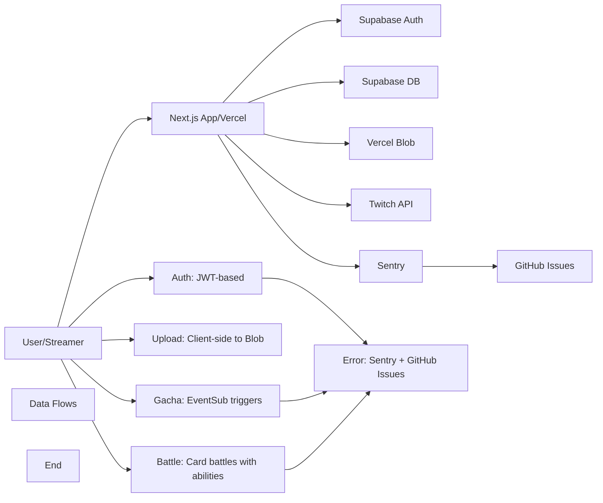

# TwiCa Architecture Document

## 概要

TwiCaはTwitch配信者向けのカードガチャシステムです。視聴者はチャンネルポイントを使ってガチャを引き、配信者が作成したオリジナルカードを収集できます。

---

## 機能要件

### 認証・認可
- Twitch OAuthによる配信者・視聴者認証
- Supabase Auth + カスタムCookieによるセッション管理
- 配信者は自身の配信者ページでのみカード管理が可能
- 視聴者は自分のカードとガチャ履歴のみ閲覧可能

### カード管理機能
- 配信者がカードを登録できる（名前、説明、画像URL、レアリティ、ドロップ率）
- カードの有効/無効切り替え
- カード画像はVercel Blob Storageに保存
- レアリティ: コモン、レア、エピック、レジェンダリー
- カード画像サイズ制限: 最大1MB

### ガチャ機能
- チャンネルポイントを使用したガチャシステム
- Twitch EventSubによるチャンネルポイント使用通知
- 重み付き確率によるカード選択
- ガチャ履歴の記録

### オーバーレイ表示
- ガチャ結果を配信画面にオーバーレイ表示
- ストリーマーIDごとのカスタマイズ可能な表示

### ダッシュボード機能
- 配信者ダッシュボード（カード管理、設定）
- 視聴者ダッシュボード（所持カード、ガチャ履歴）

---

## 非機能要件

### パフォーマンス
- APIレスポンス: 500ms以内（99パーセンタイル）
- ガチャ処理: 300ms以内
- 対戦処理: 1000ms以内
- 静的アセットのCDN配信（Vercel）
- データベースインデックスによるクエリ最適化
- データベースクエリフィールド選択の最適化

### セキュリティ
- HTTPSでの通信
- Supabase RLS (Row Level Security) による多層防御
- CSRF対策（SameSite=Lax Cookie + state検証）
- XSS対策（Reactの自動エスケープ）
- 環境変数によるシークレット管理
- セッション有効期限: 7日（Cookie + expiresAt検証）
- Twitch署名検証（EventSub Webhook）
- EventSubべき等性（event_idによる重複チェック）
- APIレート制限によるDoS攻撃対策
- 対戦の不正防止（ランダム性の確保）

### 可用性
- Vercelによる99.95% SLA
- Supabaseによる99.9% データベース可用性

### スケーラビリティ
- Vercel Serverless Functionsの自動スケーリング
- SupabaseのマネージドPostgreSQL（自動スケーリング）

---

## 受け入れ基準

### ユーザー認証
- [x] Twitch OAuthでログインできる
- [x] 配信者として認証される
- [x] 視聴者として認証される
- [x] ログアウトできる
- [x] セッション有効期限後に再認証が必要
- [x] Twitchログイン時のエラーが適切にハンドリングされる（Issue #19 - 解決済み）

### カード管理
- [x] カードを新規登録できる
- [x] カードを編集できる
- [x] カードを削除できる
- [x] カード画像をアップロードできる
- [x] カード画像サイズが1MB以下である
- [x] カードの有効/無効を切り替えられる
- [x] ドロップ率を設定できる（合計1.0以下）

### ガチャ機能
- [x] チャンネルポイントでガチャを引ける
- [x] ガチャ結果が正しく表示される
- [x] ドロップ率通りにカードが排出される
- [x] ガチャ履歴が記録される
- [x] 重みなしで同じ確率で排出される（全カードのドロップ率が等しい場合）

### オーバーレイ
- [x] ガチャ結果がOBS等のブラウザソースで表示できる
- [x] カード画像が正しく表示される
- [x] レアリティに応じた色が表示される

### データ整合性
- [x] RLSポリシーが正しく機能する
- [x] 配信者は自分のカードしか編集できない
- [x] 視聴者は自分のカードしか見れない
- [x] ガチャ履歴が正しく記録される

### APIレート制限（Issue #13）
- [x] `@upstash/ratelimit` と `@upstash/redis` をインストール
- [x] `src/lib/rate-limit.ts` を実装
- [x] 各 API ルートにレート制限を追加
- [x] 429 エラーが適切に返される
- [x] レート制限ヘッダーが設定される
- [x] 開発環境でインメモリレート制限が動作する
- [x] 本番環境で Redis レート制限が動作する
- [x] EventSub Webhook は緩いレート制限を持つ
- [x] 認証済みユーザーは twitchUserId で識別される
- [x] 未認証ユーザーは IP アドレスで識別される
- [x] フロントエンドで 429 エラーが適切に表示される

### カード対戦機能（Issue #15）
- [x] カードにステータス（HP、ATK、DEF、SPD）が追加される
- [x] 各カードにスキルが設定される
- [x] CPU対戦が可能
- [x] 自動ターン制バトルが動作する
- [x] 勝敗判定が正しく行われる
- [x] 対戦履歴が記録される
- [x] 対戦統計が表示される
- [x] フロントエンドで対戦が視覚的に楽しめる
- [x] アニメーション効果が表示される
- [x] モバイルで快適に操作可能

### 型安全性向上（Issue #17）
- [x] `any`型の使用が削減される
- [x] ESLintの`@typescript-eslint/no-explicit-any`警告が解消される
- [x] カード所有権の検証が正しく動作する
- [x] TypeScriptのコンパイルエラーがない
- [x] 既存のAPIテストがパスする

### APIエラーハンドリング標準化（Issue #18）
- [x] すべてのAPIルートで標準化されたエラーハンドラーを使用する
- [x] エラーメッセージがすべてのルートで一貫している
- [x] 既存のAPIテストがパスする
- [x] 手動テストでエラーハンドリングが正しく動作することを確認する
- [x] 既存の機能に回帰がない

### レート制限のfail-open問題修正（Issue #26）
- [x] Redisエラー発生時に `success: false` を返す
- [x] 本番環境ではエラー時にリクエストがブロックされる
- [x] 開発環境ではインメモリフォールバックが機能する
- [x] エラー発生時にSentryにログが送信される
- [x] TypeScript コンパイルエラーがない
- [x] ESLint エラーがない
- [x] 既存のAPIテストがパスする
- [x] レート制限が正しく動作する
- [x] 既存の機能に回帰がない

### データベースクエリ最適化（Issue #27）
- [x] すべての `.select('*')` が明示的なフィールド選択に置き換えられる
- [x] 各APIルートで必要なフィールドのみが選択される
- [x] TypeScript コンパイルエラーがない
- [x] ESLint エラーがない
- [x] 既存のAPIテストがパスする
- [x] APIレスポンス形式が維持される
- [x] 既存の機能に回帰がない
- [x] データ転送量が削減される（50%以上）

---

## 設計方針

### アーキテクチャパターン
- **クライアントサイド**: Next.js App Router + Server Components
- **サーバーサイド**: Vercel Serverless Functions
- **データストア**: Supabase (PostgreSQL)
- **ストレージ**: Vercel Blob
- **認証**: カスタムCookie + Twitch OAuth
- **エラートラッキング**: Sentry + GitHub Issues自動化

### デザイン原則
1. **Simple over Complex**: 複雑さを最小限に抑える
2. **Type Safety**: TypeScriptによる厳格な型定義
3. **Separation of Concerns**: 機能ごとのモジュール分割
4. **Security First**: アプリケーション層での認証検証 + RLS（多層防御）
5. **Consistency**: コードベース全体で一貫性を維持
6. **Error Handling**: ユーザーにわかりやすいエラーメッセージを提供
7. **Observability**: エラー追跡と自動イシュー作成により運用効率を向上
8. **Performance**: 最小限のデータ転送と効率的なクエリ実行

### 技術選定基準
- マネージドサービス優先（運用コスト削減）
- Next.jsエコシステムを活用（開発効率）
- カスタムセッションによる柔軟な認証管理
- Sentryによるエラー可視化

---

## アーキテクチャ

### システム全体図



---

## Issue #28: Performance - Fix N+1 Query Problem in Battle Stats API

### 問題

Battle Stats API (`src/app/api/battle/stats/route.ts`) にN+1クエリ問題がある。最近の対戦履歴を取得する際、1つの初期クエリで対戦データを取得し、その後、対戦ごとに別のデータベースクエリを実行して相手カードの詳細を取得している。

### 問題の詳細

#### 現在の実装 (lines 101-120)

```typescript
// 最近の対戦とカード詳細を取得
const { data: recentBattles, error: battlesError } = await supabaseAdmin
  .from('battles')
  .select(`
    id,
    result,
    turn_count,
    battle_log,
    created_at,
    opponent_card_id,
    user_card:user_cards(
      user_id,
      card_id,
      obtained_at,
      card:cards(
        id,
        name,
        hp,
        atk,
        def,
        spd,
        skill_type,
        skill_name,
        skill_power,
        image_url,
        rarity,
        streamer:streamers(
          twitch_user_id
        )
      )
    )
  `)
  .eq('user_id', userData.id)
  .order('created_at', { ascending: false })
  .limit(10)

// 最近の対戦の相手カード名を取得
const battleHistory = []
for (const battle of recentBattles || []) {
  // N個の追加クエリ - 各対戦ごとに1つ
  const { data: opponentCard, error: opponentError } = await supabaseAdmin
    .from('cards')
    .select('name')
    .eq('id', battleData.opponent_card_id)
    .single()

  battleHistory.push({
    battleId: battleData.id,
    result: battleData.result,
    opponentCardName: opponentError ? 'CPUカード' : `CPUの${opponentCard.name}`,
    turnCount: battleData.turn_count,
    createdAt: battleData.created_at,
    userCardName: battleData.user_card.card.name
  })
}
```

### 影響

- **パフォーマンス**: 対戦数が増加すると、1つのクエリではなくN+1個のデータベースクエリが実行される
- **レイテンシ**: 各追加クエリはネットワークレイテンシを追加する
- **データベース負荷**: データベースに不必要な負荷をかける
- **スケーラビリティ**: ユーザーベースが増加するとボトルネックになる

### 優先度

**High** - ユーザー体験に影響するパフォーマンス最適化

---

## Issue #28: 設計

### 機能要件

#### 1. N+1クエリ問題の解決

Battle Stats APIの最近の対戦履歴取得において、すべての必要なデータを単一のクエリで取得する：

1. **初期クエリの修正**
   - `battles` テーブルのクエリに `opponent_card` のJOINを追加
   - 単一のクエリで相手カードの詳細を取得

2. **ループの削除**
   - 各対戦ごとの追加クエリを削除
   - 配列の `map` 操作でデータを処理

### 非機能要件

#### パフォーマンス

- データベースクエリ数の削減（目標: N+1から1へ）
- APIレスポンス時間の短縮
- データベース負荷の軽減

#### 互換性

- 既存のAPIレスポンス形式を維持
- 既存の機能に回帰がない

### 設計

#### 1. Battle Stats APIの最適化

**src/app/api/battle/stats/route.ts**

**変更前** (Lines 101-120):
```typescript
// Get recent battles with card details
const { data: recentBattles, error: battlesError } = await supabaseAdmin
  .from('battles')
  .select(`
    id,
    result,
    turn_count,
    battle_log,
    created_at,
    opponent_card_id,
    user_card:user_cards(
      user_id,
      card_id,
      obtained_at,
      card:cards(
        id,
        name,
        hp,
        atk,
        def,
        spd,
        skill_type,
        skill_name,
        skill_power,
        image_url,
        rarity,
        streamer:streamers(
          twitch_user_id
        )
      )
    )
  `)
  .eq('user_id', userData.id)
  .order('created_at', { ascending: false })
  .limit(10)

// Get opponent card names for recent battles
const battleHistory = []
for (const battle of recentBattles || []) {
  const { data: opponentCard, error: opponentError } = await supabaseAdmin
    .from('cards')
    .select('name')
    .eq('id', battleData.opponent_card_id)
    .single()

  battleHistory.push({
    battleId: battleData.id,
    result: battleData.result,
    opponentCardName: opponentError ? 'CPUカード' : `CPUの${opponentCard.name}`,
    turnCount: battleData.turn_count,
    createdAt: battleData.created_at,
    userCardName: battleData.user_card.card.name
  })
}
```

**変更後**:
```typescript
// Get recent battles with all card details (including opponent card)
const { data: recentBattles, error: battlesError } = await supabaseAdmin
  .from('battles')
  .select(`
    id,
    result,
    turn_count,
    battle_log,
    created_at,
    user_card:user_cards(
      user_id,
      card_id,
      obtained_at,
      card:cards(
        id,
        name,
        hp,
        atk,
        def,
        spd,
        skill_type,
        skill_name,
        skill_power,
        image_url,
        rarity,
        streamer:streamers(
          twitch_user_id
        )
      )
    ),
    opponent_card:cards(
      id,
      name
    )
  `)
  .eq('user_id', userData.id)
  .order('created_at', { ascending: false })
  .limit(10)

if (battlesError) {
  return handleDatabaseError(battlesError, "Failed to fetch recent battles")
}

// Process battles without additional queries
const battleHistory = (recentBattles || []).map(battle => ({
  battleId: battle.id,
  result: battle.result,
  opponentCardName: battle.opponent_card ? `CPUの${battle.opponent_card.name}` : 'CPUカード',
  turnCount: battle.turn_count,
  createdAt: battle.created_at,
  userCardName: battle.user_card.card.name
}))
```

**理由**:
- `battles` テーブルには `opponent_card_id` があり、`cards` テーブルを参照している
- 初期クエリは既に `user_cards` と `cards` をJOINしてユーザーカード詳細を取得している
- 相手カードJOINを追加するのは簡単で、同じクエリの一部にすべき
- これにより最大10回の追加クエリが削減される

### 変更ファイル

- `src/app/api/battle/stats/route.ts` (更新 - 最近の対戦履歴クエリの最適化)

### 受け入れ基準

- [ ] N+1クエリ問題が解決される
- [ ] 最近の対戦履歴が単一のクエリで取得される
- [ ] APIレスポンス形式が維持される
- [ ] TypeScript コンパイルエラーがない
- [ ] ESLint エラーがない
- [ ] 既存のAPIテストがパスする
- [ ] 既存の機能に回帰がない
- [ ] データベースクエリ数が削減される（10件の対戦で11→1へ）

### テスト計画

1. **単体テスト**:
   - 既存の単体テストがパスすることを確認
   - Battle Stats APIが正しいデータを返すことを確認

2. **統合テスト**:
   - Battle Stats APIの統合テストがパスすることを確認
   - APIレスポンス形式が変更されていないことを確認

3. **パフォーマンステスト**:
   - 最適化前後でクエリ数を比較
   - APIレスポンス時間を計測
   - データベースクエリ数を検証（1回のみであることを確認）

4. **手動テスト**:
   - バトル統計ページが正しく表示されることを確認
   - 最近の対戦履歴が正しく表示されることを確認

### トレードオフの検討

#### 現在の実装 vs 最適化された実装

| 項目 | 現在の実装 (N+1) | 最適化された実装 |
|:---|:---|:---|
| **実装の複雑さ** | 低（forループ） | 中（JOINを使用） |
| **データベースクエリ数** | 1 + N（最大11） | 1 |
| **APIレスポンス時間** | 遅い（追加のネットワークレイテンシ） | 速い（単一クエリ） |
| **データベース負荷** | 高 | 低 |
| **スケーラビリティ** | 低（対戦数増加で悪化） | 高（対戦数に依存しない） |
| **コードの可読性** | 高 | 高 |

**推奨**: 最適化された実装（JOINを使用）

### 関連問題

この問題は他のAPIルートでも存在する可能性があるため、同様のパターンを他のルートでも確認することを推奨：
- `src/app/api/battle/[battleId]/route.ts` - 既に最適化されている（lines 97-101でJOINを使用）

---

## 更新履歴

| 日付 | 変更内容 |
|:---|:---|
| 2026-01-18 | Issue #28 N+1クエリ問題の設計追加 |
| 2026-01-18 | Issue #27 データベースクエリ最適化の実装完了 |
| 2026-01-18 | Issue #27 データベースクエリ最適化の設計追加 |
| 2026-01-17 | Issue #26 レート制限のfail-open問題の実装完了 |
| 2026-01-17 | Issue #25 エラーメッセージの一貫性問題の実装完了 |

---

## Issue #27: Performance - Optimize Database Queries by Selecting Only Required Fields (実装完了)

### 実装内容

- [x] すべての `.select('*')` が明示的なフィールド選択に置き換えられる
- [x] 各APIルートで必要なフィールドのみが選択される
- [x] TypeScript コンパイルエラーなし
- [x] ESLint エラーなし
- [x] CIが成功
- [x] Issue #27 クローズ済み

---

## Issue #26: Critical Security - Rate Limiting Fails Open on Error (実装完了)

### 実装内容

- [x] `src/lib/rate-limit.ts` で fail-closed 動作を実装
- [x] 本番環境では Redis エラー時にリクエストをブロック
- [x] 開発環境ではインメモリフォールバックを使用
- [x] サーキットブレーカーパターンを導入
- [x] Sentry エラー報告を強化
- [x] TypeScript コンパイルエラーなし
- [x] ESLint エラーなし
- [x] CIが成功
- [x] Issue #26 クローズ済み

---

## Issue #25: Inconsistent Error Messages in API Responses (実装完了)

### 実装内容

- [x] `src/lib/constants.ts` に `ERROR_MESSAGES` 定数を追加
- [x] `src/types/api.ts` を新規作成（APIレスポンスタイプの定義）
- [x] すべてのAPIルートでエラーメッセージ定数を使用
- [x] すべてのエラーメッセージを英語に統一
- [x] レート制限エラーメッセージを英語に更新
- [x] TypeScript コンパイルエラーなし
- [x] ESLint エラーなし
- [x] CIが成功
- [x] Issue #25 クローズ済み
