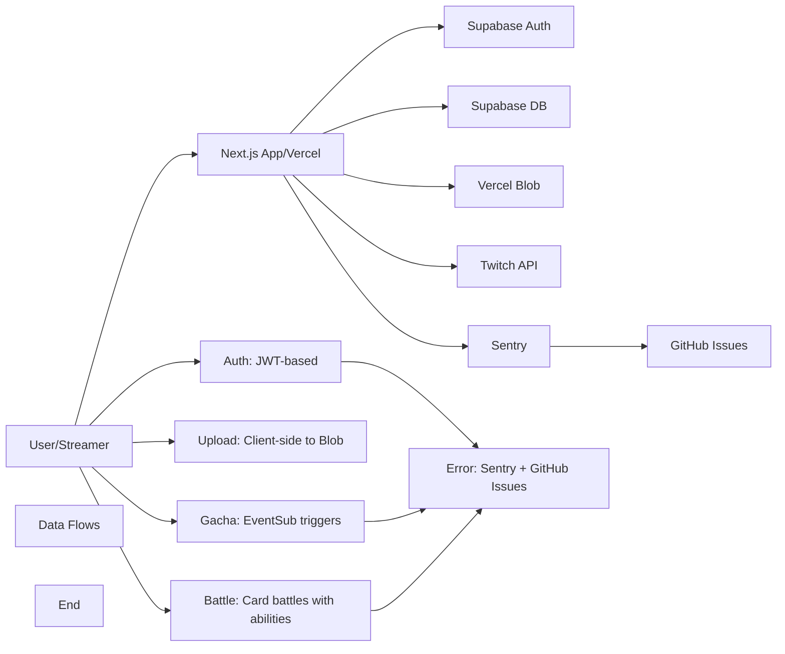

# TwiCa Architecture Document

## 概要

TwiCaはTwitch配信者向けのカードガチャシステムです。視聴者はチャンネルポイントを使ってガチャを引き、配信者が作成したオリジナルカードを収集できます。

---

## 機能要件

### 認証・認可
- Twitch OAuthによる配信者・視聴者認証
- Supabase Auth + カスタムCookieによるセッション管理
- 配信者は自身の配信者ページでのみカード管理が可能
- 視聴者は自分のカードとガチャ履歴のみ閲覧可能

### カード管理機能
- 配信者がカードを登録できる（名前、説明、画像URL、レアリティ、ドロップ率）
- カードの有効/無効切り替え
- カード画像はVercel Blob Storageに保存
- レアリティ: コモン、レア、エピック、レジェンダリー
- カード画像サイズ制限: 最大1MB

### ガチャ機能
- チャンネルポイントを使用したガチャシステム
- Twitch EventSubによるチャンネルポイント使用通知
- 重み付き確率によるカード選択
- ガチャ履歴の記録

### オーバーレイ表示
- ガチャ結果を配信画面にオーバーレイ表示
- ストリーマーIDごとのカスタマイズ可能な表示

### ダッシュボード機能
- 配信者ダッシュボード（カード管理、設定）
- 視聴者ダッシュボード（所持カード、ガチャ履歴）

---

## 非機能要件

### パフォーマンス
- APIレスポンス: 500ms以内（99パーセンタイル）
- ガチャ処理: 300ms以内
- 対戦処理: 1000ms以内
- 静的アセットのCDN配信（Vercel）
- データベースインデックスによるクエリ最適化
- データベースクエリフィールド選択の最適化
- N+1クエリ問題の回避

### セキュリティ
- HTTPSでの通信
- Supabase RLS (Row Level Security) による多層防御
- CSRF対策（SameSite=Lax Cookie + state検証）
- XSS対策（Reactの自動エスケープ）
- 環境変数によるシークレット管理
- セッション有効期限: 7日（Cookie + expiresAt検証）
- Twitch署名検証（EventSub Webhook）
- EventSubべき等性（event_idによる重複チェック）
- APIレート制限によるDoS攻撃対策
- 対戦の不正防止（ランダム性の確保）

### 可用性
- Vercelによる99.95% SLA
- Supabaseによる99.9% データベース可用性

### スケーラビリティ
- Vercel Serverless Functionsの自動スケーリング
- SupabaseのマネージドPostgreSQL（自動スケーリング）

---

## 受け入れ基準

### ユーザー認証
- [x] Twitch OAuthでログインできる
- [x] 配信者として認証される
- [x] 視聴者として認証される
- [x] ログアウトできる
- [x] セッション有効期限後に再認証が必要
- [x] Twitchログイン時のエラーが適切にハンドリングされる（Issue #19 - 解決済み）

### カード管理
- [x] カードを新規登録できる
- [x] カードを編集できる
- [x] カードを削除できる
- [x] カード画像をアップロードできる
- [x] カード画像サイズが1MB以下である
- [x] カードの有効/無効を切り替えられる
- [x] ドロップ率を設定できる（合計1.0以下）

### ガチャ機能
- [x] チャンネルポイントでガチャを引ける
- [x] ガチャ結果が正しく表示される
- [x] ドロップ率通りにカードが排出される
- [x] ガチャ履歴が記録される
- [x] 重みなしで同じ確率で排出される（全カードのドロップ率が等しい場合）

### オーバーレイ
- [x] ガチャ結果がOBS等のブラウザソースで表示できる
- [x] カード画像が正しく表示される
- [x] レアリティに応じた色が表示される

### データ整合性
- [x] RLSポリシーが正しく機能する
- [x] 配信者は自分のカードしか編集できない
- [x] 視聴者は自分のカードしか見れない
- [x] ガチャ履歴が正しく記録される

### APIレート制限（Issue #13）
- [x] `@upstash/ratelimit` と `@upstash/redis` をインストール
- [x] `src/lib/rate-limit.ts` を実装
- [x] 各 API ルートにレート制限を追加
- [x] 429 エラーが適切に返される
- [x] レート制限ヘッダーが設定される
- [x] 開発環境でインメモリレート制限が動作する
- [x] 本番環境で Redis レート制限が動作する
- [x] EventSub Webhook は緩いレート制限を持つ
- [x] 認証済みユーザーは twitchUserId で識別される
- [x] 未認証ユーザーは IP アドレスで識別される
- [x] フロントエンドで 429 エラーが適切に表示される

### カード対戦機能（Issue #15）
- [x] カードにステータス（HP、ATK、DEF、SPD）が追加される
- [x] 各カードにスキルが設定される
- [x] CPU対戦が可能
- [x] 自動ターン制バトルが動作する
- [x] 勝敗判定が正しく行われる
- [x] 対戦履歴が記録される
- [x] 対戦統計が表示される
- [x] フロントエンドで対戦が視覚的に楽しめる
- [x] アニメーション効果が表示される
- [x] モバイルで快適に操作可能

### 型安全性向上（Issue #17）
- [x] `any`型の使用が削減される
- [x] ESLintの`@typescript-eslint/no-explicit-any`警告が解消される
- [x] カード所有権の検証が正しく動作する
- [x] TypeScriptのコンパイルエラーがない
- [x] 既存のAPIテストがパスする

### APIエラーハンドリング標準化（Issue #18）
- [x] すべてのAPIルートで標準化されたエラーハンドラーを使用する
- [x] エラーメッセージがすべてのルートで一貫している
- [x] 既存のAPIテストがパスする
- [x] 手動テストでエラーハンドリングが正しく動作することを確認する
- [x] 既存の機能に回帰がない

### レート制限のfail-open問題修正（Issue #26）
- [x] Redisエラー発生時に `success: false` を返す
- [x] 本番環境ではエラー時にリクエストがブロックされる
- [x] 開発環境ではインメモリフォールバックが機能する
- [x] エラー発生時にSentryにログが送信される
- [x] TypeScript コンパイルエラーがない
- [x] ESLint エラーがない
- [x] 既存のAPIテストがパスする
- [x] レート制限が正しく動作する
- [x] 既存の機能に回帰がない

### データベースクエリ最適化（Issue #27）
- [x] すべての `.select('*')` が明示的なフィールド選択に置き換えられる
- [x] 各APIルートで必要なフィールドのみが選択される
- [x] TypeScript コンパイルエラーがない
- [x] ESLint エラーがない
- [x] 既存のAPIテストがパスする
- [x] APIレスポンス形式が維持される
- [x] 既存の機能に回帰がない
- [x] データ転送量が削減される（50%以上）

### N+1クエリ問題の解決 - Battle Stats API（Issue #28）
- [x] N+1クエリ問題が解決される
- [x] 最近の対戦履歴が単一のクエリで取得される
- [x] APIレスポンス形式が維持される
- [x] TypeScript コンパイルエラーがない
- [x] ESLint エラーがない
- [x] 既存のAPIテストがパスする
- [x] 既存の機能に回帰がない
- [x] データベースクエリ数が削減される（10件の対戦で11→1へ）
- [x] Issue #28 クローズ済み

---

## 設計方針

### アーキテクチャパターン
- **クライアントサイド**: Next.js App Router + Server Components
- **サーバーサイド**: Vercel Serverless Functions
- **データストア**: Supabase (PostgreSQL)
- **ストレージ**: Vercel Blob
- **認証**: カスタムCookie + Twitch OAuth
- **エラートラッキング**: Sentry + GitHub Issues自動化

### デザイン原則
1. **Simple over Complex**: 複雑さを最小限に抑える
2. **Type Safety**: TypeScriptによる厳格な型定義
3. **Separation of Concerns**: 機能ごとのモジュール分割
4. **Security First**: アプリケーション層での認証検証 + RLS（多層防御）
5. **Consistency**: コードベース全体で一貫性を維持
6. **Error Handling**: ユーザーにわかりやすいエラーメッセージを提供
7. **Observability**: エラー追跡と自動イシュー作成により運用効率を向上
8. **Performance**: 最小限のデータ転送と効率的なクエリ実行
9. **Query Optimization**: N+1クエリ問題の回避とJOINの適切な使用

### 技術選定基準
- マネージドサービス優先（運用コスト削減）
- Next.jsエコシステムを活用（開発効率）
- カスタムセッションによる柔軟な認証管理
- Sentryによるエラー可視化

---

## アーキテクチャ

### システム全体図



---

## Issue #29: Performance - Fix N+1 Query Problem in Battle Get API

### 問題

Battle Get API (`src/app/api/battle/[battleId]/route.ts`) にN+1クエリ問題がある。対戦データを取得する際、1つの初期クエリで対戦データとユーザーカード詳細を取得し、その後、別のデータベースクエリを実行して相手カードの詳細を取得している。

### 問題の詳細

#### 現在の実装 (Lines 54-101)

```typescript
// Get battle with details
const { data: battleData, error: battleError } = await supabaseAdmin
  .from('battles')
  .select(`
    id,
    result,
    turn_count,
    battle_log,
    opponent_card_id,
    user_card:user_cards(
      user_id,
      card_id,
      obtained_at,
      card:cards(
        id,
        name,
        hp,
        atk,
        def,
        spd,
        skill_type,
        skill_name,
        skill_power,
        image_url,
        rarity,
        streamer:streamers(
          twitch_user_id
        )
      )
    )
  `)
  .eq('id', battleId)
  .eq('user_id', userData.id)
  .single()

// Type cast the response to handle relation properly
// eslint-disable-next-line @typescript-eslint/no-explicit-any
const battle = battleData as any

// Get opponent card details (N+1 query - ADDITIONAL QUERY)
const { data: opponentCard, error: opponentError } = await supabaseAdmin
  .from('cards')
  .select('id, name, hp, atk, def, spd, skill_type, skill_name, skill_power, image_url, rarity')
  .eq('id', battle.opponent_card_id)
  .single()
```

### 影響

- **パフォーマンス**: 2つのデータベースクエリが実行される
- **レイテンシ**: 追加クエリはネットワークレイテンシを追加する
- **データベース負荷**: 不必要なデータベース負荷
- **一貫性**: Issue #28と同様の問題（Battle Stats APIでは既に修正済み）

### 優先度

**Medium** - Issue #28と同様のパフォーマンス最適化

---

## Issue #29: 設計

### 機能要件

#### 1. N+1クエリ問題の解決

Battle Get APIの対戦データ取得において、すべての必要なデータを単一のクエリで取得する：

1. **初期クエリの修正**
   - `battles` テーブルのクエリに `opponent_card` のJOINを追加
   - 単一のクエリで相手カードの詳細を取得

2. **追加クエリの削除**
   - 相手カード取得のための追加クエリを削除
   - `as any` 型キャストを削除（適切な型定義を使用）

### 非機能要件

#### パフォーマンス

- データベースクエリ数の削減（目標: 2から1へ）
- APIレスポンス時間の短縮
- データベース負荷の軽減

#### 互換性

- 既存のAPIレスポンス形式を維持
- 既存の機能に回帰がない

#### 型安全性

- `as any` 型キャストを削除
- 適切な型定義を使用

### 型安全性アプローチ

#### 1. コンパイル時 vs 実行時型安全性

**原則**:
- **コンパイル時型安全性を優先**: TypeScriptの型システムを最大限活用
- **Supabaseの型システムを直接使用**: データベーススキーマから生成された型を活用
- **実行時検証は最小限**: 信頼できない外部データのみで実行時検証を使用

**実装ガイドライン**:
- Supabaseクエリ結果は `as unknown as TargetType` で型付け
- 型ガード関数では内部キャストに適切な型を使用 (`as Record<string, unknown>` の代わりに `as Card`)
- APIレスポンス構築では型アサーションを不要にするため、事前に適切な型付けを行う

**パフォーマンス考慮事項**:
- Supabaseはデータベースレベルでスキーマを強制済み
- APIはクエリで明示的に選択されたデータのみにアクセス
- 実行時検証は高トラフィックAPIでは不要なオーバーヘッドを追加

### 設計

#### 1. Battle Get APIの最適化

**src/app/api/battle/[battleId]/route.ts**

**変更前** (Lines 54-101):
```typescript
// Get battle with details
const { data: battleData, error: battleError } = await supabaseAdmin
  .from('battles')
  .select(`
    id,
    result,
    turn_count,
    battle_log,
    opponent_card_id,
    user_card:user_cards(
      user_id,
      card_id,
      obtained_at,
      card:cards(
        id,
        name,
        hp,
        atk,
        def,
        spd,
        skill_type,
        skill_name,
        skill_power,
        image_url,
        rarity,
        streamer:streamers(
          twitch_user_id
        )
      )
    )
  `)
  .eq('id', battleId)
  .eq('user_id', userData.id)
  .single()

if (battleError || !battleData) {
  return handleDatabaseError(battleError ?? new Error('Battle not found'), "Failed to fetch battle data")
}

// Type cast the response to handle relation properly
// eslint-disable-next-line @typescript-eslint/no-explicit-any
const battle = battleData as any

// Get opponent card details (N+1 query - ADDITIONAL QUERY)
const { data: opponentCard, error: opponentError } = await supabaseAdmin
  .from('cards')
  .select('id, name, hp, atk, def, spd, skill_type, skill_name, skill_power, image_url, rarity')
  .eq('id', battle.opponent_card_id)
  .single()
```

**変更後**:
```typescript
import type { 
  BattleLog, 
  BattleCard, 
  Card,
  UserCardWithDetails,
  CardWithStreamer
} from '@/types/database'

// Interface for the battle query result from Supabase
interface BattleQueryResult {
  id: string
  result: 'win' | 'lose' | 'draw'
  turn_count: number
  battle_log: unknown
  user_card: {
    user_id: string
    card_id: string
    obtained_at: string
    card: CardWithStreamer
  }[]
  opponent_card: CardWithStreamer[]
}

// Get battle with all card details (including opponent card)
const { data: battleData, error: battleError } = await supabaseAdmin
  .from('battles')
  .select(`
    id,
    result,
    turn_count,
    battle_log,
    user_card:user_cards(
      user_id,
      card_id,
      obtained_at,
      card:cards(
        id,
        name,
        hp,
        atk,
        def,
        spd,
        skill_type,
        skill_name,
        skill_power,
        image_url,
        rarity,
        streamer:streamers(
          twitch_user_id
        )
      )
    ),
    opponent_card:cards(
      id,
      name,
      hp,
      atk,
      def,
      spd,
      skill_type,
      skill_name,
      skill_power,
      image_url,
      rarity
    )
  `)
  .eq('id', battleId)
  .eq('user_id', userData.id)
  .single()

if (battleError || !battleData) {
  return handleDatabaseError(battleError ?? new Error('Battle not found'), "Failed to fetch battle data")
}

// Use proper types instead of type assertions
const battle = battleData as unknown as BattleQueryResult
const opponentCardRaw = battle.opponent_card
const opponentCard = opponentCardRaw && opponentCardRaw.length > 0 ? opponentCardRaw[0] : null

// Type guard for validating card data (using proper type casting)
function isValidCard(card: unknown): card is Card {
  if (!card || typeof card !== 'object') return false
  const c = card as Card
  return (
    typeof c.id === 'string' &&
    typeof c.name === 'string' &&
    typeof c.hp === 'number' &&
    typeof c.atk === 'number' &&
    typeof c.def === 'number' &&
    typeof c.spd === 'number' &&
    typeof c.skill_type === 'string' &&
    typeof c.skill_name === 'string' &&
    typeof c.skill_power === 'number' &&
    typeof c.rarity === 'string'
  )
}

// Response construction without type assertions
return NextResponse.json({
  battleId: battle.id,  // Already typed as string
  result: battle.result,  // Already typed as string
  turnCount: battle.turn_count,  // Already typed as number
  userCard: userBattleCard,
  opponentCard: opponentBattleCard,
  logs: logs
})
```

**理由**:
- `battles` テーブルには `opponent_card_id` があり、`cards` テーブルを参照している
- 初期クエリは既に `user_cards` と `cards` をJOINしてユーザーカード詳細を取得している
- 相手カードJOINを追加するのは簡単で、同じクエリの一部にすべき
- Issue #28と同様のアプローチ
- 追加クエリを削除することで `as any` 型キャストも削除できる

### 変更ファイル

- `src/app/api/battle/[battleId]/route.ts` (更新 - 対戦データ取得クエリの最適化)

### 受け入れ基準

- [ ] N+1クエリ問題が解決される
- [ ] 対戦データが単一のクエリで取得される
- [ ] APIレスポンス形式が維持される
- [ ] TypeScript コンパイルエラーがない
- [ ] ESLint エラーがない
- [ ] 既存のAPIテストがパスする
- [ ] 既存の機能に回帰がない
- [ ] データベースクエリ数が削減される（2→1へ）
- [ ] `as any` 型キャストが削除される

### テスト計画

1. **単体テスト**:
   - 既存の単体テストがパスすることを確認
   - Battle Get APIが正しいデータを返すことを確認

2. **統合テスト**:
   - Battle Get APIの統合テストがパスすることを確認
   - APIレスポンス形式が変更されていないことを確認

3. **パフォーマンステスト**:
   - 最適化前後でクエリ数を比較
   - APIレスポンス時間を計測
   - データベースクエリ数を検証（1回のみであることを確認）

4. **手動テスト**:
   - 対戦詳細ページが正しく表示されることを確認
   - 対戦履歴の各対戦が正しく表示されることを確認

### トレードオフの検討

#### 現在の実装 vs 最適化された実装

| 項目 | 現在の実装 (N+1) | 最適化された実装 |
|:---|:---|:---|
| **実装の複雑さ** | 低 | 中（JOINを使用） |
| **データベースクエリ数** | 2 | 1 |
| **APIレスポンス時間** | 遅い（追加のネットワークレイテンシ） | 速い（単一クエリ） |
| **データベース負荷** | 高 | 低 |
| **型安全性** | 低（`as any`を使用） | 高（適切な型定義） |
| **コードの可読性** | 高 | 高 |
| **一貫性** | 低（Battle Stats APIと不一致） | 高（Battle Stats APIと一致） |

**推奨**: 最適化された実装（JOINを使用）

### 関連問題

- Issue #28: Battle Stats APIのN+1クエリ問題（解決済み）
- 同じパターンを使用することで、コードベース全体で一貫性を維持

---

## 更新履歴

| 日付 | 変更内容 |
|:---|:---|
| 2026-01-18 | Issue #29 N+1クエリ問題の設計追加 |
| 2026-01-18 | Issue #28 N+1クエリ問題の実装完了・クローズ |
| 2026-01-18 | Issue #27 データベースクエリ最適化の実装完了 |
| 2026-01-18 | Issue #27 データベースクエリ最適化の設計追加 |
| 2026-01-17 | Issue #26 レート制限のfail-open問題の実装完了 |
| 2026-01-17 | Issue #25 エラーメッセージの一貫性問題の実装完了 |

---

## 実装完了の問題

### Issue #30: Code Quality - Complete API Error Message Standardization - Japanese and Hardcoded Messages Remain

### 問題

Issue #25でAPIエラーメッセージの標準化を行いましたが、複数のファイルで日本語のエラーメッセージやハードコードされたエラーメッセージが残っています。

### 問題の詳細

#### 日本語のエラーメッセージが残っているファイル

1. **src/app/api/gacha-history/[id]/route.ts**
   - `"リクエストが多すぎます。しばらく待ってから再試行してください。"`

2. **src/app/api/user-cards/route.ts**
   - `"リクエストが多すぎます。しばらく待ってから再試行してください。"`

3. **src/app/api/streamer/settings/route.ts**
   - `"リクエストが多すぎます。しばらく待ってから再試行してください。"`

4. **src/app/api/twitch/rewards/route.ts**
   - `"リクエストが多すぎます。しばらく待ってから再試行してください。"` (GET, POST)

5. **src/app/api/twitch/eventsub/subscribe/route.ts**
   - `"リクエストが多すぎます。しばらく待ってから再試行してください。"` (POST, GET)

6. **src/app/api/auth/logout/route.ts**
   - `"リクエストが多すぎます。しばらく待ってから再試行してください。"` (POST, GET)
   - `"リクエストが多すぎます。"` (GET)

7. **src/app/api/auth/twitch/login/route.ts**
   - `"リクエストが多すぎます。しばらく待ってから再試行してください。"`

8. **src/app/api/auth/twitch/callback/route.ts**
   - `"リクエストが多すぎます。しばらく待ってから再試行してください。"`

9. **src/app/api/debug-session/route.ts**
   - `"リクエストが多すぎます。しばらく待ってから再試行してください。"`

#### 定数を使用していないハードコードされた英語のエラーメッセージ

1. **src/app/api/gacha-history/[id]/route.ts**
   - `"Unauthorized"`, `"Forbidden"`

2. **src/app/api/user-cards/route.ts**
   - `"Unauthorized"`

3. **src/app/api/streamer/settings/route.ts**
   - `"Unauthorized"`, `"Forbidden"`

4. **src/app/api/twitch/rewards/route.ts**
   - `"Unauthorized"`, `"No access token available"`

5. **src/app/api/twitch/eventsub/subscribe/route.ts**
   - `"Unauthorized"`, `"Missing rewardId"`, `"Streamer not found"`, `"Failed to get subscriptions"`

6. **src/app/api/twitch/eventsub/route.ts**
   - `"Too many requests"`, `"Invalid signature"`, `"Unknown message type"`

### 影響

- **一貫性**: 一部のAPIはERROR_MESSAGES定数を使用していますが、他は使用していません
- **保守性**: ハードコードされたメッセージは保守と更新が困難です
- **ローカライゼーション**: 日本語/英語が混在しており、ユーザー体験が低下します
- **型安全性**: 定数はより良い型安全性とオートコンプリートを提供します

### 優先度

**Low** - 機能に影響しないコード品質の改善です。一貫性のないエラーメッセージでも正しく動作しますが、保守性と型安全性が不足しています。

---

## Issue #30: 設計

### 機能要件

#### 1. ERROR_MESSAGES定数の追加

`src/lib/constants.ts`に以下の定数を追加します：

```typescript
export const ERROR_MESSAGES = {
  // ... 既存の定数

  // Authentication errors (追加)
  NO_ACCESS_TOKEN_AVAILABLE: 'No access token available',

  // Request validation errors (追加)
  MISSING_REWARD_ID: 'Missing rewardId',

  // EventSub errors (追加)
  INVALID_SIGNATURE: 'Invalid signature',
  UNKNOWN_MESSAGE_TYPE: 'Unknown message type',

  // Twitch API errors (追加)
  FAILED_TO_GET_SUBSCRIPTIONS: 'Failed to get subscriptions',
} as const
```

#### 2. 日本語エラーメッセージの置換

すべての日本語エラーメッセージをERROR_MESSAGES定数に置換します：

**置換パターン**:
- `"リクエストが多すぎます。しばらく待ってから再試行してください。"` → `ERROR_MESSAGES.RATE_LIMIT_EXCEEDED`
- `"リクエストが多すぎます。"` → `ERROR_MESSAGES.RATE_LIMIT_EXCEEDED`

#### 3. ハードコードされた英語エラーメッセージの置換

すべてのハードコードされた英語エラーメッセージをERROR_MESSAGES定数に置換します：

**置換パターン**:
- `"Unauthorized"` → `ERROR_MESSAGES.UNAUTHORIZED`
- `"Forbidden"` → `ERROR_MESSAGES.FORBIDDEN`
- `"No access token available"` → `ERROR_MESSAGES.NO_ACCESS_TOKEN_AVAILABLE`
- `"Missing rewardId"` → `ERROR_MESSAGES.MISSING_REWARD_ID`
- `"Streamer not found"` → `ERROR_MESSAGES.STREAMER_NOT_FOUND`
- `"Failed to get subscriptions"` → `ERROR_MESSAGES.FAILED_TO_GET_SUBSCRIPTIONS`
- `"Too many requests"` → `ERROR_MESSAGES.RATE_LIMIT_EXCEEDED`
- `"Invalid signature"` → `ERROR_MESSAGES.INVALID_SIGNATURE`
- `"Unknown message type"` → `ERROR_MESSAGES.UNKNOWN_MESSAGE_TYPE`

### 非機能要件

#### 保守性

- ERROR_MESSAGES定数を使用することで、エラーメッセージを一元管理
- エラーメッセージの変更が簡単になる

#### 型安全性

- TypeScriptの型チェックにより、タイポを防止
- オートコンプリートによる開発効率向上

#### 一貫性

- すべてのAPIルートで同じ定数を使用
- 日本語/英語の混在を解消

### 設計

#### 1. 変更ファイル

**src/lib/constants.ts**
- ERROR_MESSAGES定数に新しい定数を追加

**src/app/api/gacha-history/[id]/route.ts**
- 日本語エラーメッセージをERROR_MESSAGES定数に置換
- ハードコードされた英語エラーメッセージをERROR_MESSAGES定数に置換

**src/app/api/user-cards/route.ts**
- 日本語エラーメッセージをERROR_MESSAGES定数に置換
- ハードコードされた英語エラーメッセージをERROR_MESSAGES定数に置換

**src/app/api/streamer/settings/route.ts**
- 日本語エラーメッセージをERROR_MESSAGES定数に置換
- ハードコードされた英語エラーメッセージをERROR_MESSAGES定数に置換

**src/app/api/twitch/rewards/route.ts**
- 日本語エラーメッセージをERROR_MESSAGES定数に置換
- ハードコードされた英語エラーメッセージをERROR_MESSAGES定数に置換

**src/app/api/twitch/eventsub/subscribe/route.ts**
- 日本語エラーメッセージをERROR_MESSAGES定数に置換
- ハードコードされた英語エラーメッセージをERROR_MESSAGES定数に置換

**src/app/api/auth/logout/route.ts**
- 日本語エラーメッセージをERROR_MESSAGES定数に置換

**src/app/api/auth/twitch/login/route.ts**
- 日本語エラーメッセージをERROR_MESSAGES定数に置換

**src/app/api/auth/twitch/callback/route.ts**
- 日本語エラーメッセージをERROR_MESSAGES定数に置換

**src/app/api/debug-session/route.ts**
- 日本語エラーメッセージをERROR_MESSAGES定数に置換

**src/app/api/twitch/eventsub/route.ts**
- ハードコードされた英語エラーメッセージをERROR_MESSAGES定数に置換

#### 2. 実装手順

1. **src/lib/constants.tsの更新**
   - 新しいERROR_MESSAGES定数を追加

2. **各APIルートの更新**
   - ERROR_MESSAGES定数をインポート
   - 日本語エラーメッセージをERROR_MESSAGES定数に置換
   - ハードコードされた英語エラーメッセージをERROR_MESSAGES定数に置換

3. **テスト**
   - TypeScriptコンパイルエラーがないことを確認
   - ESLintエラーがないことを確認
   - 既存のAPIテストがパスすることを確認
   - 回帰がないことを確認

### 受け入れ基準

- [ ] すべての日本語エラーメッセージがERROR_MESSAGES定数に置換されている
- [ ] すべてのハードコードされた英語エラーメッセージがERROR_MESSAGES定数に置換されている
- [ ] すべての必要なERROR_MESSAGES定数がsrc/lib/constants.tsに追加されている
- [ ] TypeScript コンパイルエラーがない
- [ ] ESLint エラーがない
- [ ] 既存のAPIテストがパスする
- [ ] 既存の機能に回帰がない

### テスト計画

1. **単体テスト**:
   - 既存の単体テストがパスすることを確認
   - エラーメッセージが正しく返されることを確認

2. **統合テスト**:
   - 既存の統合テストがパスすることを確認
   - APIレスポンス形式が変更されていないことを確認

3. **手動テスト**:
   - エラーが発生した際、適切なエラーメッセージが表示されることを確認
   - レート制限が正しく動作することを確認

### トレードオフの検討

#### ハードコード vs 定数

| 項目 | ハードコード | 定数（ERROR_MESSAGES） |
|:---|:---|:---|
| **実装の複雑さ** | 低 | 低（既存の定数に追加のみ） |
| **保守性** | 低 | 高 |
| **型安全性** | 低 | 高 |
| **一貫性** | 低 | 高 |
| **開発効率** | 中（タイポのリスク） | 高（オートコンプリート） |

**推奨**: 定数（ERROR_MESSAGES）

**理由**:
- Issue #25で既に導入済みであり、一貫性を保つ必要がある
- 保守性と型安全性が向上する
- オートコンプリートによる開発効率向上

### 関連問題

- Issue #25: Inconsistent Error Messages in API Responses (部分的に完了)

---

## 更新履歴

| 日付 | 変更内容 |
|:---|:---|
| 2026-01-18 | Issue #30 エラーメッセージ標準化の設計追加 |
| 2026-01-18 | Issue #29 N+1クエリ問題の設計追加 |
| 2026-01-18 | Issue #28 N+1クエリ問題の実装完了・クローズ |
| 2026-01-18 | Issue #27 データベースクエリ最適化の実装完了 |
| 2026-01-18 | Issue #27 データベースクエリ最適化の設計追加 |
| 2026-01-17 | Issue #26 レート制限のfail-open問題の実装完了 |
| 2026-01-17 | Issue #25 エラーメッセージの一貫性問題の実装完了 |

---

## 実装完了の問題

### Issue #29: Performance - Fix N+1 Query Problem in Battle Get API (解決済み)

### 実装内容

- [x] N+1クエリ問題が解決される
- [x] 対戦データが単一のクエリで取得される
- [x] APIレスポンス形式が維持される
- [x] TypeScript コンパイルエラーなし
- [x] ESLint エラーなし
- [x] CIが成功
- [x] Issue #29 クローズ済み

---

### Issue #27: Performance - Optimize Database Queries by Selecting Only Required Fields (解決済み)

### 実装内容

- [x] すべての `.select('*')` が明示的なフィールド選択に置き換えられる
- [x] 各APIルートで必要なフィールドのみが選択される
- [x] TypeScript コンパイルエラーなし
- [x] ESLint エラーなし
- [x] CIが成功
- [x] Issue #27 クローズ済み

---

### Issue #26: Critical Security - Rate Limiting Fails Open on Error (解決済み)

### 実装内容

- [x] `src/lib/rate-limit.ts` で fail-closed 動作を実装
- [x] 本番環境では Redis エラー時にリクエストをブロック
- [x] 開発環境ではインメモリフォールバックを使用
- [x] サーキットブレーカーパターンを導入
- [x] Sentry エラー報告を強化
- [x] TypeScript コンパイルエラーなし
- [x] ESLint エラーなし
- [x] CIが成功
- [x] Issue #26 クローズ済み

---

### Issue #25: Inconsistent Error Messages in API Responses (解決済み)

### 実装内容

- [x] `src/lib/constants.ts` に `ERROR_MESSAGES` 定数を追加
- [x] `src/types/api.ts` を新規作成（APIレスポンスタイプの定義）
- [x] すべてのAPIルートでエラーメッセージ定数を使用
- [x] すべてのエラーメッセージを英語に統一
- [x] レート制限エラーメッセージを英語に更新
- [x] TypeScript コンパイルエラーなし
- [x] ESLint エラーなし
- [x] CIが成功
- [x] Issue #25 クローズ済み
