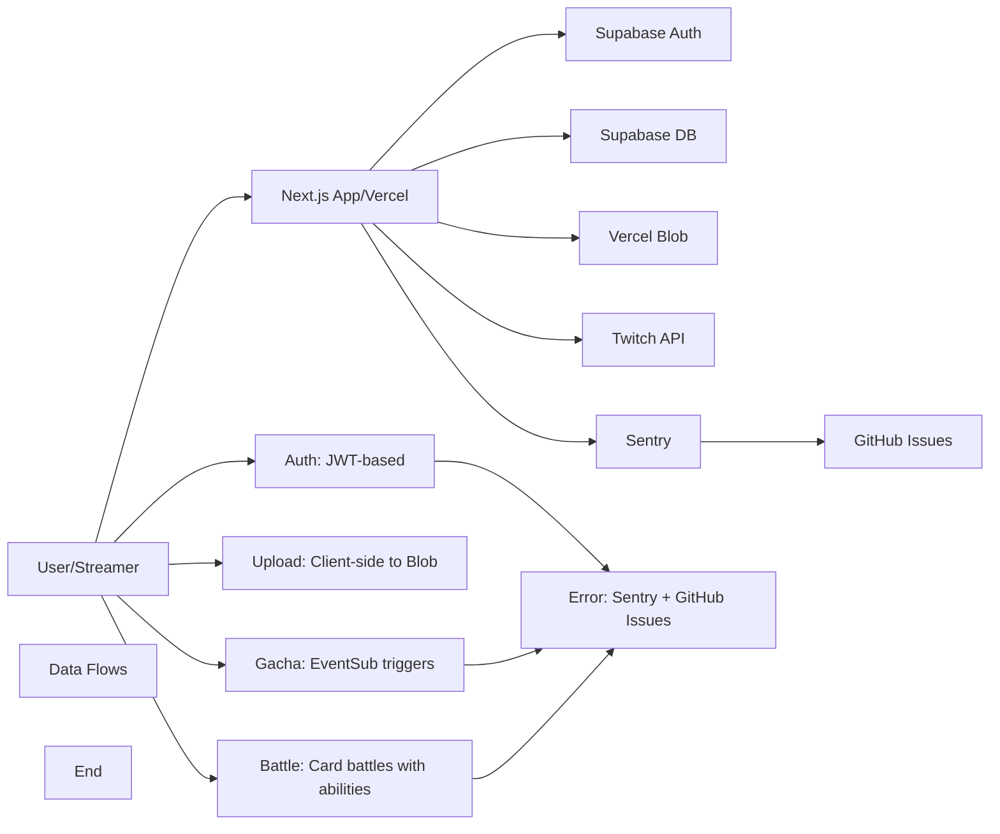

# TwiCa Architecture Document

## 概要

TwiCaはTwitch配信者向けのカードガチャシステムです。視聴者はチャンネルポイントを使ってガチャを引き、配信者が作成したオリジナルカードを収集できます。

---

## 機能要件

### 認証・認可
- Twitch OAuthによる配信者・視聴者認証
- Supabase Auth + カスタムCookieによるセッション管理
- 配信者は自身の配信者ページでのみカード管理が可能
- 視聴者は自分のカードとガチャ履歴のみ閲覧可能

### カード管理機能
- 配信者がカードを登録できる（名前、説明、画像URL、レアリティ、ドロップ率）
- カードの有効/無効切り替え
- カード画像はVercel Blob Storageに保存
- レアリティ: コモン、レア、エピック、レジェンダリー
- カード画像サイズ制限: 最大1MB

### ガチャ機能
- チャンネルポイントを使用したガチャシステム
- Twitch EventSubによるチャンネルポイント使用通知
- 重み付き確率によるカード選択
- ガチャ履歴の記録

### オーバーレイ表示
- ガチャ結果を配信画面にオーバーレイ表示
- ストリーマーIDごとのカスタマイズ可能な表示

### ダッシュボード機能
- 配信者ダッシュボード（カード管理、設定）
- 視聴者ダッシュボード（所持カード、ガチャ履歴）

---

## 非機能要件

### パフォーマンス
- APIレスポンス: 500ms以内（99パーセンタイル）
- ガチャ処理: 300ms以内
- 対戦処理: 1000ms以内
- 静的アセットのCDN配信（Vercel）
- データベースインデックスによるクエリ最適化
- データベースクエリフィールド選択の最適化
- N+1クエリ問題の回避

### セキュリティ
- HTTPSでの通信
- Supabase RLS (Row Level Security) による多層防御
- CSRF対策（SameSite=Lax Cookie + state検証）
- XSS対策（Reactの自動エスケープ）
- 環境変数によるシークレット管理
- セッション有効期限: 7日（Cookie + expiresAt検証）
- Twitch署名検証（EventSub Webhook）
- EventSubべき等性（event_idによる重複チェック）
- APIレート制限によるDoS攻撃対策
- 対戦の不正防止（ランダム性の確保）
- デバッグエンドポイントの保護（Issue #32）

### 可用性
- Vercelによる99.95% SLA
- Supabaseによる99.9% データベース可用性

### スケーラビリティ
- Vercel Serverless Functionsの自動スケーリング
- SupabaseのマネージドPostgreSQL（自動スケーリング）

---

## 受け入れ基準

### ユーザー認証
- [x] Twitch OAuthでログインできる
- [x] 配信者として認証される
- [x] 視聴者として認証される
- [x] ログアウトできる
- [x] セッション有効期限後に再認証が必要
- [x] Twitchログイン時のエラーが適切にハンドリングされる（Issue #19 - 解決済み）

### カード管理
- [x] カードを新規登録できる
- [x] カードを編集できる
- [x] カードを削除できる
- [x] カード画像をアップロードできる
- [x] カード画像サイズが1MB以下である
- [x] カードの有効/無効を切り替えられる
- [x] ドロップ率を設定できる（合計1.0以下）

### ガチャ機能
- [x] チャンネルポイントでガチャを引ける
- [x] ガチャ結果が正しく表示される
- [x] ドロップ率通りにカードが排出される
- [x] ガチャ履歴が記録される
- [x] 重みなしで同じ確率で排出される（全カードのドロップ率が等しい場合）

### オーバーレイ
- [x] ガチャ結果がOBS等のブラウザソースで表示できる
- [x] カード画像が正しく表示される
- [x] レアリティに応じた色が表示される

### データ整合性
- [x] RLSポリシーが正しく機能する
- [x] 配信者は自分のカードしか編集できない
- [x] 視聴者は自分のカードしか見れない
- [x] ガチャ履歴が正しく記録される

### APIレート制限（Issue #13）
- [x] `@upstash/ratelimit` と `@upstash/redis` をインストール
- [x] `src/lib/rate-limit.ts` を実装
- [x] 各 API ルートにレート制限を追加
- [x] 429 エラーが適切に返される
- [x] レート制限ヘッダーが設定される
- [x] 開発環境でインメモリレート制限が動作する
- [x] 本番環境で Redis レート制限が動作する
- [x] EventSub Webhook は緩いレート制限を持つ
- [x] 認証済みユーザーは twitchUserId で識別される
- [x] 未認証ユーザーは IP アドレスで識別される
- [x] フロントエンドで 429 エラーが適切に表示される

### カード対戦機能（Issue #15）
- [x] カードにステータス（HP、ATK、DEF、SPD）が追加される
- [x] 各カードにスキルが設定される
- [x] CPU対戦が可能
- [x] 自動ターン制バトルが動作する
- [x] 勝敗判定が正しく行われる
- [x] 対戦履歴が記録される
- [x] 対戦統計が表示される
- [x] フロントエンドで対戦が視覚的に楽しめる
- [x] アニメーション効果が表示される
- [x] モバイルで快適に操作可能

---

## 設計方針

### アーキテクチャパターン
- **クライアントサイド**: Next.js App Router + Server Components
- **サーバーサイド**: Vercel Serverless Functions
- **データストア**: Supabase (PostgreSQL)
- **ストレージ**: Vercel Blob
- **認証**: カスタムCookie + Twitch OAuth
- **エラートラッキング**: Sentry + GitHub Issues自動化

### デザイン原則
1. **Simple over Complex**: 複雑さを最小限に抑える
2. **Type Safety**: TypeScriptによる厳格な型定義
3. **Separation of Concerns**: 機能ごとのモジュール分割
4. **Security First**: アプリケーション層での認証検証 + RLS（多層防御）
5. **Consistency**: コードベース全体で一貫性を維持
6. **Error Handling**: ユーザーにわかりやすいエラーメッセージを提供
7. **Observability**: エラー追跡と自動イシュー作成により運用効率を向上
8. **Performance**: 最小限のデータ転送と効率的なクエリ実行
9. **Query Optimization**: N+1クエリ問題の回避とJOINの適切な使用
10. **Development/Production Separation**: デバッグツールは開発環境でのみ使用

### 技術選定基準
- マネージドサービス優先（運用コスト削減）
- Next.jsエコシステムを活用（開発効率）
- カスタムセッションによる柔軟な認証管理
- Sentryによるエラー可視化

---

## アーキテクチャ

### システム全体図



---

## Issue #35: Code Quality - Hardcoded Skill Names and CPU Strings in Battle Library

### 問題

Battle ライブラリ (`src/lib/battle.ts`) に、Issue #30 (APIエラーメッセージ標準化) および Issue #34 (CPUカード文字列定数化) に違反するハードコードされた日本語文字列が含まれています。

### 問題の詳細

#### 現在の実装

**1. `generateCPUOpponent` 関数のハードコードされた CPU カード文字列** (行 186-189, 200):

```typescript
return {
  id: 'cpu-default',
  name: 'CPUカード',  // ハードコード
  hp: 100,
  currentHp: 100,
  atk: 30,
  def: 15,
  spd: 5,
  skill_type: 'attack',
  skill_name: 'CPU攻撃',  // ハードコード
  skill_power: 10,
  image_url: null,
  rarity: 'common'
}

// 行 200
cpuCard.name = `CPUの${cpuCard.name}`  // ハードコード
```

**2. ハードコードされたスキル名配列** (行 29-32):

```typescript
const skillNames = {
  attack: ['強撃', '猛攻', '破壊光線', '必殺拳'],
  defense: ['鉄壁', '硬化', '防御態勢', '守りの陣'],
  heal: ['回復', '治癒', '生命の雨', '再生光'],
  special: ['混乱攻撃', '急速', '幸運', '奇襲']
}
```

**3. ハードコードされたデフォルトエラーメッセージ** (行 139):

```typescript
return { message: 'スキル発動失敗' }  // ハードコード
```

**4. `executeSkill` 関数のハードコードされた日本語メッセージ** (行 42, 45, 50, 56, 62):

```typescript
message: `${attacker.name}が${attacker.skill_name}！${skillDamage}ダメージを与えた！`
message: `${attacker.name}が${attacker.skill_name}！防御力が${attacker.skill_power}上がった！`
message: `${attacker.name}が${attacker.skill_name}！${healAmount}回復した！`
message: `${attacker.name}が${attacker.skill_name}！特殊効果で${specialDamage}ダメージ！`
message: `${attacker.name}が攻撃！${damage}ダメージを与えた！`
```

#### 影響

- **コード品質**: Issue #30 で実装された API エラーメッセージ標準化に違反
- **一貫性**: Battle API は `CPU_CARD_STRINGS` 定数を使用しているが、`battle.ts` は使用していない
- **保守性**: ハードコードされた文字列はメンテナンスが困難
- **国際化**: 将来の i18n 対応を困難にする

### 優先度

**Low** - コード品質の問題、セキュリティまたは機能的なバグではない

---

## Issue #35: 設計

### 機能要件

#### 1. バトルライブラリの文字列定数化

`src/lib/battle.ts` のすべてのハードコードされた日本語文字列を定数として標準化します。

### 非機能要件

#### コード品質

- すべてのハードコードされた文字列が定数を使用する
- Battle API と battle.ts の間で一貫性が保たれる
- Issue #30 の標準化完了状態が維持される
- Issue #34 の CPU_CARD_STRINGS 定数が再利用される

### 設計

#### 1. 定数の追加

**src/lib/constants.ts** に以下の定数を追加します：

```typescript
export const BATTLE_SKILL_NAMES = {
  ATTACK: ['強撃', '猛攻', '破壊光線', '必殺拳'],
  DEFENSE: ['鉄壁', '硬化', '防御態勢', '守りの陣'],
  HEAL: ['回復', '治癒', '生命の雨', '再生光'],
  SPECIAL: ['混乱攻撃', '急速', '幸運', '奇襲'],
} as const

export const BATTLE_LOG_MESSAGES = {
  SKILL_ATTACK: (attackerName: string, skillName: string, damage: number) =>
    `${attackerName}が${skillName}！${damage}ダメージを与えた！`,
  SKILL_DEFENSE: (attackerName: string, skillName: string, defenseUp: number) =>
    `${attackerName}が${skillName}！防御力が${defenseUp}上がった！`,
  SKILL_HEAL: (attackerName: string, skillName: string, healAmount: number) =>
    `${attackerName}が${skillName}！${healAmount}回復した！`,
  SKILL_SPECIAL: (attackerName: string, skillName: string, specialDamage: number) =>
    `${attackerName}が${skillName}！特殊効果で${specialDamage}ダメージ！`,
  NORMAL_ATTACK: (attackerName: string, damage: number) =>
    `${attackerName}が攻撃！${damage}ダメージを与えた！`,
  SKILL_FAILED: 'スキル発動失敗',
} as const
```

**理由**:
- バトルロギングに関連するすべての文字列を一箇所で管理
- 動的なメッセージは関数形式で実装し、テンプレートリテラルの乱用を防ぐ
- Issue #30 の標準化パターンに従う
- 将来の国際化対応が容易

#### 2. `generateCPUOpponent` 関数の修正

**src/lib/battle.ts**

**変更前**:
```typescript
return {
  id: 'cpu-default',
  name: 'CPUカード',
  hp: 100,
  currentHp: 100,
  atk: 30,
  def: 15,
  spd: 5,
  skill_type: 'attack',
  skill_name: 'CPU攻撃',
  skill_power: 10,
  image_url: null,
  rarity: 'common'
}

cpuCard.name = `CPUの${cpuCard.name}`
```

**変更後**:
```typescript
import { CPU_CARD_STRINGS, BATTLE_SKILL_NAMES } from '@/lib/constants'

return {
  id: 'cpu-default',
  name: CPU_CARD_STRINGS.DEFAULT_NAME,
  hp: 100,
  currentHp: 100,
  atk: 30,
  def: 15,
  spd: 5,
  skill_type: 'attack',
  skill_name: CPU_CARD_STRINGS.DEFAULT_SKILL_NAME,
  skill_power: 10,
  image_url: null,
  rarity: 'common'
}

cpuCard.name = `${CPU_CARD_STRINGS.NAME_PREFIX}${cpuCard.name}`
```

**理由**:
- 既存の CPU_CARD_STRINGS 定数を再利用（Issue #34 で定義済み）
- Battle API との一貫性を保つ

#### 3. `generateCardStats` 関数の修正

**src/lib/battle.ts**

**変更前**:
```typescript
const skillNames = {
  attack: ['強撃', '猛攻', '破壊光線', '必殺拳'],
  defense: ['鉄壁', '硬化', '防御態勢', '守りの陣'],
  heal: ['回復', '治癒', '生命の雨', '再生光'],
  special: ['混乱攻撃', '急速', '幸運', '奇襲']
}

const skill_type = skillTypes[Math.floor(Math.random() * skillTypes.length)]
const skillNameList = skillNames[skill_type]
const skill_name = skillNameList[Math.floor(Math.random() * skillNameList.length)]
```

**変更後**:
```typescript
import { BATTLE_SKILL_NAMES } from '@/lib/constants'

const skill_type = skillTypes[Math.floor(Math.random() * skillTypes.length)]
const skillNameList = BATTLE_SKILL_NAMES[skill_type.toUpperCase() as keyof typeof BATTLE_SKILL_NAMES]
const skill_name = skillNameList[Math.floor(Math.random() * skillNameList.length)]
```

**理由**:
- 定数を使用して文字列の一元管理
- 型安全のために `as keyof typeof BATTLE_SKILL_NAMES` を使用

#### 4. `executeSkill` 関数の修正

**src/lib/battle.ts**

**変更前**:
```typescript
export function executeSkill(attacker: BattleCard, defender: BattleCard): SkillResult {
  switch (attacker.skill_type) {
    case 'attack':
      const skillDamage = Math.max(1, attacker.atk + attacker.skill_power - defender.def)
      return {
        damage: skillDamage,
        message: `${attacker.name}が${attacker.skill_name}！${skillDamage}ダメージを与えた！`
      }

    case 'defense':
      return {
        defenseUp: attacker.skill_power,
        message: `${attacker.name}が${attacker.skill_name}！防御力が${attacker.skill_power}上がった！`
      }

    case 'heal':
      const healAmount = Math.min(attacker.hp - attacker.currentHp, attacker.skill_power)
      return {
        heal: healAmount,
        message: `${attacker.name}が${attacker.skill_name}！${healAmount}回復した！`
      }

    case 'special':
      const specialDamage = Math.max(1, Math.floor(attacker.atk * 1.5) - defender.def)
      return {
        damage: specialDamage,
        message: `${attacker.name}が${attacker.skill_name}！特殊効果で${specialDamage}ダメージ！`
      }

    default:
      return { message: 'スキル発動失敗' }
  }
}
```

**変更後**:
```typescript
import { BATTLE_LOG_MESSAGES } from '@/lib/constants'

export function executeSkill(attacker: BattleCard, defender: BattleCard): SkillResult {
  switch (attacker.skill_type) {
    case 'attack':
      const skillDamage = Math.max(1, attacker.atk + attacker.skill_power - defender.def)
      return {
        damage: skillDamage,
        message: BATTLE_LOG_MESSAGES.SKILL_ATTACK(attacker.name, attacker.skill_name, skillDamage)
      }

    case 'defense':
      return {
        defenseUp: attacker.skill_power,
        message: BATTLE_LOG_MESSAGES.SKILL_DEFENSE(attacker.name, attacker.skill_name, attacker.skill_power)
      }

    case 'heal':
      const healAmount = Math.min(attacker.hp - attacker.currentHp, attacker.skill_power)
      return {
        heal: healAmount,
        message: BATTLE_LOG_MESSAGES.SKILL_HEAL(attacker.name, attacker.skill_name, healAmount)
      }

    case 'special':
      const specialDamage = Math.max(1, Math.floor(attacker.atk * 1.5) - defender.def)
      return {
        damage: specialDamage,
        message: BATTLE_LOG_MESSAGES.SKILL_SPECIAL(attacker.name, attacker.skill_name, specialDamage)
      }

    default:
      return { message: BATTLE_LOG_MESSAGES.SKILL_FAILED }
  }
}
```

**理由**:
- 定数を使用して文字列の一元管理
- 関数形式のメッセージ定数を使用することで、動的なパラメータを型安全に渡せる
- テンプレートリテラルの重複を排除

#### 5. `playBattle` 関数の修正

**src/lib/battle.ts**

**変更前**:
```typescript
const damage = Math.max(1, attacker.atk - defender.def)
defender.currentHp = Math.max(0, defender.currentHp - damage)

logs.push({
  turn,
  actor: currentActor,
  action: 'attack',
  damage,
  message: `${attacker.name}が攻撃！${damage}ダメージを与えた！`
})
```

**変更後**:
```typescript
import { BATTLE_LOG_MESSAGES } from '@/lib/constants'

const damage = Math.max(1, attacker.atk - defender.def)
defender.currentHp = Math.max(0, defender.currentHp - damage)

logs.push({
  turn,
  actor: currentActor,
  action: 'attack',
  damage,
  message: BATTLE_LOG_MESSAGES.NORMAL_ATTACK(attacker.name, damage)
})
```

**理由**:
- 定数を使用して文字列の一元管理
- `executeSkill` 関数と一貫性を保つ

### 変更ファイル

- `src/lib/constants.ts` (更新 - BATTLE_SKILL_NAMES および BATTLE_LOG_MESSAGES 定数の追加)
- `src/lib/battle.ts` (更新 - すべてのハードコードされた文字列を定数に置換)

### 受け入れ基準

- [ ] `src/lib/constants.ts` に BATTLE_SKILL_NAMES 定数が追加されている
- [ ] `src/lib/constants.ts` に BATTLE_LOG_MESSAGES 定数が追加されている
- [ ] `src/lib/battle.ts` の `generateCPUOpponent` 関数が CPU_CARD_STRINGS 定数を使用している
- [ ] `src/lib/battle.ts` の `generateCardStats` 関数が BATTLE_SKILL_NAMES 定数を使用している
- [ ] `src/lib/battle.ts` の `executeSkill` 関数が BATTLE_LOG_MESSAGES 定数を使用している
- [ ] `src/lib/battle.ts` の `playBattle` 関数が BATTLE_LOG_MESSAGES 定数を使用している
- [ ] TypeScript コンパイルエラーがない
- [ ] ESLint エラーがない
- [ ] 既存の対戦機能テストがパスする
- [ ] CI が成功
- [ ] Issue #35 クローズ済み

### テスト計画

1. **統合テスト**:
   - CPU 対戦時に定数化された文字列が正しく表示されることを確認
   - スキル発動時に定数化されたログメッセージが正しく表示されることを確認
   - 通常攻撃時に定数化されたログメッセージが正しく表示されることを確認

2. **回帰テスト**:
   - 既存の対戦機能が正しく動作することを確認
   - バトルログメッセージの内容が変わらないことを確認
   - CPU 対戦の挙動が変わらないことを確認
   - スキル名の選択ロジックが変わらないことを確認

### トレードオフの検討

#### ハードコードされた文字列 vs 定数化

| 項目 | ハードコードされた文字列 | 定数化 |
|:---|:---|:---|
| **コード品質** | 低（標準化違反） | 高（一貫性あり） |
| **保守性** | 低（変更時に複数箇所を修正） | 高（一箇所の修正で全体に反映） |
| **国際化** | 低（複数箇所を修正） | 高（定数ファイルのみ修正） |
| **一貫性** | 低（ルートごとに異なる可能性） | 高（全ルートで統一） |
| **実装コスト** | 低（変更なし） | 中（複数の関数を修正） |

**推奨**: 定数化を使用

**理由**:
- Issue #30 で実装された標準化完了状態を維持できる
- Issue #34 で定義された CPU_CARD_STRINGS 定数を再利用できる
- Battle API と battle.ts の間で一貫性を保てる
- 将来の国際化対応が容易
- コードベース全体で一貫性が保たれる
- テストカバレッジが十分にあり、リスクが低い

### 関連問題

- Issue #30 - Complete API Error Message Standardization (解決済み)
- Issue #34 - Hardcoded CPU Card Strings in Battle APIs (解決済み)
- Issue #31 - Remove 'any' type usage in Battle Start API (解決済み)

---

## 更新履歴

| 日付 | 変更内容 |
|:---|:---|
| 2026-01-18 | Issue #35 バトルライブラリ文字列定数化の設計追加 |

---

## 実装完了の問題

詳細は `docs/ARCHITECTURE_2026-01-18_135550.md` を参照してください。
