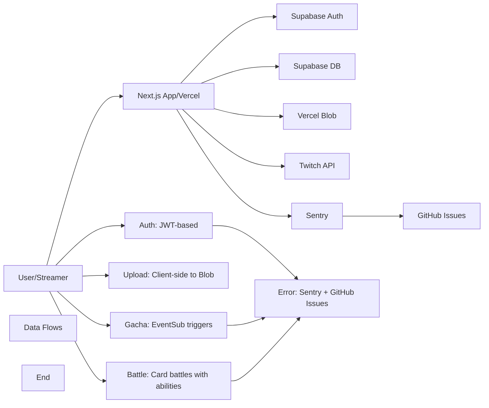

# TwiCa Architecture Document

## 概要

TwiCaはTwitch配信者向けのカードガチャシステムです。視聴者はチャンネルポイントを使ってガチャを引き、配信者が作成したオリジナルカードを収集できます。

---

## 機能要件

### 認証・認可
- Twitch OAuthによる配信者・視聴者認証
- Supabase Auth + カスタムCookieによるセッション管理
- 配信者は自身の配信者ページでのみカード管理が可能
- 視聴者は自分のカードとガチャ履歴のみ閲覧可能

### カード管理機能
- 配信者がカードを登録できる（名前、説明、画像URL、レアリティ、ドロップ率）
- カードの有効/無効切り替え
- カード画像はVercel Blob Storageに保存
- レアリティ: コモン、レア、エピック、レジェンダリー
- カード画像サイズ制限: 最大1MB

### ガチャ機能
- チャンネルポイントを使用したガチャシステム
- Twitch EventSubによるチャンネルポイント使用通知
- 重み付き確率によるカード選択
- ガチャ履歴の記録

### オーバーレイ表示
- ガチャ結果を配信画面にオーバーレイ表示
- ストリーマーIDごとのカスタマイズ可能な表示

### ダッシュボード機能
- 配信者ダッシュボード（カード管理、設定）
- 視聴者ダッシュボード（所持カード、ガチャ履歴）

### エラートラッキング
- Sentryによるエラー監視
- アプリケーションエラーの自動送信
- GitHub Issuesへの自動連携

---

## 非機能要件

### パフォーマンス
- APIレスポンス: 500ms以内（99パーセンタイル）
- ガチャ処理: 300ms以内
- 対戦処理: 1000ms以内
- 静的アセットのCDN配信（Vercel）
- データベースインデックスによるクエリ最適化
- データベースクエリフィールド選択の最適化
- N+1クエリ問題の回避

### セキュリティ
- HTTPSでの通信
- Supabase RLS (Row Level Security) による多層防御
- CSRF対策（SameSite=Lax Cookie + state検証）
- XSS対策（Reactの自動エスケープ）
- 環境変数によるシークレット管理
- セッション有効期限: 7日（Cookie + expiresAt検証）
- Twitch署名検証（EventSub Webhook）
- EventSubべき等性（event_idによる重複チェック）
- APIレート制限によるDoS攻撃対策
- 対戦の不正防止（ランダム性の確保）
- デバッグエンドポイントの保護（Issue #32）
- Sentryデバッグエンドポイントの保護（Issue #36）

### 可用性
- Vercelによる99.95% SLA
- Supabaseによる99.9% データベース可用性
- エラー検知と通知（Sentry）

### スケーラビリティ
- Vercel Serverless Functionsの自動スケーリング
- SupabaseのマネージドPostgreSQL（自動スケーリング）

### 可観測性
- Sentryによるエラー追跡と監視
- 構造化ロギング
- パフォーマンスモニタリング

---

## 受け入れ基準

### ユーザー認証
- [x] Twitch OAuthでログインできる
- [x] 配信者として認証される
- [x] 視聴者として認証される
- [x] ログアウトできる
- [x] セッション有効期限後に再認証が必要
- [x] Twitchログイン時のエラーが適切にハンドリングされる（Issue #19 - 解決済み）

### カード管理
- [x] カードを新規登録できる
- [x] カードを編集できる
- [x] カードを削除できる
- [x] カード画像をアップロードできる
- [x] カード画像サイズが1MB以下である
- [x] カードの有効/無効を切り替えられる
- [x] ドロップ率を設定できる（合計1.0以下）

### ガチャ機能
- [x] チャンネルポイントでガチャを引ける
- [x] ガチャ結果が正しく表示される
- [x] ドロップ率通りにカードが排出される
- [x] ガチャ履歴が記録される
- [x] 重みなしで同じ確率で排出される（全カードのドロップ率が等しい場合）

### オーバーレイ
- [x] ガチャ結果がOBS等のブラウザソースで表示できる
- [x] カード画像が正しく表示される
- [x] レアリティに応じた色が表示される

### データ整合性
- [x] RLSポリシーが正しく機能する
- [x] 配信者は自分のカードしか編集できない
- [x] 視聴者は自分のカードしか見れない
- [x] ガチャ履歴が正しく記録される

### APIレート制限（Issue #13）
- [x] `@upstash/ratelimit` と `@upstash/redis` をインストール
- [x] `src/lib/rate-limit.ts` を実装
- [x] 各 API ルートにレート制限を追加
- [x] 429 エラーが適切に返される
- [x] レート制限ヘッダーが設定される
- [x] 開発環境でインメモリレート制限が動作する
- [x] 本番環境で Redis レート制限が動作する
- [x] EventSub Webhook は緩いレート制限を持つ
- [x] 認証済みユーザーは twitchUserId で識別される
- [x] 未認証ユーザーは IP アドレスで識別される
- [x] フロントエンドで 429 エラーが適切に表示される

### カード対戦機能（Issue #15）
- [x] カードにステータス（HP、ATK、DEF、SPD）が追加される
- [x] 各カードにスキルが設定される
- [x] CPU対戦が可能
- [x] 自動ターン制バトルが動作する
- [x] 勝敗判定が正しく行われる
- [x] 対戦履歴が記録される
- [x] 対戦統計が表示される
- [x] フロントエンドで対戦が視覚的に楽しめる
- [x] アニメーション効果が表示される
- [x] モバイルで快適に操作可能

### コード品質（Issue #35）
- [x] Battle ライブラリの文字列が定数化されている
- [x] スキル名配列が定数として定義されている
- [x] バトルログメッセージが定数として定義されている
- [x] CPU カード文字列が定数を使用している
- [x] ハードコードされた日本語文字列が削除されている
- [x] Battle API と battle.ts の間で一貫性が保たれている

### Sentry エラー追跡
- [ ] Sentry DSN が環境変数から正しく読み込まれる
- [ ] クライアント側エラーがSentryに送信される
- [ ] サーバー側APIエラーがSentryに送信される
- [ ] コンソールエラーがSentryにキャプチャされる
- [ ] 500エラーがSentryに報告される
- [ ] Sentryイベントの環境が正しく設定される
- [ ] エラーコンテキスト（ユーザー、リクエストなど）が正しく付与される

---

## 設計方針

### アーキテクチャパターン
- **クライアントサイド**: Next.js App Router + Server Components
- **サーバーサイド**: Vercel Serverless Functions
- **データストア**: Supabase (PostgreSQL)
- **ストレージ**: Vercel Blob
- **認証**: カスタムCookie + Twitch OAuth
- **エラートラッキング**: Sentry + GitHub Issues自動化

### デザイン原則
1. **Simple over Complex**: 複雑さを最小限に抑える
2. **Type Safety**: TypeScriptによる厳格な型定義
3. **Separation of Concerns**: 機能ごとのモジュール分割
4. **Security First**: アプリケーション層での認証検証 + RLS（多層防御）
5. **Consistency**: コードベース全体で一貫性を維持
6. **Error Handling**: ユーザーにわかりやすいエラーメッセージを提供
7. **Observability**: エラー追跡と自動イシュー作成により運用効率を向上
8. **Performance**: 最小限のデータ転送と効率的なクエリ実行
9. **Query Optimization**: N+1クエリ問題の回避とJOINの適切な使用
10. **Development/Production Separation**: デバッグツールは開発環境でのみ使用
11. **String Standardization**: すべての表示文字列を定数として一元管理

### 技術選定基準
- マネージドサービス優先（運用コスト削減）
- Next.jsエコシステムを活用（開発効率）
- カスタムセッションによる柔軟な認証管理
- Sentryによるエラー可視化

---

## アーキテクチャ

### システム全体図



---

## Sentry 設計

### 現状の問題

1. **`instrumentation-client.ts` でDSNがハードコードされている**
   - 環境変数 `NEXT_PUBLIC_SENTRY_DSN` が使用されていない
   - `sentry.client.config.ts` でも初期化されており、初期化が重複している可能性がある

2. **`sentry.server.config.ts` の `beforeSend` で不適切な処理**
   - `event.request?.headers` をチェックしているが、サーバー側エラーでは `event.request` が存在しない可能性がある
   - これにより、イベントがフィルタリングされる可能性がある

3. **Sentry初期化の重複**
   - `instrumentation-client.ts` と `sentry.client.config.ts` の両方で `Sentry.init()` を呼んでいる
   - これにより、初期化が競合し、正しく動作しない可能性がある

4. **クライアント側エラーハンドリング**
   - グローバルエラーハンドラー (`global-error.tsx`) は存在するが、クライアント側のエラーが正しくSentryに送信されているか不明

### 解決策

#### 1. `instrumentation-client.ts` の削除

`src/instrumentation-client.ts` を削除し、`sentry.client.config.ts` に統合します。

**理由**:
- Next.jsのSentry SDKは、`sentry.client.config.ts` と `sentry.server.config.ts` を自動的に読み込みます
- `instrumentation-client.ts` はNext.jsのApp Routerでは必要ありません
- 初期化の重複を防ぐため

**削除するファイル**:
- `src/instrumentation-client.ts`

#### 2. `sentry.client.config.ts` の更新

`instrumentation-client.ts` から必要な設定を `sentry.client.config.ts` に移動し、環境変数を使用するように修正します。

**変更点**:
```typescript
// sentry.client.config.ts
import * as Sentry from '@sentry/nextjs'

Sentry.init({
  dsn: process.env.NEXT_PUBLIC_SENTRY_DSN,
  environment: process.env.NEXT_PUBLIC_SENTRY_ENVIRONMENT || process.env.NODE_ENV,

  integrations: [
    Sentry.replayIntegration(),
  ],

  tracesSampleRate: 1.0,

  replaysSessionSampleRate: 0.1,
  replaysOnErrorSampleRate: 1.0,

  beforeSend(event) {
    if (event.user) {
      delete event.user.email
      delete event.user.ip_address
    }

    return event
  },

  release: process.env.NEXT_PUBLIC_VERSION || 'local',
})
```

#### 3. `sentry.server.config.ts` の修正

`beforeSend` で `event.request` が存在する場合のみヘッダーを削除するように修正します。

**変更点**:
```typescript
// sentry.server.config.ts
import * as Sentry from '@sentry/nextjs'

Sentry.init({
  dsn: process.env.NEXT_PUBLIC_SENTRY_DSN,
  environment: process.env.NEXT_PUBLIC_SENTRY_ENVIRONMENT || process.env.NODE_ENV,

  beforeSend(event) {
    if (event.user) {
      delete event.user.email
      delete event.user.ip_address
    }

    if (event.request?.headers) {
      const { cookie: _cookie, authorization: _auth, ...headers } = event.request.headers
      void _cookie
      void _auth
      event.request.headers = headers
    }

    return event
  },

  release: process.env.NEXT_PUBLIC_VERSION || 'local',
})
```

#### 4. `sentry.edge.config.ts` の確認

エッジランタイムの設定も同様に修正します。

**変更点**:
```typescript
// sentry.edge.config.ts
import * as Sentry from '@sentry/nextjs'

Sentry.init({
  dsn: process.env.NEXT_PUBLIC_SENTRY_DSN,
  environment: process.env.NEXT_PUBLIC_SENTRY_ENVIRONMENT || process.env.NODE_ENV,

  beforeSend(event) {
    if (event.user) {
      delete event.user.email
      delete event.user.ip_address
    }

    return event
  },

  release: process.env.NEXT_PUBLIC_VERSION || 'local',
})
```

### トレードオフの検討

#### 選択肢1: `instrumentation-client.ts` を残す
- **メリット**: 独自の初期化ロジックを追加できる
- **デメリット**: 初期化の重複により不具合の原因になる可能性がある
- **判断**: 削除する（シンプルさを優先）

#### 選択肢2: `beforeSend` でヘッダー削除を完全に無効化
- **メリット**: すべての情報がSentryに送信される
- **デメリット**: セキュリティ上のリスク（cookie、authorizationが送信される可能性がある）
- **判断**: 適切にフィルタリングする（セキュリティを優先）

#### 選択肢3: Replay Integrationを無効化
- **メリット**: バンドルサイズが小さくなる
- **デメリット**: エラーの再現が難しくなる
- **判断**: 有効化する（デバッグ効率を優先）

### 受け入れ基準

- [ ] `instrumentation-client.ts` が削除されている
- [ ] `sentry.client.config.ts` に必要な設定が統合されている
- [ ] `sentry.client.config.ts` で環境変数 `NEXT_PUBLIC_SENTRY_DSN` が使用されている
- [ ] `sentry.server.config.ts` の `beforeSend` で適切に `event.request` のチェックが行われている
- [ ] `sentry.edge.config.ts` で環境変数 `NEXT_PUBLIC_SENTRY_DSN` が使用されている
- [ ] クライアント側エラーがSentryに送信される（`/sentry-example-page` で確認）
- [ ] サーバー側エラーがSentryに送信される（`/api/sentry-example-api` で確認）
- [ ] 500エラーがSentryに報告される（意図的にエラーを発生させて確認）

---

## Sentry Debug Endpoints Security (Issue #36)

### 現状の問題

Sentryデバッグ用のAPIエンドポイントが本番環境でアクセス可能になっている。これらのエンドポイントには認証や環境制限がなく、悪用されるリスクがある。

#### 影響を受けるエンドポイント
- `/api/test-sentry` - Sentry設定確認とテストエラー送信
- `/api/debug-sentry` - Sentry設定確認とテストエラー送信
- `/api/test-sentry-envelope` - Sentryエンベロープテスト（DSN情報が露出）
- `/api/test-sentry-connection` - Sentry接続テスト
- `/api/debug-sentry-direct` - 直接Sentryテスト（コンソールログ）
- `/api/sentry-example-api` - サンプルAPIエラー送信

#### セキュリティリスク
1. **情報露出**: DSNの一部、環境情報などが露出する可能性がある
2. **DoS攻撃**: 意図的にエラーを大量生成し、Sentryのクォータを消費できる
3. **偽装エラー**: エラーのパターンを分析し、システム挙動を推測できる

### 解決策

各Sentryデバッグエンドポイントに`DEBUG_CONFIG`を使用した環境制限を追加する。

#### 実装パターン

```typescript
import { NextResponse } from 'next/server'
import { DEBUG_CONFIG, ERROR_MESSAGES } from '@/lib/constants'

export async function GET(request: Request) {
  // Check if running in production
  if (process.env.NODE_ENV === DEBUG_CONFIG.PRODUCTION_ENV) {
    return NextResponse.json(
      { error: ERROR_MESSAGES.DEBUG_ENDPOINT_NOT_AVAILABLE },
      { status: 404 }
    )
  }

  // Check if request is from localhost
  const url = new URL(request.url)
  const host = url.hostname

  if (!DEBUG_CONFIG.ALLOWED_HOSTS.some(allowedHost => allowedHost === host)) {
    return NextResponse.json(
      { error: ERROR_MESSAGES.DEBUG_ENDPOINT_NOT_AUTHORIZED },
      { status: 403 }
    )
  }

  // Original endpoint logic
  // ...
}
```

#### 変更対象ファイル
- `src/app/api/test-sentry/route.ts`
- `src/app/api/debug-sentry/route.ts`
- `src/app/api/test-sentry-envelope/route.ts`
- `src/app/api/test-sentry-connection/route.ts`
- `src/app/api/debug-sentry-direct/route.ts`
- `src/app/api/sentry-example-api/route.ts`

### トレードオフの検討

#### 選択肢1: すべてのdebugエンドポイントを削除
- **メリット**: セキュリティリスクが完全に削除される
- **デメリット**: 開発時のデバッグが不便になる
- **判断**: 環境制限を追加して残す（開発効率を優先）

#### 選択肢2: 認証を追加
- **メリット**: 認証済みユーザーのみアクセス可能
- **デメリット**: 実装が複雑になり、認証自体に脆弱性が生じる可能性がある
- **判断**: localhostのみ許可（シンプルさを優先）

#### 選択肢3: 本番環境でも有効にする
- **メリット**: 本番環境でもデバッグ可能
- **デメリット**: セキュリティリスクが高い
- **判断**: 本番環境では無効化（セキュリティを優先）

### 受け入れ基準

- [ ] `/api/test-sentry` が本番環境で404を返す
- [ ] `/api/debug-sentry` が本番環境で404を返す
- [ ] `/api/test-sentry-envelope` が本番環境で404を返す
- [ ] `/api/test-sentry-connection` が本番環境で404を返す
- [ ] `/api/debug-sentry-direct` が本番環境で404を返す
- [ ] `/api/sentry-example-api` が本番環境で404を返す
- [ ] すべてのSentry debugエンドポイントがlocalhost/127.0.0.1のみでアクセス可能
- [ ] 本番環境以外の環境でlocalhostから正常に動作する
- [ ] lintとtestがパスする

---

## 更新履歴

| 日付 | 変更内容 |
|:---|:---|
| | 2026-01-18 | Sentryエラー送信問題の設計を追加 |
| | 2026-01-18 | Sentryデバッグエンドポイントのセキュリティ設計を追加 |

---

## 実装完了の問題

- **Issue #36**: Critical Security: Sentry Debug Endpoints Exposed in Production (実装中)
- **Issue #35**: Code Quality - Hardcoded Skill Names and CPU Strings in Battle Library (解決済み)
- **Issue #34**: Code Quality - Hardcoded CPU Card Strings in Battle APIs (解決済み)
- **Issue #33**: Code Quality - Session API Error Message Standardization (解決済み)
- **Issue #32**: Critical Security - Debug Endpoint Exposes Sensitive Cookies (解決済み)

過去のアーキテクチャドキュメントの詳細は `docs/ARCHITECTURE_2026-01-18_220000.md` を参照してください。
