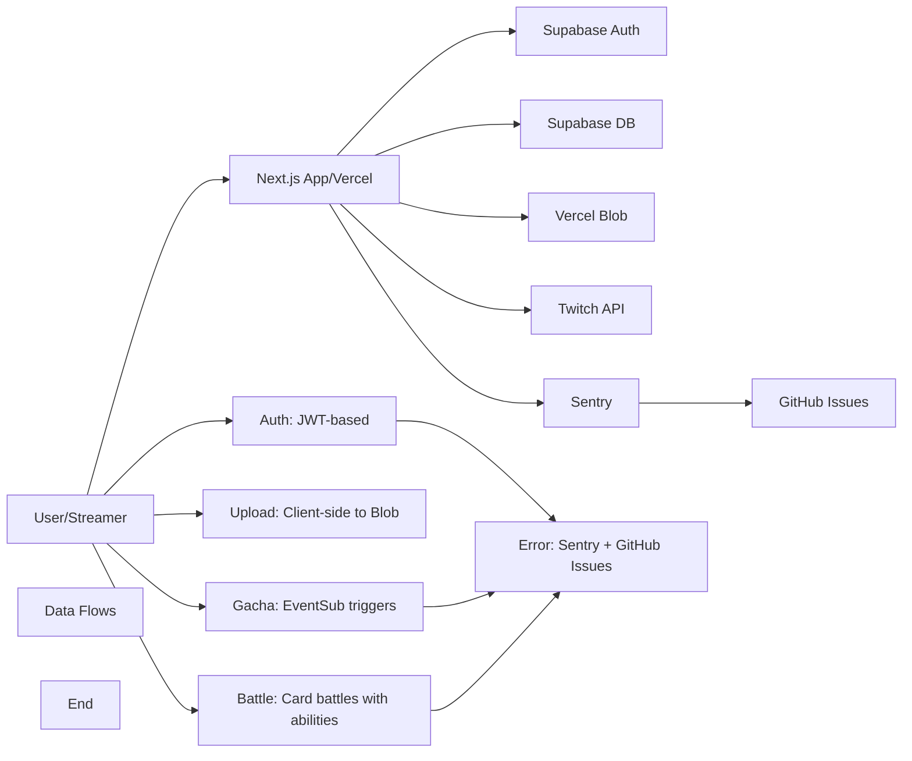

# TwiCa Architecture Document

## 概要

TwiCaはTwitch配信者向けのカードガチャシステムです。視聴者はチャンネルポイントを使ってガチャを引き、配信者が作成したオリジナルカードを収集できます。

---

## 機能要件

### 認証・認可
- Twitch OAuthによる配信者・視聴者認証
- Supabase Auth + カスタムCookieによるセッション管理
- 配信者は自身の配信者ページでのみカード管理が可能
- 視聴者は自分のカードとガチャ履歴のみ閲覧可能

### カード管理機能
- 配信者がカードを登録できる（名前、説明、画像URL、レアリティ、ドロップ率）
- カードの有効/無効切り替え
- カード画像はVercel Blob Storageに保存
- レアリティ: コモン、レア、エピック、レジェンダリー
- カード画像サイズ制限: 最大1MB

### ガチャ機能
- チャンネルポイントを使用したガチャシステム
- Twitch EventSubによるチャンネルポイント使用通知
- 重み付き確率によるカード選択
- ガチャ履歴の記録

### オーバーレイ表示
- ガチャ結果を配信画面にオーバーレイ表示
- ストリーマーIDごとのカスタマイズ可能な表示

### ダッシュボード機能
- 配信者ダッシュボード（カード管理、設定）
- 視聴者ダッシュボード（所持カード、ガチャ履歴）

### エラートラッキング
- Sentryによるエラー監視
- アプリケーションエラーの自動送信
- GitHub Issuesへの自動連携

---

## 非機能要件

### パフォーマンス
- APIレスポンス: 500ms以内（99パーセンタイル）
- ガチャ処理: 300ms以内
- 対戦処理: 1000ms以内
- 静的アセットのCDN配信（Vercel）
- データベースインデックスによるクエリ最適化
- データベースクエリフィールド選択の最適化
- N+1クエリ問題の回避

### セキュリティ
- HTTPSでの通信
- Supabase RLS (Row Level Security) による多層防御
- CSRF対策（SameSite=Lax Cookie + state検証）
- XSS対策（Reactの自動エスケープ）
- 環境変数によるシークレット管理
- セッション有効期限: 7日（Cookie + expiresAt検証）
- Twitch署名検証（EventSub Webhook）
- EventSubべき等性（event_idによる重複チェック）
- APIレート制限によるDoS攻撃対策
- 対戦の不正防止（ランダム性の確保）
- デバッグエンドポイントの保護（Issue #32）
- Sentryデバッグエンドポイントの保護（Issue #36）

### 可用性
- Vercelによる99.95% SLA
- Supabaseによる99.9% データベース可用性
- エラー検知と通知（Sentry）

### スケーラビリティ
- Vercel Serverless Functionsの自動スケーリング
- SupabaseのマネージドPostgreSQL（自動スケーリング）

### 可観測性
- Sentryによるエラー追跡と監視
- 構造化ロギング
- パフォーマンスモニタリング

---

## 受け入れ基準

### ユーザー認証
- [x] Twitch OAuthでログインできる
- [x] 配信者として認証される
- [x] 視聴者として認証される
- [x] ログアウトできる
- [x] セッション有効期限後に再認証が必要
- [x] Twitchログイン時のエラーが適切にハンドリングされる（Issue #19 - 解決済み）

### カード管理
- [x] カードを新規登録できる
- [x] カードを編集できる
- [x] カードを削除できる
- [x] カード画像をアップロードできる
- [x] カード画像サイズが1MB以下である
- [x] カードの有効/無効を切り替えられる
- [x] ドロップ率を設定できる（合計1.0以下）

### ガチャ機能
- [x] チャンネルポイントでガチャを引ける
- [x] ガチャ結果が正しく表示される
- [x] ドロップ率通りにカードが排出される
- [x] ガチャ履歴が記録される
- [x] 重みなしで同じ確率で排出される（全カードのドロップ率が等しい場合）

### オーバーレイ
- [x] ガチャ結果がOBS等のブラウザソースで表示できる
- [x] カード画像が正しく表示される
- [x] レアリティに応じた色が表示される

### データ整合性
- [x] RLSポリシーが正しく機能する
- [x] 配信者は自分のカードしか編集できない
- [x] 視聴者は自分のカードしか見れない
- [x] ガチャ履歴が正しく記録される

### APIレート制限（Issue #13）
- [x] `@upstash/ratelimit` と `@upstash/redis` をインストール
- [x] `src/lib/rate-limit.ts` を実装
- [x] 各 API ルートにレート制限を追加
- [x] 429 エラーが適切に返される
- [x] レート制限ヘッダーが設定される
- [x] 開発環境でインメモリレート制限が動作する
- [x] 本番環境で Redis レート制限が動作する
- [x] EventSub Webhook は緩いレート制限を持つ
- [x] 認証済みユーザーは twitchUserId で識別される
- [x] 未認証ユーザーは IP アドレスで識別される
- [x] フロントエンドで 429 エラーが適切に表示される

### カード対戦機能（Issue #15）
- [x] カードにステータス（HP、ATK、DEF、SPD）が追加される
- [x] 各カードにスキルが設定される
- [x] CPU対戦が可能
- [x] 自動ターン制バトルが動作する
- [x] 勝敗判定が正しく行われる
- [x] 対戦履歴が記録される
- [x] 対戦統計が表示される
- [x] フロントエンドで対戦が視覚的に楽しめる
- [x] アニメーション効果が表示される
- [x] モバイルで快適に操作可能

### コード品質（Issue #35）
- [x] Battle ライブラリの文字列が定数化されている
- [x] スキル名配列が定数として定義されている
- [x] バトルログメッセージが定数として定義されている
- [x] CPU カード文字列が定数を使用している
- [x] ハードコードされた日本語文字列が削除されている
- [x] Battle API と battle.ts の間で一貫性が保たれている

### Sentry エラー追跡
- [ ] Sentry DSN が環境変数から正しく読み込まれる
- [ ] クライアント側エラーがSentryに送信される
- [ ] サーバー側APIエラーがSentryに送信される
- [ ] コンソールエラーがSentryにキャプチャされる
- [ ] 500エラーがSentryに報告される
- [ ] Sentryイベントの環境が正しく設定される
- [ ] エラーコンテキスト（ユーザー、リクエストなど）が正しく付与される

---

## 設計方針

### アーキテクチャパターン
- **クライアントサイド**: Next.js App Router + Server Components
- **サーバーサイド**: Vercel Serverless Functions
- **データストア**: Supabase (PostgreSQL)
- **ストレージ**: Vercel Blob
- **認証**: カスタムCookie + Twitch OAuth
- **エラートラッキング**: Sentry + GitHub Issues自動化

### デザイン原則
1. **Simple over Complex**: 複雑さを最小限に抑える
2. **Type Safety**: TypeScriptによる厳格な型定義
3. **Separation of Concerns**: 機能ごとのモジュール分割
4. **Security First**: アプリケーション層での認証検証 + RLS（多層防御）
5. **Consistency**: コードベース全体で一貫性を維持
6. **Error Handling**: ユーザーにわかりやすいエラーメッセージを提供
7. **Observability**: エラー追跡と自動イシュー作成により運用効率を向上
8. **Performance**: 最小限のデータ転送と効率的なクエリ実行
9. **Query Optimization**: N+1クエリ問題の回避とJOINの適切な使用
10. **Development/Production Separation**: デバッグツールは開発環境でのみ使用
11. **String Standardization**: すべての表示文字列を定数として一元管理

### 技術選定基準
- マネージドサービス優先（運用コスト削減）
- Next.jsエコシステムを活用（開発効率）
- カスタムセッションによる柔軟な認証管理
- Sentryによるエラー可視化

---

## アーキテクチャ

### システム全体図



---

## バトルシステム定数化（Issue #37）

### 現状の問題

バトルシステムの設定値が`src/lib/battle.ts`にハードコードされています。これらの値を定数として一元管理することで、バランス調整や保守性を向上させる必要があります。

#### 影響を受ける箇所

1. **最大ターン数** (行 140)
   - 現在: `const maxTurns = 20`
   - 定数化: `BATTLE_CONFIG.MAX_TURNS`

2. **スキル発動率計算** (行 157)
   - 現在: `const skillTriggerChance = Math.min(attacker.spd * 10, 70)`
   - 定数化: `BATTLE_CONFIG.SKILL_SPEED_MULTIPLIER` = 10, `BATTLE_CONFIG.SKILL_TRIGGER_MAX_PERCENT` = 70

3. **スキル発動判定** (行 158)
   - 現在: `const skillTrigger = Math.random() * 100 < skillTriggerChance`
   - 改善: 100も定数化

4. **スペシャルスキルダメージ倍率** (行 127)
   - 現在: `const specialDamage = Math.max(1, Math.floor(attacker.atk * 1.5) - defender.def)`
   - 定数化: `BATTLE_CONFIG.SPECIAL_SKILL_DAMAGE_MULTIPLIER` = 1.5

### 解決策

#### 1. `src/lib/constants.ts` に定数を追加

```typescript
export const BATTLE_CONFIG = {
  MAX_TURNS: 20,
  SKILL_SPEED_MULTIPLIER: 10,
  SKILL_TRIGGER_MAX_PERCENT: 70,
  RANDOM_RANGE: 100,
  SPECIAL_SKILL_DAMAGE_MULTIPLIER: 1.5,
} as const
```

#### 2. `src/lib/battle.ts` で定数を使用

```typescript
import { BATTLE_CONFIG } from '@/lib/constants'

export async function playBattle(userCard: BattleCard, opponentCard: BattleCard): Promise<BattleResultData> {
  const maxTurns = BATTLE_CONFIG.MAX_TURNS
  // ...

  // Skill trigger chance (SPD * 10%, max 70%)
  const skillTriggerChance = Math.min(
    attacker.spd * BATTLE_CONFIG.SKILL_SPEED_MULTIPLIER,
    BATTLE_CONFIG.SKILL_TRIGGER_MAX_PERCENT
  )
  const skillTrigger = Math.random() * BATTLE_CONFIG.RANDOM_RANGE < skillTriggerChance
  // ...

  case 'special':
    const specialDamage = Math.max(1, Math.floor(attacker.atk * BATTLE_CONFIG.SPECIAL_SKILL_DAMAGE_MULTIPLIER) - defender.def)
    // ...
}
```

### トレードオフの検討

#### 選択肢1: すべての数値を定数化する
- **メリット**: 完全な柔軟性と一貫性
- **デメリット**: 定数の数が増え、可読性が下がる可能性がある
- **判断**: ゲームバランスに影響する重要な値のみ定数化（実装する選択肢）

#### 選択肢2: 環境変数で設定する
- **メリット**: 本番環境での即時調整が可能
- **デメリット**: 運用が複雑になり、バグの原因になる可能性がある
- **判断**: コード内の定数とする（シンプルさを優先）

#### 選択肢3: JSONファイルで設定を管理する
- **メリット**: 設定とコードを分離できる
- **デメリット**: 型安全性が下がり、設定ミスが発生しやすい
- **判断**: TypeScriptの定数とする（型安全性を優先）

### 受け入れ基準

- [ ] `BATTLE_CONFIG` 定数が `src/lib/constants.ts` に追加されている
- [ ] `src/lib/battle.ts` で `BATTLE_CONFIG` 定数が使用されている
- [ ] `maxTurns` が `BATTLE_CONFIG.MAX_TURNS` で置換されている
- [ ] スキル発動率計算で `BATTLE_CONFIG.SKILL_SPEED_MULTIPLIER` と `BATTLE_CONFIG.SKILL_TRIGGER_MAX_PERCENT` が使用されている
- [ ] ランダム範囲で `BATTLE_CONFIG.RANDOM_RANGE` が使用されている
- [ ] スペシャルスキルダメージ倍率で `BATTLE_CONFIG.SPECIAL_SKILL_DAMAGE_MULTIPLIER` が使用されている
- [ ] 既存のバトルシステムの挙動が変わらない（テストがパスする）
- [ ] lintとtestがパスする
- [ ] TypeScriptの型チェックがパスする

---

## 更新履歴

| 日付 | 変更内容 |
|:---|:---|
| 2026-01-18 | バトルシステム定数化の設計を追加（Issue #37） |
| 2026-01-18 | Sentryエラー送信問題の設計を追加 |
| 2026-01-18 | Sentryデバッグエンドポイントのセキュリティ設計を追加 |

---

## 実装完了の問題

- **Issue #37**: Code Quality - Hardcoded Battle Configuration Values in battle.ts (実装中)
- **Issue #36**: Critical Security: Sentry Debug Endpoints Exposed in Production (解決済み)
- **Issue #35**: Code Quality - Hardcoded Skill Names and CPU Strings in Battle Library (解決済み)
- **Issue #34**: Code Quality - Hardcoded CPU Card Strings in Battle APIs (解決済み)
- **Issue #33**: Code Quality - Session API Error Message Standardization (解決済み)
- **Issue #32**: Critical Security - Debug Endpoint Exposes Sensitive Cookies (解決済み)

過去のアーキテクチャドキュメントの詳細は `docs/ARCHITECTURE_2026-01-18_225249.md` を参照してください。
