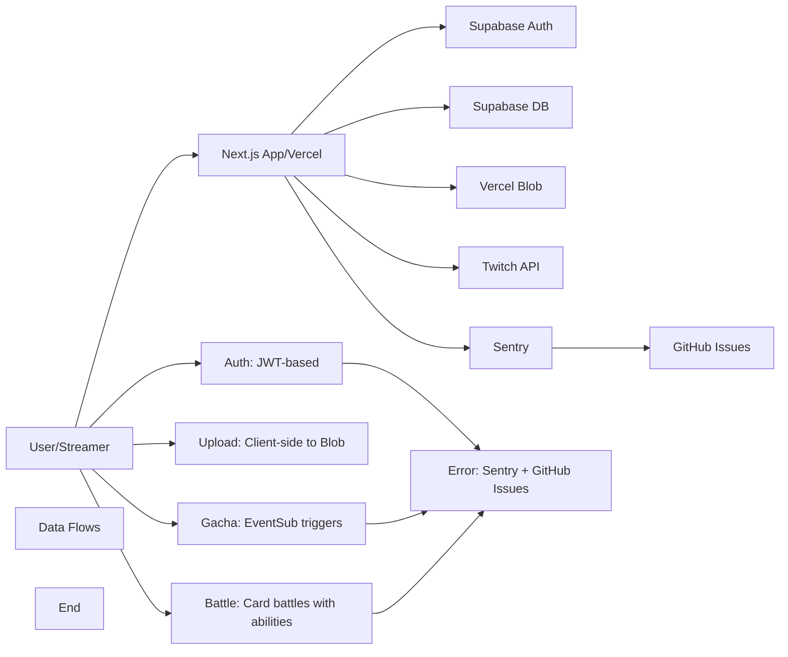

# TwiCa Architecture Document

## 概要

TwiCaはTwitch配信者向けのカードガチャシステムです。視聴者はチャンネルポイントを使ってガチャを引き、配信者が作成したオリジナルカードを収集できます。

---

## 機能要件

### 認証・認可
- Twitch OAuthによる配信者・視聴者認証
- Supabase Auth + カスタムCookieによるセッション管理
- 配信者は自身の配信者ページでのみカード管理が可能
- 視聴者は自分のカードとガチャ履歴のみ閲覧可能

### カード管理機能
- 配信者がカードを登録できる（名前、説明、画像URL、レアリティ、ドロップ率）
- カードの有効/無効切り替え
- カード画像はVercel Blob Storageに保存
- レアリティ: コモン、レア、エピック、レジェンダリー
- カード画像サイズ制限: 最大1MB

### ガチャ機能
- チャンネルポイントを使用したガチャシステム
- Twitch EventSubによるチャンネルポイント使用通知
- 重み付き確率によるカード選択
- ガチャ履歴の記録

### オーバーレイ表示
- ガチャ結果を配信画面にオーバーレイ表示
- ストリーマーIDごとのカスタマイズ可能な表示

### ダッシュボード機能
- 配信者ダッシュボード（カード管理、設定）
- 視聴者ダッシュボード（所持カード、ガチャ履歴）

### エラートラッキング
- Sentryによるエラー監視
- アプリケーションエラーの自動送信
- GitHub Issuesへの自動連携

---

## 非機能要件

### パフォーマンス
- APIレスポンス: 500ms以内（99パーセンタイル）
- ガチャ処理: 300ms以内
- 対戦処理: 1000ms以内
- 静的アセットのCDN配信（Vercel）
- データベースインデックスによるクエリ最適化
- データベースクエリフィールド選択の最適化
- N+1クエリ問題の回避

### セキュリティ
- HTTPSでの通信
- Supabase RLS (Row Level Security) による多層防御
- CSRF対策（SameSite=Lax Cookie + state検証）
- XSS対策（Reactの自動エスケープ）
- 環境変数によるシークレット管理
- セッション有効期限: 7日（Cookie + expiresAt検証）
- Twitch署名検証（EventSub Webhook）
- EventSubべき等性（event_idによる重複チェック）
- APIレート制限によるDoS攻撃対策
- 対戦の不正防止（ランダム性の確保）
- デバッグエンドポイントの保護（Issue #32）
- Sentryデバッグエンドポイントの保護（Issue #36）

### 可用性
- Vercelによる99.95% SLA
- Supabaseによる99.9% データベース可用性
- エラー検知と通知（Sentry）

### スケーラビリティ
- Vercel Serverless Functionsの自動スケーリング
- SupabaseのマネージドPostgreSQL（自動スケーリング）

### 可観測性
- Sentryによるエラー追跡と監視
- 構造化ロギング
- パフォーマンスモニタリング

---

## 受け入れ基準

### ユーザー認証
- [x] Twitch OAuthでログインできる
- [x] 配信者として認証される
- [x] 視聴者として認証される
- [x] ログアウトできる
- [x] セッション有効期限後に再認証が必要
- [x] Twitchログイン時のエラーが適切にハンドリングされる（Issue #19 - 解決済み）

### カード管理
- [x] カードを新規登録できる
- [x] カードを編集できる
- [x] カードを削除できる
- [x] カード画像をアップロードできる
- [x] カード画像サイズが1MB以下である
- [x] カードの有効/無効を切り替えられる
- [x] ドロップ率を設定できる（合計1.0以下）

### ガチャ機能
- [x] チャンネルポイントでガチャを引ける
- [x] ガチャ結果が正しく表示される
- [x] ドロップ率通りにカードが排出される
- [x] ガチャ履歴が記録される
- [x] 重みなしで同じ確率で排出される（全カードのドロップ率が等しい場合）

### オーバーレイ
- [x] ガチャ結果がOBS等のブラウザソースで表示できる
- [x] カード画像が正しく表示される
- [x] レアリティに応じた色が表示される

### データ整合性
- [x] RLSポリシーが正しく機能する
- [x] 配信者は自分のカードしか編集できない
- [x] 視聴者は自分のカードしか見れない
- [x] ガチャ履歴が正しく記録される

### APIレート制限（Issue #13）
- [x] `@upstash/ratelimit` と `@upstash/redis` をインストール
- [x] `src/lib/rate-limit.ts` を実装
- [x] 各 API ルートにレート制限を追加
- [x] 429 エラーが適切に返される
- [x] レート制限ヘッダーが設定される
- [x] 開発環境でインメモリレート制限が動作する
- [x] 本番環境で Redis レート制限が動作する
- [x] EventSub Webhook は緩いレート制限を持つ
- [x] 認証済みユーザーは twitchUserId で識別される
- [x] 未認証ユーザーは IP アドレスで識別される
- [x] フロントエンドで 429 エラーが適切に表示される

### カード対戦機能（Issue #15）
- [x] カードにステータス（HP、ATK、DEF、SPD）が追加される
- [x] 各カードにスキルが設定される
- [x] CPU対戦が可能
- [x] 自動ターン制バトルが動作する
- [x] 勝敗判定が正しく行われる
- [x] 対戦履歴が記録される
- [x] 対戦統計が表示される
- [x] フロントエンドで対戦が視覚的に楽しめる
- [x] アニメーション効果が表示される
- [x] モバイルで快適に操作可能

### コード品質（Issue #35）
- [x] Battle ライブラリの文字列が定数化されている
- [x] スキル名配列が定数として定義されている
- [x] バトルログメッセージが定数として定義されている
- [x] CPU カード文字列が定数を使用している
- [x] ハードコードされた日本語文字列が削除されている
- [x] Battle API と battle.ts の間で一貫性が保たれている

### Sentry エラー追跡
- [x] Sentry DSN が環境変数から正しく読み込まれる
- [x] クライアント側エラーがSentryに送信される
- [x] サーバー側APIエラーがSentryに送信される
- [x] コンソールエラーがSentryにキャプチャされる
- [x] 500エラーがSentryに報告される
- [x] Sentryイベントの環境が正しく設定される
- [x] エラーコンテキスト（ユーザー、リクエストなど）が正しく付与される

---

## 設計方針

### アーキテクチャパターン
- **クライアントサイド**: Next.js App Router + Server Components
- **サーバーサイド**: Vercel Serverless Functions
- **データストア**: Supabase (PostgreSQL)
- **ストレージ**: Vercel Blob
- **認証**: カスタムCookie + Twitch OAuth
- **エラートラッキング**: Sentry + GitHub Issues自動化

### デザイン原則
1. **Simple over Complex**: 複雑さを最小限に抑える
2. **Type Safety**: TypeScriptによる厳格な型定義
3. **Separation of Concerns**: 機能ごとのモジュール分割
4. **Security First**: アプリケーション層での認証検証 + RLS（多層防御）
5. **Consistency**: コードベース全体で一貫性を維持
6. **Error Handling**: ユーザーにわかりやすいエラーメッセージを提供
7. **Observability**: エラー追跡と自動イシュー作成により運用効率を向上
8. **Performance**: 最小限のデータ転送と効率的なクエリ実行
9. **Query Optimization**: N+1クエリ問題の回避とJOINの適切な使用
10. **Development/Production Separation**: デバッグツールは開発環境でのみ使用
11. **String Standardization**: すべての表示文字列を定数として一元管理
12. **Constant Standardization**: すべての設定値・定数を一元管理
13. **Client-side OAuth**: OAuthリダイレクトはクライアント側で行い、CORS問題を回避

### 技術選定基準
- マネージドサービス優先（運用コスト削減）
- Next.jsエコシステムを活用（開発効率）
- カスタムセッションによる柔軟な認証管理
- Sentryによるエラー可視化

---

## アーキテクチャ

### システム全体図



---

## Twitch OAuth CORSエラーの修正（Issue #42）

### 現状の問題

Twitch OAuth認証フローでCORSエラーが発生しています。

#### エラーメッセージ
```
Access to fetch at 'https://id.twitch.tv/oauth2/authorize?...' from origin 'https://twica.bluemoon.works' has been blocked by CORS policy: Request header field rsc is not allowed by Access-Control-Allow-Headers in preflight response.
```

#### 原因

1. **Next.js RSCからのリダイレクト**: `/api/auth/twitch/login` ルートで `NextResponse.redirect()` を使用してTwitch OAuth URLにリダイレクトしています
2. **内部ヘッダーの付加**: Next.jsのRSC（React Server Component）からのリダイレクト時、Next.jsが内部ヘッダー（`rsc`など）を付加します
3. **TwitchのCORS制限**: TwitchのOAuthエンドポイントはこれらの内部ヘッダーを受け付けず、CORSエラーを返します

#### 影響範囲
- Twitchログイン機能が正常に動作しない
- Twitchプロフィール画像の取得が失敗する（400 Bad Request）
- Twitch rewards APIのアクセスが失敗する（401 Unauthorized）

### 解決策

#### 1. APIルートの変更（`src/app/api/auth/twitch/login/route.ts`）

`NextResponse.redirect()` を使用せず、JSONレスポンスで認証URLを返すように変更します。

```typescript
export async function GET(request: Request) {
  const requestId = randomUUID()
  setRequestContext(requestId, '/api/auth/twitch/login')
  clearUserContext()
  
  try {
    const ip = getClientIp(request);
    const identifier = `ip:${ip}`;
    const rateLimitResult = await checkRateLimit(rateLimits.authLogin, identifier, 5, 60 * 1000);

    if (!rateLimitResult.success) {
      return NextResponse.json(
        { error: ERROR_MESSAGES.RATE_LIMIT_EXCEEDED },
        {
          status: 429,
          headers: {
            'X-RateLimit-Limit': String(rateLimitResult.limit),
            'X-RateLimit-Remaining': String(rateLimitResult.remaining),
            'X-RateLimit-Reset': String(rateLimitResult.reset),
          },
        }
      );
    }

    const redirectUri = `${process.env.NEXT_PUBLIC_APP_URL}/api/auth/twitch/callback`

    const state = randomUUID()

    const cookieStore = await cookies()
    cookieStore.set('twitch_auth_state', state, {
      httpOnly: true,
      secure: process.env.NODE_ENV === 'production',
      sameSite: 'lax',
      maxAge: 60 * 10, // 10 minutes
    })

    const authUrl = getTwitchAuthUrl(redirectUri, state)

    // リダイレクトではなく、JSONレスポンスで認証URLを返す
    return NextResponse.json({ authUrl })
  } catch (error) {
    reportAuthError(error, {
      provider: 'twitch',
      action: 'login',
    })
    
    return handleAuthError(error, 'unknown_error', { route: 'twitch_login' })
  }
}
```

#### 2. クライアントコンポーネントの更新

Twitchログインボタンを持つクライアントコンポーネントで、APIから認証URLを取得し、ブラウザのリダイレクトを使用するように変更します。

```typescript
'use client'

import { useState } from 'react'

export function TwitchLoginButton() {
  const [isLoading, setIsLoading] = useState(false)

  const handleLogin = async () => {
    setIsLoading(true)
    try {
      const response = await fetch('/api/auth/twitch/login')
      const data = await response.json()
      
      if (data.authUrl) {
        // クライアント側でリダイレクト
        window.location.href = data.authUrl
      } else if (data.error) {
        console.error('Login error:', data.error)
      }
    } catch (error) {
      console.error('Failed to initiate login:', error)
    } finally {
      setIsLoading(false)
    }
  }

  return (
    <button
      onClick={handleLogin}
      disabled={isLoading}
      className={/* ボタンのスタイル */}
    >
      {isLoading ? 'Loading...' : 'Login with Twitch'}
    </button>
  )
}
```

#### 3. フロントエンドのTwitchログインUIの調査

現在、Twitchログインボタンがどこで実装されているかを調査し、上記のクライアントコンポーネントに置き換える必要があります。

### トレードオフの検討

#### 選択肢1: クライアント側でリダイレクトする（採用）
- **メリット**:
  - CORSエラーが解決される
  - ブラウザのネイティブなリダイレクト動作を使用
  - サーバー側でのリダイレクトよりもシンプル
- **デメリット**:
  - フロントエンドの変更が必要
  - 既存の実装を調査する必要がある
- **判断**: この選択肢を採用

#### 選択肢2: Next.jsミドルウェアでヘッダーを削除する
- **メリット**:
  - 既存のサーバーサイド実装を維持できる
- **デメリット**:
  - ミドルウェアの設定が複雑になる
  - Next.jsのバージョンアップ時に互換性問題が発生する可能性がある
  - 根本的な解決策ではない
- **判断**: 採用しない

#### 選択肢3: Next.jsのリダイレクト設定をカスタマイズする
- **メリット**:
  - Next.jsの標準的な機能を使用
- **デメリット**:
  - 内部ヘッダーの制御が難しい
  - ドキュメントが十分ではない
- **判断**: 採用しない

### 受け入れ基準

- [ ] `/api/auth/twitch/login` ルートがJSONレスポンスで認証URLを返す
- [ ] クライアント側で認証URLを取得し、ブラウザのリダイレクトを使用する
- [ ] Twitchログインボタンをクリックすると、Twitch OAuthページに正常にリダイレクトされる
- [ ] CORSエラーが発生しない
- [ ] Twitchプロフィール画像が正常に取得される（400エラーが解消）
- [ ] Twitch rewards APIに正常にアクセスできる（401エラーが解消）
- [ ] 既存の認証フローが正常に機能する
- [ ] lintとtestがパスする
- [ ] TypeScriptの型チェックがパスする

---

## 更新履歴

| 日付 | 変更内容 |
|:---|:---|
| 2026-01-18 | Twitch OAuth CORSエラーの修正設計を追加（Issue #42） |
| 2026-01-18 | カードステータス定数化の設計を追加（Issue #41） |
| 2026-01-18 | バトルシステム定数化の設計を追加（Issue #37 - 解決済み） |
| 2026-01-18 | Sentryエラー送信問題の設計を追加 |
| 2026-01-18 | Sentryデバッグエンドポイントのセキュリティ設計を追加 |

---

## 実装完了の問題

- **Issue #41**: Code Quality - Hardcoded Card Stat Generation Ranges in battle.ts (実装中)
- **Issue #37**: Code Quality - Hardcoded Battle Configuration Values in battle.ts (解決済み)
- **Issue #36**: Critical Security: Sentry Debug Endpoints Exposed in Production (解決済み)
- **Issue #35**: Code Quality - Hardcoded Skill Names and CPU Strings in Battle Library (解決済み)
- **Issue #34**: Code Quality - Hardcoded CPU Card Strings in Battle APIs (解決済み)
- **Issue #33**: Code Quality - Session API Error Message Standardization (解決済み)
- **Issue #32**: Critical Security - Debug Endpoint Exposes Sensitive Cookies (解決済み)

過去のアーキテクチャドキュメントの詳細は `docs/ARCHITECTURE_2026-01-18.md` を参照してください。
