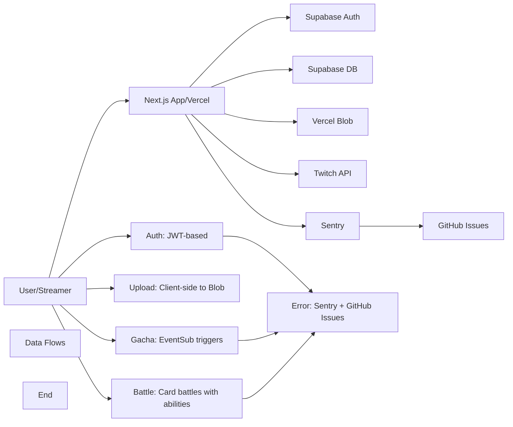

# TwiCa Architecture Document

## 概要

TwiCaはTwitch配信者向けのカードガチャシステムです。視聴者はチャンネルポイントを使ってガチャを引き、配信者が作成したオリジナルカードを収集できます。

---

## 機能要件

### 認証・認可
- Twitch OAuthによる配信者・視聴者認証
- Supabase Auth + カスタムCookieによるセッション管理
- 配信者は自身の配信者ページでのみカード管理が可能
- 視聴者は自分のカードとガチャ履歴のみ閲覧可能

### カード管理機能
- 配信者がカードを登録できる（名前、説明、画像URL、レアリティ、ドロップ率）
- カードの有効/無効切り替え
- カード画像はVercel Blob Storageに保存
- レアリティ: コモン、レア、エピック、レジェンダリー
- カード画像サイズ制限: 最大1MB

### ガチャ機能
- チャンネルポイントを使用したガチャシステム
- Twitch EventSubによるチャンネルポイント使用通知
- 重み付き確率によるカード選択
- ガチャ履歴の記録

### オーバーレイ表示
- ガチャ結果を配信画面にオーバーレイ表示
- ストリーマーIDごとのカスタマイズ可能な表示

### ダッシュボード機能
- 配信者ダッシュボード（カード管理、設定）
- 視聴者ダッシュボード（所持カード、ガチャ履歴）

### エラートラッキング
- Sentryによるエラー監視
- アプリケーションエラーの自動送信
- GitHub Issuesへの自動連携

---

## 非機能要件

### パフォーマンス
- APIレスポンス: 500ms以内（99パーセンタイル）
- ガチャ処理: 300ms以内
- 対戦処理: 1000ms以内
- 静的アセットのCDN配信（Vercel）
- データベースインデックスによるクエリ最適化
- データベースクエリフィールド選択の最適化
- N+1クエリ問題の回避

### セキュリティ
- HTTPSでの通信
- Supabase RLS (Row Level Security) による多層防御
- CSRF対策（SameSite=Lax Cookie + state検証）
- XSS対策（Reactの自動エスケープ）
- 環境変数によるシークレット管理
- セッション有効期限: 7日（Cookie + expiresAt検証）
- Twitch署名検証（EventSub Webhook）
- EventSubべき等性（event_idによる重複チェック）
- APIレート制限によるDoS攻撃対策
- 対戦の不正防止（ランダム性の確保）
- デバッグエンドポイントの保護（Issue #32）
- Sentryデバッグエンドポイントの保護（Issue #36）
- セキュリティヘッダーの設定（Issue #43）

### 可用性
- Vercelによる99.95% SLA
- Supabaseによる99.9% データベース可用性
- エラー検知と通知（Sentry）

### スケーラビリティ
- Vercel Serverless Functionsの自動スケーリング
- SupabaseのマネージドPostgreSQL（自動スケーリング）

### 可観測性
- Sentryによるエラー追跡と監視
- 構造化ロギング
- パフォーマンスモニタリング

---

## 受け入れ基準

### ユーザー認証
- [x] Twitch OAuthでログインできる
- [x] 配信者として認証される
- [x] 視聴者として認証される
- [x] ログアウトできる
- [x] セッション有効期限後に再認証が必要
- [x] Twitchログイン時のエラーが適切にハンドリングされる（Issue #19 - 解決済み）

### カード管理
- [x] カードを新規登録できる
- [x] カードを編集できる
- [x] カードを削除できる
- [x] カード画像をアップロードできる
- [x] カード画像サイズが1MB以下である
- [x] カードの有効/無効を切り替えられる
- [x] ドロップ率を設定できる（合計1.0以下）

### ガチャ機能
- [x] チャンネルポイントでガチャを引ける
- [x] ガチャ結果が正しく表示される
- [x] ドロップ率通りにカードが排出される
- [x] ガチャ履歴が記録される
- [x] 重みなしで同じ確率で排出される（全カードのドロップ率が等しい場合）

### オーバーレイ
- [x] ガチャ結果がOBS等のブラウザソースで表示できる
- [x] カード画像が正しく表示される
- [x] レアリティに応じた色が表示される

### データ整合性
- [x] RLSポリシーが正しく機能する
- [x] 配信者は自分のカードしか編集できない
- [x] 視聴者は自分のカードしか見れない
- [x] ガチャ履歴が正しく記録される

### APIレート制限（Issue #13）
- [x] `@upstash/ratelimit` と `@upstash/redis` をインストール
- [x] `src/lib/rate-limit.ts` を実装
- [x] 各 API ルートにレート制限を追加
- [x] 429 エラーが適切に返される
- [x] レート制限ヘッダーが設定される
- [x] 開発環境でインメモリレート制限が動作する
- [x] 本番環境で Redis レート制限が動作する
- [x] EventSub Webhook は緩いレート制限を持つ
- [x] 認証済みユーザーは twitchUserId で識別される
- [x] 未認証ユーザーは IP アドレスで識別される
- [x] フロントエンドで 429 エラーが適切に表示される

### カード対戦機能（Issue #15）
- [x] カードにステータス（HP、ATK、DEF、SPD）が追加される
- [x] 各カードにスキルが設定される
- [x] CPU対戦が可能
- [x] 自動ターン制バトルが動作する
- [x] 勝敗判定が正しく行われる
- [x] 対戦履歴が記録される
- [x] 対戦統計が表示される
- [x] フロントエンドで対戦が視覚的に楽しめる
- [x] アニメーション効果が表示される
- [x] モバイルで快適に操作可能

### コード品質（Issue #35）
- [x] Battle ライブラリの文字列が定数化されている
- [x] スキル名配列が定数として定義されている
- [x] バトルログメッセージが定数として定義されている
- [x] CPU カード文字列が定数を使用している
- [x] ハードコードされた日本語文字列が削除されている
- [x] Battle API と battle.ts の間で一貫性が保たれている

### Sentry エラー追跡
- [x] Sentry DSN が環境変数から正しく読み込まれる
- [x] クライアント側エラーがSentryに送信される
- [x] サーバー側APIエラーがSentryに送信される
- [x] コンソールエラーがSentryにキャプチャされる
- [x] 500エラーがSentryに報告される
- [x] Sentryイベントの環境が正しく設定される
- [x] エラーコンテキスト（ユーザー、リクエストなど）が正しく付与される

### セキュリティヘッダー（Issue #43）
- [x] `src/lib/constants.ts` に `SECURITY_HEADERS` 定数を追加
- [x] `src/lib/security-headers.ts` にヘルパー関数を作成
- [x] `src/proxy.ts` でセキュリティヘッダーを設定
- [x] 開発環境と本番環境で異なる CSP を設定
- [x] HSTS は本番環境のみで設定
- [ ] 本番環境で Tailwind CSS v4 が正常に動作することを確認
- [ ] 本番環境で Next.js App Router が正常に動作することを確認
- [ ] nonceを使用したCSPの実装（必要な場合）
- [x] lint と test がパスする
- [ ] CI がパスする

---

## 設計方針

### アーキテクチャパターン
- **クライアントサイド**: Next.js App Router + Server Components
- **サーバーサイド**: Vercel Serverless Functions
- **データストア**: Supabase (PostgreSQL)
- **ストレージ**: Vercel Blob
- **認証**: カスタムCookie + Twitch OAuth
- **エラートラッキング**: Sentry + GitHub Issues自動化

### デザイン原則
1. **Simple over Complex**: 複雑さを最小限に抑える
2. **Type Safety**: TypeScriptによる厳格な型定義
3. **Separation of Concerns**: 機能ごとのモジュール分割
4. **Security First**: アプリケーション層での認証検証 + RLS（多層防御）
5. **Consistency**: コードベース全体で一貫性を維持
6. **Error Handling**: ユーザーにわかりやすいエラーメッセージを提供
7. **Observability**: エラー追跡と自動イシュー作成により運用効率を向上
8. **Performance**: 最小限のデータ転送と効率的なクエリ実行
9. **Query Optimization**: N+1クエリ問題の回避とJOINの適切な使用
10. **Development/Production Separation**: デバッグツールは開発環境でのみ使用
11. **String Standardization**: すべての表示文字列を定数として一元管理
12. **Constant Standardization**: すべての設定値・定数を一元管理
13. **Client-side OAuth**: OAuthリダイレクトはクライアント側で行い、CORS問題を回避
14. **Security Headers**: すべてのリクエストにセキュリティヘッダーを設定

### 技術選定基準
- マネージドサービス優先（運用コスト削減）
- Next.jsエコシステムを活用（開発効率）
- カスタムセッションによる柔軟な認証管理
- Sentryによるエラー可視化

---

## アーキテクチャ

### システム全体図



---

## セキュリティヘッダーの設定（Issue #43）- CSP実装方法の更新

### 概要

APIルートやページでセキュリティヘッダーが設定されていません。これにより、XSS、クリックジャッキングなどの攻撃に対する脆弱性が存在する可能性があります。

### 問題点

以下のセキュリティヘッダーが設定されていません：

1. **X-Content-Type-Options**: MIMEタイプスニッフィングを防ぐ
2. **X-Frame-Options**: クリックジャッキングを防ぐ
3. **X-XSS-Protection**: XSSフィルターを有効化
4. **Content-Security-Policy**: コンテンツセキュリティポリシーを設定
5. **Strict-Transport-Security**: HTTPSのみでの接続を強制

### 影響範囲

- すべての API ルート
- すべてのページ

### Tailwind CSS v4 と Next.js App Router の CSP 対応状況

#### Tailwind CSS v4
- **静的なCSS生成**: v4では、静的なCSS生成が可能で、インラインスタイルに依存しなくなっています
- **CSP対応**: v4では、インラインスタイルの使用が大幅に減少し、CSP対応が改善されています
- **style-src**: `style-src 'self'` で十分に動作する可能性があります

#### Next.js App Router
- **インラインスクリプト**: Next.js App Routerでは、インラインスクリプトが一部使用される可能性があります
- **CSPサポート**: Next.jsはCSPをネイティブにサポートしており、`next.config.js`でCSPを設定できます
- **nonce**: Next.jsでは、nonceを使用したCSPを実装できます

### 設計

#### 1. 定数の追加

`src/lib/constants.ts` にセキュリティヘッダー用の定数を追加します。

```typescript
export const SECURITY_HEADERS = {
  X_CONTENT_TYPE_OPTIONS: 'nosniff',
  X_FRAME_OPTIONS: 'DENY',
  X_XSS_PROTECTION: '1; mode=block',
  CSP_DEVELOPMENT: "default-src 'self'; script-src 'self' 'unsafe-eval' 'unsafe-inline'; style-src 'self' 'unsafe-inline'; img-src 'self' data: https: blob:; connect-src 'self' https: localhost:*; font-src 'self' data:;",
  CSP_PRODUCTION: "default-src 'self'; script-src 'self'; style-src 'self'; img-src 'self' data: https: blob:; connect-src 'self' https:; font-src 'self' data:;",
  HSTS: 'max-age=31536000; includeSubDomains; preload',
} as const
```

**重要**:
- **開発環境**: `'unsafe-eval'` と `'unsafe-inline'` を許可します
- **本番環境**: `'unsafe-eval'` と `'unsafe-inline'` を削除します
- **Tailwind CSS v4**: 静的なCSS生成を活用し、インラインスタイルに依存しないようにします
- **Next.js App Router**: インラインスクリプトを最小限に抑えるようにします

#### 2. ヘルパー関数の作成

`src/lib/security-headers.ts` にヘルパー関数を作成します。

```typescript
import { NextResponse } from 'next/server'
import { SECURITY_HEADERS } from './constants'

export function setSecurityHeaders(response: NextResponse): NextResponse {
  response.headers.set('X-Content-Type-Options', SECURITY_HEADERS.X_CONTENT_TYPE_OPTIONS)
  response.headers.set('X-Frame-Options', SECURITY_HEADERS.X_FRAME_OPTIONS)
  response.headers.set('X-XSS-Protection', SECURITY_HEADERS.X_XSS_PROTECTION)

  const csp = process.env.NODE_ENV === 'production'
    ? SECURITY_HEADERS.CSP_PRODUCTION
    : SECURITY_HEADERS.CSP_DEVELOPMENT
  response.headers.set('Content-Security-Policy', csp)

  if (process.env.NODE_ENV === 'production') {
    response.headers.set('Strict-Transport-Security', SECURITY_HEADERS.HSTS)
  }

  return response
}
```

#### 3. Proxy での適用

`src/proxy.ts` でセキュリティヘッダーを適用します。

```typescript
import { type NextRequest, NextResponse } from 'next/server'
import { updateSession } from '@/lib/supabase/middleware'
import { checkRateLimit, rateLimits, getClientIp } from '@/lib/rate-limit'
import { setSecurityHeaders } from '@/lib/security-headers'

export async function proxy(request: NextRequest) {
  const response = await updateSession(request)

  setSecurityHeaders(response)

  if (request.nextUrl.pathname.startsWith('/api')) {
    const ip = getClientIp(request);

    const identifier = `global:${ip}`;
    const rateLimitResult = await checkRateLimit(
      rateLimits.eventsub,
      identifier
    );

    if (!rateLimitResult.success) {
      const errorResponse = NextResponse.json(
        { error: 'Too many requests' },
        {
          status: 429,
          headers: {
            'X-RateLimit-Limit': String(rateLimitResult.limit),
            'X-RateLimit-Remaining': String(rateLimitResult.remaining),
            'X-RateLimit-Reset': String(rateLimitResult.reset),
          },
        }
      );

      return setSecurityHeaders(errorResponse)
    }
  }

  return response
}

export const config = {
  matcher: [
    '/((?!_next/static|_next/image|favicon.ico|.*\\.(?:svg|png|jpg|jpeg|gif|webp)$).*)',
  ],
}
```

#### 4. テスト

`tests/unit/security-headers.test.ts` にテストを追加します。

```typescript
import { describe, it, expect, vi } from 'vitest'
import { NextResponse } from 'next/server'
import { setSecurityHeaders } from '@/lib/security-headers'

describe('setSecurityHeaders', () => {
  it('X-Content-Type-Optionsヘッダーを設定する', () => {
    const response = NextResponse.json({ test: 'data' })
    const result = setSecurityHeaders(response)
    expect(result.headers.get('X-Content-Type-Options')).toBe('nosniff')
  })

  it('X-Frame-Optionsヘッダーを設定する', () => {
    const response = NextResponse.json({ test: 'data' })
    const result = setSecurityHeaders(response)
    expect(result.headers.get('X-Frame-Options')).toBe('DENY')
  })

  it('X-XSS-Protectionヘッダーを設定する', () => {
    const response = NextResponse.json({ test: 'data' })
    const result = setSecurityHeaders(response)
    expect(result.headers.get('X-XSS-Protection')).toBe('1; mode=block')
  })

  describe('Content-Security-Policy', () => {
    it('開発環境ではlocalhostへの接続を許可する', () => {
      vi.stubEnv('NODE_ENV', 'development')
      const response = NextResponse.json({ test: 'data' })
      const result = setSecurityHeaders(response)
      const csp = result.headers.get('Content-Security-Policy')
      expect(csp).toContain('localhost:*')
      expect(csp).toContain('unsafe-eval')
      expect(csp).toContain('unsafe-inline')
      vi.unstubAllEnvs()
    })

    it('本番環境ではlocalhostへの接続を許可しない', () => {
      vi.stubEnv('NODE_ENV', 'production')
      const response = NextResponse.json({ test: 'data' })
      const result = setSecurityHeaders(response)
      const csp = result.headers.get('Content-Security-Policy')
      expect(csp).toContain('connect-src \'self\' https:;')
      expect(csp).not.toContain('localhost')
      expect(csp).not.toContain('unsafe-eval')
      expect(csp).not.toContain('unsafe-inline')
      vi.unstubAllEnvs()
    })
  })

  describe('Strict-Transport-Security', () => {
    it('本番環境でのみHSTSを設定する', () => {
      vi.stubEnv('NODE_ENV', 'production')
      const response = NextResponse.json({ test: 'data' })
      const result = setSecurityHeaders(response)
      expect(result.headers.get('Strict-Transport-Security')).toBe('max-age=31536000; includeSubDomains; preload')
      vi.unstubAllEnvs()
    })

    it('開発環境ではHSTSを設定しない', () => {
      vi.stubEnv('NODE_ENV', 'development')
      const response = NextResponse.json({ test: 'data' })
      const result = setSecurityHeaders(response)
      expect(result.headers.get('Strict-Transport-Security')).toBeNull()
      vi.unstubAllEnvs()
    })
  })
})
```

### メリット

1. **セキュリティ強化**: XSS、クリックジャッキングなどの攻撃を防ぐ
2. **ベストプラクティス**: OWASP などのセキュリティガイドラインに準拠
3. **一元管理**: セキュリティヘッダーを一箇所で管理
4. **環境別設定**: 開発環境と本番環境で異なる設定を適用
5. **Tailwind CSS v4対応**: Tailwind CSS v4の静的なCSS生成を活用

### トレードオフの検討

#### 選択肢1: 現状のCSP実装（採用）
- **メリット**:
  - 実装がシンプル
  - Tailwind CSS v4の静的なCSS生成を活用できる
  - `'unsafe-eval'` と `'unsafe-inline'` を削除し、セキュリティを強化
- **デメリット**:
  - Next.js App Routerのインラインスクリプトを許可しないため、Next.jsが正常に動作しない可能性がある
  - 本番環境で問題が発生した場合、対処が必要
- **判断**: この選択肢をまず試す

#### 選択肢2: nonceを使用したCSP（代替案）
- **メリット**:
  - セキュリティを維持したまま、Next.jsやTailwind CSSを使用できる
  - OWASP CSPガイドラインに準拠
- **デメリット**:
  - 実装の複雑度が増す
  - Next.jsの設定変更が必要
- **判断**: 選択肢1で問題が発生した場合、この選択肢を検討する

#### 選択肢3: style-src 'self' 'unsafe-inline' を許可する（代替案）
- **メリット**:
  - 現状の動作を維持できる
- **デメリット**:
  - セキュリティ上の問題が残る
  - 前回のレビューで指摘された問題に戻ってしまう
- **判断**: 最後の手段として使用する

### 本番環境での動作確認

**ステップ1: 開発環境での動作確認**
- Tailwind CSS v4 が正常に動作することを確認
- Next.js App Router が正常に動作することを確認
- CSP違反がないことを確認（ブラウザのコンソールを確認）

**ステップ2: 本番環境へのデプロイ**
- 本番環境にデプロイし、動作を確認
- Tailwind CSS v4 が正常に動作することを確認
- Next.js App Router が正常に動作することを確認
- CSP違反がないことを確認（ブラウザのコンソールを確認）

**ステップ3: 問題がある場合の対応**
- 問題がある場合、nonceを使用したCSPを実装する
- または、style-src 'self' 'unsafe-inline' を許可する

### nonceを使用したCSPの実装（必要な場合）

もし本番環境で問題が発生した場合、以下の手順でnonceを使用したCSPを実装します：

#### 1. next.config.ts に headers を追加

```typescript
import { withSentryConfig } from "@sentry/nextjs";
import type { NextConfig } from "next";

const nextConfig: NextConfig = {
  images: {
    remotePatterns: [
      {
        protocol: "https",
        hostname: "example.com",
      },
      {
        protocol: "https",
        hostname: "*.supabase.co",
        pathname: "/storage/v1/object/public/**",
      },
      {
        protocol: "https",
        hostname: "pbs.twimg.com",
      },
      {
        protocol: "https",
        hostname: "*.twitch.tv",
      },
      {
        protocol: "https",
        hostname: "*.vercel-storage.com",
      },
    ],
  },
  async headers() {
    return [
      {
        source: '/(.*)',
        headers: [
          {
            key: 'X-Content-Type-Options',
            value: 'nosniff',
          },
          {
            key: 'X-Frame-Options',
            value: 'DENY',
          },
          {
            key: 'X-XSS-Protection',
            value: '1; mode=block',
          },
          {
            key: 'Strict-Transport-Security',
            value: 'max-age=31536000; includeSubDomains; preload',
          },
          {
            key: 'Content-Security-Policy',
            value: process.env.NODE_ENV === 'production'
              ? "default-src 'self'; script-src 'self' 'nonce-{cspNonce}'; style-src 'self' 'nonce-{cspNonce}'; img-src 'self' data: https: blob:; connect-src 'self' https:; font-src 'self' data:;"
              : "default-src 'self'; script-src 'self' 'unsafe-eval' 'unsafe-inline'; style-src 'self' 'unsafe-inline'; img-src 'self' data: https: blob:; connect-src 'self' https: localhost:*; font-src 'self' data:;",
          },
        ],
      },
    ];
  },
};

export default withSentryConfig(nextConfig, {
  org: "azumaya",
  project: "twica",
  silent: false,
  widenClientFileUpload: true,
  tunnelRoute: undefined,
  webpack: {
    automaticVercelMonitors: true,
    treeshake: {
      removeDebugLogging: false,
    },
  },
});
```

#### 2. src/proxy.ts で nonce を生成し、レスポンスヘッダーに設定

```typescript
import { type NextRequest, NextResponse } from 'next/server'
import { updateSession } from '@/lib/supabase/middleware'
import { checkRateLimit, rateLimits, getClientIp } from '@/lib/rate-limit'
import { setSecurityHeaders } from '@/lib/security-headers'
import { randomBytes } from 'crypto'

function generateNonce(): string {
  return randomBytes(16).toString('base64')
}

export async function proxy(request: NextRequest) {
  const nonce = generateNonce()
  const response = await updateSession(request)

  response.headers.set('x-nonce', nonce)
  setSecurityHeaders(response)

  // Apply CSP with nonce
  const csp = process.env.NODE_ENV === 'production'
    ? `default-src 'self'; script-src 'self' 'nonce-${nonce}'; style-src 'self' 'nonce-${nonce}'; img-src 'self' data: https: blob:; connect-src 'self' https:; font-src 'self' data:;`
    : `default-src 'self'; script-src 'self' 'unsafe-eval' 'unsafe-inline'; style-src 'self' 'unsafe-inline'; img-src 'self' data: https: blob:; connect-src 'self' https: localhost:*; font-src 'self' data:;`
  response.headers.set('Content-Security-Policy', csp)

  if (request.nextUrl.pathname.startsWith('/api')) {
    const ip = getClientIp(request);
    const identifier = `global:${ip}`;
    const rateLimitResult = await checkRateLimit(
      rateLimits.eventsub,
      identifier
    );

    if (!rateLimitResult.success) {
      const errorResponse = NextResponse.json(
        { error: 'Too many requests' },
        {
          status: 429,
          headers: {
            'X-RateLimit-Limit': String(rateLimitResult.limit),
            'X-RateLimit-Remaining': String(rateLimitResult.remaining),
            'X-RateLimit-Reset': String(rateLimitResult.reset),
          },
        }
      );

      errorResponse.headers.set('x-nonce', nonce)
      errorResponse.headers.set('Content-Security-Policy', csp)
      return errorResponse
    }
  }

  return response
}

export const config = {
  matcher: [
    '/((?!_next/static|_next/image|favicon.ico|.*\\.(?:svg|png|jpg|jpeg|gif|webp)$).*)',
  ],
}
```

### 受け入れ基準

- [x] `src/lib/constants.ts` に `SECURITY_HEADERS` 定数を追加
- [x] `src/lib/security-headers.ts` にヘルパー関数を作成
- [x] `src/proxy.ts` でセキュリティヘッダーを設定
- [x] 開発環境と本番環境で異なる CSP を設定
- [x] HSTS は本番環境のみで設定
- [ ] 本番環境で Tailwind CSS v4 が正常に動作することを確認
- [ ] 本番環境で Next.js App Router が正常に動作することを確認
- [ ] nonceを使用したCSPの実装（必要な場合）
- [x] lint と test がパスする
- [ ] CI がパスする

---

## 更新履歴

| 日付 | 変更内容 |
|:---|:---|
| 2026-01-19 | CSP実装方法を更新（Tailwind CSS v4とNext.js App Routerの対応状況を追加） |
| 2026-01-19 | セキュリティヘッダー設定の設計を追加（Issue #43） |
| 2026-01-19 | Sentry例外送信の確認と修正設計を追加 |
| 2026-01-18 | Twitch OAuth CORSエラーの修正設計を追加（Issue #42 - 解決済み） |
| 2026-01-18 | カードステータス定数化の設計を追加（Issue #41 - 解決済み） |
| 2026-01-18 | バトルシステム定数化の設計を追加（Issue #37 - 解決済み） |
| 2026-01-18 | Sentryエラー送信問題の設計を追加 |
| 2026-01-18 | Sentryデバッグエンドポイントのセキュリティ設計を追加 |

---

## 実装完了の問題

- **Issue #43**: Security: Missing Security Headers in API Routes and Pages (実装中 - 本番環境での動作確認が必要)
- **Issue #42**: Fix: Twitch OAuth CORS Error in Next.js RSC (解決済み)
- **Issue #41**: Code Quality - Hardcoded Card Stat Generation Ranges in battle.ts (解決済み)
- **Issue #37**: Code Quality - Hardcoded Battle Configuration Values in battle.ts (解決済み)
- **Issue #36**: Critical Security: Sentry Debug Endpoints Exposed in Production (解決済み)
- **Issue #35**: Code Quality - Hardcoded Skill Names and CPU Strings in Battle Library (解決済み)
- **Issue #34**: Code Quality - Hardcoded CPU Card Strings in Battle APIs (解決済み)
- **Issue #33**: Code Quality - Session API Error Message Standardization (解決済み)
- **Issue #32**: Critical Security - Debug Endpoint Exposes Sensitive Cookies (解決済み)

過去のアーキテクチャドキュメントの詳細を参照する場合は、docs/ARCHITECTURE_*.md ファイルを確認してください。
