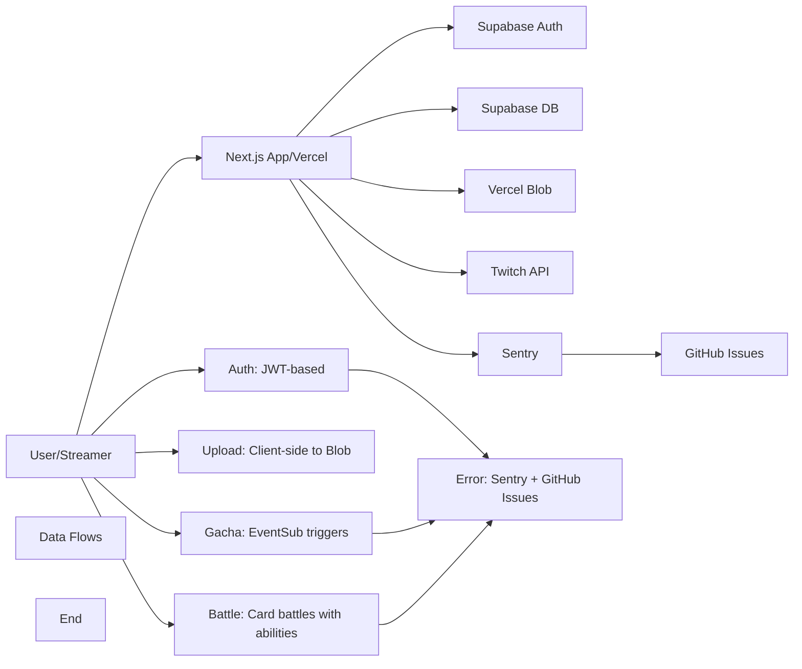

# TwiCa Architecture Document

## 概要

TwiCaはTwitch配信者向けのカードガチャシステムです。視聴者はチャンネルポイントを使ってガチャを引き、配信者が作成したオリジナルカードを収集できます。

---

## 機能要件

### 認証・認可
- Twitch OAuthによる配信者・視聴者認証
- Supabase Auth + カスタムCookieによるセッション管理
- 配信者は自身の配信者ページでのみカード管理が可能
- 視聴者は自分のカードとガチャ履歴のみ閲覧可能

### カード管理機能
- 配信者がカードを登録できる（名前、説明、画像URL、レアリティ、ドロップ率）
- カードの有効/無効切り替え
- カード画像はVercel Blob Storageに保存
- レアリティ: コモン、レア、エピック、レジェンダリー
- カード画像サイズ制限: 最大1MB

### ガチャ機能
- チャンネルポイントを使用したガチャシステム
- Twitch EventSubによるチャンネルポイント使用通知
- 重み付き確率によるカード選択
- ガチャ履歴の記録

### オーバーレイ表示
- ガチャ結果を配信画面にオーバーレイ表示
- ストリーマーIDごとのカスタマイズ可能な表示

### ダッシュボード機能
- 配信者ダッシュボード（カード管理、設定）
- 視聴者ダッシュボード（所持カード、ガチャ履歴）

### エラートラッキング
- Sentryによるエラー監視
- アプリケーションエラーの自動送信
- GitHub Issuesへの自動連携

---

## 非機能要件

### パフォーマンス
- APIレスポンス: 500ms以内（99パーセンタイル）
- ガチャ処理: 300ms以内
- 対戦処理: 1000ms以内
- 静的アセットのCDN配信（Vercel）
- データベースインデックスによるクエリ最適化
- データベースクエリフィールド選択の最適化
- N+1クエリ問題の回避

### セキュリティ
- HTTPSでの通信
- Supabase RLS (Row Level Security) による多層防御
- CSRF対策（SameSite=Lax Cookie + state検証）
- XSS対策（Reactの自動エスケープ）
- 環境変数によるシークレット管理
- セッション有効期限: 7日（Cookie + expiresAt検証）
- Twitch署名検証（EventSub Webhook）
- EventSubべき等性（event_idによる重複チェック）
- APIレート制限によるDoS攻撃対策
- 対戦の不正防止（ランダム性の確保）
- デバッグエンドポイントの保護（Issue #32）
- Sentryデバッグエンドポイントの保護（Issue #36）

### 可用性
- Vercelによる99.95% SLA
- Supabaseによる99.9% データベース可用性
- エラー検知と通知（Sentry）

### スケーラビリティ
- Vercel Serverless Functionsの自動スケーリング
- SupabaseのマネージドPostgreSQL（自動スケーリング）

### 可観測性
- Sentryによるエラー追跡と監視
- 構造化ロギング
- パフォーマンスモニタリング

---

## 受け入れ基準

### ユーザー認証
- [x] Twitch OAuthでログインできる
- [x] 配信者として認証される
- [x] 視聴者として認証される
- [x] ログアウトできる
- [x] セッション有効期限後に再認証が必要
- [x] Twitchログイン時のエラーが適切にハンドリングされる（Issue #19 - 解決済み）

### カード管理
- [x] カードを新規登録できる
- [x] カードを編集できる
- [x] カードを削除できる
- [x] カード画像をアップロードできる
- [x] カード画像サイズが1MB以下である
- [x] カードの有効/無効を切り替えられる
- [x] ドロップ率を設定できる（合計1.0以下）

### ガチャ機能
- [x] チャンネルポイントでガチャを引ける
- [x] ガチャ結果が正しく表示される
- [x] ドロップ率通りにカードが排出される
- [x] ガチャ履歴が記録される
- [x] 重みなしで同じ確率で排出される（全カードのドロップ率が等しい場合）

### オーバーレイ
- [x] ガチャ結果がOBS等のブラウザソースで表示できる
- [x] カード画像が正しく表示される
- [x] レアリティに応じた色が表示される

### データ整合性
- [x] RLSポリシーが正しく機能する
- [x] 配信者は自分のカードしか編集できない
- [x] 視聴者は自分のカードしか見れない
- [x] ガチャ履歴が正しく記録される

### APIレート制限（Issue #13）
- [x] `@upstash/ratelimit` と `@upstash/redis` をインストール
- [x] `src/lib/rate-limit.ts` を実装
- [x] 各 API ルートにレート制限を追加
- [x] 429 エラーが適切に返される
- [x] レート制限ヘッダーが設定される
- [x] 開発環境でインメモリレート制限が動作する
- [x] 本番環境で Redis レート制限が動作する
- [x] EventSub Webhook は緩いレート制限を持つ
- [x] 認証済みユーザーは twitchUserId で識別される
- [x] 未認証ユーザーは IP アドレスで識別される
- [x] フロントエンドで 429 エラーが適切に表示される

### カード対戦機能（Issue #15）
- [x] カードにステータス（HP、ATK、DEF、SPD）が追加される
- [x] 各カードにスキルが設定される
- [x] CPU対戦が可能
- [x] 自動ターン制バトルが動作する
- [x] 勝敗判定が正しく行われる
- [x] 対戦履歴が記録される
- [x] 対戦統計が表示される
- [x] フロントエンドで対戦が視覚的に楽しめる
- [x] アニメーション効果が表示される
- [x] モバイルで快適に操作可能

### コード品質（Issue #35）
- [x] Battle ライブラリの文字列が定数化されている
- [x] スキル名配列が定数として定義されている
- [x] バトルログメッセージが定数として定義されている
- [x] CPU カード文字列が定数を使用している
- [x] ハードコードされた日本語文字列が削除されている
- [x] Battle API と battle.ts の間で一貫性が保たれている

### Sentry エラー追跡
- [x] Sentry DSN が環境変数から正しく読み込まれる
- [x] クライアント側エラーがSentryに送信される
- [x] サーバー側APIエラーがSentryに送信される
- [x] コンソールエラーがSentryにキャプチャされる
- [x] 500エラーがSentryに報告される
- [x] Sentryイベントの環境が正しく設定される
- [x] エラーコンテキスト（ユーザー、リクエストなど）が正しく付与される

---

## 設計方針

### アーキテクチャパターン
- **クライアントサイド**: Next.js App Router + Server Components
- **サーバーサイド**: Vercel Serverless Functions
- **データストア**: Supabase (PostgreSQL)
- **ストレージ**: Vercel Blob
- **認証**: カスタムCookie + Twitch OAuth
- **エラートラッキング**: Sentry + GitHub Issues自動化

### デザイン原則
1. **Simple over Complex**: 複雑さを最小限に抑える
2. **Type Safety**: TypeScriptによる厳格な型定義
3. **Separation of Concerns**: 機能ごとのモジュール分割
4. **Security First**: アプリケーション層での認証検証 + RLS（多層防御）
5. **Consistency**: コードベース全体で一貫性を維持
6. **Error Handling**: ユーザーにわかりやすいエラーメッセージを提供
7. **Observability**: エラー追跡と自動イシュー作成により運用効率を向上
8. **Performance**: 最小限のデータ転送と効率的なクエリ実行
9. **Query Optimization**: N+1クエリ問題の回避とJOINの適切な使用
10. **Development/Production Separation**: デバッグツールは開発環境でのみ使用
11. **String Standardization**: すべての表示文字列を定数として一元管理
12. **Constant Standardization**: すべての設定値・定数を一元管理
13. **Client-side OAuth**: OAuthリダイレクトはクライアント側で行い、CORS問題を回避

### 技術選定基準
- マネージドサービス優先（運用コスト削減）
- Next.jsエコシステムを活用（開発効率）
- カスタムセッションによる柔軟な認証管理
- Sentryによるエラー可視化

---

## アーキテクチャ

### システム全体図



---

## Sentry例外送信の確認と修正

### 現状の問題

Sentryによるエラー追跡機能は実装されていますが、例外が確実に送信されているかの確認と、必要に応じた修正が必要です。

#### 実装状況の確認

1. **設定ファイル**
   - `sentry.client.config.ts`: クライアント側設定
   - `sentry.server.config.ts`: サーバー側設定
   - `sentry.edge.config.ts`: Edgeランタイム設定

2. **インストルメンテーション**
   - `src/instrumentation.ts`: サーバーサイドのSentry初期化
   - `src/instrumentation-client.ts`: クライアントサイドのSentry初期化

3. **エラーハンドリング**
   - `src/lib/sentry/error-handler.ts`: 構造化されたエラー報告関数
   - `src/components/ErrorBoundary.tsx`: Reactエラーバウンダリ
   - `src/app/global-error.tsx`: グローバルエラーハンドラ

4. **環境変数**
   - `NEXT_PUBLIC_SENTRY_DSN`: DSNが設定されている

#### 設定の問題点

1. **重複したクライアント設定**
   - `sentry.client.config.ts` と `src/instrumentation-client.ts` で同じような設定が行われている
   - Next.jsのSentry SDKは、`sentry.client.config.ts` を自動的に読み込むため、`instrumentation-client.ts` は不要

2. **beforeSendフィルター**
   - 現在の `beforeSend` では、常にイベントを返しているため、フィルタリングは行われていない
   - 例外が削除される可能性は低い

3. **ユーザー情報のサニタイズ**
   - `email` と `ip_address` が削除されているが、これは適切なプライバシー保護

### 解決策

#### 1. 重複設定の削除

`src/instrumentation-client.ts` を削除します。Next.jsのSentry SDKは、`sentry.client.config.ts` を自動的に読み込むため、このファイルは不要です。

#### 2. エラー送信のテスト

エラーが正しく送信されているかを確認するために、以下のテストを行います。

##### テスト1: クライアント側エラー

```typescript
// テストページを作成
// src/app/test-sentry-client/page.tsx
'use client'

import * as Sentry from '@sentry/nextjs'

export default function TestSentryClient() {
  const triggerError = () => {
    try {
      throw new Error('Test client error from manual trigger')
    } catch (error) {
      Sentry.captureException(error)
    }
  }

  return (
    <div>
      <h1>Test Sentry Client</h1>
      <button onClick={triggerError}>Trigger Error</button>
    </div>
  )
}
```

##### テスト2: サーバー側エラー

```typescript
// テストAPIを作成
// src/app/api/test-sentry-server/route.ts
import * as Sentry from '@sentry/nextjs'
import { NextResponse } from 'next/server'

export async function GET() {
  try {
    throw new Error('Test server error from API')
  } catch (error) {
    Sentry.captureException(error)
    return NextResponse.json({ error: 'Error captured in Sentry' })
  }
}
```

##### テスト3: エラーハンドラー関数

```typescript
// テストAPIを作成
// src/app/api/test-sentry-handler/route.ts
import { reportError, reportAuthError, reportApiError } from '@/lib/sentry/error-handler'
import { NextResponse } from 'next/server'

export async function GET() {
  reportError(new Error('Test error from reportError function'), { test: 'context' })
  reportAuthError(new Error('Test auth error'), { provider: 'twitch', action: 'login' })
  reportApiError('/test', 'GET', new Error('Test API error'))
  
  return NextResponse.json({ message: 'All errors captured in Sentry' })
}
```

#### 3. エラー送信の検証

Sentryダッシュボードで、以下を確認します：

1. **イベントが届いているか**
   - テストエラーがSentryに表示されているか
   - イベントの環境（development/production）が正しいか

2. **エラーデータが完全か**
   - スタックトレースが含まれているか
   - コンテキスト情報が正しく設定されているか
   - タグとユーザー情報が適切に設定されているか

3. **プライバシー保護**
   - emailとip_addressが削除されているか
   - 敏感なヘッダー（cookie, authorization）が削除されているか

#### 4. 設定の最適化

必要に応じて、以下の設定を追加します。

##### サンプリングレートの調整

```typescript
// sentry.client.config.ts
tracesSampleRate: process.env.NODE_ENV === 'production' ? 0.1 : 1.0,
replaysSessionSampleRate: process.env.NODE_ENV === 'production' ? 0.01 : 0.1,
replaysOnErrorSampleRate: process.env.NODE_ENV === 'production' ? 0.1 : 1.0,
```

##### エラーフィルタリング

```typescript
// sentry.client.config.ts
beforeSend(event) {
  if (event.user) {
    delete event.user.email
    delete event.user.ip_address
  }

  // 開発環境でのみ特定のエラーをフィルタリング（必要な場合）
  if (process.env.NODE_ENV === 'development' && event.level === 'info') {
    return null
  }

  return event
}
```

### トレードオフの検討

#### 選択肢1: 重複設定を削除し、標準的なNext.js設定を使用する（採用）
- **メリット**:
  - Next.jsのSentry SDKの推奨される設定方法
  - メンテナンスが容易
  - ドキュメントとの一貫性が保たれる
- **デメリット**:
  - なし
- **判断**: この選択肢を採用

#### 選択肢2: 既存の設定を維持する
- **メリット**:
  - 既存の動作を保証できる
- **デメリット**:
  - 重複による混乱
  - 不要なコード
- **判断**: 採用しない

### 受け入れ基準

- [ ] `src/instrumentation-client.ts` を削除する
- [ ] テストエンドポイントを作成する
- [ ] クライアント側エラーがSentryに送信されることを確認
- [ ] サーバー側エラーがSentryに送信されることを確認
- [ ] エラーハンドラー関数が正常に動作することを確認
- [ ] Sentryダッシュボードでイベントが正しく表示される
- [ ] プライバシー情報（email、ip_address）が削除されている
- [ ] 敏感なヘッダーが削除されている
- [ ] 環境変数が正しく設定されている
- [ ] 既存のエラー追跡機能に影響がない
- [ ] lintとtestがパスする

---

## 更新履歴

| 日付 | 変更内容 |
|:---|:---|
| 2026-01-19 | Sentry例外送信の確認と修正設計を追加 |
| 2026-01-18 | Twitch OAuth CORSエラーの修正設計を追加（Issue #42） |
| 2026-01-18 | カードステータス定数化の設計を追加（Issue #41） |
| 2026-01-18 | バトルシステム定数化の設計を追加（Issue #37 - 解決済み） |
| 2026-01-18 | Sentryエラー送信問題の設計を追加 |
| 2026-01-18 | Sentryデバッグエンドポイントのセキュリティ設計を追加 |

---

## 実装完了の問題

- **Issue #42**: Twitch OAuth CORSエラー（実装中）
- **Issue #41**: Code Quality - Hardcoded Card Stat Generation Ranges in battle.ts (実装中)
- **Issue #37**: Code Quality - Hardcoded Battle Configuration Values in battle.ts (解決済み)
- **Issue #36**: Critical Security: Sentry Debug Endpoints Exposed in Production (解決済み)
- **Issue #35**: Code Quality - Hardcoded Skill Names and CPU Strings in Battle Library (解決済み)
- **Issue #34**: Code Quality - Hardcoded CPU Card Strings in Battle APIs (解決済み)
- **Issue #33**: Code Quality - Session API Error Message Standardization (解決済み)
- **Issue #32**: Critical Security - Debug Endpoint Exposes Sensitive Cookies (解決済み)

過去のアーキテクチャドキュメントの詳細を参照する場合は、docs/ARCHITECTURE_2026-01-19_*.md ファイルを確認してください。
